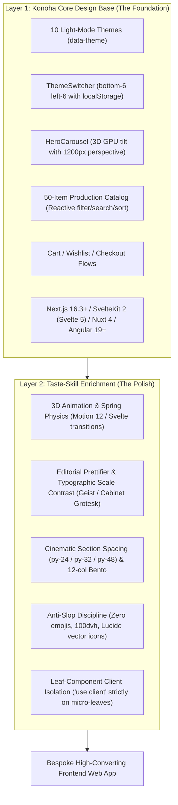

# 🎨 Konoha Core Design + Taste-Skill Enrichment Architecture
Reference: https://www.tasteskill.dev/ | Leonxlnx/taste-skill

Standard Operating Procedures for building modern, high-converting, production-grade user interfaces:
**Konoha Design System as the Core Foundation**, enriched and elevated by **Taste-Skill 3D Physics, Editorial Prettifier & Anti-Slop Discipline**.

---

## 🏛️ Two-Layer Architecture Overview



---

## 1. 🧱 Layer 1: Konoha Core Design System (Base Foundation)

Every build uses the Konoha Design System as its bedrock:

1. **10 Light-Mode Theme Engine**:
   - Mapped via CSS custom properties in `globals.css` / root stylesheet:
     - `pure-white`, `warm-paper`, `modern-slate`, `rose-pine`, `cream-latte`, `nordic-frost`, `sage-garden`, `sunset-glow`, `lavender-mist`, `cyber-light`.
   - Variables: `--theme-bg`, `--theme-fg`, `--theme-card`, `--theme-border`, `--theme-accent`, `--theme-accent-fg`, `--theme-muted`, `--theme-ring`.
2. **Fixed `ThemeSwitcher.tsx`**:
   - Positioned fixed at `bottom-6 left-6 z-[999]`.
   - Persists user selection in `localStorage` and smoothly updates `data-theme` attribute on document root.
3. **Interactive `HeroCarousel.tsx`**:
   - Full-width hero with GPU 3D perspective (`perspective(1200px)`), interactive cursor tilt, thumbnail bar, play/pause controls, and high-contrast spec badges.
4. **Rich Production Catalog & E-Commerce Flow**:
   - 50-item production-grade catalog dataset with reactive search, category filters, price range sliders, sorting, pagination, cart drawer, wishlist, and checkout modals.
5. **Modern Framework Standards**:
   - **Next.js 16.3+**: App Router (`app/`), React 19, Tailwind CSS v4, Motion 12.
   - **SvelteKit 2**: Svelte 5 Runes (`$state`, `$derived`), Tailwind CSS v4.
   - **Nuxt 3.15+/4.3**: Vue 3.5, Tailwind CSS v4.
   - **Angular 19+**: Standalone Components, Signals, Tailwind CSS v4.
6. **Footer Watermark**:
   - Clean, muted `Build by Konoha` watermark in the footer.

---

## 2. ✨ Layer 2: Taste-Skill Enrichment & Anti-Slop Polish

Taste-Skill enriches the Konoha foundation with 3 core pillars:

### A. 3D Animation Effects & Tactile Physics
- **Spring Physics**: Use physics-based springs (`type: "spring", stiffness: 300, damping: 25` in Motion 12 / Svelte transitions) instead of linear CSS transitions.
- **3D Card Perspective Tilt**:
  ```tsx
  <div
    style={{ transform: `perspective(1200px) rotateX(${tilt.y}deg) rotateY(${tilt.x}deg) translateZ(10px)` }}
    className="relative transition-transform duration-200 ease-out rounded-2xl bg-[var(--theme-card)] border border-[var(--theme-border)] shadow-sm hover:shadow-xl group"
  >
    {/* Subtle dynamic sheen on hover */}
    <div className="absolute inset-0 rounded-2xl bg-gradient-to-tr from-white/0 via-white/5 to-white/20 opacity-0 group-hover:opacity-100 transition-opacity duration-300 pointer-events-none" />
    {children}
  </div>
  ```
- **Sensory Tactile Feedback**:
  - Interactive buttons have tactile scale feedback: `active:scale-[0.98] transition-transform duration-100`.
  - Cards lift on hover: `hover:-translate-y-1 hover:shadow-lg`.
  - Staggered entrance animations for catalog grids (`staggerChildren: 0.05`).
- **Accessibility & Reduced-Motion Safety**:
  - Automatically disable 3D tilt and use opacity-only fades when `prefers-reduced-motion: reduce` is detected.

### B. Prettifier & Typographic Polish
- **Editorial Typography Stacks**:
  - Display / Headlines: **Cabinet Grotesk, Clash Display, Space Grotesk** with tight tracking (`tracking-tight` / `tracking-tighter`).
  - Body / Data: **Geist, Satoshi, Outfit, Inter Variable** for maximum readability.
- **Dramatic Scale Contrast**:
  - Pair massive bold headlines (`text-5xl md:text-7xl lg:text-8xl font-bold leading-[1.02]`) with micro metadata kickers (`text-[11px] font-semibold uppercase tracking-widest`).
- **Cinematic Chapter Spacing**:
  - Generous section padding: **`py-24`, `py-32`, or `py-48`** with clean structural dividers (`border-b border-[var(--theme-border)]`).
- **12-Column Asymmetric Bento Composition**:
  - Use asymmetric CSS Grid splits (e.g. 8:4, 7:5, 2:1 bento modules) instead of monotonous 3-identical-card rows.
  - Hairline structural borders (`border-[var(--theme-border)]`).

### C. Strict Anti-Slop Enforcement
- **Zero-Emoji Policy**: Emojis are strictly banned from UI buttons, badges, and headings. Always use crisp vector icons from `lucide-react` / `lucide-svelte` / `lucide-vue-next`.
- **No Generic AI Gradients**: Avoid generic `from-purple-600 to-indigo-600` AI-slop gradients. Use semantic theme tokens (`var(--theme-accent)`) and subtle radial mesh glares.
- **Mobile Viewport Stability**:
  - Full-viewport sections must use **`min-h-[100dvh]`** (never `h-screen` which jumps on mobile address bar collapse).
  - Sticky mobile bottom navigation dock (`fixed bottom-0 left-0 right-0 z-[999] lg:hidden bg-[var(--theme-bg)]/90 backdrop-blur-md border-t border-[var(--theme-border)]`).
- **Leaf-Component Client Isolation**:
  - Page routes and layouts remain Server Components.
  - `'use client'` is placed strictly on interactive leaf micro-components (`ThemeSwitcher`, `HeroCarousel`, `CartDrawer`, `FilterBar`).

---

## 🎛️ Taste Dials (1–10 Tuning Parameters)

Jonin tunes visual dynamism via 3 dials:
1. **`DESIGN_VARIANCE` (Default: 8)**:
   - 1–3: Conservative, clean enterprise tables and forms.
   - 4–7: Polished SaaS with subtle asymmetry and structured bento grids.
   - 8–10: High-novelty editorial showcase, bespoke interactions, and bold typography.
2. **`MOTION_INTENSITY` (Default: 7)**:
   - 1–3: Static transitions, instant CSS state swaps.
   - 4–7: Smooth spring physics (`motion`/Svelte transitions), subtle 3D card perspective tilt.
   - 8–10: Kinetic scroll parallax, cursor-reactive 3D depth, and staggered entrance choreography.
3. **`VISUAL_DENSITY` (Default: 6)**:
   - 1–4: Airy editorial spacing, giant headlines, single focal points per viewport.
   - 5–7: Balanced SaaS layout with high scannability.
   - 8–10: Dense developer console / analytics dashboard with compact data tables.

---

## 📋 Pre-Flight Quality Gate Checklist (Konoha + Taste-Skill)

Before claiming any UI task complete, verify against this checklist:
- [ ] **Konoha Theme Engine**: 10 Light-Mode Themes configured via CSS variables with `ThemeSwitcher` at `bottom-6 left-6`.
- [ ] **Konoha Hero**: `HeroCarousel` with full-width GPU 3D perspective tilt and high-contrast spec badges.
- [ ] **Production Catalog**: 50-item dataset with multi-criteria reactive filters, search, sort, and pagination.
- [ ] **Framework Baseline**: Strictly **Next.js 16.3+ App Router (React 19, Tailwind v4)**, SvelteKit 2 (Svelte 5), Nuxt 4, or Angular 19+.
- [ ] **Taste-Skill Typography**: Distinctive font stack (Geist/Cabinet Grotesk) with tight tracking and scale contrast.
- [ ] **Taste-Skill Spacing**: Cinematic chapter rhythm (`py-24` / `py-32` / `py-48`) and 12-column asymmetric bento grids.
- [ ] **Taste-Skill 3D & Motion**: Spring physics, 3D hover perspective tilt, tactile `active:scale-[0.98]`, reduced-motion fallbacks.
- [ ] **Anti-Slop Discipline**: Zero emojis in UI controls (Lucide SVGs only), safe `min-h-[100dvh]`, leaf-component client isolation.
- [ ] **Validation**: `pnpm run lint` and `pnpm run build` pass with 0 errors and 0 warnings.
