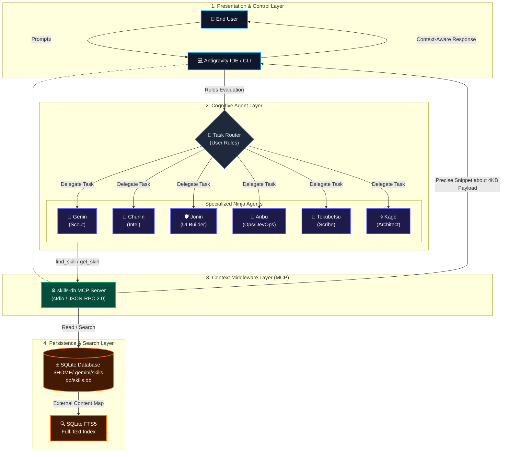

# Konoha Maintenance Skill

This skill contains the structural guidelines, command specifications, and architectural rules for maintaining and developing the **Konoha** SQLite FTS5 Skills-DB application.

## System Architecture

Konoha optimizes AI agent token usage by replacing massive folder-level context loading with SQLite FTS5 on-demand full-text search.

## Database Schema

The SQLite database is stored at `~/.gemini/skills-db/skills.db`. It consists of the following tables:

1. **`skills`** (Standard content table):
   - `name` (TEXT, PRIMARY KEY): Unique identifier (e.g. `golang-security` or `golang-security/injection`).
   - `skill_name` (TEXT): Name of the parent skill folder.
   - `type` (TEXT): `skill` (for main SKILL.md) or `reference` (for references).
   - `tags` (TEXT): Comma-separated keywords.
   - `content` (TEXT): Full markdown file content.
   - `file_path` (TEXT): Absolute path to the source file on disk (used for workspace scoping).
   - `byte_size` (INTEGER): Size of the content.
   - `line_count` (INTEGER): Number of lines.

2. **`skills_fts`** (FTS5 Virtual Table):
   - External content table mapped to `skills`.
   - Fields: `name`, `skill_name`, `tags`, `content`.

3. **`tool_calls`** (Usage & Metrics logging):
   - Tracks metrics, timestamps, query strings, returned bytes, and calculated token savings.

## Core Commands

Maintainers must use these CLI commands to build, inspect, and test the database:

| Command | Action |
|---------|--------|
| `node bin/cli.js init --force` | Re-installs server, forces re-migration of all active skills, registers MCP, and redeploys subagent profiles. |
| `node bin/cli.js migrate` | Re-indexes all detected skill folders, removing stale entries first. |
| `node bin/cli.js test` | Runs internal JSON-RPC tests on the local MCP server. |
| `node bin/cli.js status` | Checks existence of required files, validates MCP configurations, and prints database counts. |
| `node bin/cli.js savings` | Queries and displays token and bytes savings metrics. |

## Development Guidelines

### 1. Workspace Scoping & Security
- All tool outputs returned by `server.py` (`find_skill`, `list_skills`, `get_skill`) must run through `is_path_visible(file_path)` checks.
- Paths must be normalized using `os.path.realpath` to resolve symlinks before checking boundary permissions (i.e. checking if the path is in `~/.agents/`, `~/.gemini/`, or `os.getcwd()`).

### 2. Process Spawning
- **NEVER** use raw string concatenation in shell execution commands (`execSync`).
- **ALWAYS** use parameterized spawns (`spawnSync`) and validate inputs (checking name regex `/^[a-zA-Z0-9_-]+$/` and URL schemes) to protect against command injection.

### 3. Persistent Storage
- User configurations (e.g. subagent JSON settings) must be saved to the user's home directory (`~/.agents/agents.json`).
- Template files inside `src/templates/` serve only as fallbacks. Package template updates should fail silently in read-only global node_modules environments.
