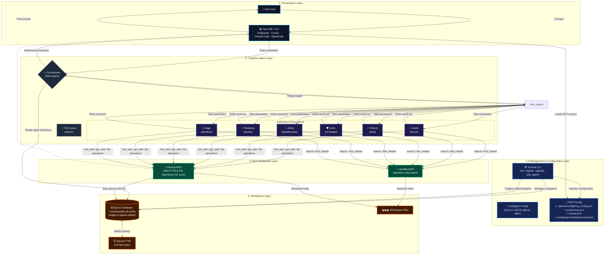

# Konoha Maintenance Skill

This skill contains the structural guidelines, command specifications, and architectural rules for maintaining and developing the **Konoha** SQLite FTS5 Skills-DB application, MCP middleware, and Bridge Router.

## Forced MCP Usage & Delegation

**ABSOLUTE RULE:** All work MUST go through the **konoha MCP** and **semble MCP** tools — never execute tasks solo, never bypass the agent delegation workflow.

- **Always use `konoha` MCP** (`konoha.find_skill`, `konoha.get_skill`, `konoha.list_skills`, `konoha.read_file_head`, `konoha.read_file_range`, `konoha.file_info`, `konoha.token_efficient_grep`, `konoha.get_file_structure`, `konoha.find_files_clean`, `konoha.search_file`, `konoha.build_from_source`, `konoha.build_from_text`, `konoha.optimize_report`) for skills, skill discovery, bounded file operations, and agent delegation. Never call generic `Read`, `Grep`, `Glob`, `Bash` `cat`/`head`/`tail`/`grep`/`rg`/`find` directly — always delegate to a konoha subagent via the konoha MCP.
- **Always use `semble` MCP** (`semble.search`, `semble.find_related`) or `konoha.search_file` for codebase search. Never use `grep`, `rg`, `find`, `glob`, or built-in `Read`/`Grep`/`Glob` tools for code discovery — always delegate to a konoha subagent via the semble MCP.
- **Never use `semble` for skills** — use `konoha.find_skill` / `konoha.get_skill` only.
- **Never use `konoha` for codebase search** — use `semble.search` / `semble.find_related` (or `konoha.search_file`) only.

Any **non-trivial task MUST be delegated** to the appropriate konoha subagent:

- `@genin` — codebase search, tracing codepaths, read-only exploration
- `@kage` — architecture decisions, security review, deep analysis, risk assessment
- `@chunin` — web research, documentation synthesis, citation-backed recommendations
- `@jonin` — UI/frontend development (SvelteKit, Next.js, Tailwind)
- `@anbu` — backend dev, bug fixing, DevOps, infrastructure
- `@tokubetsu-jonin` — technical writing, documentation, API specs

**The main orchestrator MUST NOT execute implementation tasks itself — it only coordinates and delegates.** The only exception is simple/trivial tasks (single read/edit on a known file) which may be executed directly.

## Recent Major Changes (v1.1.6)

### v1.1.6: Full MCP Orchestration & OpenCode Support

- **OpenCode Support**: Fully supported along with Antigravity, Cursor, and Claude Code.
- **MCP Delegation**: `mcp_sannin` orchestrates backend subagents using their full MCP tools directly instead of utilizing Antigravity's Hook-based TypeName overriding.
- **Reporting**: The Konoha Savings dashboard includes `OpenCode` in the Provider Breakdown and visual percentage meters.
- **Model Configuration**: Subagent models can now be specifically targeted per client using `konoha models embed` via `--cursor`, `--claude`, and `--opencode` flags.

### Removed: Quota Persistence

- The `quota_unavailable_until` column was dropped from the `bridges` table.
- The `--set-quota` / `--clear-quota` CLI actions were removed from `src/db_bridges.py`.
- Quota cooldown is now in-memory only inside the gateway; it does not survive restarts.
- Reference: `CHANGELOG.md` [Unreleased] Removed section, line 12.

## System Architecture

Konoha optimizes AI agent token usage by replacing massive folder-level context loading with SQLite FTS5 on-demand full-text search.


```mermaid
graph TB
    %% Styling Configuration
    classDef presentation fill:#0f172a,stroke:#38bdf8,stroke-width:2px,color:#f8fafc;
    classDef orchestration fill:#1e293b,stroke:#475569,stroke-width:2px,color:#e2e8f0;
    classDef cognitive fill:#1e1b4b,stroke:#6366f1,stroke-width:2px,color:#f8fafc;
    classDef middleware fill:#064e3b,stroke:#10b981,stroke-width:2px,color:#f8fafc;
    classDef persistence fill:#451a03,stroke:#f97316,stroke-width:2px,color:#f8fafc;
    classDef mgmt fill:#172554,stroke:#3b82f6,stroke-width:2px,color:#dbeafe;

    %% Subgraphs for Layered Architecture
    subgraph Layer1 ["1. Presentation Layer"]
        User["👤 End User"]
        IDE["💻 Host IDE / CLI<br>Antigravity · Cursor · Claude Code · OpenCode"]
    end

    subgraph Layer15 ["1.5 Management & Configuration Layer"]
        CLI["🛠️ Konoha CLI<br>(init, migrate, upgrade, skill, agent)"]
        AgentConfig["📄 Subagent Config (Source: SQLite agents table)"]
        MCPConfig["📄 MCP Config<br>(~/.gemini/config/mcp_config.json<br>~/.cursor/mcp.json<br>~/.claude.json<br>~/.config/opencode/opencode.json)"]
    end

    subgraph Layer2 ["2. Cognitive Agent Layer"]
        Router{"🔀 Orchestrator <br/> (Main Agent)"}
        Queue["📂 File Queue<br>(tasks/<task_id>/)"]

        subgraph Subagents ["Specialized Ninja Agents"]
            Genin["🍃 Genin <br/> (Scout)"]
            Chunin["📜 Chunin <br/> (Intel)"]
            Jonin["🛡️ Jonin <br/> (UI Builder)"]
            Anbu["👥 Anbu <br/> (Ops/DevOps)"]
            Tokubetsu["🎯 Tokubetsu <br/> (Scribe)"]
            Kage["🌀 Kage <br/> (Architect)"]
        end
    end

    subgraph Layer3 ["3. MCP Middleware Layer"]
        KonohaMCP["⚡ konoha MCP<br>Skills FTS5 & File Operations (21 tools)"]
        Semble["🔮 Semble MCP<br>Semantic code search"]
    end

    subgraph Layer4 ["4. Persistence Layer"]
        DB[("🗄️ SQLite Database <br/> ~/.konoha/skills.db (skills, bridges & agents tables)")]
        FTS5["🔍 SQLite FTS5 <br/> Full-Text Index"]
        Codebase["��� Workspace Files"]
    end

    %% Workflow Connections
    User -->|Prompts| IDE
    IDE -->|Rules evaluation| Router

    CLI -->|Updates configuration| MCPConfig
    CLI -->|Manages subagents| DB
    CLI -->|Triggers index/migration| DB
    IDE -->|Loads MCP servers| MCPConfig
    Router -->|Reads agent definitions| DB

    Router -->|Delegate task| mcp_sannin
    mcp_sannin -->|Task parameters| Genin & Chunin & Jonin & Anbu & Tokubetsu & Kage

    Genin & Chunin & Jonin & Anbu & Tokubetsu & Kage -->|find_skill / get_skill / file operations| KonohaMCP
    Genin & Chunin & Jonin & Anbu & Tokubetsu & Kage -->|search / find_related| Semble

    KonohaMCP -->|SQL query & File I/O| DB
    DB <-->|BM25 ranking| FTS5
    Semble -->|Semantic index| Codebase
    KonohaMCP -->|Streamed reads| Codebase

    Genin & Chunin & Jonin & Anbu & Tokubetsu & Kage -->|Write result.md| mcp_sannin
    mcp_sannin -->|Read output| Router
    Router -->|Synthesized response| IDE
    IDE -->|Final answer| User

    IDE -.- KonohaMCP

    class User,IDE presentation;
    class Router,Queue orchestration;
    class Genin,Chunin,Jonin,Anbu,Tokubetsu,Kage cognitive;
    class KonohaMCP,Semble middleware;
    class DB,FTS5,Codebase persistence;
    class CLI,AgentConfig,MCPConfig mgmt;
```

> **Note:** Konoha implements multi-provider LLM routing via the Bridge Router (port `19999`). The router handles `openai`, `openai-compatible`, and `antigravity` providers with quota-aware rotation. See [LLM-BRIDGE-GATEWAY.md](../../docs/LLM-BRIDGE-GATEWAY.md) for details.

## Database Schema

The SQLite database is stored at `~/.konoha/skills.db`. It consists of the following tables:

1. **`skills`** (Standard content table):
   - `name` (TEXT, PRIMARY KEY): Unique identifier (e.g. `golang-security` or `golang-security/injection`).
   - `skill_name` (TEXT): Name of the parent skill folder.
   - `type` (TEXT): `skill` (for main SKILL.md) or `reference` (for references).
   - `tags` (TEXT): Comma-separated keywords.
   - `content` (TEXT): Full markdown file content.
   - `file_path` (TEXT): Absolute path to the source file on disk (used for workspace scoping).
   - `byte_size` (INTEGER): Size of the content.
   - `line_count` (INTEGER): Number of lines.

2. **`skills_fts`** (FTS5 Virtual Table):
   - External content table mapped to `skills`.
   - Fields: `name`, `skill_name`, `tags`, `content`.

3. **`tool_calls`** (Usage & Metrics logging):
   - Tracks metrics, timestamps, query strings, returned bytes, and calculated token savings.

4. **`agents`** (Subagent & Client-specific Model configurations):
   - `name` (TEXT, PRIMARY KEY): Agent name (e.g. `genin`, `kage`).
   - `icon` (TEXT): Visual descriptor icon.
   - `title` (TEXT): Display title.
   - `model_tier` (TEXT): Primary model tier fallback.
   - `purpose` (TEXT): Dedicated purpose.
   - `skills` (TEXT): JSON-formatted string listing allowed/associated skills.
   - `delegate_when` (TEXT): Context descriptors for delegating to this agent.
   - `constraints_text` (TEXT): Behavioral boundaries.
   - `workflow` (TEXT): Standard operating workflow.
   - `description` (TEXT): Long description text.
   - `instructions` (TEXT): Base agent instructions template.
   - `delegation_keywords` (TEXT): Keywords triggering delegation mapping.
   - `cursor_model` (TEXT): Customized model mapping for Cursor.
   - `cursor_fallback_model` (TEXT): Cursor fallback model.
   - `enable_mcp_tools` (INTEGER): Flag for MCP tools authorization (0 or 1).
   - `claude_model` (TEXT): Claude Code model override.
   - `opencode_model` (TEXT): OpenCode model override.

## Core Commands

Maintainers must use these CLI commands to build, inspect, and test the database:

| Command | Action |
|---------|--------|
| `node bin/cli.js init --force` | Re-installs server, forces re-migration of all active skills, registers MCP, and redeploys subagent profiles. |
| `node bin/cli.js migrate [--force]` | Re-indexes all detected skill folders. If `--force` is used, prunes unused/unembedded skills to `.agents.backup/skills/{name-skill}-yyyymmdd` first to ensure no duplicates occur (while skipping project-level skills), and automatically reconfigures integrations for Antigravity IDE/CLI, Claude Code, Cursor, and OpenCode. |
| `node bin/cli.js test` | Runs internal JSON-RPC tests on the local MCP server. |
| `node bin/cli.js status` | Checks existence of required files, validates MCP configurations, and prints database counts. |
| `node bin/cli.js version` | Displays the current local version (1.1.6) and checks for updates from GitHub. |
| `node bin/cli.js upgrade` | Upgrades the Konoha CLI to the latest version directly from GitHub. |
| `node bin/cli.js doctor` | Diagnoses and auto-repairs Antigravity + Cursor integration health. |
| `python3 src/test_agent_attribution.py` | One-by-one Antigravity MCP agent attribution verification. |
| `python3 src/test_cursor_attribution.py` | One-by-one Cursor MCP agent attribution verification. |
| `python3 src/test_database_migration.py` | Full database schema, FTS5 matches, and migration script verification. |
| `python3 src/test_web_search.py` | zero-API-key fallback search chain and cache TTL test suite. |
| `python3 src/test_bridge_gateway.py` | Bridge schema and model routing registration test suite. |
| `node bin/cli.js savings` | Queries and displays token and bytes savings metrics. |
| `node bin/cli.js bridge status` | Shows runtime status and details of all configured bridges. |
| `node bin/cli.js bridge list` | Lists all configured bridges in a formatted table with provider info. |
| `node bin/cli.js bridge models` | Lists all models served by all active bridges. |
| `node bin/cli.js bridge create` | Interactive wizard: choose API Key (OpenAI/Compatible) or Antigravity (passive sidecar). |
| `node bin/cli.js bridge delete <name>` | Deletes a bridge configuration. |
| `node bin/cli.js bridge enable <name>` | Enables a bridge configuration. |
| `node bin/cli.js bridge disable <name>` | Disables a bridge configuration. |
| `node bin/cli.js bridge start` | Starts the Bridge Gateway daemon on port 19999. |
| `node bin/cli.js bridge stop` | Stops the Bridge Gateway daemon. |
| `python3 src/db_agents.py list` | Lists all configured subagents currently persisted in the SQLite agents table. |
| `python3 src/db_agents.py upsert <json>` | Upserts a subagent specification dictionary (inserts or updates properties) in SQLite. |
| `python3 src/db_agents.py delete <name>` | Removes the subagent configuration from the database. |
| `python3 src/db_agents.py sync` | Overwrites configuration files and synchronizes active JSON cache from database content. |
| `python3 src/db_agents.py import` | Deletes all records in SQLite and initializes them directly from ~/.agents/agents.json content. |

## Development Guidelines

### 1. Workspace Scoping & Security
- All tool outputs returned by `server.py` (`find_skill`, `list_skills`, `get_skill`) must run through `is_path_visible(file_path)` checks.
- Paths must be normalized using `os.path.realpath` to resolve symlinks before checking boundary permissions (i.e. checking if the path is in `~/.agents/`, `~/.gemini/`, or `os.getcwd()`).
- **Session Isolation & Security**: Maintainers must always ensure that session-bound context tracking, attribution, or metadata reads remain strictly isolated to the active conversation directory (`ANTIGRAVITY_CONVERSATION_ID`) to prevent cross-session context pollution, info leaks, or hallucinations.
- **Knowledge & Rule Maintenance**: When adding new logic, CLI commands, or safety updates to the codebase, maintainers MUST update the rule templates (`src/agent_manager.js`, `src/cursor_manager.js`), the `konoha-maintenance` skill (`.agents/skills/konoha/SKILL.md`), and the compliance reports (`docs/SecurityCompliance/`) to ensure the system's runtime policies and agent instructions stay perfectly in sync. Additionally, maintainers must always ensure that all system documentation (including README.md, guides, and diagrams under docs/) is kept fully up-to-date with any changes or maintenance performed.

### 2. Query Sanitization & Robustness
- FTS5 search queries must be sanitized using `sanitize_fts5_query(query)` to prevent compilation and parsing syntax errors (e.g. from hyphens `-`, slashes `/`, carets `^`, colons `:`, commas `,`, unbalanced quotes/parentheses, or dangling wildcards `*`).
- The sanitization logic must replace punctuation that acts as special syntax operators in FTS5 with spaces, while keeping alphanumeric characters, spaces, underscores, and balanced quotes/parentheses. Valid `NEAR(...)` expressions should be protected with placeholders and restored post-sanitization.
- Fallback searches using `LIKE` must replace punctuation with `%` placeholders (e.g., converting punctuated words like `modern-full-stack` to `%modern%full%stack%`) to allow matching punctuated names in the database even if FTS5 fails or is bypassed.

### 3. Process Spawning
- **NEVER** use raw string concatenation in shell execution commands (`execSync`).
- **ALWAYS** use parameterized spawns (`spawnSync`) and validate inputs (checking name regex `/^[a-zA-Z0-9_-]+$/` and URL schemes) to protect against command injection.

### 4. Persistent Storage
- User configurations (e.g. subagent JSON settings) are stored in the SQLite database `agents` table and mirrored/cached to the user's home directory (`~/.agents/agents.json`) to keep sandboxed IPC hooks low-latency.
- Template files inside `src/templates/` serve only as fallbacks. Package template updates should fail silently in read-only global node_modules environments.
- **Agents SQLite Schema** (`~/.konoha/skills.db`, table `agents`):
  ```sql
  CREATE TABLE agents (
      name                  TEXT PRIMARY KEY,
      icon                  TEXT,
      title                 TEXT,
      model_tier            TEXT,
      purpose               TEXT,
      skills                TEXT, -- JSON list
      delegate_when         TEXT,
      constraints_text      TEXT,
      workflow              TEXT,
      description           TEXT,
      instructions          TEXT,
      delegation_keywords   TEXT,
      cursor_model          TEXT,
      cursor_fallback_model TEXT,
      enable_mcp_tools      INTEGER NOT NULL DEFAULT 1,
      claude_model          TEXT,
      opencode_model        TEXT
  );
  ```
  `db_agents.py` manages this table.
- **Bridge SQLite schema** (`~/.konoha/skills.db`, table `bridges`):
  ```sql
  CREATE TABLE bridges (
      name                    TEXT    PRIMARY KEY,
      port                    INTEGER NOT NULL,
      provider                TEXT    NOT NULL,  -- openai | openai-compatible | antigravity
      enabled                 INTEGER NOT NULL DEFAULT 1,
      target_url              TEXT,
      api_key                 TEXT
  );
  ```
  `db_bridges.py` manages this table. Supported actions: `--list`, `--upsert <json>`, `--delete <name>`, `--enable <name>`, `--disable <name>`.

### 5. Subagent Model Fields (Host IDE)
- Konoha stores optional model preferences in `agents.json` (`model`, `cursorModel`, `claudeModel`) and injects them into generated `GEMINI.md`, `AGENTS.md`, and `~/.cursor/agents/*.md`.
- **Konoha Bridge Router**: Konoha implements full multi-provider LLM routing via the Bridge Router (port `19999`). Bridges are registered manually by the user (the tables start empty on install).
  - Model prefix resolution (checked in order):
    1. **Bridge-prefix lookup**: `<bridge_name>-<model>` resolved against the named bridge first.
    2. **Exact match**: Look up the exact model name in the cache across all bridges.
    3. **Fallback**: Route to the first active bridge.
  - Cache TTL for bridge model lookups: **30 seconds**.
- **Rotation**: The gateway's bridge rotator (in `src/bridge/gateway.js`) round-robins across enabled bridges. On 429 / `RESOURCE_EXHAUSTED`, the bridge is temporarily marked Unavailable in-memory only; state is not persisted.
- Antigravity orchestrator templates may document model selection conventions; Konoha enforces routing at the proxy level.

### 6. Compliance Reports
- Whenever updating Konoha versions or conducting security checks, you MUST generate a compliance report in the `docs/SecurityCompliance/` folder using the exact filename format: `security_compliance_report_google_policy_<version>_<YYYY-MM-DD>.md`.
- **Mandatory Compliance Report Structure**: All generated compliance reports MUST strictly adhere to the following Markdown structure to maintain auditing transparency:
  1. **# Security and Compliance Review: Konoha Project [vVersion]** (H1 Header)
  2. **## Executive Summary**: Summarizes the version reviewed, specific audit goals, and overall compliance outcome.
  3. **## Findings**: Contains sub-headings for each analyzed control (e.g. `### 1. Interactive Consent Prompts`, `### 2. Sandbox Boundary Validation`). Each finding must contain:
     - **Action Verified**: The specific code change, file modification, or config setting inspected.
     - **Impact**: The security benefit or policy compliance outcome (e.g. preventing silent writes).
  4. **## Conclusion**: Summary of the overall security posture and final verification declaration.

### 7. Changelog Maintenance
- Whenever you make an update to the codebase or bump the version, you MUST update the `CHANGELOG.md` file to reflect your changes.

### 8. File Modification Rule
- **File Modification Rule**: Only use `sed` if you are modifying an existing file (e.g., replacing specific strings or appending lines).
- **README Protection Rule**: DO NOT change the structure, layout, or existing content of README.md. When updating README.md, you MUST only modify specific strings (like version numbers) using targeted search-and-replace.

### 9. Agent Telemetry and Call Statistics
- **Case-Insensitive Grouping**: Agent status metrics calculation must aggregate statistics case-insensitively using lowercase agent names (`GROUP BY LOWER(agent)`), resolving misattribution to `Direct Tool Calls`.
- **Self-Test Agent Role Coverage**: The CLI self-test suite (`node bin/cli.js test`) must simulate tool calls using the 6 official agent identities (`genin`, `kage`, `chunin`, `jonin`, `anbu`, `tokubetsu-jonin`) rather than a generic `"test"` identifier. This guarantees that initial out-of-the-box telemetry accurately registers call counts for all configured subagents immediately upon verification.
- **Dynamic Active Agent Detection**: When the `agent` parameter is omitted from MCP tool arguments, `detect_active_agent()` resolves identity from:
  - **Antigravity**: `~/.gemini/antigravity-ide/brain` and `antigravity-cli/brain` — delegated `prompt.md` (`You are the X agent`) plus recent `PLANNER_RESPONSE` transcripts only (never `VIEW_FILE` lines).
  - **Cursor**: `~/.cursor/projects/*/agent-transcripts/*/*.jsonl` — `Task` `subagent_type`, subagent `[Agent] active` text, or `[Konoha] orchestrator active`.
- **Bypassing Orchestrator Override**: Prioritize registered subagent ranks over orchestrator fallback. Rank sessions by **transcript mtime** (not Antigravity `prompt.md` touch) so orchestrator prompt hooks do not mask active subagents or Cursor sessions.
- **Subagent Scan Order**: Check `tokubetsu-jonin` before `jonin` to avoid `\bjonin\b` matching inside `Tokubetsu-Jonin`.
- **Deep Directory Search**: Scan up to `15` recently modified conversation directories.
- **Protected Default Subagents**: `konoha agent delete` rejects removal of official ninja agents from `src/templates/agents.json`.
- **Orchestrator Rank & Logging**: The main agent (Antigravity orchestrator) coordinates using the village leader rank **Kage (🌀)**. Every orchestrator response starts with `[🌀 kage] active. Calling konoha.find_skill('...')` (replacing the legacy Genin log to match real anime hierarchy).
- **Orchestrator Telemetry**: Telemetry explicitly checks for `[Konoha] orchestrator active` and `[Konoha] active` to prevent orchestrator tool calls from being misattributed to subagents or fallback direct calls.

### 9. Dependency Version Auto-Fix
- **Auto-Fix Version Mismatches**: When running package installation or build commands (`pnpm install`, `pnpm run build`), if the output reports mismatched, outdated, or conflicting dependencies (such as `- lucide-react 1.21.0` and `+ lucide-react 0.468.0 (1.21.0 is available)`), agents must automatically parse the output, update `package.json` to specify the latest available version (or the recommended version) for the conflicting packages, and re-run the installation/build command again to align and fix the dependencies before proceeding.

### 10. Source Design or Code Reference Build Selection
- **Visual Mockup or Reference Source Context Detection**: When a task requests building or scaffolding a website or user interface, the agent must check if a source design or reference source code folder (e.g., `source-design`, `source-image-design`) exists.
- **`build_from_source` Tool**: If design mockups or reference source code files are present, the agent must invoke `build_from_source`. This tool instructs the build processor to strictly match layout design mockups and reference source code files while disabling the default premium template visual effects (10-theme switcher, 3D interactive carousels, 3D GPU card hovers, 3D SweetAlert2 modal dialogs, and watermark) unless they are explicitly requested or shown in the source files.
- **`build_from_text` Tool**: If no visual design mockup or reference source code directory exists, the agent must call `build_from_text` to scaffold the project using standard premium interactive features and templates.
- **Dynamic Agent Skill Resolution**: The `build_from_source` and `build_from_text` tools must dynamically resolve calling agent skills from `agents.json` to configure the correct dynamic skillset list, falling back to the `"jonin"` agent's skills list, and finally falling back to standard hardcoded defaults (e.g., `["jonin-skill"]`) only if `agents.json` cannot be read.
- **Light Mode and Split-Opening Drapes Carousel**: Visual template guidelines inside `build_from_text` prohibit dark mode/backgrounds (enforcing Light Mode only) and mandate full-width responsive homepage carousels styled with a GPU-accelerated 3D split-opening drapes slide transition effect.

### 11. Migration Optimization and Database Integrity
- **Preserving Markdown Integrity (HTML Comments)**: When optimizing skills during the `konoha migrate` process (`src/migrate.py`), the system MUST NEVER strip HTML comments (`<!-- -->`). Stripping HTML comments is destructive and drops the quality of skills because it accidentally removes critical Svelte compiler directives (e.g., `<!-- svelte-ignore a11y_click_events_have_key_events -->`) and structural markdown markers (e.g., `<!-- slide -->` for carousels).
- **Ghost Skill Purging**: To prevent deleted legacy skills from persisting in the SQLite FTS5 database, `konoha migrate` runs with `--clean` (full `DELETE FROM skills` before re-index) and purges deprecated skill entries by name/path pattern after each migration.
- **Legacy Tool Deprecation**: The legacy tools `build_with_image_design`, `render_image`, and the local `konoha render` CLI command (`visual_compare.py`) are permanently deprecated. Agents must use the unified `build_from_source` tool instead.

### 12. Subagent Model Property Allocation
- **Antigravity Model Injection**: When generating `GEMINI.md` or `AGENTS.md` in `src/agent_manager.js`, inject `model: \`<modelTier>\`` into `define_subagent` so subagents use configured Gemini/Claude tiers.
- **Cursor Model Injection**: `src/cursor_manager.js` deploys `~/.cursor/agents/*.md` with `model: inherit` (Cursor Auto) by default for Free-tier compatibility. Override via `cursorModel` in `agents.json` when explicit slugs are needed.
- **Claude & OpenCode Model Configuration**: Support whitelisting client-specific configurations via `--claude`, `--cursor`, and `--opencode` flags in the `konoha models embed` subcommand, allowing granular control over subagent LLM assignments per client IDE/CLI.
- **Models Subcommand Status & Listing**: The `konoha models status` subcommand prints current subagent model mappings for all clients. The `konoha models list` subcommand additionally includes a comprehensive table of all available/active Antigravity and bridge models.
- **Status OpenCode Mapping**: The `konoha status` command displays the active model settings for OpenCode alongside Cursor and Claude Code integrations in its subagents list table.

### 13. Cursor IDE/CLI Integration
- **Auto-Setup**: `ensureAutoSetup()` + `cursor_manager.ensureCursorSetup()` register MCP, subagents, hooks, CLI permissions, and mirror skills to `~/.cursor/skills/`.
- **Skills mirror**: `~/.agents/skills/` → `~/.cursor/skills/`; project `.agents/skills/` → `.cursor/skills/` (or global fallback on `konoha init`).
- **sessionStart Hook**: `cursor_bootstrap.js` self-heals config; always exits 0 (fail-open).
- **Orchestrator Rules**: Project `.cursor/rules/konoha.mdc` delegates via Task tool; konoha MCP for skills, seem for semantic code search (never Cursor Grep/Glob/SemanticSearch).
- **Documentation**: See `docs/SETUP-CURSOR.md`.

### 14. Semble Default Search Policy
- **Policy Source**: `src/search_policy.js` — shared text injected into `GEMINI.md`, `AGENTS.md`, and Cursor rules.
- **Rule**: All codebase discovery uses `semble.search` / `find_related` with absolute `repo`. Forbidden: grep, glob, find, rg, Cursor `Grep`/`Glob`/`SemanticSearch` (fallback: `rg` once if seem unavailable).
- **Upgrade Path**: `loadAgents()` syncs constraints when `NEVER use grep` marker is missing.

### 15. Token-Efficient File Tools (`konoha` MCP)
- **Architecture**: Node.js `file_tools_mcp.js` + `file_tools_router.js` orchestrate; Python scripts in `src/file_tools/` perform streaming I/O.
- **Tools**: `read_file_head` (≤200 lines), `read_file_range` (≤500 lines), `file_info`, `token_efficient_grep` (≤20 matches), `get_file_structure`, `find_files_clean` (which automatically skips VCS, lockfiles, `go-dist`, and `vendor` directories during file walks to prevent context bloat), `search_file` (semantic search using `semble`).
- **Launcher**: `file_tools_launcher.js` (cross-platform) + `.node_exec_path` / `.python_cmd` records; Unix also ships `file_tools_launcher.sh`.
- **Konoha Bridge Router Integration**: Automatically starts the Konoha Bridge Router on port `19999` and all enabled bridges (such as `openai` on port `11435`) in-process when the `konoha` MCP server initializes, providing multi-provider routing and formatting compatibility. The router automatically intercepts and returns `{"input_tokens": 0}` with a `200 OK` status for `POST /v1/messages/count_tokens` preflight queries (frequently made by the Claude CLI and Cherry Studio) to bypass router failures and prevent retry loops.
- **Install**: `installFileTools()` copies files to `~/.konoha/` (including `bridge/` submodules), sets up runtime dependencies via local `npm install`, and registers it as `konoha` in Antigravity `mcp_config.json` and Cursor `mcp.json`.
- **Tests**: `konoha test` runs MCP integration tests for all tools.

### 16. Antigravity Orchestrator File Pipeline
- **Flow**: `prompt_hook.js` → `prompt.md` → orchestrator reads/analyzes → `delegate.md` → subagent → `result.md` → user report.
- **Continuation Safety**: `prompt_hook.js` avoids overwriting `prompt.md` on simple continuation keywords (e.g. `continue`, `go`, `proceed`), preserving the original prompt across turn boundaries.
- **Forbidden**: `@self`, `@research`, direct project edits in orchestrator conversation.
- **Generator**: `buildOrchestratorWorkflow()` in `agent_manager.js` — shared by `GEMINI.md` and `AGENTS.md`.

### 17. Multi-CLI MCP Clients (Claude Code, OpenCode, others)
- **Install once**: `konoha init` deploys servers to `~/.konoha/` regardless of IDE.
- **Auto-detect**: `src/mcp_clients_manager.js` configures Claude Code / OpenCode **only when** `claude` or `opencode` CLI is on PATH (or config dir exists).
- **Claude Code (auto)**: Merges into `~/.claude.json` (`mcpServers`) and deploys the 6 official ninja subagents to `~/.claude/agents/` with whitelisted allowed-tools matching `mcp_semble_*`, `mcp_konoha_*`.
- **Claude Code Active Agent Detection**: Scans `~/.claude/projects/*/*.jsonl` session transcripts. Resolves session directories uniquely using `conv_dir = fpath` to isolate telemetry per session.
- **OpenCode (auto)**: Merges into `~/.config/opencode/opencode.json` (`mcp`) only — no project `opencode.json`.
- **Not installed**: Skip silently; manual fallback templates in `docs/templates/` (`claude-code.mcp.json`, `opencode.mcp.json`).
- **Self-heal**: `ensureAutoSetup()` and `konoha doctor --yes` repair when CLI is present.
- **Tool boundaries** (all clients): `semble` = code search; `konoha` = skills & bounded file reads.
- **Documentation**: `docs/SETUP-MCP-CLIENTS.md`.

### 18. Workspace-Local Skills (Konoha repo sessions)
- **Scan paths**: `konoha migrate` indexes `~/.agents/skills/`, `~/.gemini/antigravity-cli/skills/`, and **`<cwd>/.agents/skills/`** (project-local).
- **konoha-maintenance**: Lives at `.agents/skills/konoha/SKILL.md` (`name: konoha-maintenance`). After migrate, agents discover it via `find_skill("konoha maintenance")` — do not load the full SKILL.md into context.
- **Session start in konoha folder**: Run `konoha migrate` after pull; call `find_skill` for architecture/CLI/release knowledge before editing core files.

### 19. konoha Path Sandbox (v1.1.6+)
- **JS**: `file_tools_router.js` `assertWithinWorkspace()` before spawning Python workers.
- **Python**: `file_tools/_common.py` `assert_within_workspace()` on every resolved path.
- **Rejected**: Absolute paths outside workspace root (e.g. `/etc/passwd`). Relative paths resolve against MCP workspace cwd.

### 20. Release QA Gates (public release checklist)
| Gate | Command | Pass |
|------|---------|------|
| MCP tests | `konoha test` | 16/16 |
| Antigravity attribution | `python3 src/test_agent_attribution.py` | 7/7 |
| Cursor attribution | `python3 src/test_cursor_attribution.py` | 8/8 |
| Claude attribution | `python3 src/test_claude_attribution.py` | 8/8 |
| Database migration check | `python3 src/test_database_migration.py` | 3/3 |
| Fallback web search check | `python3 src/test_web_search.py` | 3/3 |
| Bridge routing check | `python3 src/test_bridge_gateway.py` | 2/2 |
| Self-heal | `konoha doctor --yes` | All healthy |
| Claude Code MCP | `konoha status` | Row active when `claude` CLI present |
| OpenCode MCP | `konoha status` | Row active when `opencode` CLI present |
| Cursor skills mirror | `ls ~/.cursor/skills/` | Matches `~/.agents/skills/` layout |
| Live benchmarks | `konoha savings` | konoha + semble metrics |
| Deploy sync | `konoha migrate` | Copies `server.py`, file tools, hooks to `~/.konoha/` |

### 21. Agent Attribution Fixes (v1.1.6 QA)
- **Cursor preference**: `detect_active_agent()` only prefers recent Cursor when Cursor is the top-ranked session by transcript mtime.
- **Orchestrator**: Return `orchestrator` immediately when detected in ranked scan (no deferred fallback that lets lower-ranked subagents win).
- **cursor_bootstrap.js**: Registers `konoha`; preserves seem policy line on subagent `.md` files; syncs Cursor skills mirror.
- **install/repair**: `registerHooks(true, true)` on first auto-setup; seem `args` repair; project `.cursor/mcp.json` merge; `deploy_utils.installFileTools()` shared by CLI and Cursor manager.

### 22. CLI TUI (v1.1.6)
- **Gradient styling**: `konoha doctor`, `konoha status`, installer, and savings output use themed gradients (`CHIDORI_THEME` / `LEAF_THEME`).
- **Dynamic tables**: `drawTable()` computes column widths from content — fixes Doctor table column overlap from fixed `padEnd()` widths.
- **Helpers**: `stripAnsi`, `computeTableWidths`, `gradientStatusCell`, `sectionTitle`, `drawIntegrationRow` in `bin/cli.js`.
- **Raw Mode Guard**: Invocations of `process.stdin.setRawMode` in CLI helpers (e.g. `askQuestion`) must check if it is a function first, avoiding TypeErrors when standard input is not a TTY (redirected stdin).

### 23. Cross-Platform Support (v1.1.6 QA)
- **`src/platform_utils.js`**: Shared `uriToPath`, `expandUser`, `detectPython`, `getUvCommand`, `normPath` for Windows/macOS/Linux.
- **`file_tools_launcher.js`**: Cross-platform Node launcher; reads `.node_exec_path` when IDE PATH differs from nvm.
- **Python detection**: Windows probes `py -3`, `py`, `python3`, `python`; recorded in `~/.konoha/.python_cmd`.
- **Path sandbox**: `normcase` on Windows in `file_tools/_common.py` and `file_tools_router.js`.
- **Cursor MCP**: `node` + `file_tools_launcher.js` (not Unix-only `sh` launcher).

### 24. Orchestrator Guardrails & Thought Token Optimization (v1.1.6 QA)
- **Antigravity Session Isolation**: Isolates dynamic subagent detection in `detect_active_agent()` by targeting only the active `ANTIGRAVITY_CONVERSATION_ID` environment directory (no wildcards), ensuring concurrent active sessions do not read transcripts or prompts from other sessions.
- **Session Isolation Sandbox Exception**: Appended a path-specific exception to the `Session Isolation Guard` in `src/agent_manager.js`, `src/cursor_manager.js`, and rule templates (`GEMINI.md`, `AGENTS.md`) to permit subagents to read `delegate.md` and write `result.md` files in the parent orchestrator task folder, bypassing sandboxed file read/write denials.
- **Antigravity Delegation Guard**: Safety guardrail (`Never touch logic delegated in Antigravity`) built into `src/agent_manager.js`, `src/cursor_manager.js`, rules templates, and global instructions to protect the orchestrator's delegated flow.
- **Bridge Gateway Preservation Guard**: Safety guardrail (`NEVER touch stable Bridge Gateway`) built into `src/agent_manager.js`, `src/cursor_manager.js`, rules templates, and global instructions to protect the local LLM Proxy Gateway and Bridge Router logic, which must never be modified or refactored as it is finalized and stable.
- **MCP Preamble Enforcement**: A prominent `⚠️ MANDATORY` preamble block is injected at the very **top** of all generated instruction files (`GEMINI.md`, `AGENTS.md`, `CLAUDE.md`, `.cursor/rules/konoha.mdc`) by the dynamic generators in `src/agent_manager.js` and `src/cursor_manager.js`. This preamble lists the exact MCP tool names for file reads, code search, and skill lookup, and explicitly forbids native/built-in tools (`view_file`, `grep_search`, `list_dir`, `Read`, `Grep`, `Glob`, `SemanticSearch`) and shell commands (`cat`, `head`, `tail`, `grep`, `rg`, `find`). Placing this at the top ensures maximum positional priority — LLMs weight instructions at the beginning of system prompts more heavily than those buried at the bottom.
- **Shell Command Blocking in Sanitize Hook**: The `antigravity_tool_sanitize_hook.js` PreToolUse hook now blocks `run_command` calls that use shell file-reading commands (`cat`, `head`, `tail`, `grep`, `rg`, `find`, `fd`, `ag`, `ack`, `less`, `more`, `bat`, `wc`) as DENY 3, preventing agents from bypassing MCP enforcement through shell command loopholes.
- **Optimize Thought Tokens**: Embedded thought optimization rule (`Optimize Thought Tokens`) directing agents to keep thought processes concise and implementation-focused to minimize output and reasoning token costs under thinking models.
- **Planning-to-File (Thought-to-Markdown)**: Convention directing the orchestrator and subagents to write complex designs, multi-step implementation plans, and deep architectural analyses to a markdown file (such as `plan.md` or `scratch/plan.md`) instead of outputting massive text or thinking blocks in the conversation thread. This keeps conversation histories light and optimizes token efficiency.
- **Automated Transient Task Cleanup**: Deleting temporary scratch task directories and transient execution states (under `scratch/tasks/`) must be automated and performed silently/immediately without asking the user for confirmation, distinguishing them from destructive operations on persistent user databases or files.
- **Rule Synchronization**: Automatically deployed to `~/.gemini/GEMINI.md`, `~/.agents/AGENTS.md`, and project `.cursor/rules/konoha.mdc` on rule regeneration (`node -e "require('./src/agent_manager').regenerateAndDeploy()"`).
- **Subagent Registration Instructions**: The dynamic rules generators in `src/agent_manager.js` append the output of `buildDefineSubagentGuide(agents)` after the design delegate guide. This explicitly documents the hook-assisted subagent invocation translation mechanism in Konoha, explaining that ninja subagents can now be invoked using their bare names (TypeName: genin, jonin, etc.) because the pre-tool hook dynamically rewrites them to platform-compatible self/research values.
- **Client Orchestration Logic Flow Alignment**: Configured configuration deployment managers (`agent_manager.js`, `bin/cli.js`) to deploy customized, platform-native rule configurations for all MCP clients. Antigravity and OpenCode utilize the global subagent rules (`GEMINI.md` / `AGENTS.md`), Cursor deploys Composer-native Task orchestration rules (`konoha.mdc`), and Claude Code receives single-agent direct execution rules (`CLAUDE.md`). This eliminates platform incompatibilities and resolves bugs where Claude Code failed to execute embedded skills due to missing subagent tools.

### 25. Provider-Specific Savings Attribution (v1.1.6 QA)
- **Active Client Detection**: `detect_active_client()` in `src/server.py` dynamically resolves the calling client by checking the environment variable `ANTIGRAVITY_CONVERSATION_ID` (always maps to `antigravity`) or scanning transcript files in `~/.cursor/projects` and `~/.claude/projects` to find the most recently modified session.
- **Client Column Telemetry**: The `client` column is registered in the `tool_calls` table and populated during `log_tool_call()`.
- **TUI Display**: `konoha savings` displays a dedicated "Provider Breakdown" table, showing Today, Last 7 Days, and All Time statistics (calls and tokens) partitioned specifically across `Antigravity IDE`, `Antigravity CLI (agy)`, `Cursor`, and `Claude Code`.

### 26. Dynamic Skill Routing & Clean Configs (v1.1.6)
- **Clean Configuration Files**: `~/.agents/agents.json` on disk is kept completely free of hardcoded `Before work: find_skill(...)` checks. This avoids checklist bloat and keeps the source-of-truth file concise.
- **Dynamic Checklists & Generation**: Roster compilers in [src/cursor_manager.js](file:///home/andycungkrinx/experiment/portofolio/data/konoha/src/cursor_manager.js) and [src/antigravity_manager.js](file:///home/andycungkrinx/experiment/portofolio/data/konoha/src/antigravity_manager.js) dynamically strip any residual/legacy checklist instructions and inject the appropriate `Before work: find_skill` checklist at compilation/deployment time based *only* on the agent's current active `skills` array.
- **SQLite-Driven Dynamic Skills**: Subagent configurations (`a.skills` arrays) and the global "Routing by Domain" table are dynamically resolved and built at rule compilation time by querying the SQLite database (`skills.db`) and matching them against the subagents' configured base skills from `agents.json`. This guarantees skill configurations and descriptions are never hardcoded in files, templates, or instructions, immediately reflecting any new skill additions or deletions.
- **Direct Tool Calls Fallback**: If a discovered skill is not embedded in any subagent configuration, the task coordinator routes the execution directly to the main orchestrator thread to execute the task using Direct Tool Calls rather than nesting subagents.
- **Persistent Upgrade Marker**: Uses a persistent marker file (`~/.agents/.upgraded_v1.1.1`) to decouple the agent format checks from the presence of default skills in `agents.json`, enabling users to freely add, change, or unembed official skills for each subagent.
- **Depth Calculation Correction**: Resolves depth calculation resetting in nested task directories by reading from both incoming `delegate.md` and target `delegate.md` files to ensure accurate sequence tracing.

### 27. Surgically Preserved Skills & Antigravity Lazy MCP Schemas (v1.1.6)
- **Base Skills Preservation**: `getSkillsForAgentFromDb` preserves base skills (e.g. `devsecops-engineer`) even if they are not yet fully indexed in the SQLite FTS5 database to prevent silent deletions during setup/sync.
- **Antigravity Lazy MCP Schemas**: Schema JSON definitions for all subagents are automatically generated and deployed to `~/.gemini/antigravity-cli/mcp/konoha/` to support running subagents as MCP tools in Google Antigravity.

## Konoha MCP Tools Reference

Konoha relies on two model context protocol (MCP) servers to optimize token efficiency and codebase discoverability: `semble` and `konoha`.

### 1. `konoha` MCP Server (Unified 12 Tools)
Serves all skill knowledge retrieval, bounded file operations, and project scaffolding tools.

* **`find_skill`**: Search skills by keyword using FTS.
  * *Arguments*: `keyword` (string, required), `limit` (integer, default 3), `compact` (boolean, default false), `agent` (string, optional).
* **`get_skill`**: Retrieve full un-truncated skill/reference content.
  * *Arguments*: `name` (string, required), `agent` (string, optional).
* **`list_skills`**: List all registered skills and metadata.
  * *Arguments*: `fields` (array of strings, optional), `agent` (string, optional).
* **`optimize_report`**: Generates a table of contents and token footprint summary.
  * *Arguments*: `keyword` (string, optional), `agent` (string, optional).
* **`build_from_source`**: Scaffolds layouts matching visual design mockups in `source-design`.
  * *Arguments*: `name` (string, required), `source_dir` (string, required), `framework` (string, required), `agent` (string, optional).
* **`build_from_text`**: Scaffolds a premium template design from text prompt descriptions.
  * *Arguments*: `name` (string, required), `description` (string, required), `framework` (string, required), `agent` (string, optional).
* **`read_file_head`**: Preview the top N lines (default 80, max 200).
  * *Arguments*: `path` (string, required), `max_lines` (number, optional).
* **`read_file_range`**: Stream a precise line range (strictly capped at 500 lines).
  * *Arguments*: `path` (string, required), `start_line` (number, required), `end_line` (number, required).
* **`file_info`**: Read size, line count, and last modified metadata.
  * *Arguments*: `path` (string, required).
* **`token_efficient_grep`**: Regex line matcher capped at 20-50 matches.
  * *Arguments*: `pattern` (string, required), `dir` (string, optional), `glob` (string, optional), `ignore_case` (boolean, default false), `max_matches` (number, default 20).
* **`get_file_structure`**: Parse class, function, or method signature declarations.
  * *Arguments*: `path` (string, required).
* **`find_files_clean`**: Fast file glob search skipping VCS, lockfiles, and build distribution folders.
  * *Arguments*: `pattern` (string, optional), `dir` (string, optional).
* **`search_file`**: Semantic code/file search across the workspace using semble.
  * *Arguments*: `query` (string, required), `dir` (string, optional), `top_k` (integer, default 5).
* **`mcp_sannin`**: Sannin router agent. Resolves the task prompt, chooses the best subagent to run, and triggers it.
  * *Arguments*: `prompt` (string, optional), `task_dir` (string, optional).
* **`mcp_kage`**: Village Leader & Architect subagent. Focuses on architecture decisions, security audits, and critical problem solving.
  * *Arguments*: `task_dir` (string, optional).
* **`mcp_jonin`**: UI & Frontend Specialist subagent. Focuses on UI components, SvelteKit, Next.js, and visual excellence.
  * *Arguments*: `task_dir` (string, optional).
* **`mcp_anbu`**: Backend & DevOps Specialist subagent. Focuses on backend logic, bug fixes, database schema, CI/CD, and infra.
  * *Arguments*: `task_dir` (string, optional).
* **`mcp_chunin`**: Intel & Research subagent. Focuses on web research, documentation lookup, compliance, and evidence synthesis.
  * *Arguments*: `task_dir` (string, optional).
* **`mcp_tokubetsu_jonin`**: Technical Writer & Scribe subagent. Focuses on README, API specs, diagrams, specs, and documentation.
  * *Arguments*: `task_dir` (string, optional).
* **`mcp_genin`**: Codebase Scout subagent. Focuses on read-only codebase navigation, symbol tracing, and dependency mapping.
  * *Arguments*: `task_dir` (string, optional).

### 2. `semble` MCP Server
Used for semantic code searches and locating codebase references in workspace source files.

* **`search`**: Search files semantically.
  * *Arguments*: `query` (string, required), `repo` (string, required), `top_k` (integer, default 5), `max_snippet_lines` (integer, default 10).
* **`find_related`**: Locate code similar to a known file path and line location.
  * *Arguments*: `file_path` (string, required), `line` (integer, required), `repo` (string, required), `top_k` (integer, default 5), `max_snippet_lines` (integer, default 10).
