# 🍃 Konoha Maintenance & Engineering Skill

Comprehensive operational guide for maintaining, extending, and debugging the **Konoha MCP Tools Orchestrator**, SQLite FTS5 indexer, and multi-archetype website generation engine.

---

## 🏛️ System Architecture Overview

Konoha operates as a high-efficiency MCP orchestrator designed to reduce context token consumption by 83–98% across 6 AI coding clients:
- **Antigravity IDE/CLI** (`~/.gemini/config/mcp_config.json`, hooks)
- **Cursor IDE/CLI** (`~/.cursor/mcp.json`, `.cursor/rules/`)
- **Claude Code** (`~/.claude.json`)
- **OpenCode** (`~/.config/opencode/opencode.json`)
- **Command Code** (`~/.commandcode/mcp.json`)
- **Codex** (`~/.codex/config.toml`, `~/.codex/AGENTS.md`)

This skill contains the structural guidelines, command specifications, and architectural rules for maintaining and developing the **Konoha** MCP Tools Orchestrator application, MCP middleware, and Bridge Router.

## Forced MCP Usage & Delegation

**ABSOLUTE RULE:** All work MUST go through the **konoha MCP**, **semble MCP**, and **RTK CLI** — never execute tasks solo, never bypass the agent delegation workflow.

- **Always use `konoha` MCP** (`konoha.find_skill`, `konoha.get_skill`, `konoha.list_skills`, `konoha.read_file_head`, `konoha.read_file_range`, `konoha.file_info`, `konoha.token_efficient_grep`, `konoha.get_file_structure`, `konoha.find_files_clean`, `konoha.get_resolved_task_dir`, `konoha.build_from_source`, `konoha.build_from_text`, `konoha.optimize_report`, `konoha.migrate_skills`, `konoha.web_search`, `konoha.save_persona_memory`, `konoha.query_persona_memory`, `konoha.list_persona_memories`, `konoha.delete_persona_memory`, `konoha.sannin`, `konoha.kage`, `konoha.jonin`, `konoha.anbu`, `konoha.chunin`, `konoha.tokubetsu_jonin`, `konoha.genin`) for skills, skill discovery, bounded file operations, persona memories, agent delegation, and orchestration. Never call generic `Read`, `Grep`, `Glob`, `Bash` `cat`/`head`/`tail`/`grep`/`rg`/`find` directly — always delegate to a konoha subagent via the konoha MCP.
- **Always use `semble` MCP** (`semble.search`, `semble.find_related`) for codebase search. Never use `grep`, `rg`, `find`, `glob`, or built-in `Read`/`Grep`/`Glob` tools for code discovery — always delegate to a konoha subagent via the semble MCP.
- **Always use `rtk` CLI** to wrap any shell command that produces output. `rtk` filters and compresses output before it reaches the LLM context — cutting 80-90% of tokens on typical commands. Use `rtk git status`, `rtk pytest tests/`, `rtk grep "pattern" src/`, `rtk ls`, etc. Meta commands (`rtk gain`, `rtk discover`) are always used raw without prefixing.
- **Never use `semble` for skills** — use `konoha.find_skill` / `konoha.get_skill` only.
- **Never use `konoha` for codebase search** — use `semble.search` / `semble.find_related` only.
- **Conversation Resume / Multi-Turn Protocol**: Upon resuming a conversation or in multi-turn interactions, you MUST NOT forget your constraints. ALWAYS re-execute the `mcp_<agentname>` delegation workflow via the `konoha` MCP. ALWAYS use the `semble` MCP for code search, and ALWAYS adhere to the RTK (Rust Token Killer) principles. Do not bypass these tools just because you are in a resumed session.

## Fresh-Install Client Contract

`konoha init` and silent auto-setup must configure every detected supported client with the same integration contract:

| Client | Konoha MCP | Semble MCP | RTK integration |
|---|---|---|---|
| Antigravity CLI/IDE | `~/.gemini/config/mcp_config.json` and native schemas | `semble` entry in the same MCP config | Rules in both `~/.gemini/antigravity-cli/rules/` and `~/.gemini/antigravity-ide/rules/` |
| Claude Code | `~/.claude.json` and `~/.claude/agents/` | `mcpServers.semble` | `~/.claude/rules/rtk.md` plus `rtk init -g` when available |
| Cursor IDE/CLI | `~/.cursor/mcp.json` and project `.cursor/mcp.json` | `semble` entry in both applicable configs | `~/.cursor/rules/rtk.mdc` |
| OpenCode | `~/.config/opencode/opencode.json` (legacy `~/.opencode/config.json` detected) | `mcp.semble` | `~/.config/opencode/rules/rtk.md`; OpenCode has no supported RTK hook |
| Command Code | `~/.commandcode/mcp.json` | `mcpServers.semble` | `~/.commandcode/rules/rtk.md` |

RTK deployment is conditional on an installed `rtk` binary; absence must produce a warning, not a broken client configuration. OpenCode must never be configured with an unsupported `rtk hook opencode` command. The MCP server remains the runtime source for skills through SQLite; Cursor skill filesystem mirroring is disabled.

Any **non-trivial task MUST be delegated** to the appropriate konoha subagent. The Sannin orchestrator MUST follow this evidence-based workflow for every user request:

## Codebase Hygiene & Cleanup

- **Delete Debug/Test Scripts**: When working on fixes or testing features manually, ensure that all temporary files, debugging scripts (e.g., `patch_test.py`, `savings_out.txt`, `test_clients_e2e.py`, `fix_json.js`, etc.), or manual mock files created during the testing process are ALWAYS DELETED before concluding the task. The project codebase must remain clean and strictly contain only production logic and official test suites.
- **Post-Fix Cleanup Gate**: After a fix or test cycle passes, inspect every artifact created during the work. Before deleting a candidate, verify it is not referenced by package metadata, source, tests, documentation, templates, or deployment code. Delete confirmed obsolete patch/fix/revert scripts, debug output, caches, and transient task directories before reporting completion.
- **Preservation Boundary**: Preserve production logic, official tests, skill templates, deployment artifacts, local client configuration, and legacy migration compatibility. Never delete compatibility code merely because its legacy name is no longer present in current files.
- **Maintenance Record**: Record the cleanup scope, reference audit, validation commands, and any intentionally preserved artifacts in the maintenance result.

1. **Read User Prompt**: At the start of the session/turn, read `prompt.md` to retrieve the complete user request.
2. **Step 1 — Deep Research (Chunin)**: Delegate to `@chunin` for deep research and internet search. Chunin suggests what is needed and reports back.
3. **Step 2 — Code Exploration (Genin)**: Delegate to `@genin` for deep code exploration based on Chunin's research. If workdir has code, find files to update; if empty, suggest files to add. Genin reports back.
4. **Step 3 — Architecture & Planning (Kage)**: Delegate to `@kage` to review Chunin/Genin findings. Kage formulates architecture/design/todo plans, selects tools/skills, and chooses the executor (`@<agentname>`). Kage reports back.
5. **Step 4 — Execution (Chosen Executor)**: Delegate to the specific `@<agentname>` chosen by Kage (e.g. `@jonin` or `@anbu`) passing all knowledge. The executor implements and reports back.
6. **Step 5 — Documentation & Refinement (Tokubetsu-Jonin)**: Delegate to `@tokubetsu_jonin` to refine the report, create/review docs, and report back.
7. **Step 6 — Kage Review Gate**: Delegate to `@kage` to verify every persisted task, file, validation result, security check, and rollback note. Rejection blocks delivery.
8. **Step 7 — Final Output**: Sannin synthesizes only after Kage approval and reports verified limitations.


## Known Issues & Critical Coding Rules

### 1. The Template Literal Backtick Bug (CRITICAL)
When editing or generating agent instruction strings in `src/agent_manager.js` or `src/mcp_clients_manager.js`, **NEVER** use unescaped backticks (`` ` ``) inside JS template literals (e.g. ``const str = `something with \`backticks\` `;``). 
Due to the way YAML stringification handles nested templates, this historically caused an infinite recursive escaping bug that bloated `agents.yaml` and `.claude/agents/*.md` to over 400MB, freezing Claude Code and Cursor.
**Rule:** Always explicitly escape backticks in generated instructions (`` \\` ``) or use standard string concatenation for blocks containing code examples.

### 2. Package Manager Mandate (CRITICAL)
When installing packages, running scripts, building projects, or interacting with any JavaScript/Node.js workspace, **NEVER** use `npm` or standalone `npx` (without pnpm). 
**Rule:** ALWAYS use `pnpm` exclusively (e.g. `pnpm install`, `pnpm run build`, `pnpm dlx create-next-app@latest`). This is a strict project-wide requirement to ensure supply-chain integrity, avoid lockfile conflicts, and enforce the `minimumReleaseAge` security policies configured within the Konoha system.

### 3. No Model Configurations (CRITICAL)
As of v2.0.0, Konoha uses a unified environment-level model injection mechanism. **NEVER** add `model`, `modelTier`, `cursorModel`, or `claudeModel` fields to any client configuration logic (e.g., `src/agent_manager.js`, `src/mcp_clients_manager.js`, or `agents.yaml`).
**Rule:** Do not attempt to embed model references. Doing so breaks the unified model router and introduces schema validation errors in downstream clients.

## Recent Major Changes (v2.0.0)
- **Model selection**: The host client controls model selection. Konoha does not inject model fields into current client configuration; nullable legacy database columns remain only for upgrade compatibility.

### Removed: Quota Persistence

- The `quota_unavailable_until` column was dropped from the `bridges` table.
- The `--set-quota` / `--clear-quota` CLI actions were removed from `src/db_bridges.py`.
- Quota cooldown is now in-memory only inside the gateway; it does not survive restarts.
- Reference: `CHANGELOG.md` [Unreleased] Removed section, line 12.

## Knowledge Self-Heal & Template Sync (v3.0.0+)

**CRITICAL RULE:** All skill definitions live in `src/templates/skills/` as the **single source of truth**. When developers edit skill files there, the knowledge base MUST stay in sync across all deployment targets.

### Automatic Sync Flow

Running `konoha init` or `konoha migrate` triggers this chain:

```
src/templates/skills/  →  .agents/skills/  →  ~/.agents/skills/  →  SQLite FTS5
      (source of truth)      (package copy)       (runtime source)    (Konoha MCP)
```

1. **`syncTemplateSkills()`** copies each skill directory from `src/templates/skills/` into `.agents/skills/` using `copyRecursiveIfDifferent()` (mtime/size comparison, no unnecessary writes).
2. **`copySkillsDirFast()`** propagates `.agents/skills/` → `~/.agents/skills/` using fingerprint-based comparison.
3. Cursor does not receive a Konoha-managed filesystem skill mirror; it loads indexed skill content through Konoha MCP.

### Developer Workflow

| You edit | Then run | Result |
|---|---|---|
| `src/templates/skills/<skill>/SKILL.md` | `konoha init` or `konoha migrate` | Knowledge auto-synced everywhere |
| New skill in `src/templates/skills/` | `konoha init` or `konoha migrate` | Skill registered in SQLite FTS5 + deployed |
| References in `src/templates/skills/<skill>/references/` | `konoha migrate` | References indexed in FTS5 |

### Manual Override

If you need to force a re-sync without running the full init/migrate:
```bash
# Sync templates → package → global only
node -e "require('./bin/cli.js').syncTemplateSkills && require('./bin/cli.js').syncTemplateSkills()"
```

Or trigger a full rebuild:
```bash
konoha migrate --clean
```

### Design Rationale

- **`src/templates/skills/` is authoritative**: Never manually edit `~/.agents/skills/` or `.cursor/skills/`; Cursor skill content is served through SQLite/Konoha MCP. Edits belong in templates.
- **`copyRecursiveIfDifferent` prevents unnecessary writes**: File-by-file mtime/size comparison means incremental builds are fast.
- **Fingerprint caching**: `copySkillsDirFast` uses a `.fingerprint` marker file to skip full walks when nothing changed.
- **Bidirectional safety**: The sync is one-way (templates → runtime). Runtime edits are never copied back to templates, preventing accidental overwrites of per-machine customizations.

## System Architecture

Konoha optimizes AI agent token usage by replacing massive folder-level context loading with SQLite FTS5 on-demand full-text search.

```mermaid
---
title: Konoha Core Architecture
config:
  theme: base
  themeVariables:
    background: '#ffffff'
    fontFamily: 'Inter, system-ui, sans-serif'
    fontSize: '14px'
  flowchart:
    nodeSpacing: 45
    rankSpacing: 55
    padding: 24
    wrappingWidth: 380
---
graph TB
    %% Styling Configuration
    classDef presentation fill:#0f172a,stroke:#38bdf8,stroke-width:2px,color:#f8fafc;
    classDef orchestration fill:#1e293b,stroke:#475569,stroke-width:2px,color:#e2e8f0;
    classDef cognitive fill:#1e1b4b,stroke:#6366f1,stroke-width:2px,color:#f8fafc;
    classDef middleware fill:#064e3b,stroke:#10b981,stroke-width:2px,color:#f8fafc;
    classDef persistence fill:#451a03,stroke:#f97316,stroke-width:2px,color:#f8fafc;
    classDef mgmt fill:#172554,stroke:#3b82f6,stroke-width:2px,color:#dbeafe;

    %% Subgraphs for Layered Architecture
    subgraph Layer1 ["1. Presentation Layer"]
        User["End User"]
        Client["Supported Client<br/>Antigravity / Claude / Cursor / OpenCode / Command Code"]
    end

    subgraph Layer15 ["1.5 Management & Configuration Layer"]
        CLI["Konoha CLI<br/>(init, migrate, upgrade, skill, agent)"]
        AgentConfig["Subagent Config<br/>(Source: SQLite agents table)"]
    end

    subgraph Layer2 ["2. Cognitive Agent Layer"]
        Router["Orchestrator<br/>(Main Agent)"]
        Sannin["Sannin Router"]
        Queue["File Queue<br/>(tasks/&lt;task_id&gt;/)"]

        subgraph Subagents ["Specialized Ninja Agents"]
            Genin["Genin<br/>(Scout)"]
            Chunin["Chunin<br/>(Intel)"]
            Jonin["Jonin<br/>(UI Builder)"]
            Anbu["Anbu<br/>(Ops/DevOps)"]
            Tokubetsu["Tokubetsu<br/>(Scribe)"]
            Kage["Kage<br/>(Architect)"]
        end
    end

    subgraph Layer3 ["3. MCP Middleware Layer"]
        MCPConfig["Client MCP Configurations"]
        KonohaMCP["konoha MCP<br/>Skills FTS5 & File Operations"]
        Semble["Semble MCP<br/>Semantic code search"]
    end

    subgraph Layer4 ["4. Persistence Layer"]
        DB["SQLite Database<br/>~/.konoha/skills.db (skills, agents, bridges, memories)"]
        FTS5["SQLite FTS5<br/>Full-Text Index"]
        Codebase["Workspace Files"]
    end

    %% Workflow Connections
    User -->|Prompts| Client
    Client -->|Rules evaluation| Router

    CLI -->|Updates configuration| MCPConfig
    CLI -->|Manages subagents| DB
    CLI -->|Triggers index/migration| DB
    Client -->|Loads MCP servers| MCPConfig
    Router -->|Reads agent definitions| AgentConfig
    Router -->|Reads and writes runtime data| DB

    Router -->|Delegate task| Sannin
    Sannin -->|Task parameters| Genin & Chunin & Jonin & Anbu & Tokubetsu & Kage

    Genin & Chunin & Jonin & Anbu & Tokubetsu & Kage -->|find_skill / get_skill / file operations| KonohaMCP
    Genin & Chunin & Jonin & Anbu & Tokubetsu & Kage -->|search / find_related| Semble

    KonohaMCP -->|SQL query & File I/O| DB
    DB <-->|BM25 ranking| FTS5
    Semble -->|Semantic index| Codebase
    KonohaMCP -->|Streamed reads| Codebase

    Genin & Chunin & Jonin & Anbu & Tokubetsu & Kage -->|Write result.md| sannin
    sannin -->|Read output| Router
    Router -->|Synthesized response| IDE
    IDE -->|Final answer| User

    IDE -.- KonohaMCP

    class User,IDE presentation;
    class Router,Queue orchestration;
    class Genin,Chunin,Jonin,Anbu,Tokubetsu,Kage cognitive;
    class KonohaMCP,Semble middleware;
    class DB,FTS5,Codebase persistence;
    class CLI,AgentConfig,MCPConfig mgmt;
```



> **Note:** Konoha implements multi-provider LLM routing via the Bridge Router (port `19999`). The router handles `openai`, `openai-compatible`, and `antigravity` providers with quota-aware rotation. See [LLM-BRIDGE-GATEWAY.md](../../../../docs/LLM-BRIDGE-GATEWAY.md) for details.

## Database Schema

The SQLite database is stored at `~/.konoha/skills.db`. It consists of the following application tables:

1. **`skills`** (Standard content table):
   - `name` (TEXT, PRIMARY KEY): Unique identifier (e.g. `golang-security` or `golang-security/injection`).
   - `skill_name` (TEXT): Name of the parent skill folder.
   - `type` (TEXT): `skill` (for main SKILL.md) or `reference` (for references).
   - `tags` (TEXT): Comma-separated keywords.
   - `content` (TEXT): Full markdown file content.
   - `file_path` (TEXT): Absolute path to the source file on disk (used for workspace scoping).
   - `byte_size` (INTEGER): Size of the content.
   - `line_count` (INTEGER): Number of lines.

2. **`skills_fts`** (FTS5 Virtual Table):
   - External content table mapped to `skills`.
   - Fields: `name`, `skill_name`, `tags`, `content`.

3. **`tool_calls`** (Usage & Metrics logging):
    - Tracks metrics, timestamps, query strings, returned bytes, and calculated token savings.

4. **`active_sessions`** (Workspace session tracking):
    - Tracks client, workspace root, session ID, transcript path, and last activity.

5. **`agents`** (Subagent configuration):
   - `name` (TEXT, PRIMARY KEY): Agent name (e.g. `genin`, `kage`).
   - `icon` (TEXT): Visual descriptor icon.
   - `title` (TEXT): Display title.
   - `model_tier` (TEXT): Nullable legacy compatibility field retained for database upgrades; never injected into current client configuration.
   - `purpose` (TEXT): Dedicated purpose.
   - `skills` (TEXT): JSON-formatted string listing allowed/associated skills.
   - `delegate_when` (TEXT): Context descriptors for delegating to this agent.
   - `constraints_text` (TEXT): Behavioral boundaries.
   - `workflow` (TEXT): Standard operating workflow.
   - `description` (TEXT): Long description text.
   - `instructions` (TEXT): Base agent instructions template.
   - `delegation_keywords` (TEXT): Keywords triggering delegation mapping.
   - `cursor_fallback_model` (TEXT): Nullable legacy compatibility field retained for database upgrades; not written by current setup.
   - `enable_mcp_tools` (INTEGER): Flag for MCP tools authorization (0 or 1).

6. **`persona_memories`** (Agent persona & episodic rules):
   - `id` (TEXT, PRIMARY KEY): Unique identifier.
   - `agent_name` (TEXT): Target agent persona name (`anbu`, `jonin`, `kage`, `genin`, `chunin`, or `global`).
   - `memory_type` (TEXT): Memory type (`rule`, `preference`, `episodic`, `pattern`, `architecture`).
   - `title` (TEXT): Short summary title.
   - `content` (TEXT): Full rule or memory description.
   - `tags` (TEXT): Comma-separated search tags.
   - `importance` (INTEGER): Priority weighting (1-5).
   - `created_at` (TEXT): ISO timestamp.
   - `updated_at` (TEXT): ISO timestamp.

7. **`persona_memories_fts`** (FTS5 Virtual Table for Persona Memories):
   - External content table mapped to `persona_memories`.
   - Fields: `id`, `agent_name`, `title`, `content`, `tags`.

## Core Commands

Maintainers must use these CLI commands to build, inspect, and test the database:

| Command | Action |
|---------|--------|
| `node bin/cli.js init --force` | Re-installs server, forces re-migration of all active skills, registers MCP, and redeploys subagent profiles. |
| `node bin/cli.js test` | Runs internal JSON-RPC tests on the local MCP server. |
| `node bin/cli.js status` | Checks existence of required files, validates MCP configurations, and prints database counts. |
| `node bin/cli.js version` | Displays the current local version (2.0.0) and checks for updates from GitHub. |
| `node bin/cli.js upgrade` | Upgrades the Konoha CLI to the latest version directly from GitHub. |
| `node bin/cli.js doctor` | Diagnoses and auto-repairs Antigravity, Cursor, and Claude Code integration health. Shows RTK status per client. |
| `python3 tests/test_agent_attribution.py` | One-by-one Antigravity MCP agent attribution verification. |
| `python3 tests/test_cursor_attribution.py` | One-by-one Cursor MCP agent attribution verification. |
| `python3 tests/test_database_migration.py` | Full database schema, FTS5 matches, and migration script verification. |
| `python3 tests/test_web_search.py` | zero-API-key fallback search chain and cache TTL test suite. |
| `python3 tests/test_bridge_gateway.py` | Bridge schema and model routing registration test suite. |
| `python3 tests/test_circuit_breaker.py` | Unit tests for CircuitBreaker states (CLOSED, OPEN, HALF_OPEN) and registry. |
| `python3 tests/test_persona_memory.py` | Unit tests for embedding-free SQLite Persona Memory persistence and FTS5 search. |
| `node bin/cli.js data view` | Displays disk size, indexed skills, saved persona memories, and vacuumable space. |
| `node bin/cli.js data memory [agent]` | Lists saved persona rules, preferences, and episodic memory per agent. |
| `node bin/cli.js data add <agent> <content>` | Saves a persistent rule or preference for an agent persona. |
| `node bin/cli.js data search <query>` | Searches saved knowledge and memories across agents. |
| `node bin/cli.js data delete <id>` | Removes a saved memory item by ID. |
| `node bin/cli.js data export` | Exports indexed skills, village roster, and persona memories into a Markdown report. |
| `node bin/cli.js data prune` | Cleans old active sessions and usage logs while preserving persona memories. |
| `node bin/cli.js data vacuum` | Defragments and compresses SQLite database file directly. |
| `node bin/cli.js savings` | Queries and displays token and bytes savings metrics. |
| `node bin/cli.js bridge status` | Shows runtime status and details of all configured bridges. |
| `node bin/cli.js bridge list` | Lists all configured bridges in a formatted table with provider info. |
| `node bin/cli.js bridge models` | Lists all models served by all active bridges. |
| `node bin/cli.js bridge create` | Interactive wizard: choose API Key (OpenAI/Compatible) or Antigravity (passive sidecar). |
| `node bin/cli.js bridge delete <name>` | Deletes a bridge configuration. |
| `node bin/cli.js bridge enable <name>` | Enables a bridge configuration. |
| `node bin/cli.js bridge disable <name>` | Disables a bridge configuration. |
| `node bin/cli.js bridge start` | Starts the Bridge Gateway daemon on port 19999. |
| `node bin/cli.js bridge stop` | Stops the Bridge Gateway daemon. |
| `python3 src/db_agents.py list` | Lists all configured subagents currently persisted in the SQLite agents table. |
| `python3 src/db_agents.py upsert <json>` | Upserts a subagent specification dictionary (inserts or updates properties) in SQLite. |
| `python3 src/db_agents.py delete <name>` | Removes the subagent configuration from the database. |
| `python3 src/db_agents.py sync` | Overwrites configuration files and synchronizes active JSON cache from database content. |
| `python3 src/db_agents.py import` | Deletes all records in SQLite and initializes them directly from ~/.agents/agents.yaml content. |

## Development Guidelines

### 1. Workspace Scoping & Security
- All tool outputs returned by `server.py` (`find_skill`, `list_skills`, `get_skill`) must run through `is_path_visible(file_path)` checks.
- Paths must be normalized using `os.path.realpath` to resolve symlinks before checking boundary permissions (i.e. checking if the path is in `~/.agents/`, `~/.gemini/`, or `os.getcwd()`).
- **Session Isolation & Security**: Maintainers must always ensure that session-bound context tracking, attribution, or metadata reads remain strictly isolated to the active conversation directory (`ANTIGRAVITY_CONVERSATION_ID`) to prevent cross-session context pollution, info leaks, or hallucinations.
- **Knowledge & Rule Maintenance**: When adding new logic, CLI commands, or safety updates to the codebase, maintainers MUST update the rule templates (`src/agent_manager.js`, `src/cursor_manager.js`), the `konoha-maintenance` skill (`.agents/skills/konoha/SKILL.md`), and the compliance reports (`docs/SecurityCompliance/`) to ensure the system's runtime policies and agent instructions stay perfectly in sync. Additionally, maintainers must always ensure that all system documentation (including README.md, guides, and diagrams under docs/) is kept fully up-to-date with any changes or maintenance performed.

### 2. Query Sanitization & Robustness
- FTS5 search queries must be sanitized using `sanitize_fts5_query(query)` to prevent compilation and parsing syntax errors (e.g. from hyphens `-`, slashes `/`, carets `^`, colons `:`, commas `,`, unbalanced quotes/parentheses, or dangling wildcards `*`).
- The sanitization logic must replace punctuation that acts as special syntax operators in FTS5 with spaces, while keeping alphanumeric characters, spaces, underscores, and balanced quotes/parentheses. Valid `NEAR(...)` expressions should be protected with placeholders and restored post-sanitization.
- Fallback searches using `LIKE` must replace punctuation with `%` placeholders (e.g., converting punctuated words like `modern-full-stack` to `%modern%full%stack%`) to allow matching punctuated names in the database even if FTS5 fails or is bypassed.

### 3. Process Spawning
- **NEVER** use raw string concatenation in shell execution commands (`execSync`).
- **ALWAYS** use parameterized spawns (`spawnSync`) and validate inputs (checking name regex `/^[a-zA-Z0-9_-]+$/` and URL schemes) to protect against command injection.

### 4. Persistent Storage
- User configurations (e.g. subagent JSON settings) are stored in the SQLite database `agents` table and mirrored/cached to the user's home directory (`~/.agents/agents.yaml`) to keep sandboxed IPC hooks low-latency.
- Template files inside `src/templates/` serve only as fallbacks. Package template updates should fail silently in read-only global node_modules environments.
- **Agents SQLite Schema** (`~/.konoha/skills.db`, table `agents`):
  ```sql
  CREATE TABLE agents (
      name                  TEXT PRIMARY KEY,
      icon                  TEXT,
      title                 TEXT,
      model_tier            TEXT,
      purpose               TEXT,
      skills                TEXT, -- JSON list
      delegate_when         TEXT,
      constraints_text      TEXT,
      workflow              TEXT,
      description           TEXT,
      instructions          TEXT,
      delegation_keywords   TEXT,
      cursor_fallback_model TEXT,
      enable_mcp_tools      INTEGER NOT NULL DEFAULT 1
  );
  ```
  `db_agents.py` manages this table.
- **Bridge SQLite schema** (`~/.konoha/skills.db`, table `bridges`):
  ```sql
  CREATE TABLE bridges (
      name                    TEXT    PRIMARY KEY,
      port                    INTEGER NOT NULL,
      provider                TEXT    NOT NULL,  -- openai | openai-compatible | antigravity
      enabled                 INTEGER NOT NULL DEFAULT 1,
      target_url              TEXT,
      api_key                 TEXT
  );
  ```
  `db_bridges.py` manages this table. Supported actions: `--list`, `--upsert <json>`, `--delete <name>`, `--enable <name>`, `--disable <name>`.

### 5. Subagent Model Fields (Host IDE)
- Konoha generates `GEMINI.md`, `AGENTS.md`, and `~/.cursor/agents/*.md` for clients.
- **Konoha Bridge Router**: Konoha implements full multi-provider LLM routing via the Bridge Router (port `19999`). Bridges are registered manually by the user (the tables start empty on install).
  - Model prefix resolution (checked in order):
    1. **Bridge-prefix lookup**: `<bridge_name>-<model>` resolved against the named bridge first.
    2. **Exact match**: Look up the exact model name in the cache across all bridges.
    3. **Fallback**: Route to the first active bridge.
  - Cache TTL for bridge model lookups: **30 seconds**.
- **Request routing**: The gateway selects one enabled bridge per request using model-prefix, exact-model, then first-active fallback. It does not perform gateway-level round-robin retry after a 429; retries remain inside supported sidecar paths.
- **External Antigravity extension**: `https://github.com/andycungkrinx91/konoha-bridge` is cloned from the live `master` branch on fresh installation (`konoha init`), packaged into `konoha-bridge-1.4.0.vsix` via `@vscode/vsce package`, and auto-installed via CLI across supported IDEs (`antigravity --install-extension konoha-bridge-1.4.0.vsix`, `code --install-extension konoha-bridge-1.4.0.vsix`, `cursor --install-extension konoha-bridge-1.4.0.vsix`). It is also atomically synced into `~/.antigravity-ide/extensions/andycungkrinx91.konoha-bridge-master-universal/` when Antigravity IDE is present; it serves `http://127.0.0.1:1313` using the `agLocalBridge` namespace. Record the resolved commit, stage atomically, preserve rollback, never run it as standalone Node, and never seed an enabled external bridge row.
- **Embedded fallback**: Konoha retains its embedded headless bridge implementation and aggregate gateway on `http://127.0.0.1:19999` for non-Antigravity machines.
- Antigravity orchestrator templates may document model selection conventions; Konoha enforces routing at the proxy level.

### 6. Compliance Reports
- Whenever updating Konoha versions or conducting security checks, you MUST generate a compliance report in the `docs/SecurityCompliance/` folder using the exact filename format: `security_compliance_report_google_policy_<Konoha-project-version>_<YYYY-MM-DD>.md` (for example, Konoha v2.0.0 uses `security_compliance_report_google_policy_2.0.0_2026-08-14.md`). The `<Konoha-project-version>` segment is the audited Konoha release version, not the Google Policy revision.
- **Mandatory Compliance Report Structure**: All generated compliance reports MUST strictly adhere to the following Markdown structure to maintain auditing transparency:
  1. **# Security and Compliance Review: Konoha Project [vVersion]** (H1 Header)
  2. **## Executive Summary**: Summarizes the version reviewed, specific audit goals, and overall compliance outcome.
  3. **## Findings**: Contains sub-headings for each analyzed control (e.g. `### 1. Interactive Consent Prompts`, `### 2. Sandbox Boundary Validation`). Each finding must contain:
     - **Action Verified**: The specific code change, file modification, or config setting inspected.
     - **Impact**: The security benefit or policy compliance outcome (e.g. preventing silent writes).
  4. **## Conclusion**: Summary of the overall security posture and final verification declaration.

### 7. Changelog Maintenance
- Whenever you make an update to the codebase or bump the version, you MUST update the `CHANGELOG.md` file to reflect your changes.

### 8. File Modification Rule
- **File Modification Rule**: Only use `sed` if you are modifying an existing file (e.g., replacing specific strings or appending lines).
- **README Protection Rule**: DO NOT change the structure, layout, or existing content of README.md. When updating README.md, you MUST only modify specific strings (like version numbers) using targeted search-and-replace.

### 9. Agent Telemetry and Call Statistics
- **Case-Insensitive Grouping**: Agent status metrics calculation must aggregate statistics case-insensitively using lowercase agent names (`GROUP BY LOWER(agent)`), resolving misattribution to `Direct Tool Calls`.
- **Self-Test Agent Role Coverage**: The CLI self-test suite (`node bin/cli.js test`) must simulate tool calls using the 6 official agent identities (`genin`, `kage`, `chunin`, `jonin`, `anbu`, `tokubetsu-jonin`) rather than a generic `"test"` identifier. This guarantees that initial out-of-the-box telemetry accurately registers call counts for all configured subagents immediately upon verification.
- **Dynamic Active Agent Detection**: When the `agent` parameter is omitted from MCP tool arguments, `detect_active_agent()` resolves identity from:
  - **Antigravity**: `~/.gemini/antigravity-ide/brain` and `antigravity-cli/brain` — delegated `prompt.md` (`You are the X agent`) plus recent `PLANNER_RESPONSE` transcripts only (never `VIEW_FILE` lines).
  - **Cursor**: `~/.cursor/projects/*/agent-transcripts/*/*.jsonl` — `Task` `subagent_type`, subagent `[Agent] active` text, or `[Konoha] orchestrator active`.
- **Bypassing Orchestrator Override**: Prioritize registered subagent ranks over orchestrator fallback. Rank sessions by **transcript mtime** (not Antigravity `prompt.md` touch) so orchestrator prompt hooks do not mask active subagents or Cursor sessions.
- **Subagent Scan Order**: Check `tokubetsu-jonin` before `jonin` to avoid `\bjonin\b` matching inside `Tokubetsu-Jonin`.
- **Deep Directory Search**: Scan up to `15` recently modified conversation directories.
- **Protected Default Subagents**: `konoha agent delete` rejects removal of official ninja agents from `src/templates/agents.yaml`.
- **Orchestrator Rank & Logging**: The main agent (Antigravity orchestrator) coordinates using the village leader rank **Kage (🌀)**. Every orchestrator response starts with `[🌀 kage] active. Calling konoha.find_skill('...')` (replacing the legacy Genin log to match real anime hierarchy).
- **Orchestrator Telemetry**: Telemetry explicitly checks for `[Konoha] orchestrator active` and `[Konoha] active` to prevent orchestrator tool calls from being misattributed to subagents or fallback direct calls.

### 10. Dependency Version Auto-Fix
- **Auto-Fix Version Mismatches**: When running package installation or build commands (`pnpm install`, `pnpm run build`), if the output reports mismatched, outdated, or conflicting dependencies (such as `- lucide-react 1.21.0` and `+ lucide-react 0.468.0 (1.21.0 is available)`), agents must automatically parse the output, update `package.json` to specify the latest available version (or the recommended version) for the conflicting packages, and re-run the installation/build command again to align and fix the dependencies before proceeding.

### 11. Source Design or Code Reference Build Selection
- **Visual Mockup or Reference Source Context Detection**: When a task requests building or scaffolding a website or user interface, the agent must check if a source design or reference source code folder (e.g., `source-design`, `source-image-design`) exists.
- **`build_from_source` Tool**: If design mockups or reference source code files are present, the agent must invoke `build_from_source`. This side-effect-free tool validates the source boundary and returns framework-specific fidelity directives for Jonin; it does not create files or install packages.
- **`build_from_text` Tool**: If no visual design mockup or reference source code directory exists, the agent must call `build_from_text`. This side-effect-free tool validates the request and returns premium Taste-Skill directives for Jonin; Jonin creates the project and runs the returned pnpm validation commands.
- **Dynamic Agent Skill Resolution**: The `build_from_source` and `build_from_text` tools must dynamically resolve calling agent skills from `agents.yaml` to configure the correct dynamic skillset list, falling back to the `"jonin"` agent's skills list, and finally falling back to standard hardcoded defaults (e.g., `["jonin-skill"]`) only if `agents.yaml` cannot be read.
- **Light Mode and Split-Opening Drapes Carousel**: Visual template guidelines inside `build_from_text` prohibit dark mode/backgrounds (enforcing Light Mode only) and mandate full-width responsive homepage carousels styled with a GPU-accelerated 3D split-opening drapes slide transition effect.

### 12. Migration Optimization and Database Integrity
- **Preserving Markdown Integrity (HTML Comments)**: When optimizing skills during the `konoha migrate` process (`src/migrate.py`), the system MUST NEVER strip HTML comments (`<!-- -->`). Stripping HTML comments is destructive and drops the quality of skills because it accidentally removes critical Svelte compiler directives (e.g., `<!-- svelte-ignore a11y_click_events_have_key_events -->`) and structural markdown markers (e.g., `<!-- slide -->` for carousels).
- **Ghost Skill Purging**: To prevent deleted legacy skills from persisting in the SQLite FTS5 database, `konoha migrate` runs with `--clean` (full `DELETE FROM skills` before re-index) and purges deprecated skill entries by name/path pattern after each migration.
- **Legacy Tool Deprecation**: The legacy tools `build_with_image_design`, `render_image`, and the local `konoha render` CLI command (`visual_compare.py`) are permanently deprecated. Agents must use the unified `build_from_source` tool instead.

### 13. Subagent Model Property Allocation
- **Cursor Model Injection**: Subagents rely on the user's IDE model settings.
- **Model configuration**: Current client configuration contains no model fields. The host client selects the active model; legacy model columns may remain in SQLite only for upgrades. Bridge-served models remain reachable through the LLM Bridge Gateway (port 19999).

### 14. Cursor IDE/CLI Integration
- **Auto-Setup**: `ensureAutoSetup()` + `cursor_manager.ensureCursorSetup()` register MCP, subagents, hooks, and CLI permissions.
- **Skills source**: `~/.agents/skills/` is canonical; agents load skill content through Konoha MCP. Konoha does not maintain filesystem mirrors.
- **sessionStart Hook**: `cursor_bootstrap.js` self-heals config; always exits 0 (fail-open).
- **Orchestrator Rules**: Project `.cursor/rules/konoha.mdc` delegates via Task tool; konoha MCP for skills, Semble for semantic code search (never Cursor Grep/Glob/SemanticSearch).
- **Documentation**: See `docs/SETUP-CURSOR.md`.

### 15. Semble Default Search Policy
- **Policy Source**: `src/search_policy.js` — shared text injected into `GEMINI.md`, `AGENTS.md`, and Cursor rules.
- **Rule**: All codebase discovery uses `semble.search` / `find_related` with absolute `repo`. Forbidden: grep, glob, find, rg, Cursor `Grep`/`Glob`/`SemanticSearch` (fallback: `rg` once if seem unavailable).
- **Upgrade Path**: `loadAgents()` syncs constraints when `NEVER use grep` marker is missing.

### 16. Token-Efficient File Tools (`konoha` MCP)
- **Architecture**: Node.js `file_tools_mcp.js` + `file_tools_router.js` orchestrate; Python scripts in `src/file_tools/` perform streaming I/O.
- **Tools**: `read_file_head` (≤200 lines), `read_file_range` (≤500 lines), `file_info`, `token_efficient_grep` (≤20 matches), `get_file_structure`, `find_files_clean` (which automatically skips VCS, lockfiles, `go-dist`, and `vendor` directories during file walks to prevent context bloat). Codebase search uses the Semble MCP directly.
- **Launcher**: `file_tools_launcher.js` (cross-platform) + `.node_exec_path` / `.python_cmd` records; Unix also ships `file_tools_launcher.sh`.
- **Konoha Bridge Router Integration**: Automatically starts the Konoha Bridge Router on port `19999` and all enabled bridges (such as `openai` on port `11435`) in-process when the `konoha` MCP server initializes, providing multi-provider routing and formatting compatibility. The router automatically intercepts and returns `{"input_tokens": 0}` with a `200 OK` status for `POST /v1/messages/count_tokens` preflight queries (frequently made by the Claude CLI and Cherry Studio) to bypass router failures and prevent retry loops.
- **Install**: `installFileTools()` copies files to `~/.konoha/` (including `bridge/` submodules), sets up runtime dependencies via local `pnpm install`, and registers it as `konoha` in Antigravity `mcp_config.json` and Cursor `mcp.json`.
- **Tests**: `konoha test` runs MCP integration tests for all tools.

### 17. Antigravity Orchestrator File Pipeline
- **Flow**: Structured MCP delegation carries `task`, `context`, `constraints`, `skills`, `taste_dials`, and `project_path` directly. Legacy `prompt.md` → `delegate.md` → `result.md` artifacts remain a compatibility fallback only.
- **Continuation Safety**: `prompt_hook.js` avoids overwriting `prompt.md` on simple continuation keywords (e.g. `continue`, `go`, `proceed`), preserving the original prompt across turn boundaries.
- **Forbidden**: `@self`, `@research`, direct project edits in orchestrator conversation.
- **Generator**: `buildOrchestratorWorkflow()` in `agent_manager.js` — shared by `GEMINI.md` and `AGENTS.md`.

- **Install once**: `konoha init` deploys servers to `~/.konoha/` regardless of IDE.
- **Claude Code (auto)**: Merges into `~/.claude.json` (`mcpServers`) and deploys the 7 official ninja subagents to `~/.claude/agents/` with whitelisted allowed-tools matching `mcp__semble__*`, `mcp__konoha__*`.
- **Claude Code Active Agent Detection**: Scans `~/.claude/projects/*/*.jsonl` session transcripts. Resolves session directories uniquely using `conv_dir = fpath` to isolate telemetry per session.
- **Self-heal**: `ensureAutoSetup()` and `konoha doctor --yes` repair when CLI is present.
- **Tool boundaries** (all clients): `semble` = code search; `konoha` = skills & bounded file reads.
- **Documentation**: `docs/SETUP-MCP-CLIENTS.md`.

### 18. External Antigravity Bridge Integration (v2.0.0)
- The external `konoha-bridge` repository is an Antigravity/VS Code extension, not a standalone Node service: `https://github.com/andycungkrinx91/konoha-bridge`. On fresh installation (`konoha init`), it is cloned from live `master`, packaged into `konoha-bridge-1.4.0.vsix`, and installed via CLI:
  ```bash
  # Antigravity IDE CLI
  antigravity --install-extension konoha-bridge-1.4.0.vsix

  # Standard VS Code CLI
  code --install-extension konoha-bridge-1.4.0.vsix

  # Cursor IDE CLI
  cursor --install-extension konoha-bridge-1.4.0.vsix
  ```
- It is also atomically synced into `~/.antigravity-ide/extensions/andycungkrinx91.konoha-bridge-master-universal/` when Antigravity IDE is present.
- The extension owns `http://127.0.0.1:1313` and uses the `agLocalBridge` setting namespace. Konoha’s embedded headless bridge and aggregate gateway remain on `http://127.0.0.1:19999`.
- Validate package publisher/name/version/entry point before atomically staging the extension. Never execute the extension with Node or treat installation as runtime activation.
- Never seed an external bridge row automatically. Provider `antigravity-extension` defaults to disabled and requires explicit `konoha bridge enable <name>`; no gateway-level round-robin failover occurs after `429`.

### 19. Claude Code / IDE Auto-Setup (v2.0.0)
- **Auto-Setup**: `ensureAutoSetup()` + `cursor_manager.ensureCursorSetup()` register MCP, subagents, hooks, and CLI permissions.
- **Claude Code (auto)**: Merges into `~/.claude.json` (`mcpServers`) and deploys the 7 official ninja subagents to `~/.claude/agents/` with whitelisted allowed-tools matching `mcp__semble__*`, `mcp__konoha__*`.
- **Claude Code Active Agent Detection**: Scans `~/.claude/projects/*/*.jsonl` session transcripts. Resolves session directories uniquely using `conv_dir = fpath` to isolate telemetry per session.
- **Self-heal**: `ensureAutoSetup()` and `konoha doctor --yes` repair when CLI is present.
- **Tool boundaries** (all clients): `semble` = code search; `konoha` = skills & bounded file reads.
- **Documentation**: `docs/SETUP-MCP-CLIENTS.md`.

### 19. Workspace-Local Skills (Konoha repo sessions)
- **Scan paths**: `konoha migrate` indexes `~/.agents/skills/`, `~/.gemini/antigravity-cli/skills/`, and **`<cwd>/.agents/skills/`** (project-local).
- **konoha-maintenance**: Lives at `.agents/skills/konoha/SKILL.md` (`name: konoha-maintenance`). After migrate, agents discover it via `find_skill("konoha maintenance")` — do not load the full SKILL.md into context.
- **Session start in konoha folder**: Run `konoha migrate` after pull; call `find_skill` for architecture/CLI/release knowledge before editing core files.

### 20. konoha Path Sandbox (v2.0.0+)
- **JS**: `file_tools_router.js` `assertWithinWorkspace()` before spawning Python workers.
- **Python**: `file_tools/_common.py` `assert_within_workspace()` on every resolved path.
- **Rejected**: Absolute paths outside workspace root (e.g. `/etc/passwd`). Relative paths resolve against MCP workspace cwd.

### 21. Release QA Gates (public release checklist)
| Gate | Command | Pass |
|------|---------|------|
| MCP tests | `konoha test` | all discovered tests pass |
| Agent delegation | `python3 tests/test_agent_delegation.py` | all pass |
| Delegation chain | `python3 tests/test_delegation_chain.py` | all pass |
| FTS5 sanitization | `python3 tests/test_fts5_sanitization.py` | all pass |
| Docs currency | `python3 tests/test_docs_currency.py` | all pass |
| Orchestration pipeline | `python3 tests/test_orchestration_pipeline.py` | all pass |
| Scratch path safety | `python3 tests/test_scratch_path.py` | all pass |
| Skill resolution | `python3 tests/test_skill_resolution.py` | all pass |
| Subagent MCP block | `python3 tests/test_subagent_mcp_block.py` | all pass |
| Workflow loop | `python3 tests/test_workflow_loop.py` | all pass |
| MCP tests (e2e) | `tests/test_mcp_e2e.js` | all pass |
| Antigravity attribution | `python3 tests/test_agent_attribution.py` | 7/7 |
| Cursor attribution | `python3 tests/test_cursor_attribution.py` | 8/8 |
| Claude attribution | `python3 tests/test_claude_attribution.py` | 8/8 |
| Database migration check | `python3 tests/test_database_migration.py` | 3/3 |
| Fallback web search check | `python3 tests/test_web_search.py` | 3/3 |
| Bridge routing check | `python3 tests/test_bridge_gateway.py` | 2/2 |
| Self-heal | `konoha doctor --yes` | All healthy |
| Claude Code MCP | `konoha status` | Row active when `claude` CLI present |
| Cursor skill source | `node tests/test_no_filesystem_mirrors.js` | no Konoha-managed `.cursor/skills/` mirror |
| Live benchmarks | `konoha savings` | konoha + semble metrics |
| Deploy sync | `konoha migrate` | Copies `server.py`, file tools, hooks to `~/.konoha/` |

### 22. Agent Attribution Fixes (v2.0.0 QA)
- **Cursor preference**: `detect_active_agent()` only prefers recent Cursor when Cursor is the top-ranked session by transcript mtime.
- **Orchestrator**: Return `orchestrator` immediately when detected in ranked scan (no deferred fallback that lets lower-ranked subagents win).
- **cursor_bootstrap.js**: Registers `konoha`; preserves Semble policy lines on subagent `.md` files.
- **install/repair**: `registerHooks(true, true)` on first auto-setup; Semble argument repair; project `.cursor/mcp.json` merge; `deploy_utils.installFileTools()` shared by CLI and Cursor manager. OpenCode uses `~/.config/opencode/opencode.json` and `AGENTS.md`; the legacy `~/.opencode/config.json` is read for compatibility.

### 23. CLI TUI (v2.0.0)
- **Gradient styling**: `konoha doctor`, `konoha status`, installer, and savings output use themed gradients (`CHIDORI_THEME` / `LEAF_THEME`).
- **Dynamic tables**: `drawTable()` computes column widths from content — fixes Doctor table column overlap from fixed `padEnd()` widths.
- **Helpers**: `stripAnsi`, `computeTableWidths`, `gradientStatusCell`, `sectionTitle`, `drawIntegrationRow` in `bin/cli.js`.
- **Raw Mode Guard**: Invocations of `process.stdin.setRawMode` in CLI helpers (e.g. `askQuestion`) must check if it is a function first, avoiding TypeErrors when standard input is not a TTY (redirected stdin).

### 24. Cross-Platform Support (v2.0.0 QA)
- **`src/platform_utils.js`**: Shared `uriToPath`, `expandUser`, `detectPython`, `getUvCommand`, `normPath` for Windows/macOS/Linux.
- **`file_tools_launcher.js`**: Cross-platform Node launcher; reads `.node_exec_path` when IDE PATH differs from nvm.
- **Python detection**: Windows probes `py -3`, `py`, `python3`, `python`; recorded in `~/.konoha/.python_cmd`.
- **Path sandbox**: `normcase` on Windows in `file_tools/_common.py` and `file_tools_router.js`.
- **Cursor MCP**: `node` + `file_tools_launcher.js` (not Unix-only `sh` launcher).

### 25. Orchestrator Guardrails & Thought Token Optimization (v2.0.0 QA)
- **Antigravity Session Isolation**: Isolates dynamic subagent detection in `detect_active_agent()` by targeting only the active `ANTIGRAVITY_CONVERSATION_ID` environment directory (no wildcards), ensuring concurrent active sessions do not read transcripts or prompts from other sessions.
- **Session Isolation Sandbox Exception**: Appended a path-specific exception to the `Session Isolation Guard` in `src/agent_manager.js`, `src/cursor_manager.js`, and rule templates (`GEMINI.md`, `AGENTS.md`) to permit subagents to read `delegate.md` and write `result.md` files in the parent orchestrator task folder, bypassing sandboxed file read/write denials.
- **Antigravity Delegation Guard**: Safety guardrail (`Never touch logic delegated in Antigravity`) built into `src/agent_manager.js`, `src/cursor_manager.js`, rules templates, and global instructions to protect the orchestrator's delegated flow.
- **Bridge Gateway Preservation Guard**: Safety guardrail (`NEVER touch stable Bridge Gateway`) built into `src/agent_manager.js`, `src/cursor_manager.js`, rules templates, and global instructions to protect the local LLM Proxy Gateway and Bridge Router logic, which must never be modified or refactored as it is finalized and stable.
- **MCP Preamble Enforcement**: A prominent `⚠️ MANDATORY` preamble block is injected at the very **top** of all generated instruction files (`GEMINI.md`, `AGENTS.md`, `CLAUDE.md`, `.cursor/rules/konoha.mdc`) by the dynamic generators in `src/agent_manager.js` and `src/cursor_manager.js`. This preamble lists the exact MCP tool names for file reads, code search, and skill lookup, and explicitly forbids native/built-in tools (`view_file`, `grep_search`, `list_dir`, `Read`, `Grep`, `Glob`, `SemanticSearch`) and shell commands (`cat`, `head`, `tail`, `grep`, `rg`, `find`). Placing this at the top ensures maximum positional priority — LLMs weight instructions at the beginning of system prompts more heavily than those buried at the bottom.
- **Shell Command Blocking in Sanitize Hook**: The `antigravity_tool_sanitize_hook.js` PreToolUse hook now blocks `run_command` calls that use shell file-reading commands (`cat`, `head`, `tail`, `grep`, `rg`, `find`, `fd`, `ag`, `ack`, `less`, `more`, `bat`, `wc`) as DENY 3, preventing agents from bypassing MCP enforcement through shell command loopholes.
- **Optimize Thought Tokens**: Embedded thought optimization rule (`Optimize Thought Tokens`) directing agents to keep thought processes concise and implementation-focused to minimize output and reasoning token costs under thinking models.
- **Planning-to-File (Thought-to-Markdown)**: Convention directing the orchestrator and subagents to write complex designs, multi-step implementation plans, and deep architectural analyses to a markdown file (such as `plan.md` or `scratch/plan.md`) instead of outputting massive text or thinking blocks in the conversation thread. This keeps conversation histories light and optimizes token efficiency.
- **Automated Transient Task Cleanup**: Deleting temporary scratch task directories and transient execution states (under `scratch/tasks/`) must be automated and performed silently/immediately without asking the user for confirmation, distinguishing them from destructive operations on persistent user databases or files.
- **Rule Synchronization**: Automatically deployed to `~/.gemini/GEMINI.md`, `~/.agents/AGENTS.md`, and project `.cursor/rules/konoha.mdc` on rule regeneration (`node -e "require('./src/agent_manager').regenerateAndDeploy()"`).
- **Subagent Registration Instructions**: The dynamic rules generators in `src/agent_manager.js` append the output of `buildDefineSubagentGuide(agents)` after the design delegate guide. This explicitly documents the hook-assisted subagent invocation translation mechanism in Konoha, explaining that ninja subagents can now be invoked using their bare names (TypeName: genin, jonin, etc.) because the pre-tool hook dynamically rewrites them to platform-compatible self/research values.

### 26. Provider-Specific Savings Attribution (v2.0.0 QA)
- **Active Client Detection**: `detect_active_client()` in `src/server.py` dynamically resolves the calling client by checking the environment variable `ANTIGRAVITY_CONVERSATION_ID` (always maps to `antigravity`) or scanning transcript files in `~/.cursor/projects` and `~/.claude/projects` to find the most recently modified session.
- **Client Column Telemetry**: The `client` column is registered in the `tool_calls` table and populated during `log_tool_call()`.
- **TUI Display**: `konoha savings` displays a dedicated "Provider Breakdown" table, showing Today, Last 7 Days, and All Time statistics (calls and tokens) partitioned specifically across `Antigravity IDE`, `Antigravity CLI (agy)`, `Cursor`, and `Claude Code`.

### 27. Dynamic Skill Routing & Clean Configs (v2.0.0)
- **Clean Configuration Files**: `~/.agents/agents.yaml` on disk is kept completely free of hardcoded `Before work: find_skill(...)` checks. This avoids checklist bloat and keeps the source-of-truth file concise.
- **Dynamic Checklists & Generation**: Roster compilers in [src/cursor_manager.js](file:///home/andycungkrinx/experiment/portofolio/data/konoha/src/cursor_manager.js) and [src/antigravity_manager.js](file:///home/andycungkrinx/experiment/portofolio/data/konoha/src/antigravity_manager.js) dynamically strip any residual/legacy checklist instructions and inject the appropriate `Before work: find_skill` checklist at compilation/deployment time based *only* on the agent's current active `skills` array.
- **SQLite-Driven Dynamic Skills**: Subagent configurations (`a.skills` arrays) and the global "Routing by Domain" table are dynamically resolved and built at rule compilation time by querying the SQLite database (`skills.db`) and matching them against the subagents' configured base skills from `agents.yaml`. This guarantees skill configurations and descriptions are never hardcoded in files, templates, or instructions, immediately reflecting any new skill additions or deletions.
- **Direct Tool Calls Fallback**: If a discovered skill is not embedded in any subagent configuration, the task coordinator routes the execution directly to the main orchestrator thread to execute the task using Direct Tool Calls rather than nesting subagents.
- **Persistent Upgrade Marker**: Uses a persistent marker file (`~/.agents/.upgraded_v1.1.1`) to decouple the agent format checks from the presence of default skills in `agents.yaml`, enabling users to freely add, change, or unembed official skills for each subagent.
- **Depth Calculation Correction**: Resolves depth calculation resetting in nested task directories by reading from both incoming `delegate.md` and target `delegate.md` files to ensure accurate sequence tracing.

### 28. Surgically Preserved Skills & Antigravity Lazy MCP Schemas (v2.0.0)
- **Base Skills Preservation**: `getSkillsForAgentFromDb` preserves base skills (e.g. `devsecops-engineer`) even if they are not yet fully indexed in the SQLite FTS5 database to prevent silent deletions during setup/sync.
- **Antigravity Lazy MCP Schemas**: Schema JSON definitions for all subagents are automatically generated and deployed to `~/.gemini/antigravity-cli/mcp/konoha/` to support running subagents as MCP tools in Google Antigravity.

## Konoha MCP Tools Reference

Konoha relies on two model context protocol (MCP) servers to optimize token efficiency and codebase discoverability: `semble` and `konoha`.

### 1. `konoha` MCP Server (runtime-discovered tool inventory)
Serves all skill knowledge retrieval, bounded file operations, and project scaffolding tools.

* **`find_skill`**: Search skills by keyword using FTS.
  * *Arguments*: `keyword` (string, required), `limit` (integer, default 3), `compact` (boolean, default false), `agent` (string, optional).
* **`get_skill`**: Retrieve full un-truncated skill/reference content.
  * *Arguments*: `name` (string, required), `agent` (string, optional).
* **`list_skills`**: List all registered skills and metadata.
  * *Arguments*: `fields` (array of strings, optional), `agent` (string, optional).
* **`optimize_report`**: Generates a table of contents and token footprint summary.
  * *Arguments*: `keyword` (string, optional), `agent` (string, optional).
* **`build_from_source`**: Returns a validated, side-effect-free source-fidelity build specification for Jonin.
  * *Arguments*: `name`, `source_dir`, `framework` (`nextjs`, `nuxt`, `sveltekit`, or `angular`), optional `taste_dials`, and optional `agent`.
* **`build_from_text`**: Returns a validated, side-effect-free premium build specification for Jonin.
  * *Arguments*: `name`, `description`, `framework` (`nextjs`, `nuxt`, `sveltekit`, or `angular`), optional `taste_dials`, and optional `agent`.
* **Manifest-backed MCP tools**: `src/mcp_tool_manifest.json` is the single registry for 38 Konoha tools; Node and Python clients must expose the same names and schemas.
  * *Arguments*: `path` (string, required), `max_lines` (number, optional).
* **`read_file_range`**: Stream a precise line range (strictly capped at 500 lines).
  * *Arguments*: `path` (string, required), `start_line` (number, required), `end_line` (number, required).
* **`file_info`**: Read size, line count, and last modified metadata.
  * *Arguments*: `path` (string, required).
* **`token_efficient_grep`**: Regex line matcher capped at 20-50 matches.
  * *Arguments*: `pattern` (string, required), `dir` (string, optional), `glob` (string, optional), `ignore_case` (boolean, default false), `max_matches` (number, default 20).
* **`get_file_structure`**: Parse class, function, or method signature declarations.
  * *Arguments*: `path` (string, required).
* **`find_files_clean`**: Fast file glob search skipping VCS, lockfiles, and build distribution folders.
  * *Arguments*: `pattern` (string, optional), `dir` (string, optional).
* **`get_resolved_task_dir`**: Resolves a transient task directory outside the workspace to avoid accidental git commits.
  * *Arguments*: `task_dir` (string, optional).
* **`migrate_skills`**: Full database migration — re-indexes all skills from source directories into SQLite FTS5.
  * *Arguments*: (no arguments; runs full migrate with `--clean`).
* **`web_search`**: Performs web searches and returns cited result blocks with source URLs.
  * *Arguments*: `query` (string, required), `allowed_domains` (array of strings, optional), `blocked_domains` (array of strings, optional).
* **`sannin`**: Sannin router agent. Resolves the task prompt, chooses the best subagent to run, and triggers it.
  * *Arguments*: `prompt` (string, optional), `task_dir` (string, optional).
* **`kage`**: Village Leader & Architect subagent. Focuses on architecture decisions, security audits, critical problem solving, and diagrams (`drawio`, `mermaid`).
  * *Arguments*: `task_dir` (string, optional).
* **`jonin`**: UI & Frontend Specialist subagent. Focuses on UI components, SvelteKit, Next.js, and visual excellence.
  * *Arguments*: `task_dir` (string, optional).
* **`anbu`**: Backend & DevOps Specialist subagent. Focuses on backend logic, bug fixes, database schema, CI/CD, infra, messaging/caching, cyber defense, and prompt engineering.
  * *Arguments*: `task_dir` (string, optional).
* **`chunin`**: Intel & Research subagent. Focuses on web research, documentation lookup, compliance, and evidence synthesis.
  * *Arguments*: `task_dir` (string, optional).
* **`tokubetsu_jonin`**: Technical Writer & Scribe subagent. Focuses on README, API specs, diagrams, specs, PDF reports, postmortems, and documentation.
  * *Arguments*: `task_dir` (string, optional).
* **`genin`**: Codebase Scout subagent. Focuses on read-only codebase navigation, symbol tracing, and dependency mapping.
  * *Arguments*: `task_dir` (string, optional).

### 2. `semble` MCP Server
Used for semantic code searches and locating codebase references in workspace source files.

* **`search`**: Search files semantically.
  * *Arguments*: `query` (string, required), `repo` (string, required), `top_k` (integer, default 5), `max_snippet_lines` (integer, default 10).
* **`find_related`**: Locate code similar to a known file path and line location.
  * *Arguments*: `file_path` (string, required), `line` (integer, required), `repo` (string, required), `top_k` (integer, default 5), `max_snippet_lines` (integer, default 10).


## Important Maintenance Knowledge

### Proxy Gateway Port Collision (19999)
If the Konoha MCP server crashes with `signal: terminated` or `signal: killed` upon initialization in the IDE, it is almost always caused by an orphaned Node process keeping the Bridge Gateway port **19999** open (`EADDRINUSE`).
**Fix:** Run `fuser -k 19999/tcp` to kill the orphaned process, then completely restart the Antigravity/Cursor IDE session to clear the client's failure cache.

### Buffer Management
When debugging `ENOBUFS` exceptions in Konoha MCP tools, ensure the `maxBuffer` in `file_tools_router.js` is set to `1024 * 1024 * 1024` (1GB) to accommodate massive subagent instruction payloads.

### Tool Testing
The `tests/test_mcp_e2e.js` script dynamically tests every exported handler in `file_tools_router.js` and exits nonzero on any failure. It utilizes `os.homedir()` to ensure cross-machine compatibility for team environments.

### Project Context, Structured Delegation & Taste-Skill Commands
| Command / Tool | Description |
|---|---|
| `konoha project context [path]` | Displays active project profile, detected tech stack, package manager, and invariants. |
| `konoha project list` | Lists all tracked project workspaces in SQLite database. |
| `konoha project add [path] "<summary>"` | Saves persistent architectural invariants and rules for a project workspace. |
| `konoha project memory [path]` | Lists saved episodic learnings and decisions scoped to a project. |
| `konoha data memory [agent] --project <path>` | Scopes persona memory queries to a specific project workspace. |
| `delegate_to_<agent>` MCP tool | Direct structured delegation tool bypassing scratch file read/write cycles. |
| `report_from_agent` MCP tool | Structured task completion report tool with automatic project memory checkpointing. |
17. **4-Tier Embedding Feature Deduplication & Cache Architecture**:
    - `chunk_document()` deduplicates Markdown document sections via SHA-256 content hashing of normalized whitespace.
    - `embed_text()` integrates an in-memory dictionary cache (`_EMBED_CACHE`, 4,096 capacity) keyed by text hash, serving precomputed 384-dim embeddings in 0 ms with 0 ONNX compute.
    - `index_single_skill_chunks()` checks `skill_chunks` for pre-existing embedding blobs matching `chunk_text`, reusing them across skills.
    - `scan_nearest_chunks()` deduplicates candidate nearest chunks to preserve diversity and quality in top-K results.
18. **Persona & Project Context Memory Deduplication & Token-Burn Guard**:
    - Idempotent `save_memory()` updates existing rows, timestamps, and maximum importance if matching memory content exists for `(agent_name, content, project_hash)` without duplicating database rows.
    - Context memory formatting strictly pulls verified database records from `projects` and `persona_memories` (Zero Hallucination).
    - Auto-compact prompt badges reduce context footprint to < 120 tokens on turns >= 2 while maintaining 100% of architectural invariants.
19. **Cross-Platform `agent-browser` Lifecycle & Self-Healing Diagnostics**:
    - `getAgentBrowserCommand()` and `installAgentBrowser()` provide seamless cross-platform binary resolution across Windows (`agent-browser.cmd`), Linux, and macOS.
    - Automated global installer cascades across `npm`, `pnpm`, and `yarn`.
    - Integrated into `konoha init` (Step 2c), `konoha upgrade`, package definition (`optionalDependencies`), and self-healing doctor auto-repair (`konoha doctor` with `REPAIRED` status).
