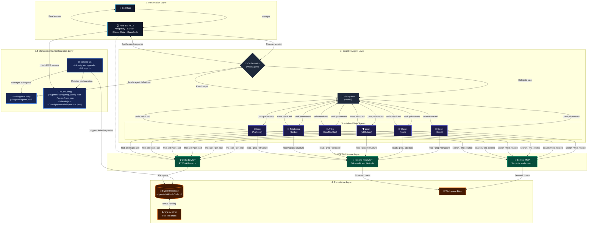

# Konoha Maintenance Skill

This skill contains the structural guidelines, command specifications, and architectural rules for maintaining and developing the **Konoha** SQLite FTS5 Skills-DB application.

## System Architecture

Konoha optimizes AI agent token usage by replacing massive folder-level context loading with SQLite FTS5 on-demand full-text search.

> **Note:** Konoha does not implement multi-provider LLM routing. The host IDE owns model selection, API calls, and any quota handling. Konoha provides MCP middleware, subagent orchestration, and on-demand skill retrieval.

## Database Schema

The SQLite database is stored at `~/.gemini/skills-db/skills.db`. It consists of the following tables:

1. **`skills`** (Standard content table):
   - `name` (TEXT, PRIMARY KEY): Unique identifier (e.g. `golang-security` or `golang-security/injection`).
   - `skill_name` (TEXT): Name of the parent skill folder.
   - `type` (TEXT): `skill` (for main SKILL.md) or `reference` (for references).
   - `tags` (TEXT): Comma-separated keywords.
   - `content` (TEXT): Full markdown file content.
   - `file_path` (TEXT): Absolute path to the source file on disk (used for workspace scoping).
   - `byte_size` (INTEGER): Size of the content.
   - `line_count` (INTEGER): Number of lines.

2. **`skills_fts`** (FTS5 Virtual Table):
   - External content table mapped to `skills`.
   - Fields: `name`, `skill_name`, `tags`, `content`.

3. **`tool_calls`** (Usage & Metrics logging):
   - Tracks metrics, timestamps, query strings, returned bytes, and calculated token savings.

## Core Commands

Maintainers must use these CLI commands to build, inspect, and test the database:

| Command | Action |
|---------|--------|
| `node bin/cli.js init --force` | Re-installs server, forces re-migration of all active skills, registers MCP, and redeploys subagent profiles. |
| `node bin/cli.js migrate` | Re-indexes all detected skill folders, removing stale entries first. |
| `node bin/cli.js test` | Runs internal JSON-RPC tests on the local MCP server. |
| `node bin/cli.js status` | Checks existence of required files, validates MCP configurations, and prints database counts. |
| `node bin/cli.js version` | Displays the current local version (1.1.6) and checks for updates from GitHub. |
| `node bin/cli.js upgrade` | Upgrades the Konoha CLI to the latest version directly from GitHub. |
| `node bin/cli.js doctor` | Diagnoses and auto-repairs Antigravity + Cursor integration health. |
| `python3 src/test_agent_attribution.py` | One-by-one Antigravity MCP agent attribution verification. |
| `python3 src/test_cursor_attribution.py` | One-by-one Cursor MCP agent attribution verification. |
| `node bin/cli.js savings` | Queries and displays token and bytes savings metrics. |

## Development Guidelines

### 1. Workspace Scoping & Security
- All tool outputs returned by `server.py` (`find_skill`, `list_skills`, `get_skill`) must run through `is_path_visible(file_path)` checks.
- Paths must be normalized using `os.path.realpath` to resolve symlinks before checking boundary permissions (i.e. checking if the path is in `~/.agents/`, `~/.gemini/`, or `os.getcwd()`).

### 2. Process Spawning
- **NEVER** use raw string concatenation in shell execution commands (`execSync`).
- **ALWAYS** use parameterized spawns (`spawnSync`) and validate inputs (checking name regex `/^[a-zA-Z0-9_-]+$/` and URL schemes) to protect against command injection.

### 3. Persistent Storage
- User configurations (e.g. subagent JSON settings) must be saved to the user's home directory (`~/.agents/agents.json`).
- Template files inside `src/templates/` serve only as fallbacks. Package template updates should fail silently in read-only global node_modules environments.

### 4. Subagent Model Fields (Host IDE)
- Konoha stores optional model preferences in `agents.json` (`model`, `cursorModel`) and injects them into generated `GEMINI.md`, `AGENTS.md`, and `~/.cursor/agents/*.md`.
- **Konoha does not implement multi-provider LLM routing.** Model selection, API calls, and quota handling are owned by the host IDE (Antigravity model registry, Cursor `model: inherit` slugs, Claude Code, OpenCode).
- Antigravity orchestrator templates may document quota fallback behavior for coordinators; that is IDE policy text, not a Konoha runtime component.

### 5. Compliance Reports
- Whenever updating Konoha versions or conducting security checks, you MUST generate a compliance report in the `docs/SecurityCompliance/` folder using the exact filename format: `security_compliance_report_google_policy_<version>_<YYYY-MM-DD>.md`.
- **Mandatory Compliance Report Structure**: All generated compliance reports MUST strictly adhere to the following Markdown structure to maintain auditing transparency:
  1. **# Security and Compliance Review: Konoha Project [vVersion]** (H1 Header)
  2. **## Executive Summary**: Summarizes the version reviewed, specific audit goals, and overall compliance outcome.
  3. **## Findings**: Contains sub-headings for each analyzed control (e.g. `### 1. Interactive Consent Prompts`, `### 2. Sandbox Boundary Validation`). Each finding must contain:
     - **Action Verified**: The specific code change, file modification, or config setting inspected.
     - **Impact**: The security benefit or policy compliance outcome (e.g. preventing silent writes).
  4. **## Conclusion**: Summary of the overall security posture and final verification declaration.

### 6. Changelog Maintenance
- Whenever you make an update to the codebase or bump the version, you MUST update the `CHANGELOG.md` file to reflect your changes.

### 7. File Modification Rule
- **File Modification Rule**: Only use `sed` if you are modifying an existing file (e.g., replacing specific strings or appending lines).
- **README Protection Rule**: DO NOT change the structure, layout, or existing content of README.md. When updating README.md, you MUST only modify specific strings (like version numbers) using targeted search-and-replace.

### 8. Agent Telemetry and Call Statistics
- **Case-Insensitive Grouping**: Agent status metrics calculation must aggregate statistics case-insensitively using lowercase agent names (`GROUP BY LOWER(agent)`), resolving misattribution to `Direct Tool Calls`.
- **Dynamic Active Agent Detection**: When the `agent` parameter is omitted from MCP tool arguments, `detect_active_agent()` resolves identity from:
  - **Antigravity**: `~/.gemini/antigravity-ide/brain` and `antigravity-cli/brain` — delegated `prompt.md` (`You are the X agent`) plus recent `PLANNER_RESPONSE` transcripts only (never `VIEW_FILE` lines).
  - **Cursor**: `~/.cursor/projects/*/agent-transcripts/*/*.jsonl` — `Task` `subagent_type`, subagent `[Agent] active` text, or `[Konoha] orchestrator active`.
- **Bypassing Orchestrator Override**: Prioritize registered subagent ranks over orchestrator fallback. Rank sessions by **transcript mtime** (not Antigravity `prompt.md` touch) so orchestrator prompt hooks do not mask active subagents or Cursor sessions.
- **Subagent Scan Order**: Check `tokubetsu-jonin` before `jonin` to avoid `\bjonin\b` matching inside `Tokubetsu-Jonin`.
- **Deep Directory Search**: Scan up to `15` recently modified conversation directories.
- **Protected Default Subagents**: `konoha agent delete` rejects removal of official ninja agents from `src/templates/agents.json`.

### 9. Dependency Version Auto-Fix
- **Auto-Fix Version Mismatches**: When running package installation or build commands (`pnpm install`, `pnpm run build`), if the output reports mismatched, outdated, or conflicting dependencies (such as `- lucide-react 1.21.0` and `+ lucide-react 0.468.0 (1.21.0 is available)`), agents must automatically parse the output, update `package.json` to specify the latest available version (or the recommended version) for the conflicting packages, and re-run the installation/build command again to align and fix the dependencies before proceeding.

### 10. Source Design or Code Reference Build Selection
- **Visual Mockup or Reference Source Context Detection**: When a task requests building or scaffolding a website or user interface, the agent must check if a source design or reference source code folder (e.g., `source-design`, `source-image-design`) exists.
- **`build_from_source` Tool**: If design mockups or reference source code files are present, the agent must invoke `build_from_source`. This tool instructs the build processor to strictly match layout design mockups and reference source code files while disabling the default premium template visual effects (10-theme switcher, 3D interactive carousels, 3D GPU card hovers, 3D SweetAlert2 modal dialogs, and watermark) unless they are explicitly requested or shown in the source files.
- **`build_from_text` Tool**: If no visual design mockup or reference source code directory exists, the agent must call `build_from_text` to scaffold the project using standard premium interactive features and templates.

### 11. Migration Optimization and Database Integrity
- **Preserving Markdown Integrity (HTML Comments)**: When optimizing skills during the `konoha migrate` process (`src/migrate.py`), the system MUST NEVER strip HTML comments (`<!-- -->`). Stripping HTML comments is destructive and drops the quality of skills because it accidentally removes critical Svelte compiler directives (e.g., `<!-- svelte-ignore a11y_click_events_have_key_events -->`) and structural markdown markers (e.g., `<!-- slide -->` for carousels).
- **Ghost Skill Purging**: To prevent deleted legacy skills from persisting in the SQLite FTS5 database, `konoha migrate` runs with `--clean` (full `DELETE FROM skills` before re-index) and purges deprecated skill entries by name/path pattern after each migration.
- **Legacy Tool Deprecation**: The legacy tools `build_with_image_design`, `render_image`, and the local `konoha render` CLI command (`visual_compare.py`) are permanently deprecated. Agents must use the unified `build_from_source` tool instead.

### 12. Subagent Model Property Allocation
- **Antigravity Model Injection**: When generating `GEMINI.md` or `AGENTS.md` in `src/agent_manager.js`, inject `model: \`<modelTier>\`` into `define_subagent` so subagents use configured Gemini/Claude tiers.
- **Cursor Model Injection**: `src/cursor_manager.js` deploys `~/.cursor/agents/*.md` with `model: inherit` (Cursor Auto) by default for Free-tier compatibility. Override via `cursorModel` in `agents.json` when explicit slugs are needed.

### 13. Cursor IDE/CLI Integration
- **Auto-Setup**: `ensureAutoSetup()` + `cursor_manager.ensureCursorSetup()` register MCP, subagents, hooks, CLI permissions, and mirror skills to `~/.cursor/skills/`.
- **Skills mirror**: `~/.agents/skills/` → `~/.cursor/skills/`; project `.agents/skills/` → `.cursor/skills/` (or global fallback on `konoha init`).
- **sessionStart Hook**: `cursor_bootstrap.js` self-heals config; always exits 0 (fail-open).
- **Orchestrator Rules**: Project `.cursor/rules/konoha.mdc` delegates via Task tool; skills-db for skills, semble for semantic code search (never Cursor Grep/Glob/SemanticSearch).
- **Documentation**: See `docs/SETUP-CURSOR.md`.

### 14. Semble Default Search Policy
- **Policy Source**: `src/search_policy.js` — shared text injected into `GEMINI.md`, `AGENTS.md`, and Cursor rules.
- **Rule**: All codebase discovery uses `semble.search` / `find_related` with absolute `repo`. Forbidden: grep, glob, find, rg, Cursor `Grep`/`Glob`/`SemanticSearch` (fallback: `rg` once if semble unavailable).
- **Upgrade Path**: `loadAgents()` syncs constraints when `NEVER use grep` marker is missing.

### 15. Token-Efficient File Tools (`konoha-files` MCP)
- **Architecture**: Node.js `file_tools_mcp.js` + `file_tools_router.js` orchestrate; Python scripts in `src/file_tools/` perform streaming I/O.
- **Tools**: `read_file_head` (≤200 lines), `read_file_range` (≤500 lines), `file_info`, `token_efficient_grep` (≤20 matches), `get_file_structure`, `find_files_clean`.
- **Launcher**: `file_tools_launcher.js` (cross-platform) + `.node_exec_path` / `.python_cmd` records; Unix also ships `file_tools_launcher.sh`.
- **Install**: `installFileTools()` copies to `~/.gemini/skills-db/`; registered as `konoha-files` in Antigravity `mcp_config.json` and Cursor `mcp.json`.
- **Tests**: `konoha test` runs MCP integration tests for all four tools.

### 16. Antigravity Orchestrator File Pipeline
- **Flow**: `prompt_hook.js` → `prompt.md` → orchestrator reads/analyzes → `delegate.md` → subagent → `result.md` → user report.
- **Forbidden**: `@self`, `@research`, direct project edits in orchestrator conversation.
- **Generator**: `buildOrchestratorWorkflow()` in `agent_manager.js` — shared by `GEMINI.md` and `AGENTS.md`.

### 17. Multi-CLI MCP Clients (Claude Code, OpenCode, others)
- **Install once**: `konoha init` deploys servers to `~/.gemini/skills-db/` regardless of IDE.
- **Auto-detect**: `src/mcp_clients_manager.js` configures Claude Code / OpenCode **only when** `claude` or `opencode` CLI is on PATH (or config dir exists).
- **Claude Code (auto)**: Merges into `~/.claude.json` (`mcpServers`) only — no project `.mcp.json`.
- **OpenCode (auto)**: Merges into `~/.config/opencode/opencode.json` (`mcp`) only — no project `opencode.json`.
- **Not installed**: Skip silently; manual fallback templates in `docs/templates/` (`claude-code.mcp.json`, `opencode.mcp.json`).
- **Self-heal**: `ensureAutoSetup()` and `konoha doctor --yes` repair when CLI is present.
- **Tool boundaries** (all clients): `skills-db` = skills only; `semble` = code search; `konoha-files` = bounded file I/O.
- **Documentation**: `docs/SETUP-MCP-CLIENTS.md`.

### 18. Workspace-Local Skills (Konoha repo sessions)
- **Scan paths**: `konoha migrate` indexes `~/.agents/skills/`, `~/.gemini/antigravity-cli/skills/`, and **`<cwd>/.agents/skills/`** (project-local).
- **konoha-maintenance**: Lives at `.agents/skills/konoha/SKILL.md` (`name: konoha-maintenance`). After migrate, agents discover it via `find_skill("konoha maintenance")` — do not load the full SKILL.md into context.
- **Session start in konoha folder**: Run `konoha migrate` after pull; call `find_skill` for architecture/CLI/release knowledge before editing core files.

### 19. konoha-files Path Sandbox (v1.1.6+)
- **JS**: `file_tools_router.js` `assertWithinWorkspace()` before spawning Python workers.
- **Python**: `file_tools/_common.py` `assert_within_workspace()` on every resolved path.
- **Rejected**: Absolute paths outside workspace root (e.g. `/etc/passwd`). Relative paths resolve against MCP workspace cwd.

### 20. Release QA Gates (public release checklist)
| Gate | Command | Pass |
|------|---------|------|
| MCP tests | `konoha test` | 14/14 |
| Antigravity attribution | `python3 src/test_agent_attribution.py` | 7/7 |
| Cursor attribution | `python3 src/test_cursor_attribution.py` | 8/8 |
| Self-heal | `konoha doctor --yes` | All healthy |
| Claude Code MCP | `konoha status` | Row active when `claude` CLI present |
| OpenCode MCP | `konoha status` | Row active when `opencode` CLI present |
| Cursor skills mirror | `ls ~/.cursor/skills/` | Matches `~/.agents/skills/` layout |
| Live benchmarks | `konoha savings` | skills-db + semble metrics |
| Deploy sync | `konoha migrate` | Copies `server.py`, file tools, hooks to `~/.gemini/skills-db/` |

### 21. Agent Attribution Fixes (v1.1.6 QA)
- **Cursor preference**: `detect_active_agent()` only prefers recent Cursor when Cursor is the top-ranked session by transcript mtime.
- **Orchestrator**: Return `orchestrator` immediately when detected in ranked scan (no deferred fallback that lets lower-ranked subagents win).
- **cursor_bootstrap.js**: Registers `konoha-files`; preserves semble policy line on subagent `.md` files; syncs Cursor skills mirror.
- **install/repair**: `registerHooks(true, true)` on first auto-setup; semble `args` repair; project `.cursor/mcp.json` merge; `deploy_utils.installFileTools()` shared by CLI and Cursor manager.

### 22. CLI TUI (v1.1.6)
- **Gradient styling**: `konoha doctor`, `konoha status`, installer, and savings output use themed gradients (`CHIDORI_THEME` / `LEAF_THEME`).
- **Dynamic tables**: `drawTable()` computes column widths from content — fixes Doctor table column overlap from fixed `padEnd()` widths.
- **Helpers**: `stripAnsi`, `computeTableWidths`, `gradientStatusCell`, `sectionTitle`, `drawIntegrationRow` in `bin/cli.js`.

### 23. Cross-Platform Support (v1.1.6 QA)
- **`src/platform_utils.js`**: Shared `uriToPath`, `expandUser`, `detectPython`, `getUvCommand`, `normPath` for Windows/macOS/Linux.
- **`file_tools_launcher.js`**: Cross-platform Node launcher; reads `.node_exec_path` when IDE PATH differs from nvm.
- **Python detection**: Windows probes `py -3`, `py`, `python3`, `python`; recorded in `~/.gemini/skills-db/.python_cmd`.
- **Path sandbox**: `normcase` on Windows in `file_tools/_common.py` and `file_tools_router.js`.
- **Cursor MCP**: `node` + `file_tools_launcher.js` (not Unix-only `sh` launcher).
