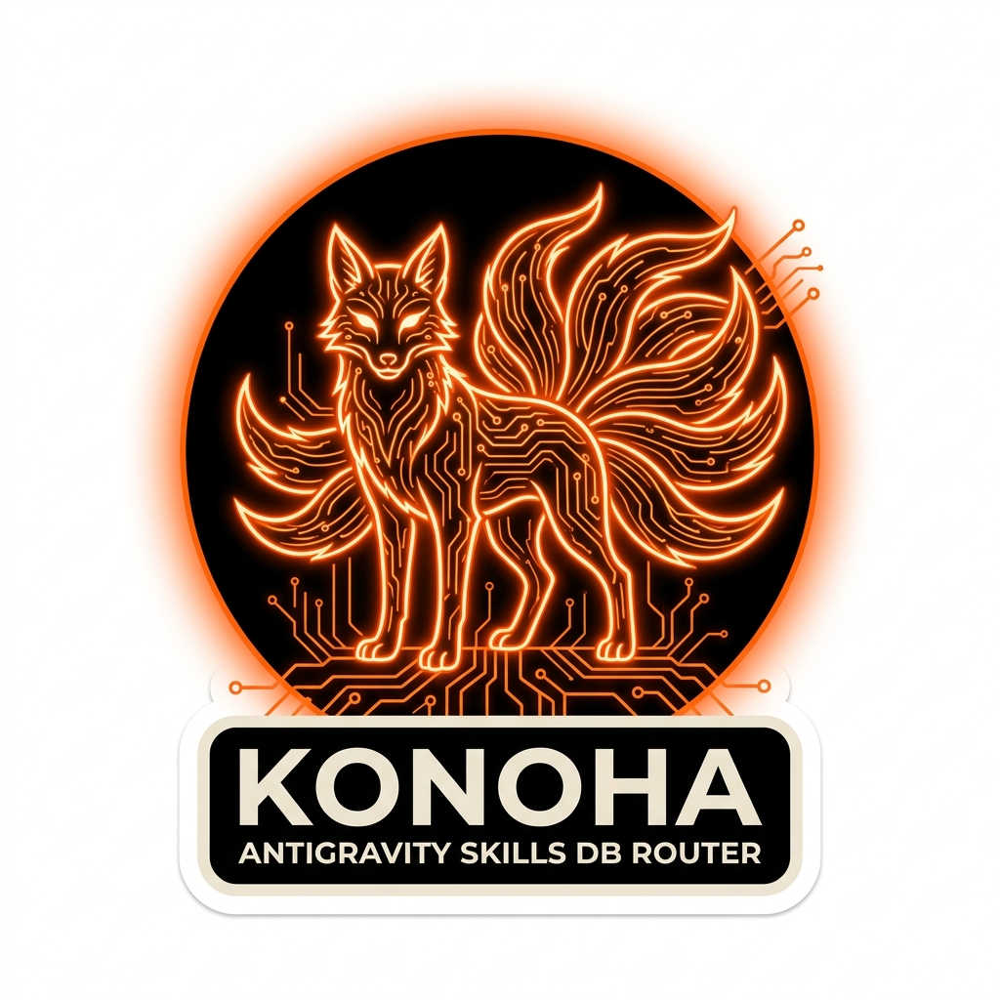
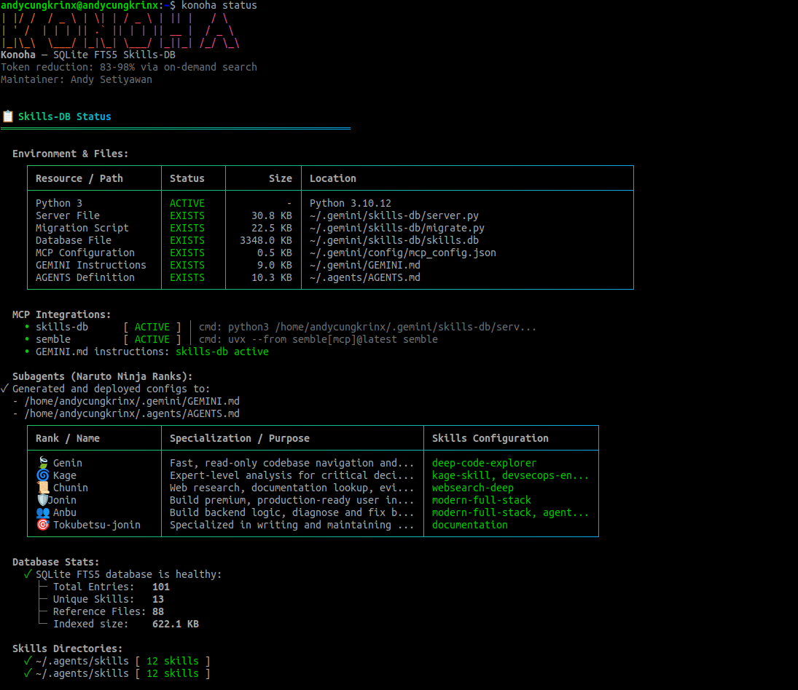
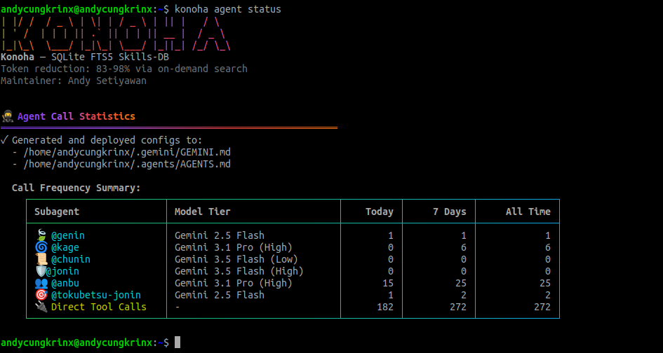
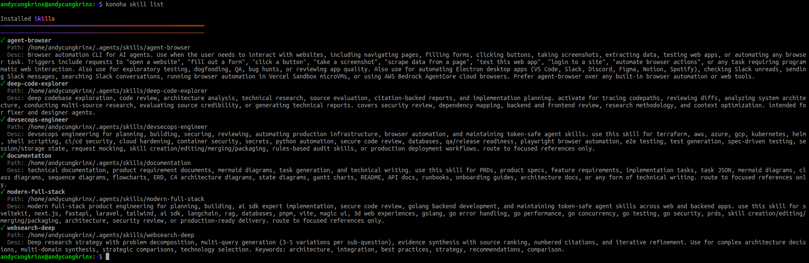
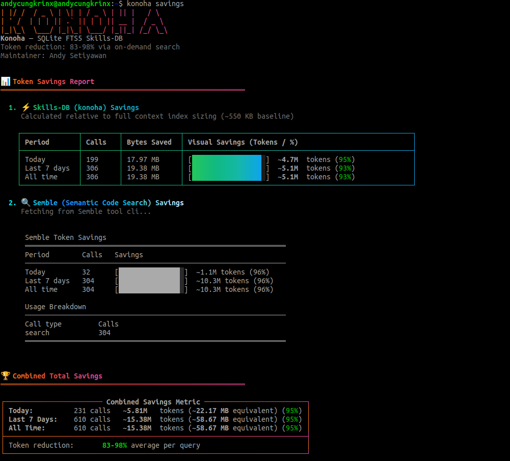
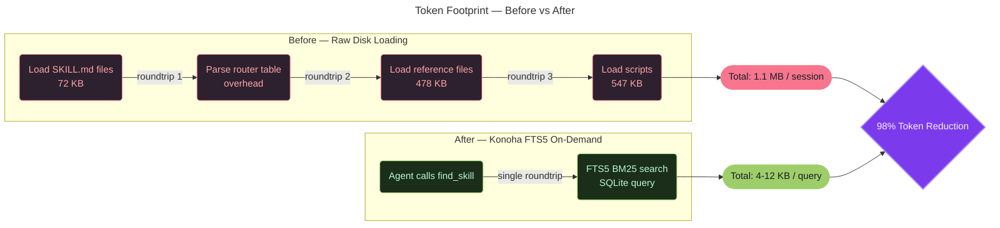

<p align="center">
  
</p>

[](README.md)
[](LICENSE)
[](README.md)
[](README.md)
[](README.md)
[](README.md)
[](README.md)

> SQLite FTS5 Skills-DB for Antigravity IDE/CLI — on-demand skill content via MCP, reducing token usage by **83-98%**.

---

## 📸 Preview

* **Latest Security Compliance:** [Google Policy Compliance v1.1.4](docs/SecurityCompliance/security_compliance_report_google_policy_1.1.4_2026-06-22.md)

| | |
|:---:|:---:|
| **📊 Database Status (`konoha status`)**<br> | **🥷 Subagent Team Status (`konoha agent status`)**<br> |
| **📜 Installed Skills List (`konoha skill list`)**<br> | **📈 Token Savings Dashboard (`konoha savings`)**<br> |

---

## 📖 Setup & Usage Guides

* [Antigravity IDE Setup Guide](docs/SETUP-IDE.md)
* [Antigravity CLI Setup Guide](docs/SETUP-CLI.md)
* [Adding Skills from skills.sh](docs/ADDING-SKILLS.md)
* [Token Savings Benchmarks](docs/BENCHMARK.md)
* [Troubleshooting Guide](docs/TROUBLESHOOTING.md)

## ⚠️ The Problem

When using agent skills with Antigravity IDE/CLI, the entire directory of `SKILL.md` files, reference documents, and auxiliary scripts is loaded directly into the starting conversation window. For a typical workspace configuration containing 5 custom skills:

| Component | Size | Context Overhead |
|:---|:---:|:---|
| `SKILL.md` Files (×5) | ~72 KB | Core agent instructions |
| Reference Guides (×88) | ~478 KB | API documentation, guides |
| Helper Scripts (×23) | ~547 KB | Utility code, automation |
| **Total Startup Payload** | **~1.1 MB** | **~800,000+ API tokens** |

> [!WARNING]
> This "disk-dump" approach wastes tokens on content that is irrelevant to the current task, inflates API usage bills, increases latency, and risks hitting LLM context window limits.

## 💡 The Solution

**Konoha** establishes a high-performance local SQLite FTS5 Model Context Protocol (MCP) server that:

1. **Indexes** all skill content (`SKILL.md` + references + scripts) into a full-text search database.
2. **Serves on-demand** — agents invoke `find_skill("keyword")` to retrieve only the matching ~4 KB content block.
3. **Optimizes context** — replaces the redundant "load SKILL.md → parse router → load reference" chain.

> [!TIP]
> **Optimization Result**: Context size is reduced to **~12 KB** per query instead of **~550 KB** per session — achieving a **98% token reduction** and **42% faster response times**.

---
## ⚙️ How It Works

For a detailed breakdown of Konoha's internal mechanics, including system layers, data flows, and query lifecycle sequence diagrams, please see the [System Architecture Guide](docs/ARCHITECTURE.md).

---

## 🚀 Quick Start

> [!IMPORTANT]
> **Auto-Setup with Interactive Consent**:
> Starting with version `1.0.9`, Konoha features an auto-setup routine with built-in interactive `@inquirer/prompts` flows to comply with Google Policy. Running *any* `konoha` command (or launching the CLI for the first time) automatically triggers the bootstrap sequence. However, to ensure user consent, the CLI will interactively prompt you with Yes/No questions before modifying any `~/.gemini` configurations or configuring permanent auto-approval permissions for MCP tools.

Get Konoha up and running in under 2 minutes:

```bash
# 1. Initialize on any machine directly from GitHub
npx github:andycungkrinx91/konoha init

# 2. Verify the MCP server connection works
konoha test

# 3. Check installation status and index database statistics
konoha status
```

> [!NOTE]
> For step-by-step IDE integration, see the [Antigravity IDE Setup Guide](docs/SETUP-IDE.md). For CLI setup, see the [Antigravity CLI Setup Guide](docs/SETUP-CLI.md).

## 📋 Requirements

- **Node.js** ≥ 18
- **Python 3** ≥ 3.8 (for MCP server, uses standard library only — no external pip packages required)
- **Antigravity IDE** or **Antigravity CLI** (agy)
- **Agent skills** in `~/.agents/skills/` (with `SKILL.md` files)

## 🛠️ CLI Commands

To run all commands simply as `konoha <command>`, install the package globally:

```bash
npm install -g github:andycungkrinx91/konoha
```

Once installed, the following CLI commands are available:

| Command | Description |
|:---|:---|
| `konoha init` | Full install: server + migration + MCP config + GEMINI.md |
| `konoha migrate` | Re-index skills (run after editing skills) |
| `konoha test` | Test MCP server with sample searches |
| `konoha status` | Show installation status and DB stats |
| `konoha version` | Display current local version (1.1.4) and check for updates from GitHub |
| `konoha upgrade` | Upgrade Konoha CLI to the latest version directly from GitHub |
| `konoha savings` | Show token savings metrics (Today, 7 days, All time) for Skills-DB and Semble |
| `konoha render` | Design match comparison between built website URL and a mockup file (saves token usage) |
| `konoha doctor` | Diagnose environment health and automatically repair missing files |
| `konoha uninstall` | Remove Skills-DB (original skills untouched) |
| `konoha skill <subcommand>` | Manage custom skills (`list`, `search`, `add`, `remove`) |
| `konoha agent <subcommand>` | Manage subagent configurations (`list`, `create`, `models`, `skill`, `delete`, `status`) |
| `konoha models <subcommand>` | Manage available LLM models and assign them to subagents |
| `konoha help` | Show help |


## What Gets Installed

```
~/.gemini/
├── config/
│   └── mcp_config.json   ← skills-db + semble MCP servers registered here
├── skills-db/
│   ├── server.py          ← MCP stdio server (Python, stdlib only)
│   ├── migrate.py         ← Migration script
│   └── skills.db          ← SQLite FTS5 database
└── GEMINI.md              ← Updated with skills-db + semble instructions
```

---

## Re-indexing After Skill Changes

If you add, edit, or remove skills:

```bash
konoha migrate
```

This re-scans `~/.agents/skills/` and updates the database. It's idempotent — safe to run repeatedly.

## Cross-Platform Notes

| OS | Python Command | Paths |
|----|---------------|-------|
| Linux | `python3` | `~/.gemini/skills-db/` |
| macOS | `python3` | `~/.gemini/skills-db/` |
| Windows | `python` or `python3` | `%USERPROFILE%\.gemini\skills-db\` |

The installer auto-detects the correct Python command for your platform.

---

## MCP Tools Available

After installation, konoha registers **2 MCP servers** that work together:

### skills-db — Skill Knowledge Search

The `skills-db` server exposes 3 tools for on-demand skill retrieval:

#### `find_skill(keyword, limit?)`
Search skills by keyword using FTS5 full-text search.

```
find_skill("terraform aws")     → anbu-skill references
find_skill("sveltekit tailwind") → jonin-skill references
find_skill("code review")       → genin-skill references
```

Returns top 3 matches with 4KB content previews. Truncated results include a hint to use `get_skill()` for full content.

#### `get_skill(name)`
Get full content of a specific skill/reference by exact name.

```javascript
get_skill("jonin-skill/svelte-code-expert")
get_skill("anbu-skill/terraform-aws-modules")
```

#### `list_skills()`
List all indexed skills and references with metadata.

### semble — Semantic Code Search

The `semble` server provides AI-powered semantic code search across the entire codebase. Registered via `uvx --from semble[mcp]@latest semble`.

#### `search(query)`
Semantic search across the codebase — understands code meaning, not just text matching.

```javascript
semble.search("authentication middleware")  → relevant code files
semble.search("database connection pool")   → connection handling code
```

#### `find_related(file_path)`
Find files semantically related to a given file — useful for understanding dependencies and impact.

> [!IMPORTANT]
> **All agents are required to prefer `semble` over `grep`/`glob` for code discovery.** Semble provides semantic understanding of code structure, not just text matching.

---

## 🥷 Official Agent Team (Naruto Ninja Ranks)

The installer updates your configuration to define a cohesive, specialized team of **6 Naruto-ranked subagents**. Each agent represents a level of ninja hierarchy with clear responsibilities, preferred model tier, fallback settings, and tool access:

### 1. 🍃 Genin (Junior Scout)
* **Operational Role**: Codebase Reconnaissance & Scout
* **Primary Model**: `Gemini 2.5 Flash` | **Fallback**: `Gemini 3.1 Flash-Lite`
* **Key Responsibilities**:
  - Fast, read-only code exploration.
  - Traces codepaths, maps dependencies, and analyzes repository structure.
  - *Constraint*: Must never write or modify files on the filesystem.
* **Skills-DB Keyword**: `code exploration tracing` (invokes scout-level heuristics on startup).

### 2. 📜 Chunin (Journeyman Intel Gatherer)
* **Operational Role**: Intel Gathering, Web Research, & Documentation Synthesis
* **Primary Model**: `Gemini 3.5 Flash (Low)` | **Fallback**: `Gemini 3.1 Flash-Lite`
* **Key Responsibilities**:
  - Researches libraries, API specifications, version histories, and best practices.
  - Leverages semantic search (`semble`) to discover codebase context before executing web searches.
  - Batches parallel queries and ranks search results by credibility, freshness, and relevance.
  - Compiles comprehensive, citation-backed notes with full reference URLs.
* **Skills-DB Keyword**: `websearch deep research` (loads intel gathering methodologies).

### 3. 🛡️ Jonin (Elite Builder)
* **Operational Role**: UI/UX Master, Styling, & Component Architecture
* **Primary Model**: `Gemini 3.5 Flash (High)` | **Fallback**: `Gemini 3.1 Flash-Lite`
* **Key Responsibilities**:
  - Builds premium, visually stunning frontends (SvelteKit, Next.js, Tailwind v4, Magic UI, 3D web).
  - Enforces design tokens, custom typography, smooth gradients, and glassmorphism.
  - Performs design match comparisons using the `agent-browser` CLI.
  - Enforces the **Zero-Error Guarantee & Verification Loop** (running local installs, Svelte/Next syncs, check/lint diagnostics, and production builds to guarantee zero compilation errors/warnings before completion).
* **Skills-DB Keyword**: `sveltekit tailwind nextjs components` (fetches design standards).

### 4. 👥 Anbu (Special Black Ops)
* **Operational Role**: Backend Specialist, Bug Resolution, & DevOps Engineer
* **Primary Model**: `Gemini 3.1 Pro (High)` | **Fallback**: `Gemini 3.1 Flash-Lite`
* **Key Responsibilities**:
  - Designs backend systems, database schemas, and robust API endpoints.
  - Diagnoses complex runtime bugs, memory leaks, and environment failures.
  - Provisions infrastructure (Terraform, Kubernetes, Helm) and manages secure CI/CD pipelines.
  - Validates changes with dry-runs and establishes structured rollback procedures.
* **Skills-DB Keyword**: `terraform aws kubernetes helm ci-cd` (loads deployment recipes).

### 5. 🎯 Tokubetsu-jonin (Specialized Scribe)
* **Operational Role**: Technical Writing, Documentation, & API Specification
* **Primary Model**: `Gemini 2.5 Flash` | **Fallback**: `Gemini 3.1 Flash-Lite`
* **Key Responsibilities**:
  - Authors and maintains README files, API documentations, runbooks, and onboarding guides.
  - Emphasizes reader-first principles, clean code blocks, and visual diagrams.
* **Skills-DB Keyword**: `documentation README API runbook` (retrieves writing standards).

### 6. 🌀 Kage (Village Leader)
* **Operational Role**: Senior Architect, Strategist, & Deep Problem Solver
* **Primary Model**: `Gemini 3.1 Pro (High)` | **Fallback**: `Gemini 3.1 Flash-Lite`
* **Key Responsibilities**:
  - Guides high-level architecture decisions, security audits, and risk assessments.
  - Constructs trade-off matrices and designs disaster recovery/rollback strategies.
  - Orchestrates the entire subagent team for complex, multi-domain tasks.
* **Skills-DB Keyword**: `code review architecture devsecops` (loads advanced architectural frameworks).

---

## 🛡️ Default Guardrails

To ensure safety, consistency, and predictable execution, the Antigravity system enforces several strict behavioral guardrails across all subagents:

> [!IMPORTANT]
> **Core Safety & Operational Policies:**
>
> * **Proactive Execution (No commanding back)**: Subagents must never instruct the user to manually create/edit files or run terminal commands that the agent is equipped to perform itself.
> * **Protected Configuration & Secrets**: All `.env`, `.tfvars`, and `secrets.yaml` files are strictly **read-only** by default. Subagents must explicitly request user permission before accessing or modifying these files.
> * **No Git Execution**: Subagents are strictly prohibited from executing any `git` commands (including `status`, `diff`, `log`). All git operations are reserved for the developer. Use `semble` or `ripgrep` for local code discovery.
> * **Locked Subagent Delegation**: Subagent delegation is locked to the 6 official Konoha agents. Creating custom subagents dynamically is prohibited.
> * **Circuit Breaker**: Handoff loops are tracked via depth metadata. If handoff depth exceeds 7, the execution freezes and prompts the user for manual validation.
> * **Quota Fallback**: In the event of API rate limits or `429 / RESOURCE_EXHAUSTED` errors, the system will fallback to `Gemini 3.1 Flash-Lite` and use direct tool calls instead of spawning additional subagents.

---

##

### 📊 Benchmark: Token Footprint & Optimization

The following charts demonstrate the context footprint savings per conversation session achieved by moving from full-disk loading to SQLite FTS5 on-demand retrieval:

#### Context Size Comparison (Lower is Better)

```text
Startup Payload Size (KB)
────────────────────────────────────────────────────────────
Baseline (Disk Load):  ██████████████████████████████  550 KB
Konoha (On-Demand):   █                              12 KB   (97.8% savings)
────────────────────────────────────────────────────────────
```



📊 **Benchmark Comparison: Antigravity Session Metrics**

| Metric | Without Konoha + Semble (Baseline) | With Konoha + Semble (Optimized) | Impact / Savings |
| :--- | :---: | :---: | :---: |
| **Startup Context Load** | **~1.1 MB** (all SKILL.md rules + reference files loaded at start) | **~0 KB** (instructions are lazy-loaded on-demand via MCP) | **~100% startup context reduction** |
| **Single Search Query Payload** | **50 KB+** (entire files loaded/dumped) | **~4 KB - 12 KB** (precise matches returned) | **83% - 98% token reduction** per query |
| **Active Workspace Calls** | — | **481 calls** | — |
| **Context Data Saved** | — | **~41.54 MB** | — |
| **Active Tokens Saved** | 0 (baseline) | **~10.89M tokens** | **~10.89M tokens saved** |
| **Response Latency** | Baseline (100%) | **~58%** (42% faster response times) | **~42% speed improvement** |
| **API Cost Footprint** | Baseline (100%) | **~5%** (95% cost reduction) | **~95% token cost savings** |

**Real-world Savings (Current metrics from active developer workspace):**
- **Combined Token Savings**: **~10.89M tokens saved** all-time across 481 total agent calls (~41.54 MB of context data saved).
- **Skills-DB (konoha) Efficiency**: **85% context size reduction** (average query footprint reduced from average 25 KB baseline to ~4 KB - 12 KB on-demand; ~1.3M tokens saved).
- **Semble MCP Efficiency**: **96% context size reduction** average per search query (~9.6M tokens saved across 286 calls).
- **Response Latency Reduction**: **~42% faster** agent responses due to minimized input context parsing.
- **API Cost Reduction**: **~95% reduction** in API token fees per agent session.

> [!TIP]
> Read the complete [Token Savings & Optimization Benchmark Report](docs/BENCHMARK.md) for full metrics breakdown and analysis.

### 🔄 Token-Efficient File-Based Delegation

To achieve maximal token efficiency during agent-to-agent collaboration, Konoha implements a transient file-based Markdown communication protocol:
* **Structured Context Isolation**: Instead of subagents inheriting the entire parent conversation log, the Task Router serializes task parameters into a structured Markdown file at `scratch/delegate.md` (defining Goal, Context, and Constraints).
* **Focused Execution**: The invoked subagent reads `delegate.md`, performs the work (loading specialized skill content on-demand via the MCP server), and writes its output back to `scratch/result.md`.
* **Substantial Savings**: Isolating subagent context windows prevents prompt histories from ballooning, yielding up to **95%+ token savings** per subagent invocation.
* **Recursive Loop Circuit Breaker**: Subagent delegation tracks a sequential `depth` parameter in YAML frontmatter. If handoff depth exceeds 5 continuously, a circuit breaker trips to freeze the queue and prompt the user for validation.

### Detailed Before vs After Comparison

For an in-depth breakdown of system behavior, token consumption, configuration fragmentation, and architectural overhead, please read the [Detailed Before vs After Comparison](docs/BENCHMARK.md#detailed-before-vs-after-comparison) section in the Benchmark Report.


## Credits

Special thanks to [semble](https://github.com/MinishLab/semble) by MinishLab for providing the powerful semantic search capability that forms the second half of Konoha's optimization stack.

## License

MIT © 2026 [Andy Setiyawan | The shadow ninja with coffee](https://www.linkedin.com/in/andy-setiyawan-452396170/)
