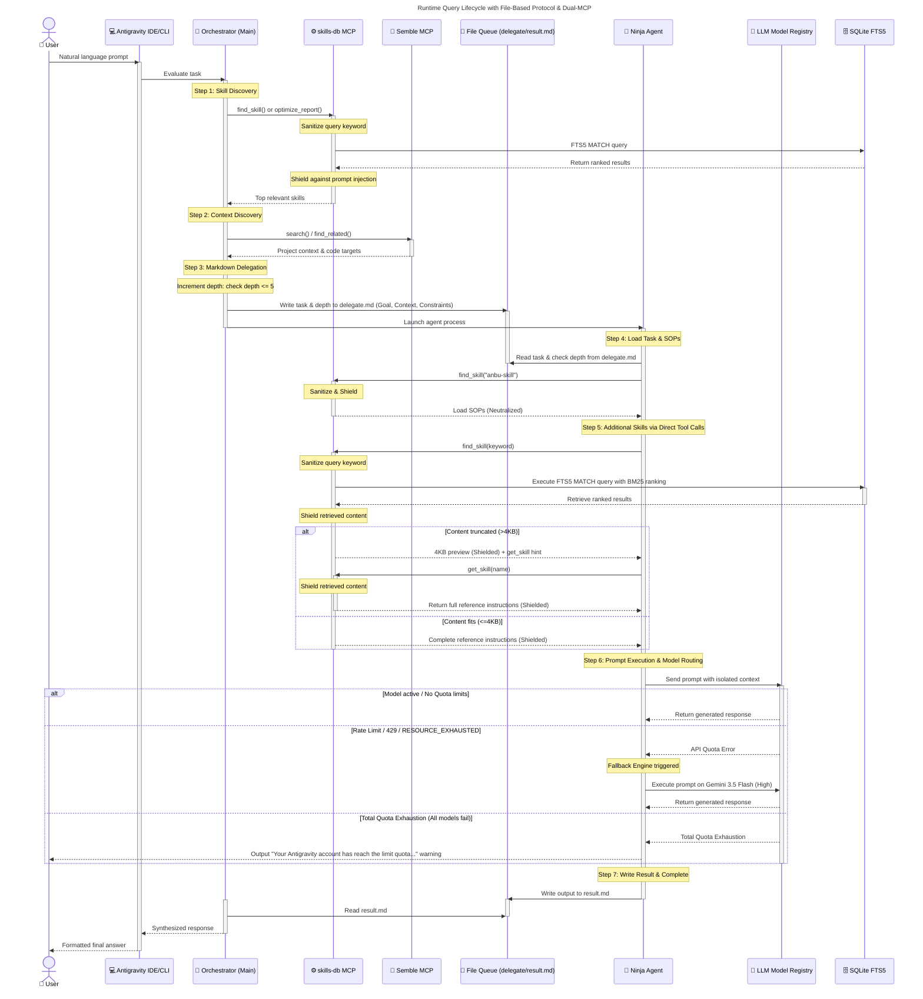

<p align="center">
  
</p>

[](README.md)
[](LICENSE)
[](README.md)
[](README.md)
[](README.md)
[](README.md)
[](README.md)

> SQLite FTS5 Skills-DB for Antigravity IDE/CLI — on-demand skill content via MCP, reducing token usage by **83-98%**.

## The Problem

When using agent skills with Antigravity IDE/CLI, entire SKILL.md files and their references are loaded into agent context. For a typical setup with 5 custom skills:

| Component | Size |
|-----------|------|
| SKILL.md files (×5) | ~72 KB |
| Reference files (×88) | ~478 KB |
| Scripts (×23) | ~547 KB |
| **Total per session** | **~1.1 MB** |

This wastes tokens on content that's mostly irrelevant to the current task.

## The Solution

**konoha** creates a local SQLite FTS5 MCP server that:

1. **Indexes** all skill content (SKILL.md + references) into a full-text search database
2. **Serves on-demand** — agents call `find_skill("keyword")` and get only the ~4KB that matches
3. **Replaces** the "load SKILL.md → parse router → load reference" chain

**Result**: ~12 KB per query instead of ~550 KB per session = **98% token reduction**.

### Benchmark: Token Footprint & Optimization

The following charts demonstrate the context footprint savings per conversation session achieved by moving from full-disk loading to SQLite FTS5 on-demand retrieval:

#### Context Size Comparison (Lower is Better)

```
Startup Payload Size (KB)
────────────────────────────────────────────────────────────
Baseline (Disk Load):  ██████████████████████████████  550 KB
Konoha (On-Demand):   █                              12 KB   (97.8% savings)
────────────────────────────────────────────────────────────
```


📊 **Benchmark Comparison: Antigravity Session Metrics**

| Metric | Without Konoha + Semble (Baseline) | With Konoha + Semble (Optimized) | Impact / Savings |
| :--- | :---: | :---: | :---: |
| **Startup Context Load** | **~1.1 MB** (all SKILL.md rules + reference files loaded at start) | **~0 KB** (instructions are lazy-loaded on-demand via MCP) | **~100% startup context reduction** |
| **Single Search Query Payload** | **50 KB+** (entire files loaded/dumped) | **~4 KB - 12 KB** (precise matches returned) | **83% - 98% token reduction** per query |
| **Active Workspace Calls** | — | **273 calls** | — |
| **Context Data Saved** | — | **~44.07 MB** | — |
| **Active Tokens Saved** | 0 (baseline) | **~11.55M tokens** | **~11.55M tokens saved** |
| **Response Latency** | Baseline (100%) | **~58%** (42% faster response times) | **~42% speed improvement** |
| **API Cost Footprint** | Baseline (100%) | **~5%** (95% cost reduction) | **~95% token cost savings** |

**Real-world Savings (Current metrics from active developer workspace):**
- **Combined Token Savings**: **~11.55M tokens saved** all-time across 273 total agent calls (~44.07 MB of context data saved).
- **Skills-DB (konoha) Efficiency**: **99% context size reduction** (average query footprint reduced from 550 KB baseline to ~12 KB on-demand; ~3.0M tokens saved).
- **Semble MCP Efficiency**: **96% context size reduction** average per search query (~8.6M tokens saved across 256 calls).
- **Response Latency Reduction**: **~42% faster** agent responses due to minimized input context parsing.
- **API Cost Reduction**: **~95% reduction** in API token fees per agent session.

> [!TIP]
> Read the complete [Token Savings & Optimization Benchmark Report](file:///home/andycungkrinx/experiment/portofolio/data/konoha/docs/BENCHMARK.md) for full metrics breakdown and analysis.

### Token-Efficient File-Based Delegation

To achieve maximal token efficiency during agent-to-agent collaboration, Konoha implements a transient file-based Markdown communication protocol:
* **Structured Context Isolation**: Instead of subagents inheriting the entire parent conversation log, the Task Router serializes task parameters into a structured Markdown file at `scratch/delegate.md` (defining Goal, Context, and Constraints).
* **Focused Execution**: The invoked subagent reads `delegate.md`, performs the work (loading specialized skill content on-demand via the MCP server), and writes its output back to `scratch/result.md`.
* **Substantial Savings**: Isolating subagent context windows prevents prompt histories from ballooning, yielding up to **95%+ token savings** per subagent invocation.
* **Recursive Loop Circuit Breaker**: Subagent delegation tracks a sequential `depth` parameter in YAML frontmatter. If handoff depth exceeds 5 continuously, a circuit breaker trips to freeze the queue and prompt the user for validation.

## Quick Start

```bash
# Initialize on any machine directly from GitHub
npx github:andycungkrinx91/konoha init

# Verify it works
konoha test

# Check status
konoha status
```

## Requirements

- **Node.js** ≥ 18
- **Python 3** ≥ 3.8 (for MCP server, uses stdlib only — no pip packages)
- **Antigravity IDE** or **Antigravity CLI** (agy)
- **Agent skills** in `~/.agents/skills/` (with SKILL.md files)

## Commands

To run all commands simply as `konoha <command>`, install the package globally:

```bash
npm install -g github:andycungkrinx91/konoha
```

After doing so, you can run all commands directly:

| Command | Description |
|---------|-------------|
| `konoha init` | Full install: server + migration + MCP config + GEMINI.md |
| `konoha migrate` | Re-index skills (run after editing skills) |
| `konoha test` | Test MCP server with sample searches |
| `konoha status` | Show installation status and DB stats |
| `konoha version` | Display current local version (1.0.5) and check for updates from GitHub |
| `konoha upgrade` | Upgrade Konoha CLI to the latest version directly from GitHub |
| `konoha savings` | Show token savings metrics (Today, 7 days, All time) for Skills-DB and Semble |
| `konoha doctor` | Diagnose environment health and automatically repair missing files |
| `konoha uninstall` | Remove Skills-DB (original skills untouched) |
| `konoha skill <subcommand>` | Manage custom skills (`list`, `search`, `add`, `remove`) |
| `konoha agent <subcommand>` | Manage subagent configurations (`list`, `create`, `models`, `skill`, `delete`, `status`) |
| `konoha models <subcommand>` | Manage available LLM models and assign them to subagents |
| `konoha help` | Show help |

## What Gets Installed

```
~/.gemini/
├── config/
│   └── mcp_config.json   ← skills-db + semble MCP servers registered here
├── skills-db/
│   ├── server.py          ← MCP stdio server (Python, stdlib only)
│   ├── migrate.py         ← Migration script
│   └── skills.db          ← SQLite FTS5 database
└── GEMINI.md              ← Updated with skills-db + semble instructions
```

## MCP Tools Available

After installation, konoha registers **2 MCP servers** that work together:

### skills-db — Skill Knowledge Search

The `skills-db` server exposes 3 tools for on-demand skill retrieval:

#### `find_skill(keyword, limit?)`
Search skills by keyword using FTS5 full-text search.

```
find_skill("terraform aws")     → devsecops-engineer references
find_skill("sveltekit tailwind") → modern-full-stack references
find_skill("code review")       → deep-code-explorer references
```

Returns top 3 matches with 4KB content previews. Truncated results include a hint to use `get_skill()` for full content.

#### `get_skill(name)`
Get full content of a specific skill/reference by exact name.

```
get_skill("modern-full-stack/svelte-code-writer")
get_skill("devsecops-engineer/terraform-aws-modules")
```

#### `list_skills()`
List all indexed skills and references with metadata.

### semble — Semantic Code Search

The `semble` server provides AI-powered semantic code search across the entire codebase. Registered via `uvx --from semble[mcp]@latest semble`.

#### `search(query)`
Semantic search across the codebase — understands code meaning, not just text matching.

```
semble.search("authentication middleware")  → relevant code files
semble.search("database connection pool")   → connection handling code
```

#### `find_related(file_path)`
Find files semantically related to a given file — useful for understanding dependencies and impact.

> **All agents are required to prefer `semble` over `grep`/`glob` for code discovery.** Semble provides semantic understanding of code structure, not just text matching.

## Official Agent Team (Naruto Ninja Ranks)

The installer updates your configuration to define a cohesive, specialized team of **6 Naruto-ranked subagents**. Each agent represents a level of ninja hierarchy with clear responsibilities, preferred model tier, fallback settings, and tool access:

### 1. 🍃 Genin (Junior Ninja)
* **Role**: Codebase Reconnaissance & Scout
* **Model Tier**: `Gemini 2.5 Flash` | **Fallback**: `Gemini 3.5 Flash (High)`
* **Responsibilities**:
  - Fast, read-only code exploration.
  - Tracing codepaths, mapping dependencies, and mapping repository structure.
  - Must never write or modify any files on the filesystem.
* **Skills-DB Usage**: Calls `find_skill("code exploration tracing")` on startup to get scout-level heuristics.

### 2. 📜 Chunin (Journeyman Ninja)
* **Role**: Intel Gathering, Web Research, & Documentation
* **Model Tier**: `Gemini 3.5 Flash (Low)` | **Fallback**: `Gemini 3.5 Flash (High)`
* **Responsibilities**:
  - Researching libraries, API documentations, version differences, and best practices.
  - Using semantic code search (semble) to discover local repository context and dependencies before searching the web.
  - Batching parallel queries and ranking search results by credibility, freshness, and relevance.
  - Compiles comprehensive, citation-backed notes with full URLs.
* **Skills-DB Usage**: Calls `find_skill("websearch deep research")` to access intelligence and research methodologies.

### 3. 🛡️ Jonin (Elite Ninja)
* **Role**: UI/UX Master, Styling, & Component Building
* **Model Tier**: `Gemini 3.5 Flash (High)`
* **Responsibilities**:
  - Building gorgeous, premium interfaces (e.g., SvelteKit, Next.js, Tailwind v4, Magic UI, and 3D web).
  - Enforcing design tokens, custom typography, animations, gradients, and responsive layouts.
  - Generating design assets and mockups.
* **Skills-DB Usage**: Calls `find_skill("sveltekit tailwind nextjs components")` to fetch design guidelines.

### 4. 👥 Anbu (Special Black Ops Ninja)
* **Role**: Backend Specialist, Bug Fixing, & DevOps
* **Model Tier**: `Gemini 3.1 Pro (High)` | **Fallback**: `Gemini 3.5 Flash (High)`
* **Responsibilities**:
  - Backend development, database schema design, and server APIs.
  - Undercover diagnostics of complex bugs, memory leaks, and environment failures.
  - Deploying infrastructure via Terraform, managing Kubernetes, Helm charts, and building secure CI/CD pipelines.
  - Implementing dry-runs and safe rollback plans for system integrity.
* **Skills-DB Usage**: Calls `find_skill("terraform aws kubernetes helm ci-cd")` to fetch deployment configurations.

### 5. 🎯 Tokubetsu-jonin (Specialized Elite Ninja)
* **Role**: Technical Writing, Documentation, & Scribe
* **Model Tier**: `Gemini 2.5 Flash` | **Fallback**: `Gemini 3.5 Flash (High)`
* **Responsibilities**:
  - Writing and maintaining technical documentation, specs, readme guides, and runbooks.
  - Ensuring readability and reader-first principles, including command and code examples.
* **Skills-DB Usage**: Calls `find_skill("documentation README API runbook")` to retrieve style guidelines.

### 6. 🌀 Kage (Village Shadow Leader)
* **Role**: Senior Architect, Strategist, & Deep Problem Solver
* **Model Tier**: `Gemini 3.1 Pro (High)` | **Fallback**: `Gemini 3.5 Flash (High)`
* **Responsibilities**:
  - High-level design decisions, security reviews, trade-off matrices, and risk assessments.
  - Handles complex architecture issues and provides rollback strategies.
  - The most comprehensive and capable decision maker on the team.
* **Skills-DB Usage**: Calls `find_skill("code review architecture devsecops")` to retrieve advanced architectural frameworks.

## Configuration, Registry & Recovery

For advanced workflows, customization, and troubleshooting details, please refer to the dedicated documentation guides:

- **Model Registry & Fallbacks**: Mappings of Ninja ranks to specific LLM tiers, fallback redirection rules, and available model aliases. See [Antigravity CLI Setup Guide - Model Registry & Fallbacks](docs/SETUP-CLI.md#model-registry-and-fallbacks).
- **Customizing Subagents**: Step-by-step instructions for creating, updating, or deleting subagents and pruning legacy metrics using CLI commands. See [Antigravity CLI Setup Guide - Subagent Management](docs/SETUP-CLI.md#skill-and-agent-management).
- **Quota Exceeded Recovery**: Step-by-step recovery guides to resolve `RESOURCE_EXHAUSTED` or `429` API errors by switching active Google default accounts or upgrading subscription limits. See [Troubleshooting Guide - Quota Limits](docs/TROUBLESHOOTING.md#quota-limits-rate-limits-and-api-errors).

## Default Guardrails

The Antigravity system enforces several default safety and behavioral guardrails across all subagents:

- **Proactive Execution (No commanding back)**: Subagents must never command or instruct the user to manually create or modify files, or run terminal commands that the agent is equipped to perform itself. The agent must proactively perform all edits, code additions, shell commands, and investigations using its own tool suite rather than writing instructions for the developer to execute them.
- **Read-Only `.tfvars` & `.env` Guardrail**: All `.tfvars` and `.env` files (including `terraform.tfvars`, any files with the `.tfvars` extension, and `.env` files) are strictly protected and **read-only** by default. Subagents must **always ask for user permission** (using the `ask_permission` tool or by asking the user directly) before attempting to read or write any of these files to prevent unauthorized access or accidental configuration overrides.
- **No Git Commands Guardrail**: Subagents are strictly prohibited from executing any `git` command whatsoever (including read-only queries like `git status`, `git log`, or `git diff`). All git operations are strictly reserved for the developer to perform manually. Use alternative system discovery tools or `semble` instead.
- **Strict Subagent Delegation Guardrail**: Subagent delegation is strictly restricted to the 6 official Konoha agents: `genin`, `kage`, `chunin`, `jonin`, `anbu`, `tokubetsu-jonin`. Defining or creating custom subagents is prohibited.
- **No Auto-Creation of Subagents**: The AI agent (Antigravity) is **NEVER** allowed to automatically define, create, or delete subagents. Spawning new/custom subagents or invoking `define_subagent` for unrecognized agent names is strictly prohibited for the AI. The creation and deletion of subagents are manual features reserved exclusively for the user.
- **Quota Fallback to Direct Tool Calls**: In case of quota limits (such as `RESOURCE_EXHAUSTED` or `429` errors), the coordinator will NOT spawn shadow subagents. Instead, it will immediately fall back to Direct Tool Calls (executing edits, reads, and commands directly) to complete the task.
- **Recursive Handoff Circuit Breaker**: Tracks sequential delegation loop depth (`depth: <N>`) inside the `delegate.md` queue. Trips immediately if depth exceeds 5, freezing task execution and alerting the developer to prevent infinite execution loops.

## Setup & Usage Guides

- [Antigravity IDE Setup](docs/SETUP-IDE.md)
- [Antigravity CLI Setup](docs/SETUP-CLI.md)
- [Adding Skills from skills.sh](docs/ADDING-SKILLS.md)
- [Token Savings Benchmarks](docs/BENCHMARK.md)
- [Troubleshooting](docs/TROUBLESHOOTING.md)

## How It Works

### Architecture

```mermaid
---
title: Konoha System Architecture (v1.0.5)
---
flowchart TB
    %% ── Style Definitions ──────────────────────────────────────
    classDef userNode fill:#0f172a,stroke:#38bdf8,stroke-width:2px,color:#f8fafc;
    classDef ideNode fill:#0f172a,stroke:#38bdf8,stroke-width:2px,color:#f8fafc;
    classDef routerNode fill:#1e293b,stroke:#94a3b8,stroke-width:2px,color:#e2e8f0;
    classDef agentNode fill:#1e1b4b,stroke:#818cf8,stroke-width:2px,color:#e0e7ff;
    classDef modelNode fill:#311b92,stroke:#651fff,stroke-width:2px,color:#f5f3ff;
    classDef mcpNode fill:#064e3b,stroke:#34d399,stroke-width:2px,color:#ecfdf5;
    classDef sembleNode fill:#134e4a,stroke:#2dd4bf,stroke-width:2px,color:#ccfbf1;
    classDef dbNode fill:#451a03,stroke:#fb923c,stroke-width:2px,color:#fff7ed;
    classDef ftsNode fill:#451a03,stroke:#fbbf24,stroke-width:2px,color:#fff7ed;
    classDef codeNode fill:#1c1917,stroke:#a8a29e,stroke-width:2px,color:#e7e5e4;
    classDef mgmtNode fill:#172554,stroke:#3b82f6,stroke-width:2px,color:#dbeafe;
    classDef queueNode fill:#2d1a4a,stroke:#a78bfa,stroke-width:2px,color:#f5f3ff;

    %% ── Layer 1: Presentation ──────────────────────────────────
    subgraph L1 ["Layer 1 — Presentation"]
        direction LR
        User(["👤 End User"])
        IDE("💻 Antigravity IDE / CLI")
    end

    %% ── Layer 1.5: Management & Configuration ──────────────────
    subgraph LM ["Layer 1.5 — Management & Configuration"]
        CLI["🛠️ Konoha CLI<br>(init, migrate, upgrade, models, skill, agent)"]
        AgentConfig["📄 Subagent Config<br>(~/.agents/agents.json)"]
        MCPConfig["📄 MCP Config<br>(mcp_config.json)"]
    end

    %% ── Layer 2: Cognitive Agent Orchestration ─────────────────
    subgraph L2 ["Layer 2 — Cognitive Agent Orchestration"]
        Router{"🔀 Task Router<br>GEMINI.md Rules"}
        Queue["📂 File Queue<br>(depth-tracked delegate.md & result.md)"]

        subgraph AgentPool ["Ninja Agent Pool"]
            direction LR
            Genin("🍃 Genin<br>Scout")
            Chunin("📜 Chunin<br>Intel")
            Jonin("🛡️ Jonin<br>UI Builder")
            Anbu("👥 Anbu<br>Backend / DevOps")
            Tokubetsu("🎯 Tokubetsu<br>Scribe")
            Kage("🌀 Kage<br>Architect")
        end
    end

    %% ── Layer 2.5: LLM Execution & Fallback ────────────────────
    subgraph L25 ["Layer 2.5 — LLM Execution & Fallback"]
        LLMRegistry["🤖 LLM Model Registry<br>(Gemini, Claude, GPT)"]
        FallbackRouter{"⚠️ Fallback Router<br>(Route on 429/Resource Exhausted)"}
        QuotaLimit["🛑 Quota Exhaustion<br>( gcloud auth login / Upgrade )"]
    end

    %% ── Layer 3: MCP Middleware ────────────────────────────────
    subgraph L3 ["Layer 3 — MCP Middleware"]
        direction LR
        SkillsDB("⚙️ skills-db MCP<br>FTS5 Sanitizer & Injection Shield")
        Semble("🔮 Semble MCP<br>Semantic Code Search")
    end

    %% ── Layer 4: Persistence ──────────────────────────────────
    subgraph L4 ["Layer 4 — Persistence"]
        direction LR
        DB[("🗄️ SQLite DB<br>skills.db")]
        FTS5("🔍 FTS5 Index<br>BM25 Ranking")
        Codebase("📂 Codebase<br>Workspace Files")
    end

    %% ── Data Flow ──────────────────────────────────────────────
    User -->|"1. Natural language prompt"| IDE
    IDE -->|"2. Evaluate rules"| Router

    %% CLI and Configuration flow
    CLI -->|"Updates configuration"| MCPConfig
    CLI -->|"Manages agents/models"| AgentConfig
    CLI -->|"Triggers index/migration"| DB
    IDE -->|"Loads MCP servers"| MCPConfig
    Router -->|"Reads agent definitions"| AgentConfig

    Router -->|"3. Write task"| Queue
    Queue -->|"4. Read parameters"| Genin
    Queue -->|"4. Read parameters"| Chunin
    Queue -->|"4. Read parameters"| Jonin
    Queue -->|"4. Read parameters"| Anbu
    Queue -->|"4. Read parameters"| Tokubetsu
    Queue -->|"4. Read parameters"| Kage

    %% Model Execution Workflow
    Genin & Chunin & Jonin & Anbu & Tokubetsu & Kage -->|"5. Execute prompts"| LLMRegistry
    LLMRegistry -->|"5a. Quota limit / 429 error"| FallbackRouter
    FallbackRouter -->|"5b. Route to Fallback Model<br>(Gemini 3.5 Flash High)"| LLMRegistry
    FallbackRouter -->|"5c. Total Exhaustion"| QuotaLimit
    QuotaLimit -->|"5d. Warning / Recovery instructions"| User

    Genin -->|"4a. find_skill()"| SkillsDB
    Chunin -->|"4a. find_skill()"| SkillsDB
    Jonin -->|"4a. find_skill()"| SkillsDB
    Anbu -->|"4a. find_skill()"| SkillsDB
    Tokubetsu -->|"4a. find_skill()"| SkillsDB
    Kage -->|"4a. find_skill()"| SkillsDB

    Genin -->|"4b. search()"| Semble
    Chunin -->|"4b. search()"| Semble
    Jonin -->|"4b. search()"| Semble
    Anbu -->|"4b. search()"| Semble
    Tokubetsu -->|"4b. search()"| Semble
    Kage -->|"4b. search()"| Semble

    SkillsDB -->|"5. SQL query"| DB
    DB <-->|"6. FTS5 search"| FTS5
    Semble -->|"5. Semantic index"| Codebase

    Genin & Chunin & Jonin & Anbu & Tokubetsu & Kage -->|"6. Write output"| Queue
    Queue -->|"7. Read output"| Router
    Router -->|"8. Return response"| IDE
    IDE -->|"9. Context-aware response"| User

    %% ── Layout Alignment ──────────────────────────────────────
    IDE ~~~ SkillsDB

    %% ── Apply Styles ──────────────────────────────────────────
    class User userNode
    class IDE ideNode
    class Router routerNode
    class Queue queueNode
    class Genin,Chunin,Jonin,Anbu,Tokubetsu,Kage agentNode
    class LLMRegistry,FallbackRouter,QuotaLimit modelNode
    class SkillsDB mcpNode
    class Semble sembleNode
    class DB dbNode
    class FTS5 ftsNode
    class Codebase codeNode
    class CLI,AgentConfig,MCPConfig mgmtNode
```



> **Legend** — 🔵 Presentation &nbsp;|&nbsp; ⚫ Orchestration &nbsp;|&nbsp; 🟣 Agents &nbsp;|&nbsp; 🟢 skills-db MCP &nbsp;|&nbsp; 🩵 Semble MCP &nbsp;|&nbsp; 🟠 Persistence

### Query Lifecycle



### Detailed Before vs After Comparison

For an in-depth breakdown of system behavior, token consumption, configuration fragmentation, and architectural overhead, please read the [Detailed Before vs After Comparison](file:///home/andycungkrinx/experiment/portofolio/data/konoha/docs/BENCHMARK.md#detailed-before-vs-after-comparison) section in the Benchmark Report.


## Re-indexing After Skill Changes

If you add, edit, or remove skills:

```bash
konoha migrate
```

This re-scans `~/.agents/skills/` and updates the database. It's idempotent — safe to run repeatedly.

## Cross-Platform Notes

| OS | Python Command | Paths |
|----|---------------|-------|
| Linux | `python3` | `~/.gemini/skills-db/` |
| macOS | `python3` | `~/.gemini/skills-db/` |
| Windows | `python` or `python3` | `%USERPROFILE%\.gemini\skills-db\` |

The installer auto-detects the correct Python command for your platform.

## Credits

Special thanks to [semble](https://github.com/MinishLab/semble) by MinishLab for providing the powerful semantic search capability that forms the second half of Konoha's optimization stack.

## License

MIT © 2026 [Andy Setiyawan | The shadow ninja with coffee](https://www.linkedin.com/in/andy-setiyawan-452396170/)
