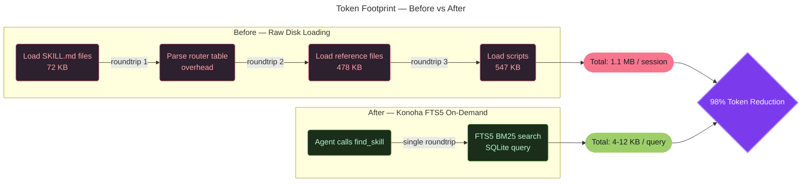

<p align="center">
  
</p>

[](README.md)
[](LICENSE)
[](README.md)
[](README.md)
[](README.md)
[](README.md)
[](docs/SETUP-SEARXNG.md)
[](README.md)

> SQLite FTS5 Skills-DB for Antigravity, Cursor, Claude Code, and OpenCode — on-demand skill content via MCP, reducing token usage by **83-98%**.

---

## 📸 Preview

* **Latest Security Compliance:** [Google Policy Compliance v1.1.6](docs/SecurityCompliance/security_compliance_report_google_policy_1.1.6_2026-06-27.md)

| | |
|:---:|:---:|
| **📊 Database Status (`konoha status`)**<br> | **🥷 Subagent Team Status (`konoha agent status`)**<br> |
| **📜 Installed Skills List (`konoha skill list`)**<br> | **📈 Token Savings Dashboard (`konoha savings`)**<br> |

---

## 📖 Setup & Usage Guides

* [Konoha Bridge Router Guide](docs/LLM-BRIDGE-GATEWAY.md)
* [Antigravity IDE Setup Guide](docs/SETUP-IDE.md)
* [Antigravity CLI Setup Guide](docs/SETUP-CLI.md)
* [Cursor IDE & CLI Setup Guide](docs/SETUP-CURSOR.md)
* [Claude Code, OpenCode & MCP Clients](docs/SETUP-MCP-CLIENTS.md)
* [Adding Skills from skills.sh](docs/ADDING-SKILLS.md)
* [Token Savings Benchmarks](docs/BENCHMARK.md)
* [Troubleshooting Guide](docs/TROUBLESHOOTING.md)

## ⚠️ The Problem

When using agent skills with Antigravity IDE/CLI, Cursor IDE/CLI, Claude Code, or OpenCode, the entire directory of `SKILL.md` files, reference documents, and auxiliary scripts is loaded directly into the starting conversation window. For a typical workspace configuration containing 5 custom skills:

| Component | Size | Context Overhead |
|:---|:---:|:---|
| `SKILL.md` Files (×5) | ~72 KB | Core agent instructions |
| Reference Guides (×88) | ~478 KB | API documentation, guides |
| Helper Scripts (×23) | ~547 KB | Utility code, automation |
| **Total Startup Payload** | **~1.1 MB** | **~800,000+ API tokens** |

> [!WARNING]
> This "disk-dump" approach wastes tokens on content that is irrelevant to the current task, inflates API usage bills, increases latency, and risks hitting LLM context window limits.

## 💡 The Solution

**Konoha** establishes a high-performance local SQLite FTS5 Model Context Protocol (MCP) server that:

1. **Indexes** all skill content (`SKILL.md` + references + scripts) into a full-text search database.
2. **Serves on-demand** — agents invoke `find_skill("keyword")` to retrieve only the matching ~4 KB content block.
3. **Optimizes context** — replaces the redundant "load SKILL.md → parse router → load reference" chain.

> [!TIP]
> **Optimization Result**: Context size is reduced to **~12 KB** per query instead of **~550 KB** per session — achieving a **98% token reduction** and **42% faster response times**.

---
## ⚙️ How It Works

For a detailed breakdown of Konoha's internal mechanics, including system layers, data flows, and query lifecycle sequence diagrams, please see the [System Architecture Guide](docs/ARCHITECTURE.md).

### Workflow: Forced MCP Delegation

All non-trivial work on a Konoha-configured host **MUST** flow through the Konoha MCP and Semble MCP tools and be delegated to a konoha subagent — never executed solo by the main orchestrator.

- **Skill lookup** (`konoha.find_skill`, `konoha.get_skill`) — always via `konoha` MCP, never `semble`.
- **Codebase search** (`semble.search`, `semble.find_related`) — always via `semble` MCP, never `grep`/`rg`/`find`.
- **Bounded file reads** — `konoha.read_file_head` / `read_file_range` / `file_info` / `token_efficient_grep`, never generic `Read` / `Grep` / `Glob` / shell `cat`/`head`/`tail`.
- **Subagent routing** — match the task domain to a ninja agent:
  - `@genin` — codebase exploration, codepath tracing
  - `@kage` — architecture, security, deep analysis
  - `@chunin` — web research, documentation synthesis
  - `@jonin` — UI/frontend (SvelteKit, Next.js, Tailwind)
  - `@anbu` — backend, bug fixing, DevOps
  - `@tokubetsu-jonin` — technical writing, docs, READMEs

**The main orchestrator MUST NOT execute implementation tasks itself — it only coordinates and delegates.** Trivial edits on a known file may run inline; everything else routes through a subagent.

---

## 🚀 Quick Start

> [!IMPORTANT]
> **Zero-Prompt Auto-Setup**:
> Running `konoha init` (or any `konoha` command, which auto-triggers `ensureAutoSetup()`) configures every detected IDE/CLI client in one shot. Konoha asks a single consent prompt ("Initialize Konoha and modify ~/.gemini configurations?"), then auto-configures all detected MCP clients (Antigravity, Cursor, Claude Code, OpenCode) without further prompting. Clients not detected on the system are skipped silently. Pass `--yes` or set `CI=true` to suppress all prompts.

Get Konoha up and running in under 2 minutes:

```bash
# 1. Initialize on any machine directly from GitHub
npx github:andycungkrinx91/konoha init

# 2. Verify the MCP server connection works
konoha test

# 3. Check installation status and index database statistics
konoha status
```

> [!NOTE]
> For step-by-step IDE integration, see the [Antigravity IDE Setup Guide](docs/SETUP-IDE.md), [Antigravity CLI Setup Guide](docs/SETUP-CLI.md), [Cursor IDE & CLI Setup Guide](docs/SETUP-CURSOR.md), or [Claude Code, OpenCode & MCP Clients](docs/SETUP-MCP-CLIENTS.md).

## 📋 Requirements

- **Node.js** ≥ 18
- **Python 3** ≥ 3.8 (for MCP server, uses standard library only — no external pip packages required)
- **Antigravity IDE** or **Antigravity CLI** (agy), **Cursor IDE / Cursor CLI**, and/or **Claude Code** / **OpenCode** (optional — auto-configured when CLI is detected)
- **Agent skills** in `~/.agents/skills/` (with `SKILL.md` files); Cursor users also get `~/.cursor/skills/` mirrored automatically

## 🛠️ CLI Commands

To run all commands simply as `konoha <command>`, install the package globally:

```bash
npm install -g github:andycungkrinx91/konoha
```

Once installed, the following CLI commands are available:

| Command | Description |
|:---|:---|
| `konoha init` | Full install: server + migration + MCP config + GEMINI.md |
| `konoha migrate [--force]` | Re-index skills. If `--force` is used, prunes unused/unembedded skills to `.agents.backup/skills/{name-skill}-yyyymmdd` first to ensure no duplicate entries occur (skipping project-level skills), and automatically reconfigures integrations for Antigravity IDE/CLI, Claude Code, Cursor, and OpenCode. |
| `konoha test` | Test MCP server with sample searches |
| `konoha status` | Show installation status and DB stats |
| `konoha version` | Display current local version and check for updates from GitHub |
| `konoha upgrade` | Upgrade Konoha CLI to the latest version directly from GitHub |
| `konoha bridge status` | Show bridge router status and Antigravity session liveness (sidecar-gated bridges show `AWAITING SIDECAR` when IDE is closed) |
| `konoha bridge list` | List all configured bridges with port/provider/enabled state |
| `konoha savings` | Show token savings metrics (Today, 7 days, All time) for Skills-DB and Semble |
| `konoha doctor` | Diagnose environment health and automatically repair missing files |
| `konoha uninstall` | Remove Skills-DB (original skills untouched) |
| `konoha skill <subcommand>` | Manage custom skills (`list`, `search`, `add`, `remove`) |
| `konoha agent <subcommand>` | Manage subagent configurations (`list`, `create`, `models`, `skill`, `delete`, `status`) |
| `konoha models <subcommand>` | Manage available LLM models and assign them to subagents |
| `konoha bridge <subcommand>` | Manage Konoha Bridge Router (`status`, `list`, `create`, `delete`, `enable`, `disable`) |
| `konoha help` | Show help |


## 🛰️ Konoha Bridge Router

Konoha ships a local **Konoha Bridge Router** on port **`19999`** that multiplexes requests across one or more inner **LLM Bridges**. The router forwards requests to a bridge based on the model name prefix `<bridge-name>-<model-name>`, strips inbound `Authorization` / `x-api-key` / `x-konoha-gateway-*` headers, and forwards to `127.0.0.1:<bridge-port>`. Local clients never need to send an API key to the router.

Bridge configuration examples (bridges are registered manually by the user — the `bridges` table starts empty on install and is persisted in `~/.konoha/skills.db` via `src/db_bridges.py`):

Bridges are registered manually by the user (the tables start empty on install).

Examples:

- Ollama-compatible endpoint — default `http://localhost:11434`
- OpenAI-compatible endpoint — provide your own API key

Configure bridges with `konoha bridge create` (interactive wizard). You can add multiple bridges for different providers:

| Bridge Name | Default Port | Provider | Behavior |
|:---|:---:|:---|:---|
| `gpt-api` | User-defined | `openai` | Direct proxy to OpenAI-compatible endpoints (e.g. `https://api.openai.com/v1`). |
| `my-ollama` | User-defined | `openai-compatible` | Proxy to local LLM instances (e.g. Ollama, vLLM). |

> **Note:** `openai-oauth` (device code flow) support was removed in v1.1.6+. Use `openai` (API key) or `openai-compatible` bridges instead.

Model routing examples:

- `my-ollama-llama3` → gateway strips `my-ollama-`, forwards `llama3` to the inner bridge on its designated local port.
- `gpt-api-gpt-4o` → gateway routes to `gpt-api` bridge configured with your OpenAI API key.

Automatic failover: when a bridge returns an error, the gateway automatically rotates to the next eligible bridge.

Full reference: [docs/LLM-BRIDGE-GATEWAY.md](docs/LLM-BRIDGE-GATEWAY.md)

## What Gets Installed

```
~/.gemini/
├── config/
│   └── mcp_config.json   ← konoha + semble MCP (Antigravity)
└── GEMINI.md              ← Orchestrator + subagent instructions

~/.konoha/
├── file_tools_launcher.js ← cross-platform Node resolver (preferred launcher)
├── file_tools_mcp.js      ← konoha MCP server (core skill+file ops)
├── file_tools_launcher.sh ← Shell wrapper for Cursor CLI sandbox
├── file_tools_router.js   ← In-process tool dispatch router
├── platform_utils.js      ← cross-OS path/Python helpers
├── .node_exec_path        ← recorded Node path (auto)
├── .python_cmd            ← recorded Python command (auto)
├── file_tools/            ← Python streaming helpers (grep, read, search)
├── bridge/                ← Proxy Gateway bridge modules
├── server.py              ← Legacy Python skill worker (kept for backward compat)
├── migrate.py             ← Migration script
└── skills.db              ← SQLite FTS5 database (+ `agents`, `bridges` tables)

~/.cursor/
├── mcp.json               ← konoha + semble MCP (Cursor)
├── agents/                ← Six ninja subagents (model: inherit)
├── skills/                ← Agent skills (mirrored from ~/.agents/skills/)
├── hooks.json             ← sessionStart → cursor_bootstrap.js
└── cli-config.json        ← Cursor CLI MCP permissions

~/.claude.json             ← konoha + semble (Claude Code, global only)
~/.config/opencode/
└── opencode.json          ← konoha + semble (OpenCode, global only)
```

---

## Re-indexing After Skill Changes

Run `konoha migrate` whenever you add, edit, or remove skills:

```bash
konoha migrate
```

To clean up and archive unused or unembedded skills to `.agents.backup/skills/{name-skill}-yyyymmdd` (specifically to ensure no duplicate content occurs, while skipping project-level skills), run with the `--force` flag. This duplicate-free migration logic fully supports and automatically updates Antigravity IDE/CLI, Claude Code, Cursor, and OpenCode:

```bash
konoha migrate --force
```

This updates `skills.db`, syncs `.cursor/skills/` and `~/.agents/skills/`, and refreshes all system instructions automatically.

---

## MCP Tools Available

After installation, Konoha registers **2 MCP servers** that work together:

### konoha — Skill Knowledge Search & Token-Efficient File Operations

The unified `konoha` server exposes 21 tools for skill retrieval, bounded file operations, project scaffolding, and subagent delegation workflows:

#### `mcp_sannin(prompt?, task_dir?)`
The Sannin routing workflow tool. Resolves the task prompt, dynamically chooses the most suitable subagent to run, sets up the task directory, and executes the chosen subagent inline.

#### Subagent Delegation Tools (`mcp_kage`, `mcp_jonin`, `mcp_anbu`, `mcp_chunin`, `mcp_tokubetsu_jonin`, `mcp_genin`)
Executes the specified subagent inline under a task directory (`task_dir`), loading its system instructions and skill references dynamically.

#### `web_search(query, num_results?, search_depth?)`
Enterprise-grade web search with multi-query decomposition, authoritative domain ranking, and Wikipedia OpenSearch fallback. Automatically invoked by `mcp_chunin` for deep research.

#### `find_skill(keyword, limit?)`
Search skills by keyword using FTS5 full-text search.

```
find_skill("terraform aws")     → anbu-skill references
find_skill("sveltekit tailwind") → jonin-skill references
find_skill("code review")       → genin-skill references
```

#### `get_skill(name)`
Get full content of a specific skill/reference by exact name.

```javascript
get_skill("jonin-skill/svelte-code-expert")
get_skill("anbu-skill/terraform-aws-modules")
```

#### `list_skills()`
List all indexed skills and references with metadata.

#### `optimize_report(keyword?)`
Token-efficient skill discovery report with usage hints.

#### `build_from_source(name, source_dir, framework)`
Scaffold from design mockups or reference source files (`.png`, `.html`, `.tsx`, etc.).

#### `build_from_text(name, description, framework)`
Scaffold from a text prompt using default premium templates.

#### Bounded File Tools
| Tool | Purpose | Token guard |
|------|---------|-------------|
| `read_file_head(path, max_lines?)` | Preview first N lines (default 80) | Max **200** lines |
| `read_file_range(path, start_line, end_line)` | Stream a line range with line numbers | Max **500** line span |
| `file_info(path)` | Size, line count, mtime — no content load | Metadata only |
| `token_efficient_grep(pattern, dir, glob?, ignore_case?)` | Compressed regex search | Max **20** matches (cap 50) |
| `get_file_structure(path)` | Class/function signatures only (no bodies) | AST (Python) / regex (JS/TS) |
| `find_files_clean(pattern, dir)` | Glob walk with blacklist | Skips `.git`, `node_modules`, `dist`, lockfiles |
| `search_file(query, dir?, top_k?)` | Semantic code/file search using semble | Semble-powered semantic search |

> [!IMPORTANT]
> **All agents must use konoha** for skill lookups, file reads, and line grep — not Cursor `Read`/`Grep`/`Glob`, Antigravity `view_file`, or shell `cat`/`head`/`grep`. Workflow: **semble** (semantic code search) → **konoha** (skills & file operations).

### semble — Semantic Code Search (default)

The `semble` server provides AI-powered semantic code search across the entire codebase. Registered via `uvx --from semble[mcp]@latest semble`. **Use semble instead of built-in grep/glob/find or Cursor `Grep`/`Glob`/`SemanticSearch` for codebase discovery.**

> Semble by MinishLab — [@software{minishlab2026semble}](https://github.com/MinishLab/semble). Uses ~98% fewer tokens than grep+read.

#### `search(query)`
Semantic search across the codebase — understands code meaning, not just text matching.

#### `find_related(file_path)`
Find files semantically related to a given file — useful for understanding dependencies and impact.

---

## 🥷 Official Agent Team (Naruto Ninja Ranks)

The installer updates your configuration to define a cohesive, specialized team of **6 Naruto-ranked subagents**. Each agent represents a level of ninja hierarchy with clear responsibilities, preferred model tier, fallback settings, and tool access:

### 1. 🍃 Genin (Junior Scout)
* **Operational Role**: Codebase Reconnaissance & Scout
* **Primary Model**: `Gemini 3.1 Flash-Lite`
* **Key Responsibilities**:
  - Fast, read-only code exploration.
  - Traces codepaths, maps dependencies, and analyzes repository structure.
  - *Constraint*: Must never write or modify files on the filesystem.
* **Skills-DB Keyword**: `code exploration tracing` (invokes scout-level heuristics on startup).

### 2. 📜 Chunin (Journeyman Intel Gatherer)
* **Operational Role**: Intel Gathering, Web Research, & Documentation Synthesis
* **Primary Model**: `Gemini 3.5 Flash (Low)` | **Fallback**: `Gemini 3.1 Flash-Lite`
* **Key Responsibilities**:
  - Researches libraries, API specifications, version histories, and best practices.
  - Leverages semantic search (`semble`) to discover codebase context before executing web searches.
  - Batches parallel queries and ranks search results by credibility, freshness, and relevance.
  - Compiles comprehensive, citation-backed notes with full reference URLs.
* **Skills-DB Keyword**: `websearch deep research` (loads intel gathering methodologies).

### 3. 🛡️ Jonin (Elite Builder)
* **Operational Role**: UI/UX Master, Styling, & Component Architecture
* **Primary Model**: `Gemini 3.5 Flash (High)` | **Fallback**: `Gemini 3.1 Flash-Lite`
* **Key Responsibilities**:
  - Builds premium, visually stunning frontends (SvelteKit, Next.js, Tailwind v4, Magic UI, 3D web).
  - Enforces design tokens, custom typography, smooth gradients, and glassmorphism.
  - Performs design match comparisons using the `agent-browser` CLI.
  - Enforces the **Zero-Error Guarantee & Verification Loop** (running local installs, Svelte/Next syncs, check/lint diagnostics, and production builds to guarantee zero compilation errors/warnings before completion).
* **Skills-DB Keyword**: `sveltekit tailwind nextjs components` (fetches design standards).

### 4. 👥 Anbu (Special Black Ops)
* **Operational Role**: Backend Specialist, Bug Resolution, & DevOps Engineer
* **Primary Model**: `Gemini 3.1 Pro (High)` | **Fallback**: `Gemini 3.1 Flash-Lite`
* **Key Responsibilities**:
  - Designs backend systems, database schemas, and robust API endpoints.
  - Diagnoses complex runtime bugs, memory leaks, and environment failures.
  - Provisions infrastructure (Terraform, Kubernetes, Helm) and manages secure CI/CD pipelines.
  - Validates changes with dry-runs and establishes structured rollback procedures.
* **Skills-DB Keyword**: `terraform aws kubernetes helm ci-cd` (loads deployment recipes).

### 5. 🎯 Tokubetsu-jonin (Specialized Scribe)
* **Operational Role**: Technical Writing, Documentation, & API Specification
* **Primary Model**: `Gemini 3.1 Flash-Lite`
* **Key Responsibilities**:
  - Authors and maintains README files, API documentations, runbooks, and onboarding guides.
  - Emphasizes reader-first principles, clean code blocks, and visual diagrams.
* **Skills-DB Keyword**: `documentation README API runbook` (retrieves writing standards).

### 6. 🌀 Kage (Village Leader)
* **Operational Role**: Senior Architect, Strategist, & Deep Problem Solver
* **Primary Model**: `Gemini 3.1 Pro (High)` | **Fallback**: `Gemini 3.1 Flash-Lite`
* **Key Responsibilities**:
  - Guides high-level architecture decisions, security audits, and risk assessments.
  - Constructs trade-off matrices and designs disaster recovery/rollback strategies.
  - Orchestrates the entire subagent team for complex, multi-domain tasks.
* **Skills-DB Keyword**: `code review architecture devsecops` (loads advanced architectural frameworks).

---

## 🛡️ Default Guardrails

To ensure safety, consistency, and predictable execution, the Antigravity system enforces several strict behavioral guardrails across all subagents:

> [!IMPORTANT]
> **Core Safety & Operational Policies:**
>
> * **Proactive Execution (No commanding back)**: Subagents must never instruct the user to manually create/edit files or run terminal commands that the agent is equipped to perform itself.
> * **Protected Configuration & Secrets**: All `.env`, `.tfvars`, and `secrets.yaml` files are strictly **read-only** by default. Subagents must explicitly request user permission before accessing or modifying these files.
> * **No Git Execution**: Subagents are strictly prohibited from executing any `git` commands (including `status`, `diff`, `log`). Use `semble` for code search; `konoha` for targeted reads/grep; `rg` only if semble MCP is unavailable.
> * **Locked Subagent Delegation**: Subagent delegation is locked to the 6 official Konoha agents (`genin`, `kage`, `chunin`, `jonin`, `anbu`, `tokubetsu-jonin`). Never use Antigravity `@self` / `@research`. Creating custom subagents dynamically is prohibited.
> * **Orchestrator Pipeline (Antigravity)**: User prompt → `prompt.md` → orchestrator analyzes → `delegate.md` → Konoha subagent → `result.md` → user report. Main agent coordinates only — no direct project edits.
> * **Circuit Breaker**: Handoff loops are tracked via `depth` metadata in `delegate.md`. If depth exceeds **7**, execution freezes and prompts the user for manual validation.
> * **Rate Limit Fallback**: In the event of API rate limits, the system will fallback to `Gemini 3.1 Flash-Lite` and use direct tool calls instead of spawning additional subagents.

---

##

### 📊 Benchmark: Token Footprint & Optimization

The following charts demonstrate the context footprint savings per conversation session achieved by moving from full-disk loading to SQLite FTS5 on-demand retrieval:

#### Context Size Comparison (Lower is Better)

```text
Startup Payload Size (KB)
────────────────────────────────────────────────────────────
Baseline (Disk Load):  ██████████████████████████████  550 KB
Konoha (On-Demand):   █                              12 KB   (97.8% savings)
────────────────────────────────────────────────────────────
```


```mermaid
---
title: Token Footprint — Before vs After
---
flowchart LR
    %% ── Style Definitions ──────────────────────────────────────
    classDef stepBad fill:#2d202f,stroke:#f7768e,stroke-width:1px,color:#fca5a5;
    classDef stepGood fill:#1a2e1a,stroke:#9ece6a,stroke-width:1px,color:#bbf7d0;
    classDef metricBad fill:#f7768e,stroke:#f7768e,stroke-width:2px,color:#1a1b26;
    classDef metricGood fill:#9ece6a,stroke:#9ece6a,stroke-width:2px,color:#1a1b26;
    classDef verdict fill:#7c3aed,stroke:#a78bfa,stroke-width:2px,color:#f5f3ff;

    %% ── Before Path (Wasteful) ─────────────────────────────────
    subgraph BEFORE ["Before — Raw Disk Loading"]
        direction LR
        B1("Load SKILL.md files<br>72 KB") -->|"roundtrip 1"| B2("Parse router table<br>overhead")
        B2 -->|"roundtrip 2"| B3("Load reference files<br>478 KB")
        B3 -->|"roundtrip 3"| B4("Load scripts<br>547 KB")
    end
    B4 --> B_Total(["Total: 1.1 MB / session"])

    %% ── After Path (Optimized) ─────────────────────────────────
    subgraph AFTER ["After — Konoha FTS5 On-Demand"]
        direction LR
        A1("Agent calls find_skill") -->|"single roundtrip"| A2("FTS5 BM25 search<br>SQLite query")
    end
    A2 --> A_Total(["Total: 4-12 KB / query"])

    %% ── Verdict ────────────────────────────────────────────────
    B_Total --> Savings{"98% Token Reduction"}
    A_Total --> Savings

    %% ── Apply Styles ──────────────────────────────────────────
    class B1,B2,B3,B4 stepBad
    class B_Total metricBad
    class A1,A2 stepGood
    class A_Total metricGood
    class Savings verdict
```

📊 **Benchmark Comparison: Antigravity Session Metrics**

| Metric | Without Konoha + Semble (Baseline) | With Konoha + Semble (Optimized) | Impact / Savings |
| :--- | :---: | :---: | :---: |
| **Startup Context Load** | **~1.1 MB** (all SKILL.md rules + reference files loaded at start) | **~0 KB** (instructions are lazy-loaded on-demand via MCP) | **~100% startup context reduction** |
| **Single Search Query Payload** | **50 KB+** (entire files loaded/dumped) | **~4 KB - 12 KB** (precise matches returned) | **83% - 98% token reduction** per query |
| **Active Workspace Calls** | — | **~2,904 calls** | — |
| **Context Data Saved** | — | **~302 MB** | — |
| **Active Tokens Saved** | 0 (baseline) | **~110M tokens** | **~110M tokens saved** |
| **Response Latency** | Baseline (100%) | **~58%** (42% faster response times) | **~42% speed improvement** |
| **API Cost Footprint** | Baseline (100%) | **~5%** (95% cost reduction) | **~95% token cost savings** |

**Real-world Savings** (live metrics from `konoha savings`, captured 2026-06-23):
- **Combined Token Savings**: **~110M tokens saved** all-time across ~2,904 MCP calls (~302 MB of context data saved).
- **Skills-DB (konoha) Efficiency**: **97–99% reduction** per query (~79.1M tokens saved across 2,064 calls).
- **Semble MCP Efficiency**: **96% reduction** average per search query (~30.8M tokens saved across 840 calls).
- **Response Latency Reduction**: **~42% faster** agent responses due to minimized input context parsing.
- **API Cost Reduction**: **~95% reduction** in API token fees per agent session.

> [!TIP]
> Read the complete [Token Savings & Optimization Benchmark Report](docs/BENCHMARK.md) for full metrics breakdown and analysis.

### 🔄 Token-Efficient File-Based Delegation

Konoha implements a transient file-based Markdown communication protocol for Antigravity orchestration:

| Step | Actor | File |
|------|-------|------|
| 1 | `prompt_hook.js` | `prompt.md` (user request) |
| 2 | Orchestrator | reads `prompt.md`, discovers skills/code |
| 3 | Orchestrator | writes `delegate.md` under `~/.konoha/tmp/<client>/<session>/scratch/tasks/<task_id>/` (resolved by an internal orchestrator helper) — **never** inside the project workspace, so transient agent files cannot be accidentally committed |
| 4 | Subagent | reads `delegate.md`, executes, writes `result.md` |
| 5 | Orchestrator | reads `result.md`, reports to user, cleans up |

* **Structured Context Isolation**: Subagents do not inherit the full parent chat — they read `delegate.md` (Goal, Context, Constraints) only.
* **Substantial Savings**: Isolated subagent context yields up to **95%+ token savings** per invocation.
* **Recursive Loop Circuit Breaker**: `depth` in `delegate.md` YAML frontmatter; circuit breaks at **depth > 7**.

### Skill Resolution

When a subagent runs, `run_mcp_agent` resolves skills in three layers:

1. **Exact match** — `agents.skills` (per-agent YAML) is queried against `skills.skill_name` and `references.name`.
2. **Fuzzy match** — if a skill name has no exact hit, Levenshtein distance ≤ 3 finds close names. Example: `devsecops-enginer` → `devsecops-engineer`.
3. **Prompt-driven autoload** — when the agent's `skills` list is empty, the prompt is tokenized and matched against `skill_name` + the first 200 chars of each skill's content. The top 3 token-coverage matches are auto-loaded and embedded into the agent instructions.

The mismatch is reported on stderr (`fuzzy-resolved skill 'x' -> 'y'`) so the orchestrator can spot recurring typos and update the YAML.

### Workspace Hygiene

Transient subagent scratch directories (`delegate.md`, `plan.md`, `result.md`, etc.) are written **outside** the project tree at `~/.konoha/tmp/<client>/<session>/scratch/tasks/<task_id>/`. If `~/.konoha` is not writable, the resolver falls back to `/tmp/konoha-<pid>-<ts>/`. The path is **never** rooted under `WORKSPACE_ROOT`, so `git add .` cannot accidentally commit agent scratch files. This is enforced by `src/test_scratch_path.py`.

### Detailed Before vs After Comparison

For an in-depth breakdown of system behavior, token consumption, configuration fragmentation, and architectural overhead, please read the [Detailed Before vs After Comparison](docs/BENCHMARK.md#detailed-before-vs-after-comparison) section in the Benchmark Report.


## Credits

Special thanks to [semble](https://github.com/MinishLab/semble) by MinishLab for providing the powerful semantic code search capability that forms the second half of Konoha's optimization stack.

**Citation:** If you use Konoha in academic research, please also cite Semble as follows:

```bibtex
@software{minishlab2026semble,
  author       = {{van Dongen}, Thomas and Stephan Tulkens},
  title        = {Semble: Fast and Accurate Code Search for Agents},
  year         = {2026},
  url          = {https://github.com/MinishLab/semble},
  organization = {MinishLab}
}
```

## License

MIT © 2026 [Andy Setiyawan | The shadow ninja with coffee](https://www.linkedin.com/in/andy-setiyawan-452396170/)
