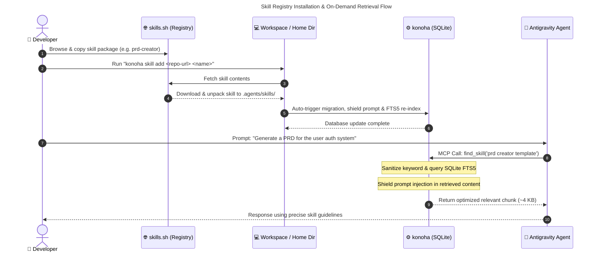

# Adding Skills from skills.sh

This guide walk you through the step-by-step process of finding, installing, and indexing custom agent skills from [skills.sh](https://www.skills.sh/) to optimize token usage with `konoha`.

---

## Workflow Diagram

The following diagram shows how skills from the registry are installed, indexed by `konoha`, and utilized by your agent team:



---

## Step-by-Step Guide

### Step 1: Find a Skill on skills.sh
Browse the [skills.sh registry](https://www.skills.sh/) or locate a repository containing compatible agent skills. For this example, we will use the `prd-creator` skill from the `ralph-loop` repository.

### Step 2: Install the Skill
Run the `npx skills add` command in your terminal. 

```bash
npx skills add https://github.com/pageai-pro/ralph-loop --skill prd-creator
```

> [!NOTE]
> * **If run inside a Git repository/project workspace**: The skill will be installed locally in `./.agents/skills/prd-creator`.
> * **If run outside a repository**: The skill will be installed globally in `~/.agents/skills/prd-creator`.
> 
> `konoha` supports both locations out of the box.

### Step 3: Run the Migration
Run the migration command to scan your skills directories and index the new content into your SQLite FTS5 database:

```bash
konoha migrate
```

The migration automatically:
1. Scans `~/.agents/skills/` and `./.agents/skills/`.
2. Indexes the main `SKILL.md` instructions.
3. Automatically detects other root markdown files (e.g., `JSON.md`, `PRD.md`) or nested `references/*.md` files and indexes them as reference assets in the database.

**Migration output example:**
```
📦 Migrating: prd-creator
  ✓ SKILL.md (6,520 bytes, 159 lines)
  ✓ JSON.md (28,955 bytes) [root reference]
  ✓ PRD.md (11,353 bytes) [root reference]
  
✅ Migration complete! 3 entries indexed.
```

### Step 4: Verify and Test the Search
Test that the MCP server can find the newly added skill rules. Run the sample query check:

```bash
konoha test
```

Or run a status check to verify the database stats have updated:

```bash
konoha status
```

You should see your total indexed count increase (e.g., from `93` to `96` entries).

### Step 5: Start Using the Skill
Your agent team is now ready to use the skill on-demand. When you prompt the agent with a task related to the new skill, the subagents will call `find_skill` or `get_skill` to retrieve the guidelines dynamically, avoiding start-up context bloat.
