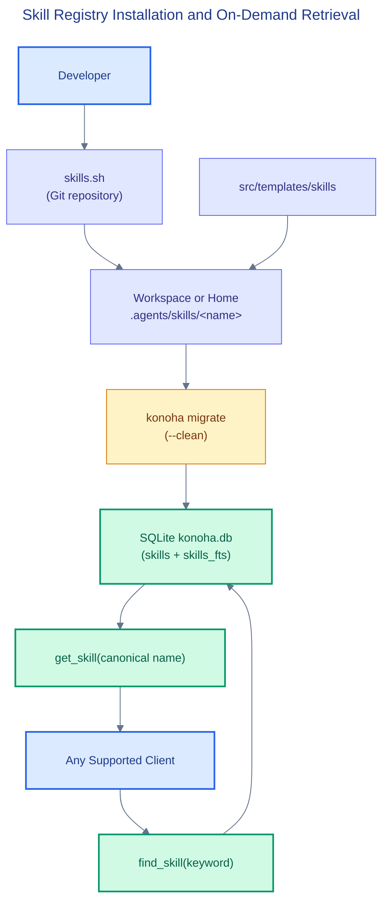

# 🔌 Adding Skills from skills.sh

This guide walks you through the step-by-step process of finding, installing, and indexing custom agent skills from [skills.sh](https://www.skills.sh/) to optimize token usage with `konoha`.

---

## 🗺️ Workflow Diagram

The following diagram shows how skills from the registry are installed, indexed by `konoha`, and utilized by your agent team:

> **Canonical editable diagram:** [06 Skill Registry Installation](diagrams/konoha-architecture.drawio) · [Diagram manifest](diagrams/README.md).


```mermaid
---
title: Skill Registry Installation and On-Demand Retrieval
config:
  theme: base
  themeVariables:
    background: '#ffffff'
    primaryColor: '#dbeafe'
    primaryTextColor: '#1e3a8a'
    primaryBorderColor: '#2563eb'
    lineColor: '#64748b'
    secondaryColor: '#e0e7ff'
    tertiaryColor: '#d1fae5'
    fontFamily: 'Inter, system-ui, sans-serif'
    fontSize: '14px'
  flowchart:
    nodeSpacing: 45
    rankSpacing: 55
    padding: 24
    wrappingWidth: 380
---
flowchart TB
    Developer["Developer"] --> Registry["skills.sh<br/>(Git repository)"]
    Registry --> Files["Workspace or Home<br/>.agents/skills/&lt;name&gt;"]
    Templates["src/templates/skills"] --> Files
    Files --> Migrate["konoha migrate<br/>(--clean)"]
    Migrate --> DB["SQLite konoha.db<br/>(skills + skills_fts)"]
    Client["Any Supported Client"] --> Find["find_skill(keyword)"]
    Find --> DB
    DB --> Get["get_skill(canonical name)"]
    Get --> Client

    classDef actor fill:#dbeafe,stroke:#2563eb,color:#1e3a8a,stroke-width:2px
    classDef source fill:#e0e7ff,stroke:#6366f1,color:#312e81
    classDef process fill:#fef3c7,stroke:#d97706,color:#78350f
    classDef runtime fill:#d1fae5,stroke:#059669,color:#065f46,stroke-width:2px
    class Developer,Client actor
    class Registry,Files,Templates source
    class Migrate process
    class DB,Find,Get runtime
```

---

## 📋 Step-by-Step Guide

### Step 1: Find a Skill on skills.sh
Browse the [skills.sh registry](https://www.skills.sh/) or search directly from Konoha:
- **Web UI**: Open the Skills page (`http://127.0.0.1:1404/skills`), toggle the search bar to `🌐 skills.sh Registry`, and type your query (e.g. `react`, `docker`, `prd`).
- **CLI**: Run `konoha skill search <query>` to view interactive rankings, install counts, and GitHub sources.

### Step 2: Install the Skill

#### Option A: 1-Click Install from Web UI
On the Web UI Skills page in `🌐 skills.sh Registry` mode, click the **1-Click Install** button on any skill card. Konoha automatically runs non-interactive installation (`-y --agent '*'`), copies the skill to your project or global directory, normalizes repository URLs, and indexes both SQLite FTS5 and IBM Granite 384d vector embeddings.

#### Option B: Terminal CLI (`konoha skill add`)
Run the native `konoha skill add` command in your terminal, specifying the repository URL and the target skill name:

```bash
konoha skill add https://github.com/pageai-pro/ralph-loop prd-creator
```

> [!NOTE]
> * **If run inside a Git repository/project workspace**: The skill will be installed locally in `./.agents/skills/prd-creator`.
> * **If run outside a repository**: The skill will be installed globally in `~/.agents/skills/prd-creator`.
>
> `konoha` supports both locations out of the box and automatically triggers multi-directory database migration upon adding.
>
> **Cross-platform paths:**
> - `~/.agents/skills/` = `C:\Users\<you>\.agents\skills\` on Windows
> - `.agents/skills/` = same relative path on all platforms

### Step 3: Run the Migration (Optional)
If the database does not automatically sync or if you manually copied skill files, run the migration command:
Run the migration command to scan your skills directories and index the new content into your SQLite FTS5 database:

```bash
konoha migrate
```


```bash
konoha migrate --force
```

The migration automatically:
1. Scans `~/.agents/skills/` and `./.agents/skills/`.
2. Indexes the main `SKILL.md` instructions.
3. Automatically detects other root markdown files (e.g., `JSON.md`, `PRD.md`) or nested `references/*.md` files and indexes them as reference assets in the database.

**Migration output example:**
```
📦 Migrating: prd-creator
  ✓ SKILL.md (6,520 bytes, 159 lines)
  ✓ JSON.md (28,955 bytes) [root reference]
  ✓ PRD.md (11,353 bytes) [root reference]
  
✅ Migration complete! 3 entries indexed.
```

### Step 4: Verify and Test the Search
Test that the MCP server can find the newly added skill rules. Run the sample query check:

```bash
konoha test
```

Or run a status check to verify the database stats have updated:

```bash
konoha status
```

You should see your total indexed count increase (e.g., from `93` to `96` entries).

**Cursor users:** `konoha skill add` and `konoha migrate` index the new skill in the canonical SQLite database. Cursor loads the content through `konoha.find_skill`/`konoha.get_skill`; Konoha does not create `~/.cursor/skills/` mirrors or symlinks.

### Step 5: Embed the Skill into a Subagent (Optional)
To associate the new skill with a specific specialist ninja subagent (e.g. `@anbu`, `@jonin`, or `@kage`):

```bash
# Direct syntax:
konoha skill <skillname> embed <agentname>

# Example:
konoha skill prd-creator embed kage
```

You can also view current subagent skill assignments interactively or via tabular summary:

```bash
konoha agent skill kage
```

### Step 6: Start Using the Skill
Your agent team is now ready to use the skill on-demand. When you prompt the agent with a task related to the new skill, the subagents will call `find_skill` or `get_skill` to retrieve the guidelines dynamically, avoiding start-up context bloat.

### Reference Example: A Shipped Cross-Agent Skill (`i-have-adhd`)

The built-in `i-have-adhd` skill (adapted from [ayghri/i-have-adhd](https://github.com/ayghri/i-have-adhd), MIT) shows the full cross-agent pattern used by first-party skills:

1. Content lives in `src/templates/skills/i-have-adhd/SKILL.md` and ships byte-identical across `src/templates/skills/`, `.agents/skills/`, `.cursor/skills/`, and `.gemini/skills/`.
2. Agent mapping is declared once in `src/templates/agents.yaml` (`skills:` lists) and mirrored into the `src/templates/AGENTS.md` / `GEMINI.md` routing tables — it is embedded into exactly five agents (genin, jonin, anbu, tokubetsu-jonin, chunin) while sannin (router) and kage (reviewer) stay out of scope.
3. Each of the five agent skills carries a Domain-Routing row pointing to `i-have-adhd`, so the agents load it via `konoha.get_skill("i-have-adhd")` when shaping final responses.
4. The contract is enforced by `tests/test_i_have_adhd_skill.js` (4-tree byte parity, exact 5-agent mapping, all 10 output rules present).
