# 🌊 Konoha Complete Workflows Architecture & Flow Diagrams

This document defines all active architectural workflows within **Konoha** (`konoha-mcp`) using native, responsive, and publication-ready **Mermaid** diagrams.

---

## 📑 Table of Contents

1. [Master Orchestration Architecture & Client-Specialist Flow](#1-master-orchestration-architecture--client-specialist-flow)
2. [Workflow 1: Core Multi-Agent MCP SDLC Orchestration Pipeline](#2-workflow-1-core-multi-agent-mcp-sdlc-orchestration-pipeline)
3. [Workflow 2: Definition-of-Readiness (DoR) Gate & Dispatch Flow](#3-workflow-2-definition-of-readiness-dor-gate--dispatch-flow)
4. [Workflow 3: Text-Based Website Build Pipeline (`build_from_text`)](#4-workflow-3-text-based-website-build-pipeline-build_from_text)
5. [Workflow 4: Mockup / Design Image Build Pipeline (`build_from_source`)](#5-workflow-4-mockup--design-image-build-pipeline-build_from_source)
6. [Workflow 5: Two-Step Zero-AI-Slop Pre-Gate & Autonomous Remediation Loop](#6-workflow-5-two-step-zero-ai-slop-pre-gate--autonomous-remediation-loop)
7. [Workflow 6: QA Automation & Token-Efficient E2E Validation Flow](#7-workflow-6-qa-automation--token-efficient-e2e-validation-flow)
8. [Workflow 7: Skills Lifecycle, SQLite FTS5 & Cross-Client 5-Tree Synchronization](#8-workflow-7-skills-lifecycle-sqlite-fts5--cross-client-5-tree-synchronization)
9. [Workflow 8: Local LLM Proxy Bridge Gateway & Sidecar Binary RPC](#9-workflow-8-local-llm-proxy-bridge-gateway--sidecar-binary-rpc)
10. [Workflow 9: Socket.dev Supply Chain Security Gate & Policy Evaluation](#10-workflow-9-socketdev-supply-chain-security-gate--policy-evaluation)
11. [Workflow 10: Kage Reviewer 98% Minimum Confidence Delivery Gate](#11-workflow-10-kage-reviewer-98-minimum-confidence-delivery-gate)
12. [Workflow 11: Telegram Remote Reporter & Whitelisted Long Polling Dispatch](#12-workflow-11-telegram-remote-reporter--whitelisted-long-polling-dispatch)
13. [Workflow 12: Cloudflare Zero Trust Ingress Tunnel & Unified Prompt Inbox Queue](#13-workflow-12-cloudflare-zero-trust-ingress-tunnel--unified-prompt-inbox-queue)

---

## 1. Master Orchestration Architecture & Client-Specialist Flow

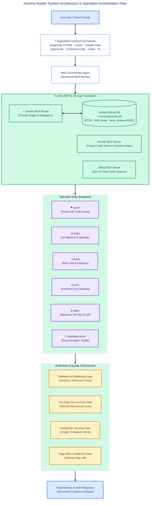

---

## 2. Workflow 1: Core Multi-Agent MCP SDLC Orchestration Pipeline

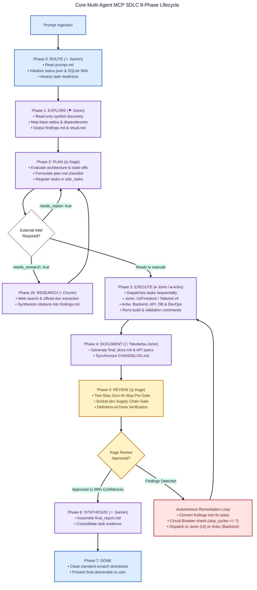

---

## 3. Workflow 2: Definition-of-Readiness (DoR) Gate & Dispatch Flow

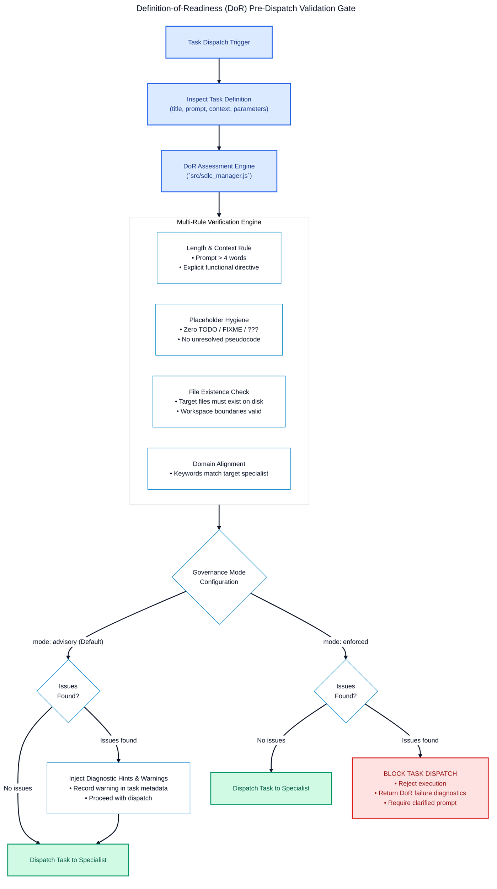

---

## 4. Workflow 3: Text-Based Website Build Pipeline (`build_from_text`)

```mermaid
---
title: Text-Based Website & UI Build Pipeline (build_from_text)
config:
  theme: base
  themeVariables:
    background: '#ffffff'
    mainBkg: '#ffffff'
    primaryColor: '#ede9fe'
    primaryTextColor: '#1e1b4b'
    primaryBorderColor: '#7c3aed'
    lineColor: '#0f172a'
    arrowheadColor: '#0f172a'
    fontFamily: 'Inter, system-ui, sans-serif'
    fontSize: '14px'
  flowchart:
    nodeSpacing: 45
    rankSpacing: 55
    padding: 24
    wrappingWidth: 380
---
flowchart TD
    UserReq["User Prompt:<br/>'Build an e-commerce / dashboard / SaaS platform'"] --> Step1["Step 1: MCP Call `konoha.build_from_text`<br/>(name, description, framework, taste_dials)"]
    Step1 --> Step2["Step 2: Generate Specification Object<br/>• Canonical Framework Resolved (Next.js, Svelte, Nuxt, Angular)<br/>• Validation commands formulated<br/>• Archetype layout directives applied"]

    Step2 --> Step3["Step 3: Framework-Native CLI Scaffolding<br/>• Next.js: pnpm create next-app@latest<br/>• Nuxt: pnpm dlx nuxi@latest init<br/>• Angular: pnpm dlx @angular/cli@latest new<br/>• SvelteKit: pnpm dlx sv create"]

    subgraph MandatoryInvariants ["Mandatory Konoha Layout Invariants"]
        I1["Brand Logo Far-Left<br/>(Never centered; actions on right)"]
        I2["Zero Mobile Header Toggle<br/>(No broken hamburger menu)"]
        I3["Archetype-Adaptive Mobile Dock<br/>(Fixed bottom navigation bar)"]
        I4["Fixed Left Sidebar (Desktop)<br/>(Dashboard / Admin / Infra builds)"]
        I5["Floating Theme Switcher Modal<br/>(Bottom-left FAB, 10-theme picker)"]
        I6["Hero Banner Carousel<br/>(4+ HD slides, 5000ms autoplay)"]
        I7["Mandatory package.json Scripts<br/>('build', 'lint', 'start', 'check')"]
    end

    Step3 --> MandatoryInvariants
    MandatoryInvariants --> Step4["Step 4: Elite Implementation (♦ Jonin)<br/>• Semantic Tailwind CSS v4 styling<br/>• Reduced-motion accessible transitions<br/>• Pure Light Mode fidelity"]

    Step4 --> Step5["Step 5: Framework Validation Suite<br/>• pnpm run build ──► 0 Errors<br/>• pnpm run lint  ──► 0 Warnings<br/>• pnpm run check ──► Clean"]

    Step5 --> Step6["Step 6: Kage Two-Step Review Gate<br/>• 100/100 aislop scan<br/>• ≥ 98% Delivery Confidence"]

    linkStyle default stroke:#0f172a,stroke-width:2px;
    classDef req fill:#dbeafe,stroke:#2563eb,color:#1e3a8a,stroke-width:2px;
    classDef scaffold fill:#ede9fe,stroke:#7c3aed,color:#4c1d95,stroke-width:2px;
    classDef validate fill:#d1fae5,stroke:#059669,color:#065f46,stroke-width:2px;
    class UserReq req;
    class Step1,Step2,Step3,MandatoryInvariants,Step4 scaffold;
    class Step5,Step6 validate;
```

---

## 5. Workflow 4: Mockup / Design Image Build Pipeline (`build_from_source`)

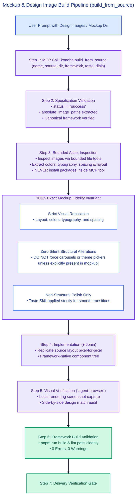

---

## 6. Workflow 5: Two-Step Zero-AI-Slop Pre-Gate & Autonomous Remediation Loop

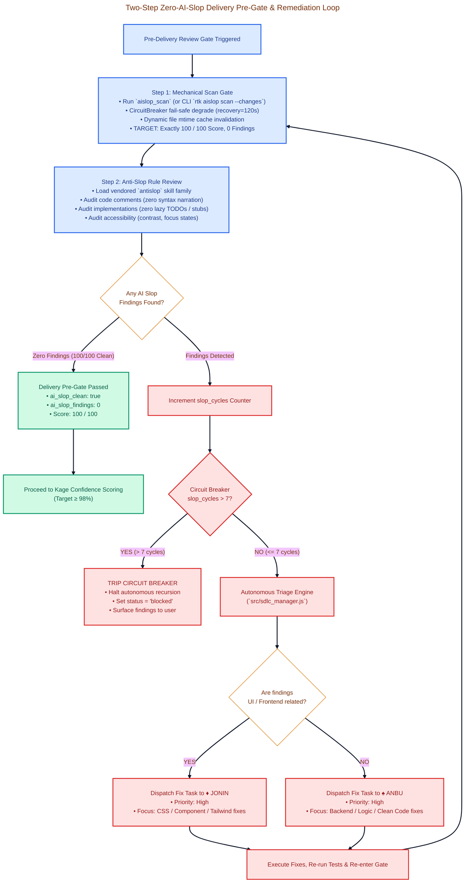

---

## 7. Workflow 6: QA Automation & Token-Efficient E2E Validation Flow

```mermaid
---
title: Token-Efficient QA Automation Pipeline (♠ Anbu Owner)
config:
  theme: base
  themeVariables:
    background: '#ffffff'
    mainBkg: '#ffffff'
    primaryColor: '#ffffff'
    primaryTextColor: '#0f172a'
    primaryBorderColor: '#0284c7'
    lineColor: '#0f172a'
    arrowheadColor: '#0f172a'
    fontFamily: 'Inter, system-ui, sans-serif'
    fontSize: '14px'
  flowchart:
    nodeSpacing: 45
    rankSpacing: 55
    padding: 24
    wrappingWidth: 350
---
flowchart LR
    Start["QA Task Ingestion"] --> S1["1. Test Discovery<br/>(Check tests/ & prevent duplicates)"]
    S1 --> S2["2. Flow Recording<br/>(agent-browser captures JSON steps)"]
    S2 --> S3["3. Test Codification<br/>(qa_codify compiles Playwright spec)"]
    S3 --> S4["4. Headless Execution<br/>(qa_e2e_run runs Playwright test)"]
    S4 --> S5["5. Evidence Capping<br/>(Clean exit 0 & output < 2,000 chars)"]
    S5 --> S6["6. Persistence<br/>(Save run_id to SQLite sdlc_tasks)"]
    S6 --> Done["Kage Verification Sign-off"]

    linkStyle default stroke:#0f172a,stroke-width:2px;
    classDef step fill:#dbeafe,stroke:#2563eb,color:#1e3a8a,stroke-width:2px;
    classDef pass fill:#d1fae5,stroke:#059669,color:#065f46,stroke-width:2px;
    class Start,S1,S2,S3,S4,S5 step;
    class S6,Done pass;
```

---

## 8. Workflow 7: Skills Lifecycle, SQLite FTS5 & Cross-Client 5-Tree Synchronization

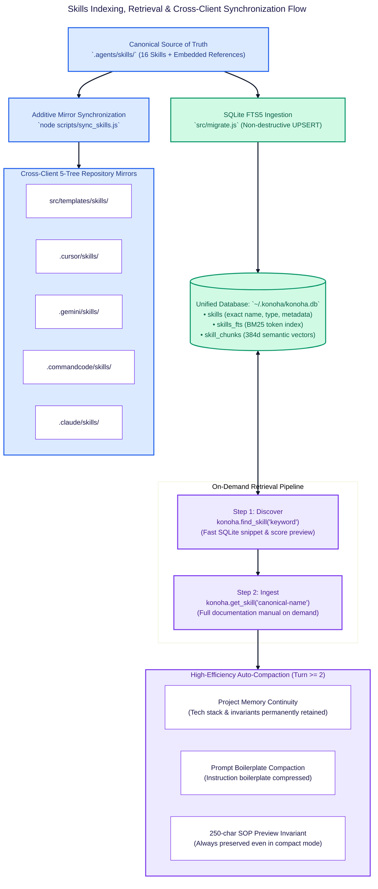

---

## 9. Workflow 8: Local LLM Proxy Bridge Gateway & Sidecar Binary RPC

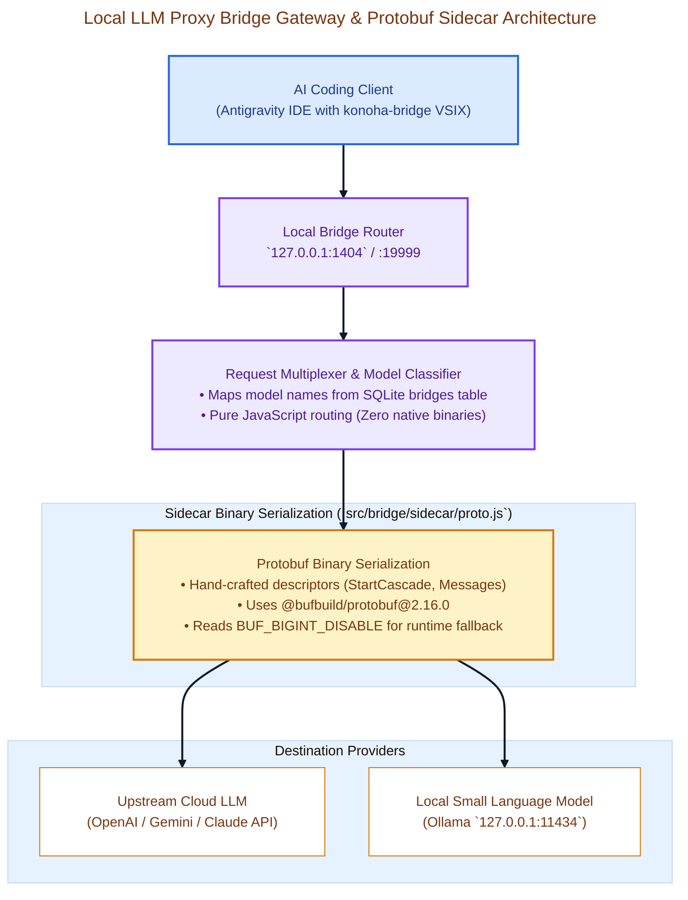

---

## 10. Workflow 9: Socket.dev Supply Chain Security Gate & Policy Evaluation

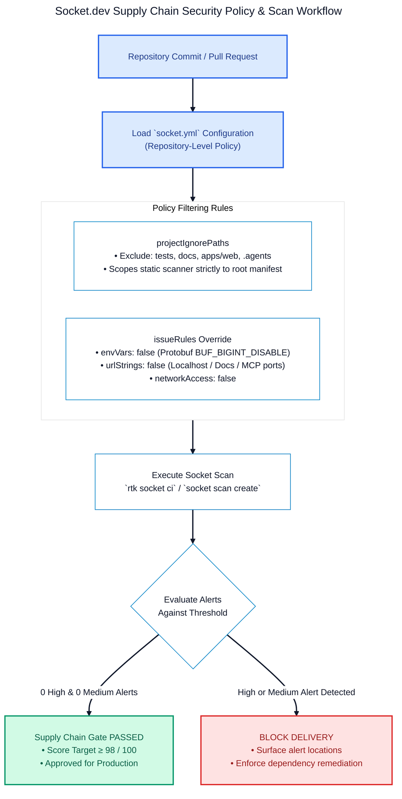

---

## 11. Workflow 10: Kage Reviewer 98% Minimum Confidence Delivery Gate

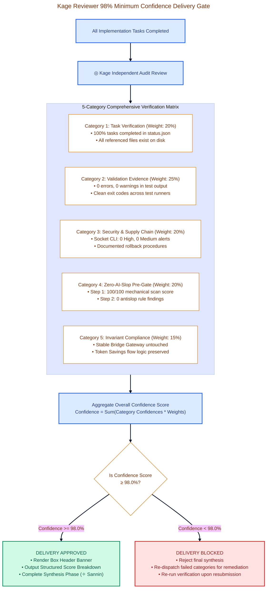

---

## 12. Workflow 11: Telegram Remote Reporter & Whitelisted Long Polling Dispatch

```mermaid
---
title: Telegram Remote Reporter & Whitelisted Long Polling Dispatch
config:
  theme: base
  themeVariables:
    background: '#ffffff'
    mainBkg: '#ffffff'
    primaryColor: '#e0f2fe'
    primaryTextColor: '#0369a1'
    primaryBorderColor: '#0284c7'
    lineColor: '#0f172a'
    arrowheadColor: '#0f172a'
    fontFamily: 'Inter, system-ui, sans-serif'
    fontSize: '14px'
  flowchart:
    nodeSpacing: 45
    rankSpacing: 55
    padding: 24
    wrappingWidth: 380
---
flowchart TD
    subgraph OutboundReporting ["Outbound Task Status Reporter (src/telegram/notifier.js)"]
        SDLCEvent["SDLC Task Event<br/>(Task Completed / Failed / Queued)"] --> FormatReport["Format Zero-Emoji Notice<br/>• [KONOHA TASK REPORT]<br/>• Status: [SUCCESS] / [FAILED] / [QUEUED]<br/>• Duration, Agent, Evidence summary"]
        FormatReport --> CheckEnabled{"telegram_config<br/>enabled == 1?"}
        CheckEnabled -- "Yes" --> PostTelegram["HTTPS POST api.telegram.org<br/>/bot&lt;TOKEN&gt;/sendMessage<br/>to authorized chat_id"]
        CheckEnabled -- "No" --> SilentSkip["Silent No-Op<br/>(Telemetry preserved locally)"]
    end

    subgraph InboundLongPolling ["Inbound Long Polling Daemon (src/telegram/poller.js)"]
        PollerLoop["Native HTTPS Poller Loop<br/>GET /getUpdates?offset=N&timeout=30"] --> UserMessage["User Message Received<br/>from Telegram Client"]
        UserMessage --> WhitelistCheck{"Is message.chat.id ==<br/>telegram_config.chat_id?"}
        WhitelistCheck -- "No" --> DropMsg["Drop Message & Log Warning<br/>(Unauthorized sender rejected)"]
        WhitelistCheck -- "Yes" --> CommandRouter{"Message Type"}

        CommandRouter -- "/session [number|create]" --> SessionSwitch["Multi-Client Switcher<br/>(session_manager.js)"]
        CommandRouter -- "/sh &lt;cmd&gt;" --> ShellExec["Interactive Shell (bash -i -c)<br/>• Security Guardrail: isDangerousCommand<br/>• Full ~/.bashrc Alias Support"]
        CommandRouter -- "/kage, /anbu, /jonin..." --> SubagentDispatch["Direct Subagent Dispatch<br/>Enqueue prompt_queue"]
        CommandRouter -- "/run &lt;prompt&gt; | text" --> QueueEnqueue["Enqueue into prompt_queue<br/>(source: 'telegram')"]
        CommandRouter -- "/status" --> ReplyStatus["Reply with Active Daemon &amp; Task State"]
        CommandRouter -- "/savings" --> ReplySavings["Reply with Byte-Weighted Token Savings"]
        CommandRouter -- "/cancel" --> ReplyCancel["Cancel Active Queued Task"]
        CommandRouter -- "/help" --> ReplyHelp["Reply with Command Reference"]

        QueueEnqueue --> SendAck["Send Telegram Reply:<br/>[KONOHA TASK QUEUED] ID: &lt;ID&gt;"]
        SubagentDispatch --> SendAck
        QueueEnqueue --> QueueWorker["Autonomous Worker (worker.js)<br/>• Operational: 0 LLM Tokens<br/>• AI Coding: agy -p (Kage Gate)"]
    end

    linkStyle default stroke:#0f172a,stroke-width:2px;
    classDef event fill:#eff6ff,stroke:#2563eb,color:#1e3a8a,stroke-width:2px;
    classDef process fill:#f8fafc,stroke:#475569,color:#0f172a,stroke-width:2px;
    classDef gate fill:#fffbeb,stroke:#d97706,color:#92400e,stroke-width:2px;
    classDef success fill:#d1fae5,stroke:#059669,color:#065f46,stroke-width:2px;
    classDef drop fill:#fee2e2,stroke:#dc2626,color:#991b1b,stroke-width:2px;

    class SDLCEvent,PollerLoop,UserMessage event;
    class FormatReport,PostTelegram,QueueEnqueue,SendAck,ReplyStatus,ReplySavings,ReplyCancel,ReplyHelp,SessionSwitch,ShellExec,SubagentDispatch,QueueWorker process;
    class CheckEnabled,WhitelistCheck,CommandRouter gate;
    class SendAck,PostTelegram,ShellExec success;
    class DropMsg,SilentSkip drop;
```

---

## 13. Workflow 12: Cloudflare Zero Trust Ingress Tunnel & Unified Prompt Inbox Queue

```mermaid
---
title: Cloudflare Zero Trust Ingress Tunnel & Unified Prompt Inbox Queue
config:
  theme: base
  themeVariables:
    background: '#ffffff'
    mainBkg: '#ffffff'
    primaryColor: '#f3e8ff'
    primaryTextColor: '#6b21a8'
    primaryBorderColor: '#9333ea'
    lineColor: '#0f172a'
    arrowheadColor: '#0f172a'
    fontFamily: 'Inter, system-ui, sans-serif'
    fontSize: '14px'
  flowchart:
    nodeSpacing: 45
    rankSpacing: 55
    padding: 24
    wrappingWidth: 380
---
flowchart TD
    subgraph EdgeIngress ["Cloudflare Zero Trust Edge & Tunnel Supervisor"]
        ExtClient["Remote Browser / Mobile Client"] --> CFEdge["Cloudflare Zero Trust Edge Access<br/>(OAuth / SSO Identity Gate)"]
        CFEdge --> CFTunnel["Encrypted QUIC / HTTP2 Tunnel<br/>cloudflared tunnel --url http://localhost:1404"]
        CFTunnel --> LocalSupervisor["Tunnel Supervisor (src/tunnel/manager.js)<br/>• PID &amp; Process Monitoring<br/>• Public URL Extraction (*.trycloudflare.com)"]
    end

    subgraph SecurityGate ["Ingress Security Validation (src/tunnel/security.js)"]
        LocalSupervisor --> WebServer["Konoha Web Server (Port 1404)<br/>GET/POST /api/v1/* &amp; UI Routes"]
        WebServer --> ModeCheck{"Request Origin &amp; Auth Mode"}
        ModeCheck -- "Localhost (127.0.0.1)" --> AllowDirect["Allow Direct Access<br/>(Zero friction local dev)"]
        ModeCheck -- "Tunnel Ingress (Mode A: Zero Trust)" --> EdgeHeaderCheck{"Has Valid Header<br/>Cf-Access-Authenticated-User-Email?"}
        EdgeHeaderCheck -- "Yes" --> Authenticated["Authenticated Request<br/>Identity injected into req.user"]
        EdgeHeaderCheck -- "No (direct tunnel hit)" --> DenyAccess["401 Unauthorized<br/>Edge Identity Required"]
    end

    subgraph PromptQueueLifecycle ["Unified Prompt Queue Engine (src/queue/inbox.js)"]
        Authenticated --> SubmitPrompt["POST /api/v1/queue/prompts<br/>Prompt payload + task context"]
        AllowDirect --> SubmitPrompt
        SubmitPrompt --> SQLiteInsert[("Insert SQLite prompt_queue<br/>• status: 'pending'<br/>• source: 'remote_ui' | 'telegram'<br/>• priority: 0, retry_count: 0")]
        SQLiteInsert --> FileMirror["Atomic Mirror Write<br/>• ~/.konoha/inbox/&lt;session_id&gt;.json<br/>• ~/.konoha/inbox/latest.json"]
        FileMirror --> ClientPickup["Coding Client Pickup / Polling<br/>(Antigravity · Cursor · Claude · OpenCode)"]
        ClientPickup --> MarkProcessing["Update Status: 'processing'"]
        MarkProcessing --> MarkCompleted["Update Status: 'completed' / 'failed'"]
        MarkCompleted --> RemoteDashboard["Real-Time Remote Access UI<br/>(apps/web/src/components/RemoteAccess.svelte)"]
    end

    linkStyle default stroke:#0f172a,stroke-width:2px;
    classDef client fill:#eff6ff,stroke:#2563eb,color:#1e3a8a,stroke-width:2px;
    classDef edge fill:#ede9fe,stroke:#7c3aed,color:#4c1d95,stroke-width:2px;
    classDef auth fill:#fef3c7,stroke:#d97706,color:#92400e,stroke-width:2px;
    classDef storage fill:#d1fae5,stroke:#059669,color:#065f46,stroke-width:2px;
    classDef deny fill:#fee2e2,stroke:#dc2626,color:#991b1b,stroke-width:2px;

    class ExtClient,ClientPickup client;
    class CFEdge,CFTunnel,LocalSupervisor edge;
    class ModeCheck,EdgeHeaderCheck,Authenticated auth;
    class SQLiteInsert,FileMirror,RemoteDashboard storage;
    class DenyAccess deny;
```
