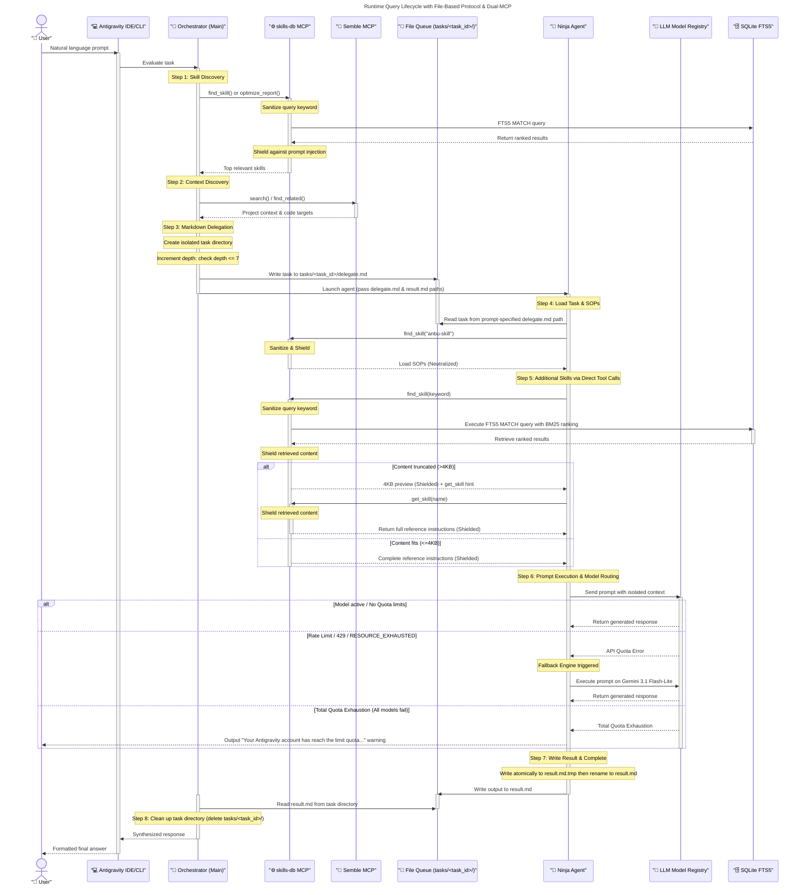

# ⚙️ How It Works

## Architecture

```mermaid
---
title: Konoha System Architecture (v1.1.1)
---
flowchart TB
    %% ── Style Definitions ──────────────────────────────────────
    classDef userNode fill:#0f172a,stroke:#38bdf8,stroke-width:2px,color:#f8fafc;
    classDef ideNode fill:#0f172a,stroke:#38bdf8,stroke-width:2px,color:#f8fafc;
    classDef routerNode fill:#1e293b,stroke:#94a3b8,stroke-width:2px,color:#e2e8f0;
    classDef agentNode fill:#1e1b4b,stroke:#818cf8,stroke-width:2px,color:#e0e7ff;
    classDef modelNode fill:#311b92,stroke:#651fff,stroke-width:2px,color:#f5f3ff;
    classDef mcpNode fill:#064e3b,stroke:#34d399,stroke-width:2px,color:#ecfdf5;
    classDef sembleNode fill:#134e4a,stroke:#2dd4bf,stroke-width:2px,color:#ccfbf1;
    classDef dbNode fill:#451a03,stroke:#fb923c,stroke-width:2px,color:#fff7ed;
    classDef ftsNode fill:#451a03,stroke:#fbbf24,stroke-width:2px,color:#fff7ed;
    classDef codeNode fill:#1c1917,stroke:#a8a29e,stroke-width:2px,color:#e7e5e4;
    classDef mgmtNode fill:#172554,stroke:#3b82f6,stroke-width:2px,color:#dbeafe;
    classDef queueNode fill:#2d1a4a,stroke:#a78bfa,stroke-width:2px,color:#f5f3ff;

    %% ── Layer 1: Presentation ──────────────────────────────────
    subgraph L1 ["Layer 1 — Presentation"]
        direction LR
        User(["👤 End User"])
        IDE("💻 Antigravity IDE / CLI")
    end

    %% ── Layer 1.5: Management & Configuration ──────────────────
    subgraph LM ["Layer 1.5 — Management & Configuration"]
        CLI["🛠️ Konoha CLI<br>(init, migrate, upgrade, models, skill, agent)"]
        AgentConfig["📄 Subagent Config<br>(~/.agents/agents.json)"]
        MCPConfig["📄 MCP Config<br>(mcp_config.json)"]
    end

    %% ── Layer 2: Cognitive Agent Orchestration ─────────────────
    subgraph L2 ["Layer 2 — Cognitive Agent Orchestration"]
        Router{"🔀 Task Router<br>GEMINI.md Rules"}
        Queue["📂 File Queue<br>(isolated tasks/<task_id> folders)"]

        subgraph AgentPool ["Ninja Agent Pool"]
            direction LR
            Genin("🍃 Genin<br>Scout")
            Chunin("📜 Chunin<br>Intel")
            Jonin("🛡️ Jonin<br>UI Builder")
            Anbu("👥 Anbu<br>Backend / DevOps")
            Tokubetsu("🎯 Tokubetsu<br>Scribe")
            Kage("🌀 Kage<br>Architect")
        end
    end

    %% ── Layer 2.5: LLM Execution & Fallback ────────────────────
    subgraph L25 ["Layer 2.5 — LLM Execution & Fallback"]
        LLMRegistry["🤖 LLM Model Registry<br>(Gemini, Claude, GPT)"]
        FallbackRouter{"⚠️ Fallback Router<br>(Route on 429/Resource Exhausted)"}
        QuotaLimit["🛑 Quota Exhaustion<br>( gcloud auth login / Upgrade )"]
    end

    %% ── Layer 3: MCP Middleware ────────────────────────────────
    subgraph L3 ["Layer 3 — MCP Middleware"]
        direction LR
        SkillsDB("⚙️ skills-db MCP<br>FTS5 Sanitizer & Injection Shield")
        Semble("🔮 Semble MCP<br>Semantic Code Search")
    end

    %% ── Layer 4: Persistence ──────────────────────────────────
    subgraph L4 ["Layer 4 — Persistence"]
        direction LR
        DB[("🗄️ SQLite DB<br>skills.db")]
        FTS5("🔍 FTS5 Index<br>BM25 Ranking")
        Codebase("📂 Codebase<br>Workspace Files")
    end

    %% ── Data Flow ──────────────────────────────────────────────
    User -->|"1. Natural language prompt"| IDE
    IDE -->|"2. Evaluate rules"| Router

    %% CLI and Configuration flow
    CLI -->|"Updates configuration"| MCPConfig
    CLI -->|"Manages agents/models"| AgentConfig
    CLI -->|"Triggers index/migration"| DB
    IDE -->|"Loads MCP servers"| MCPConfig
    Router -->|"Reads agent definitions"| AgentConfig

    Router -->|"3. Write task"| Queue
    Queue -->|"4. Read parameters"| Genin
    Queue -->|"4. Read parameters"| Chunin
    Queue -->|"4. Read parameters"| Jonin
    Queue -->|"4. Read parameters"| Anbu
    Queue -->|"4. Read parameters"| Tokubetsu
    Queue -->|"4. Read parameters"| Kage

    %% Model Execution Workflow
    Genin -->|"5. Execute prompts"| LLMRegistry
    Chunin -->|"5. Execute prompts"| LLMRegistry
    Jonin -->|"5. Execute prompts"| LLMRegistry
    Anbu -->|"5. Execute prompts"| LLMRegistry
    Tokubetsu -->|"5. Execute prompts"| LLMRegistry
    Kage -->|"5. Execute prompts"| LLMRegistry
    LLMRegistry -->|"5a. Quota limit / 429 error"| FallbackRouter
    FallbackRouter -->|"5b. Route to Fallback Model<br>(Gemini 3.1 Flash-Lite)"| LLMRegistry
    FallbackRouter -->|"5c. Total Exhaustion"| QuotaLimit
    QuotaLimit -->|"5d. Warning / Recovery instructions"| User

    Genin -->|"4a. find_skill()"| SkillsDB
    Chunin -->|"4a. find_skill()"| SkillsDB
    Jonin -->|"4a. find_skill()"| SkillsDB
    Anbu -->|"4a. find_skill()"| SkillsDB
    Tokubetsu -->|"4a. find_skill()"| SkillsDB
    Kage -->|"4a. find_skill()"| SkillsDB

    Genin -->|"4b. search()"| Semble
    Chunin -->|"4b. search()"| Semble
    Jonin -->|"4b. search()"| Semble
    Anbu -->|"4b. search()"| Semble
    Tokubetsu -->|"4b. search()"| Semble
    Kage -->|"4b. search()"| Semble

    SkillsDB -->|"5. SQL query"| DB
    DB <-->|"6. FTS5 search"| FTS5
    Semble -->|"5. Semantic index"| Codebase

    Genin -->|"6. Write output"| Queue
    Chunin -->|"6. Write output"| Queue
    Jonin -->|"6. Write output"| Queue
    Anbu -->|"6. Write output"| Queue
    Tokubetsu -->|"6. Write output"| Queue
    Kage -->|"6. Write output"| Queue
    Queue -->|"7. Read output"| Router
    Router -->|"8. Return response"| IDE
    IDE -->|"9. Context-aware response"| User

    %% ── Layout Alignment ──────────────────────────────────────
    IDE ~~~ SkillsDB

    %% ── Apply Styles ──────────────────────────────────────────
    class User userNode
    class IDE ideNode
    class Router routerNode
    class Queue queueNode
    class Genin,Chunin,Jonin,Anbu,Tokubetsu,Kage agentNode
    class LLMRegistry,FallbackRouter,QuotaLimit modelNode
    class SkillsDB mcpNode
    class Semble sembleNode
    class DB dbNode
    class FTS5 ftsNode
    class Codebase codeNode
    class CLI,AgentConfig,MCPConfig mgmtNode
```

> **Legend** — 🔵 Presentation &nbsp;|&nbsp; ⚫ Orchestration &nbsp;|&nbsp; 🟣 Agents &nbsp;|&nbsp; 🟢 skills-db MCP &nbsp;|&nbsp; 🩵 Semble MCP &nbsp;|&nbsp; 🟠 Persistence

## Query Lifecycle

