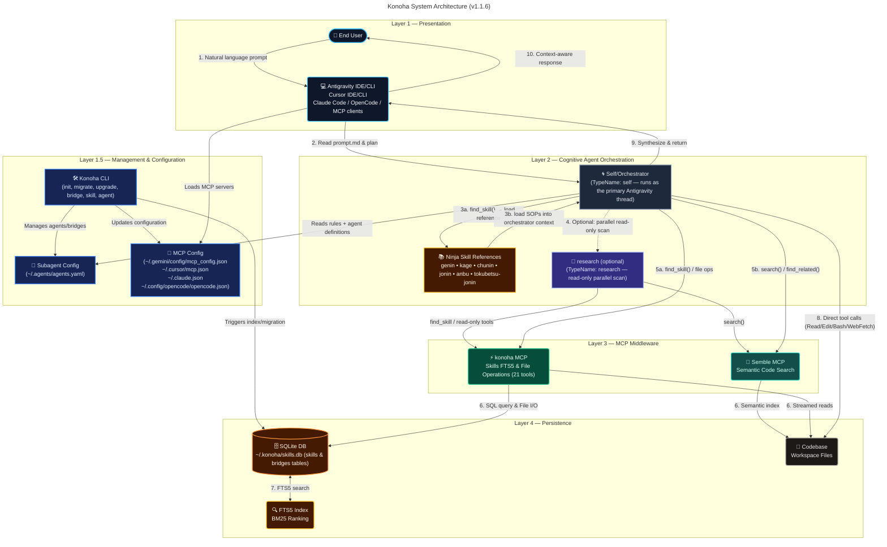
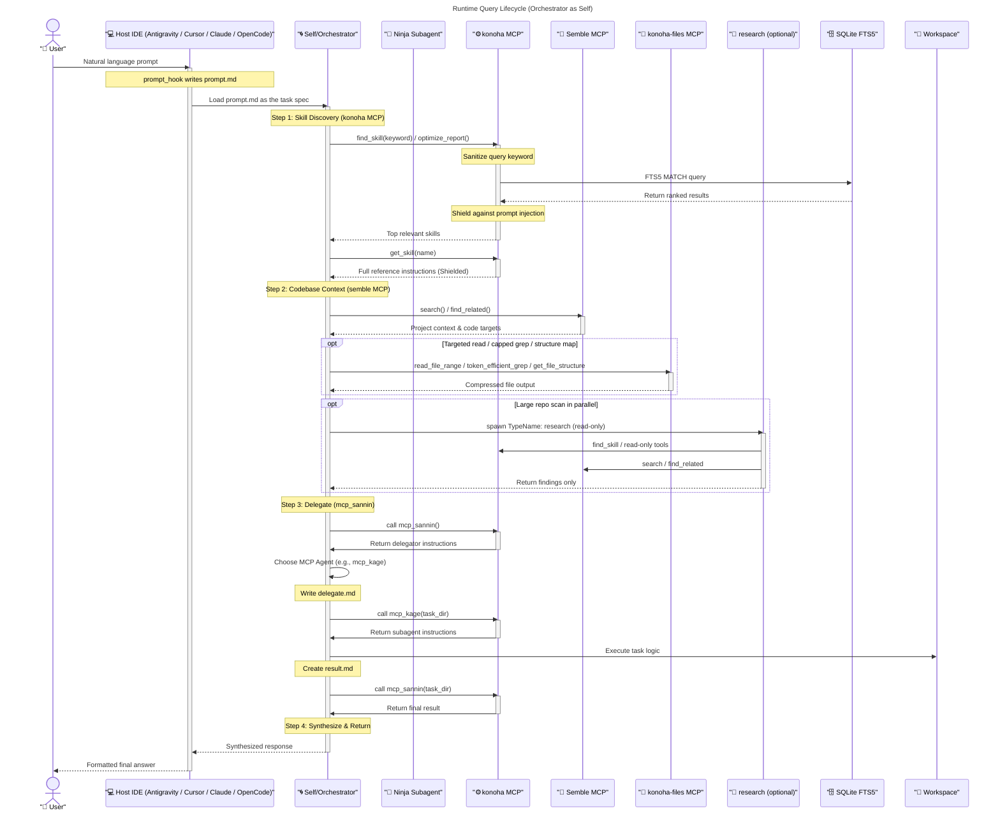

# ⚙️ How It Works

## Architecture

```mermaid
---
title: Konoha System Architecture (v1.1.6)
---
flowchart TB
    %% ── Style Definitions ──────────────────────────────────────
    classDef userNode fill:#0f172a,stroke:#38bdf8,stroke-width:2px,color:#f8fafc;
    classDef ideNode fill:#0f172a,stroke:#38bdf8,stroke-width:2px,color:#f8fafc;
    classDef routerNode fill:#1e293b,stroke:#94a3b8,stroke-width:2px,color:#e2e8f0;
    classDef orchestratorNode fill:#1e1b4b,stroke:#818cf8,stroke-width:2px,color:#e0e7ff;
    classDef researchNode fill:#312e81,stroke:#a5b4fc,stroke-width:2px,color:#e0e7ff;
    classDef mcpNode fill:#064e3b,stroke:#34d399,stroke-width:2px,color:#ecfdf5;
    classDef sembleNode fill:#134e4a,stroke:#2dd4bf,stroke-width:2px,color:#ccfbf1;
    classDef dbNode fill:#451a03,stroke:#fb923c,stroke-width:2px,color:#fff7ed;
    classDef ftsNode fill:#451a03,stroke:#fbbf24,stroke-width:2px,color:#fff7ed;
    classDef codeNode fill:#1c1917,stroke:#a8a29e,stroke-width:2px,color:#e7e5e4;
    classDef mgmtNode fill:#172554,stroke:#3b82f6,stroke-width:2px,color:#dbeafe;
    classDef skillNode fill:#451a03,stroke:#fbbf24,stroke-width:2px,color:#fff7ed;

    %% ── Layer 1: Presentation ──────────────────────────────────
    subgraph L1 ["Layer 1 — Presentation"]
        direction LR
        User(["👤 End User"])
        IDE("💻 Antigravity IDE/CLI<br>Cursor IDE/CLI<br>Claude Code / OpenCode / MCP clients")
    end

    %% ── Layer 1.5: Management & Configuration ─────────────────
    subgraph LM ["Layer 1.5 — Management & Configuration"]
        CLI["🛠️ Konoha CLI<br>(init, migrate, upgrade, bridge, skill, agent)"]
        AgentConfig["📄 Subagent Config<br>(~/.agents/agents.yaml)"]
        MCPConfig["📄 MCP Config<br>(~/.gemini/config/mcp_config.json<br>~/.cursor/mcp.json<br>~/.claude.json<br>~/.config/opencode/opencode.json)"]
    end

    %% ── Layer 2: Cognitive Agent Orchestration ─────────────────
    subgraph L2 ["Layer 2 — Cognitive Agent Orchestration"]
        Orchestrator["🌀 Self/Orchestrator<br>(TypeName: self — runs as the primary Antigravity thread)"]
        SkillRefs["📚 Ninja Skill References<br>genin • kage • chunin • jonin • anbu • tokubetsu-jonin"]
        Research["🔬 research (optional)<br>(TypeName: research — read-only parallel scan)"]
    end

    %% ── Layer 3: MCP Middleware ────────────────────────────────
    subgraph L3 ["Layer 3 — MCP Middleware"]
        direction LR
        KonohaMCP("⚡ konoha MCP<br>Skills FTS5 & File Operations (21 tools)")
        Semble("🔮 Semble MCP<br>Semantic Code Search")
    end

    %% ── Layer 4: Persistence ──────────────────────────────────
    subgraph L4 ["Layer 4 — Persistence"]
        direction LR
        DB[("🗄️ SQLite DB<br/>~/.konoha/skills.db (skills & bridges tables)")]
        FTS5("🔍 FTS5 Index<br>BM25 Ranking")
        Codebase("📂 Codebase<br>Workspace Files")
    end

    %% ── Data Flow ──────────────────────────────────────────────
    User -->|"1. Natural language prompt"| IDE
    IDE -->|"2. Read prompt.md & plan"| Orchestrator

    %% CLI and Configuration flow
    CLI -->|"Updates configuration"| MCPConfig
    CLI -->|"Manages agents/bridges"| AgentConfig
    CLI -->|"Triggers index/migration"| DB
    IDE -->|"Loads MCP servers"| MCPConfig
    Orchestrator -->|"Reads rules + agent definitions"| AgentConfig

    Orchestrator -->|"3a. find_skill() → load reference"| SkillRefs
    SkillRefs -->|"3b. load SOPs into orchestrator context"| Orchestrator

    Orchestrator -.->|"4. Optional: parallel read-only scan"| Research
    Research -->|"find_skill / read-only tools"| KonohaMCP
    Research -->|"search()"| Semble

    Orchestrator -->|"5a. find_skill() / file ops"| KonohaMCP
    Orchestrator -->|"5b. search() / find_related()"| Semble

    KonohaMCP -->|"6. SQL query & File I/O"| DB
    DB <-->|"7. FTS5 search"| FTS5
    Semble -->|"6. Semantic index"| Codebase
    KonohaMCP -->|"6. Streamed reads"| Codebase

    Orchestrator -->|"8. Direct tool calls (Read/Edit/Bash/WebFetch)"| Codebase
    Orchestrator -->|"9. Synthesize & return"| IDE
    IDE -->|"10. Context-aware response"| User

    %% ── Layout Alignment ──────────────────────────────────────
    IDE ~~~ KonohaMCP

    %% ── Apply Styles ──────────────────────────────────────────
    class User userNode
    class IDE ideNode
    class Orchestrator routerNode
    class SkillRefs skillNode
    class Research researchNode
    class KonohaMCP mcpNode
    class Semble sembleNode
    class DB dbNode
    class FTS5 ftsNode
    class Codebase codeNode
    class CLI,AgentConfig,MCPConfig mgmtNode
```

> **Legend** — 🔵 Presentation (host IDE) &nbsp;|&nbsp; ⚫ Orchestration &nbsp;|&nbsp; 🟣 Skill references &nbsp;|&nbsp; 🟢 konoha MCP &nbsp;|&nbsp; 🩵 Semble MCP &nbsp;|&nbsp; 🟠 Persistence
>
> In version 1.1.6, Konoha implements SQLite database storage for both bridges and ninja agent skills (`~/.konoha/skills.db`), enabling dynamic skill resolution at rules compile-time and automated installation of the `konoha-bridge` extension into Antigravity IDE and VS Code.
>
> **Orchestration model:** The orchestrator runs as the primary thread and coordinates tasks by delegating to specialized konoha subagents. All subagent delegation goes through the `mcp_sannin` (Village Elder) MCP tool, which intelligently routes tasks to backend MCP agents (e.g. `mcp_kage`, `mcp_jonin`). Custom IDE-native agents and hook-based translations are no longer used.

## Query Lifecycle

```mermaid
---
title: Runtime Query Lifecycle (Orchestrator as Self)
---
sequenceDiagram
    actor User as "👤 User"
    participant IDE as "💻 Host IDE (Antigravity / Cursor / Claude / OpenCode)"
    participant Orchestrator as "🌀 Self/Orchestrator"
    participant Subagent as "🤖 Ninja Subagent"
    participant KonohaMCP as "⚙️ konoha MCP"
    participant Semble as "🔮 Semble MCP"
    participant KonohaFiles as "📁 konoha-files MCP"
    participant Research as "🔬 research (optional)"
    participant DB as "🗄️ SQLite FTS5"
    participant Codebase as "📂 Workspace"

    User->>IDE: Natural language prompt
    activate IDE
    Note over IDE: prompt_hook writes prompt.md
    IDE->>Orchestrator: Load prompt.md as the task spec
    activate Orchestrator

    %% --- Skill Discovery Phase ---
    Note over Orchestrator: Step 1: Skill Discovery (konoha MCP)
    Orchestrator->>KonohaMCP: find_skill(keyword) / optimize_report()
    activate KonohaMCP
    Note over KonohaMCP: Sanitize query keyword
    KonohaMCP->>DB: FTS5 MATCH query
    DB-->>KonohaMCP: Return ranked results
    Note over KonohaMCP: Shield against prompt injection
    KonohaMCP-->>Orchestrator: Top relevant skills
    deactivate KonohaMCP

    Orchestrator->>KonohaMCP: get_skill(name)
    activate KonohaMCP
    KonohaMCP-->>Orchestrator: Full reference instructions (Shielded)
    deactivate KonohaMCP

    %% --- Context Discovery ---
    Note over Orchestrator: Step 2: Codebase Context (semble MCP)
    Orchestrator->>Semble: search() / find_related()
    activate Semble
    Semble-->>Orchestrator: Project context & code targets
    deactivate Semble

    opt Targeted read / capped grep / structure map
        Orchestrator->>KonohaFiles: read_file_range / token_efficient_grep / get_file_structure
        activate KonohaFiles
        KonohaFiles-->>Orchestrator: Compressed file output
        deactivate KonohaFiles
    end

    %% --- Optional parallel read-only scan ---
    opt Large repo scan in parallel
        Orchestrator->>Research: spawn TypeName: research (read-only)
        activate Research
        Research->>KonohaMCP: find_skill / read-only tools
        Research->>Semble: search / find_related
        Research-->>Orchestrator: Return findings only
        deactivate Research
    end

    %% --- Execution Phase ---
    Note over Orchestrator: Step 3: Delegate (mcp_sannin)
    Orchestrator->>KonohaMCP: call mcp_sannin()
    activate KonohaMCP
    KonohaMCP->>Orchestrator: Return delegator instructions
    deactivate KonohaMCP
    
    Orchestrator->>Orchestrator: Choose MCP Agent (e.g., mcp_kage)
    Note over Orchestrator: Write delegate.md
    Orchestrator->>KonohaMCP: call mcp_kage(task_dir)
    activate KonohaMCP
    KonohaMCP->>Orchestrator: Return subagent instructions
    deactivate KonohaMCP
    
    Orchestrator->>Codebase: Execute task logic
    Note over Orchestrator: Create result.md
    Orchestrator->>KonohaMCP: call mcp_sannin(task_dir)
    activate KonohaMCP
    KonohaMCP->>Orchestrator: Return final result
    deactivate KonohaMCP

    %% --- Response Phase ---
    Note over Orchestrator: Step 4: Synthesize & Return
    Orchestrator-->>IDE: Synthesized response
    deactivate Orchestrator
    IDE-->>User: Formatted final answer
    deactivate IDE
```

## Forced MCP Usage & Delegation Policy

**ABSOLUTE RULE:** All non-trivial work MUST go through the **konoha MCP** and **semble MCP** tools — never execute tasks solo, never bypass the agent delegation workflow.

- **Skill discovery**: Always via `konoha` MCP (`find_skill`, `get_skill`, `list_skills`). Never use `semble` for skills.
- **Codebase search**: Always via `semble` MCP (`search`, `find_related`). Never use `grep`, `rg`, `find`, `glob`, or generic `Read`/`Grep` tools for code discovery.
- **File reads**: Always via `konoha` MCP (`read_file_head`, `read_file_range`, `file_info`, `token_efficient_grep`, `get_file_structure`, `find_files_clean`). Never use shell `cat`/`head`/`tail`/`less` or generic Read/Grep tools.
- **Non-trivial delegation**: Any task that requires code changes, multi-step planning, or specialized expertise MUST be delegated to a konoha subagent:
  - `@genin` — codebase search, tracing codepaths, read-only exploration
  - `@kage` — architecture decisions, security review, deep analysis, risk assessment
  - `@chunin` — web research, documentation synthesis, citation-backed recommendations
  - `@jonin` — UI/frontend development (SvelteKit, Next.js, Tailwind)
  - `@anbu` — backend dev, bug fixing, DevOps, infrastructure
  - `@tokubetsu-jonin` — technical writing, documentation, API specs

**The main orchestrator MUST NOT execute implementation tasks itself — it only coordinates and delegates.** The only exception is simple/trivial tasks (single read/edit on a known file) which may be executed directly.