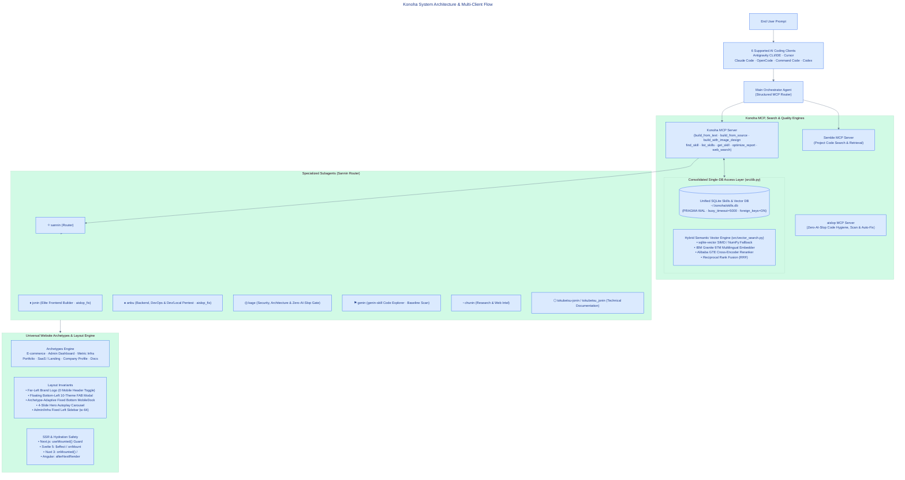

# ⚙️ How It Works: System Architecture & Multi-Archetype Engine

## Architecture

> **Canonical editable diagram:** [01 System Architecture](diagrams/konoha-architecture.drawio) · [Diagram manifest](diagrams/README.md).

```mermaid
---
title: Konoha System Architecture & Multi-Client Flow
config:
  theme: base
  themeVariables:
    background: '#ffffff'
    primaryColor: '#dbeafe'
    primaryTextColor: '#1e3a8a'
    primaryBorderColor: '#2563eb'
    lineColor: '#64748b'
    secondaryColor: '#ede9fe'
    tertiaryColor: '#d1fae5'
    fontFamily: 'Inter, system-ui, sans-serif'
    fontSize: '14px'
  flowchart:
    nodeSpacing: 45
    rankSpacing: 55
    padding: 24
    wrappingWidth: 380
---
flowchart TB
    User["End User Prompt"] --> Clients["6 Supported AI Coding Clients<br/>Antigravity CLI/IDE · Cursor<br/>Claude Code · OpenCode · Command Code · Codex"]
    Clients --> Orchestrator["Main Orchestrator Agent<br/>(Structured MCP Router)"]

    subgraph CoreMCP ["Konoha MCP, Search & Quality Engines"]
        KonohaMCP["Konoha MCP Server<br/>(build_from_text · build_from_source · build_with_image_design<br/>find_skill · list_skills · get_skill · optimize_report · web_search)"]
        SembleMCP["Semble MCP Server<br/>(Project Code Search & Retrieval)"]
        AislopMCP["aislop MCP Server<br/>(Zero-AI-Slop Code Hygiene, Scan & Auto-Fix)"]
        
        subgraph PersistenceLayer ["Consolidated Single-DB Access Layer (src/db.py)"]
            SQLiteDB[("Unified SQLite Skills & Vector DB<br/>~/.konoha/skills.db<br/>(PRAGMA WAL · busy_timeout=5000 · foreign_keys=ON)")]
            VectorEngine["Hybrid Semantic Vector Engine (src/vector_search.py)<br/>• sqlite-vector SIMD / NumPy Fallback<br/>• IBM Granite 97M Multilingual Embedder<br/>• Alibaba GTE Cross-Encoder Reranker<br/>• Reciprocal Rank Fusion (RRF)"]
        end
        
        KonohaMCP <--> PersistenceLayer
    end

    subgraph Specialists ["Specialized Subagents (Sannin Router)"]
        Sannin["✧ sannin (Router)"]
        Jonin["♦ jonin (Elite Frontend Builder · aislop_fix)"]
        Anbu["♠ anbu (Backend, DevOps & Dev/Local Pentest · aislop_fix)"]
        Kage["◎ kage (Security, Architecture & Zero-AI-Slop Gate)"]
        Genin["⚑ genin (genin-skill Code Explorer · Baseline Scan)"]
        Chunin["▫ chunin (Research & Web Intel)"]
        Tokubetsu["⬡ tokubetsu-jonin / tokubetsu_jonin (Technical Documentation)"]
    end

    subgraph UniversalInvariants ["Universal Website Archetypes & Layout Engine"]
        Archetypes["Archetypes Engine<br/>E-commerce · Admin Dashboard · Metric Infra<br/>Portfolio · SaaS / Landing · Company Profile · Docs"]
        Invariants["Layout Invariants<br/>• Far-Left Brand Logo (0 Mobile Header Toggle)<br/>• Floating Bottom-Left 10-Theme FAB Modal<br/>• Archetype-Adaptive Fixed Bottom MobileDock<br/>• 4-Slide Hero Autoplay Carousel<br/>• Admin/Infra Fixed Left Sidebar (w-64)"]
        SSRSafety["SSR & Hydration Safety<br/>• Next.js: useMounted() Guard<br/>• Svelte 5: $effect / onMount<br/>• Nuxt 3: onMounted() / <ClientOnly><br/>• Angular: afterNextRender"]
    end

    Orchestrator --> KonohaMCP
    Orchestrator --> SembleMCP
    KonohaMCP --> Sannin
    Sannin --> Specialists
    Specialists --> UniversalInvariants
```

---

## 🛠️ Canonical Konoha MCP Tools Matrix

| Tool Category | Registered Tools | Description |
| :--- | :--- | :--- |
| **Skill Discovery & Loading** | `find_skill`, `list_skills`, `get_skill`, `optimize_report` | High-speed FTS5 SQLite skill querying and token-efficient skill ingestion. |
| **Autonomous Website Builders** | `build_from_text`, `build_from_source`, `build_with_image_design` | Side-effect-free structured specifications for multi-archetype website generation. |
| **Intel & Web Search** | `web_search` | Real-time web evidence gathering and documentation lookups. |
| **Specialist Delegation Subagents** | `sannin`, `kage`, `jonin`, `anbu`, `chunin`, `tokubetsu_jonin` (or `tokubetsu-jonin`), `genin` | In-line direct subagent delegation for specialized frontend, backend, security, and doc tasks. |
| **Bounded File Operations** | `read_file_head`, `read_file_range`, `file_info`, `token_efficient_grep`, `get_file_structure`, `find_files_clean` | Bounded token-safe file inspections preventing context window pollution. |

---

## 💾 Consolidated Single-Database Access Layer (`src/db.py`)

All database interactions across the entire Konoha codebase are consolidated under `src/db.py`, ensuring consistent connection setup, unified schema definitions, and eliminating schema drift:

1. **Canonical Path Ownership**: `DB_PATH = os.path.expanduser("~/.konoha/skills.db")` is defined exclusively in `src/db.py`.
2. **Unified Pragmas**: Every connection opened via `db.get_connection()` automatically configures:
   - `row_factory = sqlite3.Row`
   - `PRAGMA journal_mode=WAL;` (Write-Ahead Logging for high-concurrency read/write)
   - `PRAGMA foreign_keys=ON;`
   - `PRAGMA busy_timeout=5000;` (5-second retry timeout to eliminate database locks)
   - `PRAGMA synchronous=NORMAL;`
3. **Unified Schema DDL (`setup_schema`)**: Single canonical `executescript()` containing every table and trigger across all subsystems (`skills`, `skills_fts` + sync triggers, `skill_chunks`, `tool_calls`, `active_sessions`, `agents`, `bridges`, `projects`, `persona_memories`, `persona_memories_fts`).

---

## 🧠 Hybrid Vector Search & Multilingual Retrieval (`src/vector_search.py`)

Konoha provides cross-lingual semantic retrieval fused with FTS5 BM25 keyword matching:

1. **IBM Granite 97M Multilingual Embedding (ONNX)**:
   - Model: `onnx-community/granite-embedding-97m-multilingual-r2-ONNX` (384-dimensional dense vectors, int8 quantized).
   - Pre/Post-processing: Tokenized via `tokenizers`, CLS-token extracted from `last_hidden_state`, and L2-normalized.
2. **Alibaba GTE Multilingual Cross-Encoder Reranker**:
   - Model: `onnx-community/gte-multilingual-reranker-base` (int8 quantized).
   - Pairs query with candidate chunk snippets; scores with sigmoid logit transformation.
3. **Cross-Platform `sqlite-vector` SIMD Acceleration**:
   - Lazily downloads platform-specific prebuilt binary (`linux-x64`, `linux-arm64`, `darwin-arm64`, `darwin-x64`, `windows-x64`) to `~/.konoha/vendor/sqlite-vector/`.
   - Build-time capability detection: if dynamic extension loading is disabled in Python, seamlessly falls back to in-memory NumPy cosine similarity calculation without errors.
4. **Markdown Heading Chunker**:
   - Chunks documentation by section headers (`#`, `##`, `###`), preserving semantic context boundaries.
   - Max 2,000 characters per chunk with 100-character boundary overlap.
5. **Reciprocal Rank Fusion (RRF)**:
   - Merges vector similarity rankings with FTS5 BM25 ranks using standard `RRF(d) = sum(1.0 / (60 + rank))`.
6. **Cross-Lingual Evaluation Benchmark**:
   - Tested against 40 real English and Indonesian queries:
     - **English**: 100.0% Recall@5 (MRR 0.892)
     - **Indonesian**: 95.0% Recall@5 (MRR 0.879)
     - **Overall**: 97.5% Recall@5 (MRR 0.885 vs FTS5 0.769)
7. **Zero-Config Default & Opt-In Flag**:
   - Semantic retrieval is enabled via `KONOHA_SEMANTIC_SEARCH=1`. When unset, Konoha defaults to pure SQLite FTS5 for zero-dependency instant startup.
8. **4-Tier Embedding Feature Deduplication**:
   - **Chunk-Level**: Document sections hashed via SHA-256 over normalized whitespace in `chunk_document()`, pruning duplicate markdown blocks before vectorization.
   - **In-Memory Cache**: `_EMBED_CACHE` (4,096 capacity) serves cached dense vectors in 0 ms with zero redundant ONNX compute.
   - **DB-Level Blob Reuse**: `index_single_skill_chunks()` checks `skill_chunks` for matching `chunk_text`, reusing existing binary blobs across skills.
   - **Candidate Deduplication**: Nearest chunks deduplicated by content in `scan_nearest_chunks()` to ensure diverse top-K representation.
9. **Persistent Persona & Context Memory Optimization**:
   - Idempotent `save_memory()` updates existing records instead of duplicating rows.
   - Strictly zero-hallucination factual extraction from `projects` and `persona_memories`.
   - Auto-compact turn-based badges reduce prompt context footprint to < 120 tokens on turn >= 2.

---

## 🏗️ Multi-Archetype Website Builder Specifications

Konoha features an autonomous multi-archetype generator (`konoha.build_from_text` and `konoha.build_from_source`) that crafts production-grade applications across 4 major frameworks:

1. **Next.js 16 (React 19, Tailwind CSS v4)**
2. **SvelteKit 2 (Svelte 5 Runes, Tailwind CSS)**
3. **Nuxt 3 (Vue 3 Composition API, Tailwind CSS)**
4. **Angular v19+ (Standalone Components, Signals)**

### 📐 Archetype Directory Matrix

| Archetype | Key Structural Invariants | Target Scenarios |
| :--- | :--- | :--- |
| **Admin & Infra Dashboard** | Fixed Left Sidebar (`w-64`) on desktop + Top Header bar + Bottom MobileDock | Cloud monitoring, K8s cluster management, user management, metrics telemetry |
| **Portfolio / Personal** | Far-left logo sticky header + Projects Bento grid + Skills matrix + Contact form | Software engineers, cloud architects, designers, consultants |
| **SaaS & Landing Page** | High-impact hero + Bento features + Monthly/Annual pricing switcher + Testimonials | SaaS startups, developer tools, waitlists, app launches |
| **Company Profile** | Mission hero carousel + Team leadership grid + Services tabs + Office locations | Corporate businesses, digital agencies, consulting firms |
| **E-Commerce** | 4-slide 3D hero carousel + 50-item catalog + Faceted filters + Slide-over cart drawer | Retail storefronts, brand merchandise, digital product stores |
| **Documentation** | 3-column layout (Left Sidebar Nav, Center Markdown Content, Right TOC) | Open-source libraries, API specifications, technical handbooks |

---

## 🛡️ Quality & Verification Gates

1. **Zero-AI-Slop Pre-Gate with `aislop` MCP**:
   - Hard pre-gate: `kage` executes `aislop_scan` scoped to all changed files before any confidence percentage is assessed.
   - Requires `ai_slop_clean: true` and `ai_slop_findings: 0` in `kage_review.json`. Missing or non-zero findings mechanically block workflow delivery.
   - Role boundaries: Genin and Kage are strictly read-only (`aislop_scan`, `aislop_why`); execution agents Jonin and Anbu have access to `aislop_fix` to remediate issues.
2. **Kage Reviewer 95% Minimum Confidence Gate**:
   - Every task is reviewed by `kage` for structural integrity, zero hallucination, and security compliance.
   - Evaluates real recorded task evidence in `status.json` and writes structured `kage_review.json`. If confidence < 95%, delivery is blocked and tasks are re-delegated for remediation.
3. **Zero Errors & Zero Warnings**:
   - Validation requires `pnpm run build`, `pnpm run lint`, and `pnpm run check` (for SvelteKit) to complete with 0 errors and 0 warnings.
4. **High-Efficiency Auto-Compaction & Turn Reset Invariant**:
   - Automatically activates after 2 MCP delegations (`turn >= 2`) across all 6 coding clients.
   - Preserves token budget by compacting instruction boilerplate while permanently retaining the primary skill SOP preview (250 chars) so fixing agents never lose their methodology.
   - Bounds instruction truncation to 1200 chars and constraint truncation to 600 chars at sentence boundaries (no mid-sentence chopping).
   - Enforces a 30-minute idle reset (`SESSION_IDLE_RESET_SECONDS = 1800`) preventing cross-session turn accumulation in long-lived MCP server processes.
5. **Append-Only Prompt History & Original Task Authority**:
   - `src/prompt_hook.js` records user inputs in an append-only format (`# Session Prompts`) with `## Original Task` as the authoritative goal.
   - Subsequent user messages or pasted errors are recorded as timestamped `## Follow-up N` refinements that never replace, delete, or overwrite the original bug task.
6. **Real Validation Evidence Assessment in `report_from_agent`**:
   - `report_from_agent()` verifies that completion claims contain real command output evidence matching passing markers (`exit code 0`, `0 errors`, `passed`, `succeeded`).
   - Unsubstantiated claims are automatically downgraded to `status: "unverified"`, preventing unverified tasks from silently completing the workflow.
7. **Episodic Learnings & Memory Hygiene**:
   - Only learnings from verified tasks (`verified = True`) are persisted to episodic memory in `persona_memory.py`.
   - `memory_content_exists()` performs deduplication against the SQLite database, preventing corrupted or hallucinated diagnoses from polluting future prompts.
8. **Authorized Penetration Testing in Dev/Local Environments**:
   - `anbu` is authorized to conduct penetration testing and vulnerability assessments in dev/local environments (`localhost`, `127.0.0.1`, dev containers, local clusters).
   - The workflow review gate utilizes pentest-aware validation (`_is_pentest_task`, `_is_clean_validation`) allowing diagnostic exploit checks and HTTP error responses without false rejection, while strictly prohibiting unhandled fatal crash exceptions.
