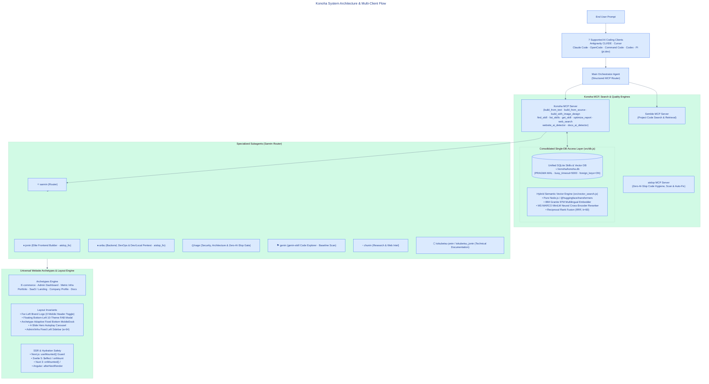
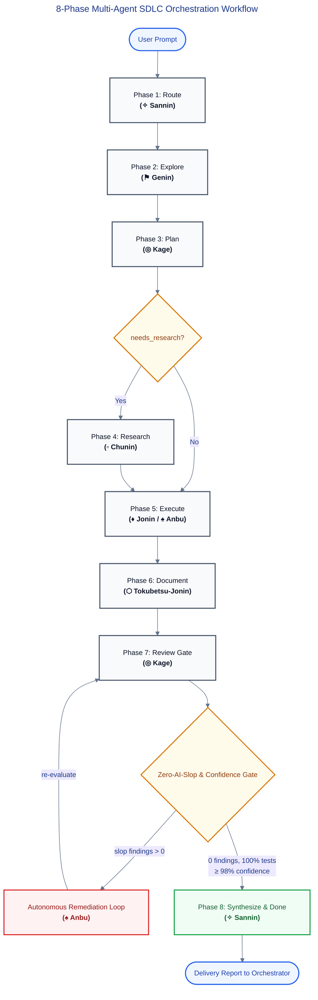

# ⚙️ How It Works: System Architecture & Multi-Archetype Engine

## Architecture

> **Canonical editable diagram:** [01 System Architecture](diagrams/konoha-architecture.drawio) · [Diagram manifest](diagrams/README.md).

```mermaid
---
title: Konoha System Architecture & Multi-Client Flow
config:
  theme: base
  themeVariables:
    background: '#ffffff'
    primaryColor: '#dbeafe'
    primaryTextColor: '#1e3a8a'
    primaryBorderColor: '#2563eb'
    lineColor: '#64748b'
    secondaryColor: '#ede9fe'
    tertiaryColor: '#d1fae5'
    fontFamily: 'Inter, system-ui, sans-serif'
    fontSize: '14px'
  flowchart:
    nodeSpacing: 45
    rankSpacing: 55
    padding: 24
    wrappingWidth: 380
---
flowchart TB
    User["End User Prompt"] --> Clients["7 Supported AI Coding Clients<br/>Antigravity CLI/IDE · Cursor<br/>Claude Code · OpenCode · Command Code · Codex · Pi (pi.dev)"]
    Clients --> Orchestrator["Main Orchestrator Agent<br/>(Structured MCP Router)"]

    subgraph CoreMCP ["Konoha MCP, Search & Quality Engines"]
        KonohaMCP["Konoha MCP Server<br/>(build_from_text · build_from_source · build_with_image_design<br/>find_skill · list_skills · get_skill · optimize_report · web_search<br/>website_ai_detector · docs_ai_detector)"]
        SembleMCP["Semble MCP Server<br/>(Project Code Search & Retrieval)"]
        AislopMCP["aislop MCP Server<br/>(Zero-AI-Slop Code Hygiene, Scan & Auto-Fix)"]
        
        subgraph PersistenceLayer ["Consolidated Single-DB Access Layer (src/db.js)"]
            SQLiteDB[("Unified SQLite Skills & Vector DB<br/>~/.konoha/konoha.db<br/>(PRAGMA WAL · busy_timeout=5000 · foreign_keys=ON)")]
            VectorEngine["Hybrid Semantic Vector Engine (src/vector_search.js)<br/>• Pure Node.js / @huggingface/transformers<br/>• IBM Granite 97M Multilingual Embedder<br/>• MS MARCO MiniLM Neural Cross-Encoder Reranker<br/>• Reciprocal Rank Fusion (RRF, k=60)"]
        end
        
        KonohaMCP <--> PersistenceLayer
    end

    subgraph Specialists ["Specialized Subagents (Sannin Router)"]
        Sannin["✧ sannin (Router)"]
        Jonin["♦ jonin (Elite Frontend Builder · aislop_fix)"]
        Anbu["♠ anbu (Backend, DevOps & Dev/Local Pentest · aislop_fix)"]
        Kage["◎ kage (Security, Architecture & Zero-AI-Slop Gate)"]
        Genin["⚑ genin (genin-skill Code Explorer · Baseline Scan)"]
        Chunin["▫ chunin (Research & Web Intel)"]
        Tokubetsu["⬡ tokubetsu-jonin / tokubetsu_jonin (Technical Documentation)"]
    end

    subgraph UniversalInvariants ["Universal Website Archetypes & Layout Engine"]
        Archetypes["Archetypes Engine<br/>E-commerce · Admin Dashboard · Metric Infra<br/>Portfolio · SaaS / Landing · Company Profile · Docs"]
        Invariants["Layout Invariants<br/>• Far-Left Brand Logo (0 Mobile Header Toggle)<br/>• Floating Bottom-Left 10-Theme FAB Modal<br/>• Archetype-Adaptive Fixed Bottom MobileDock<br/>• 4-Slide Hero Autoplay Carousel<br/>• Admin/Infra Fixed Left Sidebar (w-64)"]
        SSRSafety["SSR & Hydration Safety<br/>• Next.js: useMounted() Guard<br/>• Svelte 5: $effect / onMount<br/>• Nuxt 3: onMounted() / <ClientOnly><br/>• Angular: afterNextRender"]
    end

    Orchestrator --> KonohaMCP
    Orchestrator --> SembleMCP
    KonohaMCP --> Sannin
    Sannin --> Specialists
    Specialists --> UniversalInvariants
```

---

## 🛠️ Canonical Konoha MCP Tools Matrix (35 Canonical Tools)

| Tool Category | Registered Tools (35 Total) | Description |
| :--- | :--- | :--- |
| **Bounded File Operations (6)** | `read_file_head`, `read_file_range`, `file_info`, `token_efficient_grep`, `get_file_structure`, `find_files_clean` | Bounded token-safe file inspections preventing context window pollution. |
| **Skill Discovery & Loading (4)** | `find_skill`, `list_skills`, `get_skill`, `optimize_report` | High-speed FTS5 SQLite skill querying and token-efficient snippet-first ingestion. |
| **Autonomous Website Builders (2)** | `build_from_source`, `build_from_text` | Side-effect-free structured specifications for multi-archetype website generation. |
| **Specialist Delegation Subagents (7)** | `sannin`, `kage`, `jonin`, `anbu`, `chunin`, `tokubetsu_jonin`, `genin` | In-line direct subagent delegation for specialized frontend, backend, security, and doc tasks. |
| **AI Fingerprint Detection (2)** | `website_ai_detector`, `docs_ai_detector` | Website (0-20 Human-Built target) and Document AI detectors (.docx, .pdf, .pptx, text). |
| **Project Context & Memory (4)** | `get_project_context`, `save_project_context`, `query_project_memory`, `report_from_agent` | Episodic architectural memory and context tracking across client workspaces. |
| **Persona Memory (4)** | `save_persona_memory`, `query_persona_memory`, `list_persona_memories`, `delete_persona_memory` | Agent & user persona traits, patterns, and architectural rules in SQLite. |
| **SDLC Governance & Quality Gates (3)** | `check_readiness`, `get_task_evidence`, `get_slop_findings` | Definition-of-Ready auditing, automated task evidence collection, and slop findings query. |
| **Intel & Web Search (1)** | `web_search` | Real-time web evidence gathering and documentation lookups with Wikipedia fallback. |
| **Skills Migration & Administration (2)** | `get_resolved_task_dir`, `migrate_skills` | Isolated session task directory resolution and cross-workspace skill synchronization. |

### 🧠 Cross-Agent Output Skill (`i-have-adhd`)

Agent-to-skill mapping is declared in `src/templates/agents.yaml` and surfaced through the `AGENTS.md` / `GEMINI.md` routing tables. The `i-have-adhd` skill (from [ayghri/i-have-adhd](https://github.com/ayghri/i-have-adhd), MIT) is embedded into exactly five agents — **genin, jonin, anbu, tokubetsu-jonin, chunin** — and shapes their final responses (action first, numbered steps, one concrete next action, no preamble/closers). **Sannin (router) and Kage (reviewer) deliberately do not load it**; their output formats are governed by the routing SOP and the delivery-gate contract. Parity and scoping are enforced by `tests/test_i_have_adhd_skill.js`.

---

## 💾 Consolidated Single-Database Access Layer (`src/db.js`)

All database interactions across the entire Konoha codebase are consolidated under `src/db.js`, ensuring consistent connection setup, unified schema definitions, and eliminating schema drift:

1. **Canonical Path Ownership**: `DB_PATH = path.join(os.homedir(), ".konoha", "konoha.db")` is defined exclusively in `src/db.js` (with automatic one-time legacy migration from `skills.db`).
2. **Unified Pragmas**: Every connection opened via `db.getConnection()` automatically configures:
   - Native `better-sqlite3` database handle
   - `PRAGMA journal_mode=WAL;` (Write-Ahead Logging for high-concurrency read/write)
   - `PRAGMA foreign_keys=ON;`
   - `PRAGMA busy_timeout=5000;` (5-second retry timeout to eliminate database locks)
   - `PRAGMA synchronous=NORMAL;`
3. **Unified Schema DDL (`setupSchema`)**: Canonical initialization containing every table and trigger across all subsystems (`skills`, `skills_fts` + sync triggers, `skill_chunks`, `tool_calls`, `active_sessions`, `agents`, `bridges`, `projects`, `persona_memories`, `persona_memories_fts`).

---

## 🧠 Hybrid Vector Search & Multilingual Retrieval (`src/vector_search.js`)

Konoha provides cross-lingual semantic retrieval fused with FTS5 BM25 keyword matching:

1. **IBM Granite 97M Multilingual Embedding (ONNX)**:
   - Model: `onnx-community/granite-embedding-97m-multilingual-r2-ONNX` (384-dimensional dense vectors, int8 quantized).
   - Pre/Post-processing: Tokenized via `tokenizers`, CLS-token extracted from `last_hidden_state`, and L2-normalized.
2. **Alibaba GTE Multilingual Cross-Encoder Reranker**:
   - Model: `onnx-community/gte-multilingual-reranker-base` (int8 quantized).
   - Pairs query with candidate chunk snippets; scores with sigmoid logit transformation.
3. **Cross-Platform `sqlite-vector` SIMD Acceleration**:
   - Lazily downloads platform-specific prebuilt binary (`linux-x64`, `linux-arm64`, `darwin-arm64`, `darwin-x64`, `windows-x64`) to `~/.konoha/vendor/sqlite-vector/`.
   - Build-time capability detection: if dynamic extension loading is disabled or unsupported in SQLite, falls back to in-memory cosine similarity calculation without errors.
4. **Markdown Heading Chunker**:
   - Chunks documentation by section headers (`#`, `##`, `###`), preserving semantic context boundaries.
   - Max 2,000 characters per chunk with 100-character boundary overlap.
5. **Reciprocal Rank Fusion (RRF)**:
   - Merges vector similarity rankings with FTS5 BM25 ranks using standard `RRF(d) = sum(1.0 / (60 + rank))`.
6. **Cross-Lingual Evaluation Benchmark**:
   - Tested against 40 real English and Indonesian queries:
     - **English**: 100.0% Recall@5 (MRR 0.892)
     - **Indonesian**: 95.0% Recall@5 (MRR 0.879)
     - **Overall**: 97.5% Recall@5 (MRR 0.885 vs FTS5 0.769)
7. **Zero-Config Default & Opt-In Flag**:
   - Semantic retrieval is enabled via `KONOHA_SEMANTIC_SEARCH=1`. When unset, Konoha defaults to pure SQLite FTS5 for zero-dependency instant startup.
8. **4-Tier Embedding Feature Deduplication**:
   - **Chunk-Level**: Document sections hashed via SHA-256 over normalized whitespace in `chunk_document()`, pruning duplicate markdown blocks before vectorization.
   - **In-Memory Cache**: `_EMBED_CACHE` (4,096 capacity) serves cached dense vectors in 0 ms with zero redundant ONNX compute.
   - **DB-Level Blob Reuse**: `index_single_skill_chunks()` checks `skill_chunks` for matching `chunk_text`, reusing existing binary blobs across skills.
   - **Candidate Deduplication**: Nearest chunks deduplicated by content in `scan_nearest_chunks()` to ensure diverse top-K representation.
9. **Persistent Persona & Context Memory Optimization**:
   - Idempotent `save_memory()` updates existing records instead of duplicating rows.
   - Strictly zero-hallucination factual extraction from `projects` and `persona_memories`.
   - Auto-compact turn-based badges reduce prompt context footprint to < 120 tokens on turn >= 2.

---

## 🏗️ Multi-Archetype Website Builder Specifications

Konoha features an autonomous multi-archetype generator (`konoha.build_from_text` and `konoha.build_from_source`) that crafts production-grade applications across 4 major frameworks:

1. **Next.js 16 (React 19, Tailwind CSS v4)**
2. **SvelteKit 2 (Svelte 5 Runes, Tailwind CSS)** — stable scaffold via `pnpm dlx sv create` for generated sites (the Konoha Web UI dashboard itself runs SvelteKit 3 RC)
3. **Nuxt 3 (Vue 3 Composition API, Tailwind CSS)**
4. **Angular v19+ (Standalone Components, Signals)**

### 📐 Archetype Directory Matrix

| Archetype | Key Structural Invariants | Target Scenarios |
| :--- | :--- | :--- |
| **Admin & Infra Dashboard** | Fixed Left Sidebar (`w-64`) on desktop + Top Header bar + Bottom MobileDock | Cloud monitoring, K8s cluster management, user management, metrics telemetry |
| **Portfolio / Personal** | Far-left logo sticky header + Projects Bento grid + Skills matrix + Contact form | Software engineers, cloud architects, designers, consultants |
| **SaaS & Landing Page** | High-impact hero + Bento features + Monthly/Annual pricing switcher + Testimonials | SaaS startups, developer tools, waitlists, app launches |
| **Company Profile** | Mission hero carousel + Team leadership grid + Services tabs + Office locations | Corporate businesses, digital agencies, consulting firms |
| **E-Commerce** | 4-slide 3D hero carousel + 50-item catalog + Faceted filters + Slide-over cart drawer | Retail storefronts, brand merchandise, digital product stores |
| **Documentation** | 3-column layout (Left Sidebar Nav, Center Markdown Content, Right TOC) | Open-source libraries, API specifications, technical handbooks |

---

## 🛡️ Quality & Verification Gates

1. **Zero-AI-Slop Pre-Gate with `aislop` MCP**:
   - Hard pre-gate: `kage` executes `aislop_scan` scoped to all changed files before any confidence percentage is assessed.
   - Requires `ai_slop_clean: true` and `ai_slop_findings: 0` in `kage_review.json`. Missing or non-zero findings mechanically block workflow delivery.
   - Role boundaries: Genin and Kage are strictly read-only (`aislop_scan`, `aislop_why`); execution agents Jonin and Anbu have access to `aislop_fix` to remediate issues.
2. **Kage Reviewer 98% Minimum Confidence Gate**:
   - Every task is reviewed by `kage` for structural integrity, zero hallucination, and security compliance.
   - Evaluates real recorded task evidence in `status.json` and writes structured `kage_review.json`. If confidence < 98% (Minimum Required: ≥ 98% across all verification categories), delivery is blocked and tasks are re-delegated for remediation.
3. **Zero Errors & Zero Warnings**:
   - Validation requires `pnpm run build`, `pnpm run lint`, and `pnpm run check` (for SvelteKit) to complete with 0 errors and 0 warnings.
4. **High-Efficiency Auto-Compaction & Turn Reset Invariant**:
   - Automatically activates after 2 MCP delegations (`turn >= 2`) across all 7 coding clients.
   - Preserves token budget by compacting instruction boilerplate while permanently retaining the primary skill SOP preview (250 chars) so fixing agents never lose their methodology.
   - Bounds instruction truncation to 1200 chars and constraint truncation to 600 chars at sentence boundaries (no mid-sentence chopping).
   - Enforces a 30-minute idle reset (`SESSION_IDLE_RESET_SECONDS = 1800`) preventing cross-session turn accumulation in long-lived MCP server processes.
5. **Append-Only Prompt History & Original Task Authority**:
   - `src/prompt_hook.js` records user inputs in an append-only format (`# Session Prompts`) with `## Original Task` as the authoritative goal.
   - Subsequent user messages or pasted errors are recorded as timestamped `## Follow-up N` refinements that never replace, delete, or overwrite the original bug task.
6. **Real Validation Evidence Assessment in `report_from_agent`**:
   - `report_from_agent()` verifies that completion claims contain real command output evidence matching passing markers (`exit code 0`, `0 errors`, `passed`, `succeeded`).
   - Unsubstantiated claims are automatically downgraded to `status: "unverified"`, preventing unverified tasks from silently completing the workflow.
7. **Episodic Learnings & Memory Hygiene**:
   - Only learnings from verified tasks (`verified = True`) are persisted to episodic memory in `persona_memory.js`.
   - `memory_content_exists()` performs deduplication against the SQLite database, preventing corrupted or hallucinated diagnoses from polluting future prompts.
8. **Authorized Penetration Testing in Dev/Local Environments**:
   - `anbu` is authorized to conduct penetration testing and vulnerability assessments in dev/local environments (`localhost`, `127.0.0.1`, dev containers, local clusters).
   - The workflow review gate utilizes pentest-aware validation (`_is_pentest_task`, `_is_clean_validation`) allowing diagnostic exploit checks and HTTP error responses without false rejection, while strictly prohibiting unhandled fatal crash exceptions.
9. **CLI Upgrade Engine, Progress Tracking & Subprocess Resilience**:
   - `KonohaProgressBar` delivers real-time terminal progress reporting (`0%` to `100%`) with shaded block indicators (`██████░░░░`), active elapsed timers, and unreferenced interval tickers (`timer.unref()`) to prevent event-loop stalls.
   - Animated Terminal Feedback: `startSpinner()` renders a 10-frame braille spinner (90ms interval) with in-place line redraw (`\r\x1b[2K`) on TTY; automatically falls back to static `›` lines on non-TTY, CI, or `NO_COLOR` environments, with `KONOHA_SPINNERS=0` as an explicit opt-out.
   - Unicode-Accurate Table Widths: `getVisualLength()` implements East Asian Width accounting (CJK ideographs, Hangul, kana, fullwidth forms) plus emoji-presentation BMP symbols that render as 2 columns in modern terminals, and `truncateVisual()` strips ANSI escapes before measuring/cutting — eliminating column overlap in agent/skill/status tables.
   - 7-Stage Upgrade Lifecycle: Detects package managers (`pnpm`/`npm`), streams GitHub downloads, synchronizes `~/.konoha/` runtime assets, indexes SQLite FTS5 skills, registers all 7 MCP client configs, and verifies extension bridges.
   - Subprocess & Daemon Isolation: `cmdTest` strictly sanitizes `KONOHA_DAEMON` from testing environments, while pure Node.js execution and normalized path separators (`/`) are preserved across all handlers.
10. **Multi-IDE Auto-Approval & Granular Tool Permissions Engine**:
   - Zero-Interruption Execution: Automates permission whitelisting across all 7 supported environments (Antigravity IDE/CLI, Cursor, Claude Code, Command Code, OpenCode, Codex, Pi/pi.dev), eliminating manual approval popups for routine reads, searches, and tests.
   - Uniform MCP Tool Grants: Deploys `autoApprove: ["*"]` and `auto_approve: true` across `konoha` (35 tools), `semble` (2 tools), and `aislop` (4 tools).
   - Client-Native Directives: Adapts to individual client paradigms, configuring VS Code/Cursor User settings (`cursor.mcp.autoApprove`, `cursor.agent.autoApprove`), Claude Code bypass modes (`permissionMode: "bypassPermissions"`, `mcp__*` prefix matching), OpenCode V1 object schemas (`permission: { read: 'allow', ... }`), and Codex TOML tool blocks (`approval_mode = "auto"`).
11. **Native SDLC Governance Layer & Quality Gates**:
   - **Definition-of-Readiness (DoR) Gate**: Validates task substance (> 4 words), absence of unresolved placeholders (`TODO`, `FIXME`, `???`), existence of referenced files, and domain keyword alignment before dispatch. Operates in `advisory` mode by default (injecting diagnostic hints) or `enforced` mode (blocking dispatch until criteria are met).
   - **Cross-Provider Independent Review**: Automatically detects model and bridge independence between implementing agents (e.g. `anbu`, `jonin`) and the reviewer (`kage`), ensuring objective, cross-provider second-opinion audits when multi-model bridges are active.
   - **Two-Step Anti-Slop Delivery Gate**: Enforces mandatory zero-AI-slop compliance (`ai_slop_clean: true` and `ai_slop_findings: 0`) prior to final delivery — Step 1 `aislop_scan` (aislop scanner with CircuitBreaker fail-safe degrade and dynamic file mtime cache invalidation), Step 2 `anti-slop` rule review via the vendored `antislop` skill family (https://github.com/miqdadbadjuber/anti-slop).
   - **Autonomous Kage → Anbu Remediation Loop**: Automatically converts anti-slop findings into high-priority remediation tasks for `anbu`, re-evaluating upon completion. The loop is strictly bounded by Konoha's delegation-depth circuit breaker (`slop_cycles > 7`) to prevent infinite recursion.
   - **Persistent SQLite Audit Trail (`sdlc_tasks`)**: Persists structured task state, DoR results, validation evidence, and slop audit history in SQLite WAL mode (`~/.konoha/konoha.db`). Managed via CLI (`konoha task list`, `konoha task show <id>`, `konoha task slop <id>`) and MCP tools (`check_readiness`, `get_task_evidence`, `get_slop_findings`). Delivery is strictly blocked if any SDLC task remains in `blocked` or `failed` state.
   - **Web UI Governance Dashboard (`/tasks`)**: Visual task explorer, interactive Definition-of-Readiness tester, task detail & audit evidence modal, and real-time project governance configuration (`/api/v1/sdlc/*`).
12. **Base Personality: High Effort + Instruct Style Across All Agents**:
   - Injected authoritative, action-first base personality across all ninja subagents (`sannin`, `genin`, `kage`, `chunin`, `jonin`, `anbu`, `tokubetsu-jonin`) and main orchestrators across all 7 supported clients.
   - Combines deep internal reasoning (silent deliberation during High/Max effort) with crisp, direct, instruction-following output.
   - Strictly prohibits conversational filler ("hmmmm", "let me check", "wait - but", "let me see", "I will now proceed to", "let me examine"), hesitation markers, and sycophantic praise. Mandates ADHD-friendly formatting (numbered procedures, immediate next action first) and mandatory `FIRST ACTION: call konoha.find_skill`.
13. **Strict Zero Dark Theme & 3-Color Minimum Gradient Invariants for Documentation**:
   - Strictly forbids dark theme styles (dark covers, dark headers, dark footers, black fills) across all generated and refined document formats: Word (`.docx`), PowerPoint (`.pptx`), Excel (`.xlsx`), and PDF (`.pdf`). All canvases must be pure white (`#FFFFFF`) or pearl (`#F8FAFC`).
   - Mandates a smooth multi-stop gradient with a minimum of 3 colors (e.g. Sapphire-to-Azure-to-Sky `#1E3A8A` → `#2563EB` → `#60A5FA`) for decorative accents, cover ribbons, running headers/footers, and divider lines.
   - Enforces business-class enterprise typography, light table header fills (`#F1F5F9`), two-pass dynamic `Page X of Y` pagination, and metadata sanitization.
14. **Konoha Bridge 1.6.0 VSIX Extension**:
   - Upgraded local extension binary (`assets/konoha-bridge-1.6.0.vsix`) with hardened bridge routing, latency optimizations, and automated Antigravity IDE/CLI extension installation.
15. **Cross-Client 5-Tree Mirror Parity & Universal Workflow Enforcement (v2.0.0)**:
   - Synchronizes official skills from canonical source `.agents/skills` across all 5 active repository mirror trees (`src/templates/skills`, `.cursor/skills`, `.gemini/skills`, `.commandcode/skills`, `.claude/skills`) via `node scripts/sync_skills.js`.
   - Universal stdout reminder in `src/workflow_reminder.js` guarantees workflow continuity on new sessions, session resume, and auto-compaction turns across all 7 supported coding clients.
   - Removed `--skip-embeddings` from explicit skill install flows (`addSkillDirect`, `createSkillFromTemplate`), ensuring newly added skills are fully queryable via both FTS5 text search and IBM Granite vector embeddings.

---

## 🔄 8-Phase Multi-Agent Workflow & Native SDLC Governance Lifecycle

Konoha coordinates all software development through an autonomous, state-driven 8-phase orchestration pipeline governed by `src/mcp/workflow.js` and backed by the native SDLC task engine in `src/sdlc_manager.js` (visualized in Draw.io diagram [Page 11: Kage Pre-Delivery Reviewer Workflow Gate](diagrams/README.md#manifest)):

```mermaid
---
title: 8-Phase Multi-Agent SDLC Orchestration Workflow
config:
  theme: base
  themeVariables:
    background: '#ffffff'
    primaryColor: '#dbeafe'
    primaryTextColor: '#1e3a8a'
    primaryBorderColor: '#2563eb'
    lineColor: '#64748b'
    secondaryColor: '#ede9fe'
    tertiaryColor: '#d1fae5'
    fontFamily: 'Inter, system-ui, sans-serif'
    fontSize: '14px'
  flowchart:
    nodeSpacing: 45
    rankSpacing: 55
    padding: 24
    wrappingWidth: 380
---
flowchart TD
    %% Entry & Phase 1-3
    UserPrompt(["User Prompt"]) --> P1["Phase 1: Route<br/><b>(✧ Sannin)</b>"]
    P1 --> P2["Phase 2: Explore<br/><b>(⚑ Genin)</b>"]
    P2 --> P3["Phase 3: Plan<br/><b>(◎ Kage)</b>"]

    %% Research Decision Branch
    P3 --> DecisionResearch{"needs_research?"}
    DecisionResearch -->|Yes| P4["Phase 4: Research<br/><b>(▫ Chunin)</b>"]
    DecisionResearch -->|No| P5["Phase 5: Execute<br/><b>(♦ Jonin / ♠ Anbu)</b>"]
    P4 --> P5

    %% Execution & Documentation
    P5 --> P6["Phase 6: Document<br/><b>(⬡ Tokubetsu-Jonin)</b>"]
    P6 --> P7["Phase 7: Review Gate<br/><b>(◎ Kage)</b>"]

    %% Review Quality Gate & Autonomous Remediation Loop
    P7 --> DecisionReview{"Zero-AI-Slop & Confidence Gate"}
    DecisionReview -->|slop findings > 0| Remediation["Autonomous Remediation Loop<br/><b>(♠ Anbu)</b>"]
    Remediation -->|re-evaluate| P7
    DecisionReview -->|"0 findings, 100% tests<br/>≥ 98% confidence"| P8["Phase 8: Synthesize & Done<br/><b>(✧ Sannin)</b>"]

    %% Final Delivery
    P8 --> DeliveryReport(["Delivery Report to Orchestrator"])

    %% Styling Classes
    classDef startEnd fill:#eff6ff,stroke:#2563eb,stroke-width:2px,color:#1e40af;
    classDef phase fill:#f8fafc,stroke:#475569,stroke-width:2px,color:#0f172a;
    classDef decision fill:#fffbeb,stroke:#d97706,stroke-width:2px,color:#92400e;
    classDef remediation fill:#fef2f2,stroke:#dc2626,stroke-width:2px,color:#991b1b;
    classDef approved fill:#f0fdf4,stroke:#16a34a,stroke-width:2px,color:#166534;

    class UserPrompt,DeliveryReport startEnd;
    class P1,P2,P3,P4,P5,P6,P7 phase;
    class DecisionResearch,DecisionReview decision;
    class Remediation remediation;
    class P8 approved;
```

### 📋 Workflow Phase Matrix

| Phase | Assigned Agent | Core Mandate & Actions | Artifact Inputs | Artifact Outputs | Phase Exit Gate |
| :--- | :--- | :--- | :--- | :--- | :--- |
| **1. Route** | `sannin` | Task resolution, Definition-of-Readiness check (`checkReadiness`), task directory isolation (`scratch/tasks/<task_id>/`), root task registration in `sdlc_tasks`. | User prompt | `prompt.md`, `status.json` | DoR check passed (or advisory hints injected in advisory mode). |
| **2. Explore** | `genin` | Read-only codebase exploration, symbol indexing, dependency discovery, architecture boundary tracing. Does NOT modify code. | `prompt.md`, project codebase | `findings.md`, `result.md` | Non-empty `findings.md` and completed exploration dispatch. |
| **3. Plan** | `kage` | Analyzes exploration findings, defines decoupled `- [agent]: task` items, detects if web research is required (`needs_research: true`), registers subtasks in SQLite `sdlc_tasks`. | `findings.md`, `prompt.md` | `plan.md`, `result.md` | Locked architectural plan with unique executable tasks. |
| **4. Research** | `chunin` | Conducts real-time web research and documentation verification when requested by Kage plan (`needs_research: true`). | `plan.md` query line | `research_results.json`, `result.md` | Structured findings returned back to Kage for plan finalization. |
| **5. Execute** | `jonin` (UI) / `anbu` (Backend/DevOps) | Implements designated task, runs framework-native validation commands (`pnpm build`, `pnpm lint`, `pnpm check`), captures zero-exit code and error/warning evidence. | `delegate.md`, plan task items | Modified project files, `result.md`, recorded validation entries | Clean validation evidence (`exit code 0`, `0 errors`, `0 warnings`) and task status updated to `completed`. |
| **6. Document** | `tokubetsu-jonin` | Generates or updates technical documentation, API specifications, runbooks, and changelogs. Enforces zero dark theme and human-authentic writing. | Completed code changes, `findings.md`, `plan.md` | `final_docs.md`, `result.md` | Technical documentation and changelog synchronized with changes. |
| **7. Review** | `kage` | Comprehensive pre-delivery quality and confidence gate. Evaluates Zero-AI-Slop compliance, SDLC subtask completion, security/rollback reviews, and calculated confidence. | All artifacts, `kage_review.json` | `kage_review.json` with scores, `status.review` | 100/100 aislop score (0 findings), all subtasks completed, ≥98% confidence. |
| **8. Synthesize** | `sannin` | Compiles comprehensive `final_report.md` with Kage Reviewer Confidence Gate Report, updates root task to `completed` in SQLite `sdlc_tasks`, purges transient scratch files. | All phase artifacts & review JSON | `final_report.md`, `status: completed` | Root container marked completed; clean payload delivered to host. |

### 🏛️ Native SDLC Task Governance & Session Isolation Invariants

1. **Definition-of-Readiness (DoR) Pre-Dispatch Gate**:
   - Evaluates prompt substance (> 4 words), absence of unresolved placeholder markers (`TODO`, `FIXME`, `???`), verification of referenced file paths, and domain keyword alignment before any subagent is dispatched.
   - Operates in `advisory` mode by default (surfaces diagnostic hints without blocking) or `enforced` mode (blocks dispatch with actionable guidance until prompt meets readiness criteria).

2. **Hierarchical Task Structure & Session Deadlock Immunity**:
   - **Root Task Container (`task_id`)**: Created by Sannin upon prompt receipt. Represents the overarching user request. Maintained with `status: 'in_progress'` throughout the workflow lifecycle, and marked `'completed'` only when Sannin finishes final synthesis.
   - **Unit Subtasks (`status.tasks`)**: Created during the `plan` phase from `plan.md`, persisted into SQLite `sdlc_tasks` with `project_path: resolvedTaskDir`. Each subtask is executed independently, captures verified validation evidence, and transitions to `'completed'`.
   - **Delivery Gate Isolation**: In `src/mcp/workflow.js`, Kage's review gate strictly validates that all unit subtasks belonging to the active workflow are `'completed'` in both `status.json` and SQLite `sdlc_tasks`. It checks the root container to ensure it is not `'blocked'` or `'failed'` while deliberately excluding it from self-completion checks. This guarantees that long-running persistent client sessions (Antigravity IDE/CLI, Cursor, Claude Code) never deadlock or block new workflows due to orphan tasks from earlier prompts.

3. **Autonomous Remediation Loop with Circuit Breaker**:
   - If Kage's Zero-AI-Slop Pre-Gate detects any AI slop findings (`ai_slop_findings > 0`), the workflow automatically synthesizes a high-priority remediation task and dispatches `anbu` (or `jonin` for UI files).
   - Once remediation completes, Kage re-evaluates the two-step gate.
   - Bounded by Konoha's delegation-depth circuit breaker (`slop_cycles <= 7`) to prevent infinite remediation loops.

4. **100% Passing Test Baseline**:
   - Verified across all **82 JavaScript test suites** (`rtk node tests/run_all.js`) at 100% pass rate.

