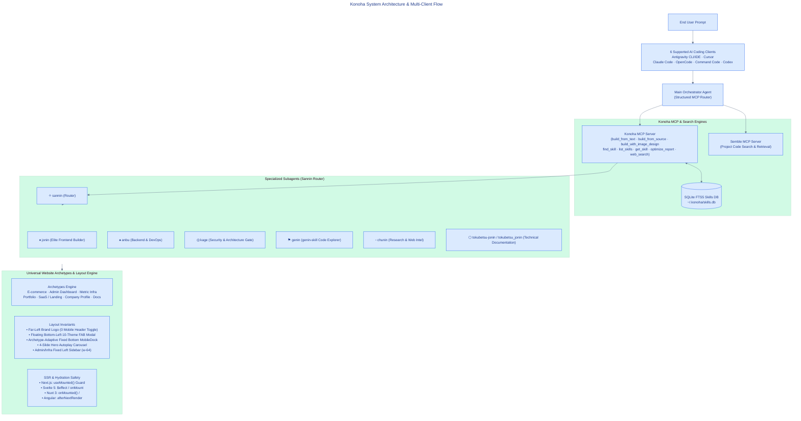

# ⚙️ How It Works: System Architecture & Multi-Archetype Engine

## Architecture

> **Canonical editable diagram:** [01 System Architecture](diagrams/konoha-architecture.drawio) · [Diagram manifest](diagrams/README.md).

```mermaid
---
title: Konoha System Architecture & Multi-Client Flow
config:
  theme: base
  themeVariables:
    background: '#ffffff'
    primaryColor: '#dbeafe'
    primaryTextColor: '#1e3a8a'
    primaryBorderColor: '#2563eb'
    lineColor: '#64748b'
    secondaryColor: '#ede9fe'
    tertiaryColor: '#d1fae5'
    fontFamily: 'Inter, system-ui, sans-serif'
    fontSize: '14px'
  flowchart:
    nodeSpacing: 45
    rankSpacing: 55
    padding: 24
    wrappingWidth: 380
---
flowchart TB
    User["End User Prompt"] --> Clients["6 Supported AI Coding Clients<br/>Antigravity CLI/IDE · Cursor<br/>Claude Code · OpenCode · Command Code · Codex"]
    Clients --> Orchestrator["Main Orchestrator Agent<br/>(Structured MCP Router)"]

    subgraph CoreMCP ["Konoha MCP & Search Engines"]
        KonohaMCP["Konoha MCP Server<br/>(build_from_text · build_from_source · build_with_image_design<br/>find_skill · list_skills · get_skill · optimize_report · web_search)"]
        SembleMCP["Semble MCP Server<br/>(Project Code Search & Retrieval)"]
        SQLiteDB[("SQLite FTS5 Skills DB<br/>~/.konoha/skills.db")]
        KonohaMCP <--> SQLiteDB
    end

    subgraph Specialists ["Specialized Subagents (Sannin Router)"]
        Sannin["✧ sannin (Router)"]
        Jonin["♦ jonin (Elite Frontend Builder)"]
        Anbu["♠ anbu (Backend & DevOps)"]
        Kage["◎ kage (Security & Architecture Gate)"]
        Genin["⚑ genin (genin-skill Code Explorer)"]
        Chunin["▫ chunin (Research & Web Intel)"]
        Tokubetsu["⬡ tokubetsu-jonin / tokubetsu_jonin (Technical Documentation)"]
    end

    subgraph UniversalInvariants ["Universal Website Archetypes & Layout Engine"]
        Archetypes["Archetypes Engine<br/>E-commerce · Admin Dashboard · Metric Infra<br/>Portfolio · SaaS / Landing · Company Profile · Docs"]
        Invariants["Layout Invariants<br/>• Far-Left Brand Logo (0 Mobile Header Toggle)<br/>• Floating Bottom-Left 10-Theme FAB Modal<br/>• Archetype-Adaptive Fixed Bottom MobileDock<br/>• 4-Slide Hero Autoplay Carousel<br/>• Admin/Infra Fixed Left Sidebar (w-64)"]
        SSRSafety["SSR & Hydration Safety<br/>• Next.js: useMounted() Guard<br/>• Svelte 5: $effect / onMount<br/>• Nuxt 3: onMounted() / <ClientOnly><br/>• Angular: afterNextRender"]
    end

    Orchestrator --> KonohaMCP
    Orchestrator --> SembleMCP
    KonohaMCP --> Sannin
    Sannin --> Specialists
    Specialists --> UniversalInvariants
```

---

## 🛠️ Canonical Konoha MCP Tools Matrix

| Tool Category | Registered Tools | Description |
| :--- | :--- | :--- |
| **Skill Discovery & Loading** | `find_skill`, `list_skills`, `get_skill`, `optimize_report` | High-speed FTS5 SQLite skill querying and token-efficient skill ingestion. |
| **Autonomous Website Builders** | `build_from_text`, `build_from_source`, `build_with_image_design` | Side-effect-free structured specifications for multi-archetype website generation. |
| **Intel & Web Search** | `web_search` | Real-time web evidence gathering and documentation lookups. |
| **Specialist Delegation Subagents** | `sannin`, `kage`, `jonin`, `anbu`, `chunin`, `tokubetsu_jonin` (or `tokubetsu-jonin`), `genin` | In-line direct subagent delegation for specialized frontend, backend, security, and doc tasks. |
| **Bounded File Operations** | `read_file_head`, `read_file_range`, `file_info`, `token_efficient_grep`, `get_file_structure`, `find_files_clean` | Bounded token-safe file inspections preventing context window pollution. |

---

## 🏗️ Multi-Archetype Website Builder Specifications

Konoha features an autonomous multi-archetype generator (`konoha.build_from_text` and `konoha.build_from_source`) that crafts production-grade applications across 4 major frameworks:

1. **Next.js 16 (React 19, Tailwind CSS v4)**
2. **SvelteKit 2 (Svelte 5 Runes, Tailwind CSS)**
3. **Nuxt 3 (Vue 3 Composition API, Tailwind CSS)**
4. **Angular v19+ (Standalone Components, Signals)**

### 📐 Archetype Directory Matrix

| Archetype | Key Structural Invariants | Target Scenarios |
| :--- | :--- | :--- |
| **Admin & Infra Dashboard** | Fixed Left Sidebar (`w-64`) on desktop + Top Header bar + Bottom MobileDock | Cloud monitoring, K8s cluster management, user management, metrics telemetry |
| **Portfolio / Personal** | Far-left logo sticky header + Projects Bento grid + Skills matrix + Contact form | Software engineers, cloud architects, designers, consultants |
| **SaaS & Landing Page** | High-impact hero + Bento features + Monthly/Annual pricing switcher + Testimonials | SaaS startups, developer tools, waitlists, app launches |
| **Company Profile** | Mission hero carousel + Team leadership grid + Services tabs + Office locations | Corporate businesses, digital agencies, consulting firms |
| **E-Commerce** | 4-slide 3D hero carousel + 50-item catalog + Faceted filters + Slide-over cart drawer | Retail storefronts, brand merchandise, digital product stores |
| **Documentation** | 3-column layout (Left Sidebar Nav, Center Markdown Content, Right TOC) | Open-source libraries, API specifications, technical handbooks |

---

## 🛡️ Quality & Verification Gates

1. **Kage Reviewer 90% Minimum Confidence Gate**:
   - Every task is reviewed by `kage` for structural integrity, zero hallucination, and security compliance.
2. **Zero Errors & Zero Warnings**:
   - Validation requires `pnpm run build`, `pnpm run lint`, and `pnpm run check` to complete with 0 errors and 0 warnings.
3. **Auto-Compaction & Memory Continuity**:
   - High-Efficiency Auto-Compaction preserves token quota across multi-turn sessions.
