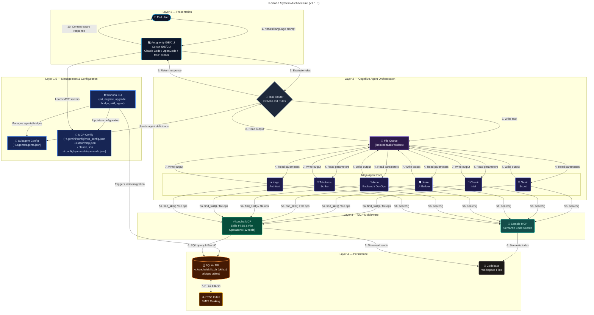
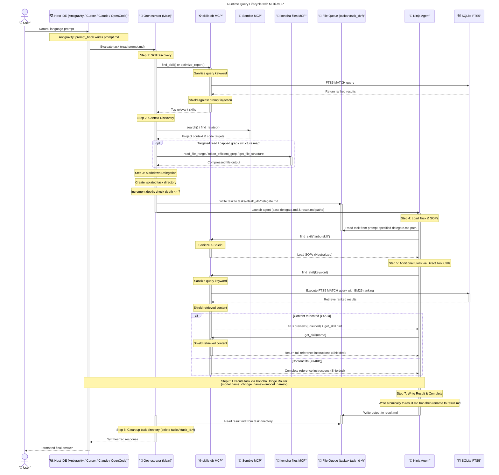

# ⚙️ How It Works

## Architecture

```mermaid
---
title: Konoha System Architecture (v1.1.6)
---
flowchart TB
    %% ── Style Definitions ──────────────────────────────────────
    classDef userNode fill:#0f172a,stroke:#38bdf8,stroke-width:2px,color:#f8fafc;
    classDef ideNode fill:#0f172a,stroke:#38bdf8,stroke-width:2px,color:#f8fafc;
    classDef routerNode fill:#1e293b,stroke:#94a3b8,stroke-width:2px,color:#e2e8f0;
    classDef agentNode fill:#1e1b4b,stroke:#818cf8,stroke-width:2px,color:#e0e7ff;
    classDef mcpNode fill:#064e3b,stroke:#34d399,stroke-width:2px,color:#ecfdf5;
    classDef sembleNode fill:#134e4a,stroke:#2dd4bf,stroke-width:2px,color:#ccfbf1;
    classDef dbNode fill:#451a03,stroke:#fb923c,stroke-width:2px,color:#fff7ed;
    classDef ftsNode fill:#451a03,stroke:#fbbf24,stroke-width:2px,color:#fff7ed;
    classDef codeNode fill:#1c1917,stroke:#a8a29e,stroke-width:2px,color:#e7e5e4;
    classDef mgmtNode fill:#172554,stroke:#3b82f6,stroke-width:2px,color:#dbeafe;
    classDef queueNode fill:#2d1a4a,stroke:#a78bfa,stroke-width:2px,color:#f5f3ff;

    %% ── Layer 1: Presentation ──────────────────────────────────
    subgraph L1 ["Layer 1 — Presentation"]
        direction LR
        User(["👤 End User"])
        IDE("💻 Antigravity IDE/CLI<br>Cursor IDE/CLI<br>Claude Code / OpenCode / MCP clients")
    end

    %% ── Layer 1.5: Management & Configuration ──────────────────
    subgraph LM ["Layer 1.5 — Management & Configuration"]
        CLI["🛠️ Konoha CLI<br>(init, migrate, upgrade, bridge, skill, agent)"]
        AgentConfig["📄 Subagent Config<br>(~/.agents/agents.json)"]
        MCPConfig["📄 MCP Config<br>(~/.gemini/config/mcp_config.json<br>~/.cursor/mcp.json<br>~/.claude.json<br>~/.config/opencode/opencode.json)"]
    end

    %% ── Layer 2: Cognitive Agent Orchestration ─────────────────
    subgraph L2 ["Layer 2 — Cognitive Agent Orchestration"]
        Router{"🔀 Task Router<br>GEMINI.md Rules"}
        Queue["📂 File Queue<br>(isolated tasks/<task_id> folders)"]

        subgraph AgentPool ["Ninja Agent Pool"]
            direction LR
            Genin("🍃 Genin<br>Scout")
            Chunin("📜 Chunin<br>Intel")
            Jonin("🛡️ Jonin<br>UI Builder")
            Anbu("👥 Anbu<br>Backend / DevOps")
            Tokubetsu("🎯 Tokubetsu<br>Scribe")
            Kage("🌀 Kage<br>Architect")
        end
    end

    %% ── Layer 3: MCP Middleware ────────────────────────────────
    subgraph L3 ["Layer 3 — MCP Middleware"]
        direction LR
        KonohaMCP("⚡ konoha MCP<br>Skills FTS5 & File Operations (12 tools)")
        Semble("🔮 Semble MCP<br>Semantic Code Search")
    end

    %% ── Layer 4: Persistence ──────────────────────────────────
    subgraph L4 ["Layer 4 — Persistence"]
        direction LR
        DB[("🗄️ SQLite DB<br/>~/.konoha/skills.db (skills & bridges tables)")]
        FTS5("🔍 FTS5 Index<br>BM25 Ranking")
        Codebase("📂 Codebase<br>Workspace Files")
    end

    %% ── Data Flow ──────────────────────────────────────────────
    User -->|"1. Natural language prompt"| IDE
    IDE -->|"2. Evaluate rules"| Router

    %% CLI and Configuration flow
    CLI -->|"Updates configuration"| MCPConfig
    CLI -->|"Manages agents/bridges"| AgentConfig
    CLI -->|"Triggers index/migration"| DB
    IDE -->|"Loads MCP servers"| MCPConfig
    Router -->|"Reads agent definitions"| AgentConfig

    Router -->|"3. Write task"| Queue
    Queue -->|"4. Read parameters"| Genin
    Queue -->|"4. Read parameters"| Chunin
    Queue -->|"4. Read parameters"| Jonin
    Queue -->|"4. Read parameters"| Anbu
    Queue -->|"4. Read parameters"| Tokubetsu
    Queue -->|"4. Read parameters"| Kage

    Genin -->|"5a. find_skill() / file ops"| KonohaMCP
    Chunin -->|"5a. find_skill() / file ops"| KonohaMCP
    Jonin -->|"5a. find_skill() / file ops"| KonohaMCP
    Anbu -->|"5a. find_skill() / file ops"| KonohaMCP
    Tokubetsu -->|"5a. find_skill() / file ops"| KonohaMCP
    Kage -->|"5a. find_skill() / file ops"| KonohaMCP

    Genin -->|"5b. search()"| Semble
    Chunin -->|"5b. search()"| Semble
    Jonin -->|"5b. search()"| Semble
    Anbu -->|"5b. search()"| Semble
    Tokubetsu -->|"5b. search()"| Semble
    Kage -->|"5b. search()"| Semble

    KonohaMCP -->|"6. SQL query & File I/O"| DB
    DB <-->|"7. FTS5 search"| FTS5
    Semble -->|"6. Semantic index"| Codebase
    KonohaMCP -->|"6. Streamed reads"| Codebase

    Genin -->|"7. Write output"| Queue
    Chunin -->|"7. Write output"| Queue
    Jonin -->|"7. Write output"| Queue
    Anbu -->|"7. Write output"| Queue
    Tokubetsu -->|"7. Write output"| Queue
    Kage -->|"7. Write output"| Queue
    Queue -->|"8. Read output"| Router
    Router -->|"9. Return response"| IDE
    IDE -->|"10. Context-aware response"| User

    %% ── Layout Alignment ──────────────────────────────────────
    IDE ~~~ KonohaMCP

    %% ── Apply Styles ──────────────────────────────────────────
    class User userNode
    class IDE ideNode
    class Router routerNode
    class Queue queueNode
    class Genin,Chunin,Jonin,Anbu,Tokubetsu,Kage agentNode
    class KonohaMCP mcpNode
    class Semble sembleNode
    class DB dbNode
    class FTS5 ftsNode
    class Codebase codeNode
    class CLI,AgentConfig,MCPConfig mgmtNode
```

> **Legend** — 🔵 Presentation (host IDE) &nbsp;|&nbsp; ⚫ Orchestration &nbsp;|&nbsp; 🟣 Agents &nbsp;|&nbsp; 🟢 konoha MCP &nbsp;|&nbsp; 🩵 Semble MCP &nbsp;|&nbsp; 🟠 Persistence
>
> In version 1.1.6, Konoha implements SQLite database storage for bridges (`~/.konoha/skills.db`) and automated installation of the `konoha-bridge` extension into Antigravity IDE and VS Code.

## Query Lifecycle

```mermaid
---
title: Runtime Query Lifecycle with Multi-MCP
---
sequenceDiagram
    actor User as "👤 User"
    participant IDE as "💻 Host IDE (Antigravity / Cursor / Claude / OpenCode)"
    participant Router as "🔀 Orchestrator (Main)"
    participant SkillsDB as "⚙️ skills-db MCP"
    participant Semble as "🔮 Semble MCP"
    participant KonohaFiles as "📁 konoha-files MCP"
    participant Queue as "📂 File Queue (tasks/<task_id>/)"
    participant Agent as "🥷 Ninja Agent"
    participant DB as "🗄️ SQLite FTS5"

    User->>IDE: Natural language prompt
    activate IDE
    Note over IDE: Antigravity: prompt_hook writes prompt.md
    IDE->>Router: Evaluate task (read prompt.md)
    activate Router

    %% --- Skill Discovery Phase ---
    Note over Router: Step 1: Skill Discovery
    Router->>SkillsDB: find_skill() or optimize_report()
    activate SkillsDB
    Note over SkillsDB: Sanitize query keyword
    SkillsDB->>DB: FTS5 MATCH query
    DB-->>SkillsDB: Return ranked results
    Note over SkillsDB: Shield against prompt injection
    SkillsDB-->>Router: Top relevant skills
    deactivate SkillsDB

    %% --- Context Discovery ---
    Note over Router: Step 2: Context Discovery
    Router->>Semble: search() / find_related()
    activate Semble
    Semble-->>Router: Project context & code targets
    deactivate Semble

    opt Targeted read / capped grep / structure map
        Router->>KonohaFiles: read_file_range / token_efficient_grep / get_file_structure
        activate KonohaFiles
        KonohaFiles-->>Router: Compressed file output
        deactivate KonohaFiles
    end

    %% --- Routing Phase ---
    Note over Router: Step 3: Markdown Delegation
    Note over Router: Create isolated task directory
    Note over Router: Increment depth: check depth <= 7
    Router->>Queue: Write task to tasks/<task_id>/delegate.md
    activate Queue
    Router->>Agent: Launch agent (pass delegate.md & result.md paths)
    deactivate Router
    activate Agent

    %% --- Agent Execution Phase ---
    Note over Agent: Step 4: Load Task & SOPs
    Agent->>Queue: Read task from prompt-specified delegate.md path
    deactivate Queue
    Agent->>SkillsDB: find_skill("anbu-skill")
    activate SkillsDB
    Note over SkillsDB: Sanitize & Shield
    SkillsDB-->>Agent: Load SOPs (Neutralized)
    deactivate SkillsDB

    %% --- Skills-DB Search Phase ---
    Note over Agent: Step 5: Additional Skills via Direct Tool Calls
    Agent->>SkillsDB: find_skill(keyword)
    activate SkillsDB
    Note over SkillsDB: Sanitize query keyword
    SkillsDB->>DB: Execute FTS5 MATCH query with BM25 ranking
    activate DB
    DB-->>SkillsDB: Retrieve ranked results
    deactivate DB
    Note over SkillsDB: Shield retrieved content

    alt Content truncated (>4KB)
        SkillsDB-->>Agent: 4KB preview (Shielded) + get_skill hint
        Agent->>SkillsDB: get_skill(name)
        activate SkillsDB
        Note over SkillsDB: Shield retrieved content
        SkillsDB-->>Agent: Return full reference instructions (Shielded)
        deactivate SkillsDB
    else Content fits (<=4KB)
        SkillsDB-->>Agent: Complete reference instructions (Shielded)
    end
    deactivate SkillsDB

    Note over Agent,IDE: Step 6: Execute task via Konoha Bridge Router<br>(model name: <bridge_name>-<model_name>)

    %% --- Response Phase ---
    Note over Agent: Step 7: Write Result & Complete
    Note over Agent: Write atomically to result.md.tmp then rename to result.md
    Agent->>Queue: Write output to result.md
    activate Queue
    deactivate Agent
    activate Router
    Router->>Queue: Read result.md from task directory
    deactivate Queue
    Note over Router: Step 8: Clean up task directory (delete tasks/<task_id>/)
    Router-->>IDE: Synthesized response
    deactivate Router
    IDE-->>User: Formatted final answer
    deactivate IDE
```
