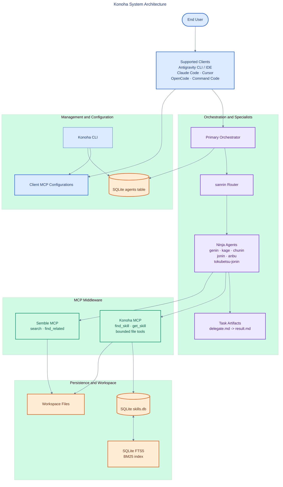
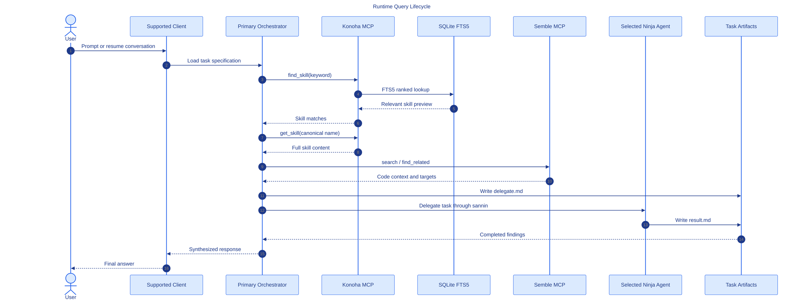
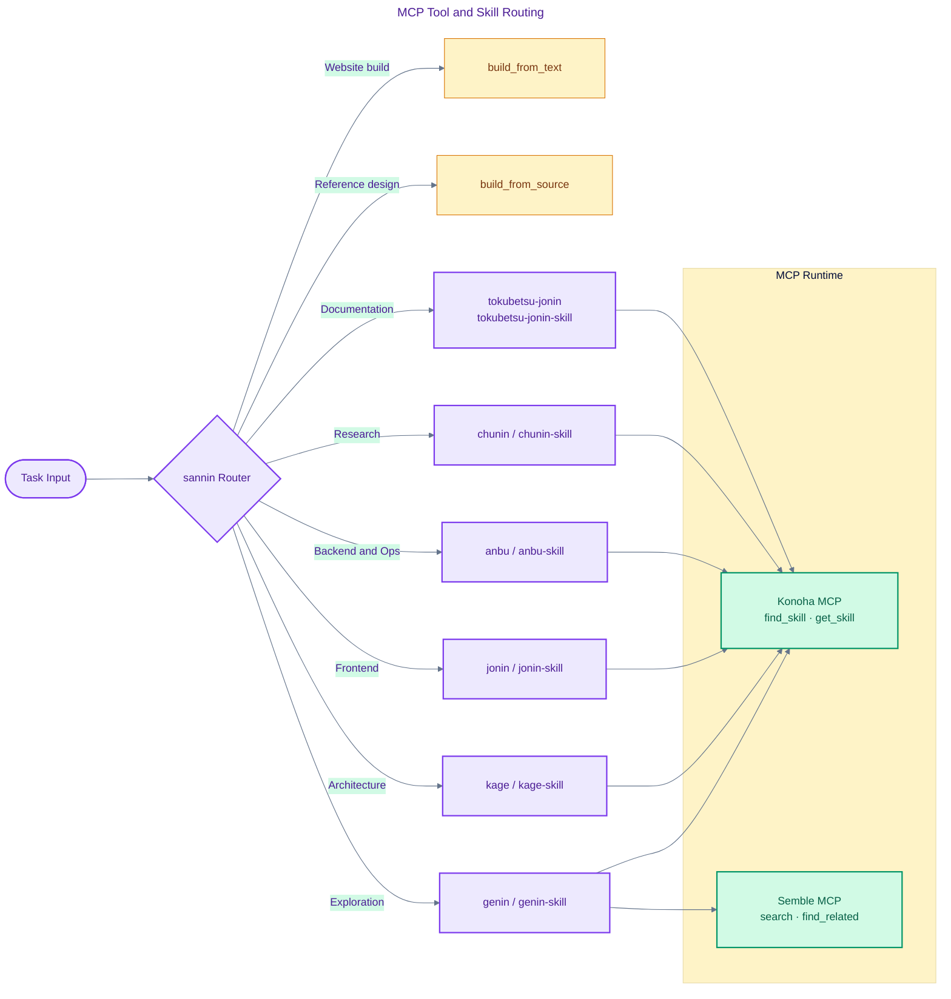

# ⚙️ How It Works

## Architecture

> **Canonical editable diagram:** [01 System Architecture](diagrams/konoha-architecture.drawio) · [Diagram manifest](diagrams/README.md). Draw.io owns editable geometry; this Mermaid view keeps the same semantic architecture in Markdown.

```mermaid
---
title: Konoha System Architecture
config:
  theme: base
  themeVariables:
    background: '#ffffff'
    primaryColor: '#dbeafe'
    primaryTextColor: '#1e3a8a'
    primaryBorderColor: '#2563eb'
    lineColor: '#64748b'
    secondaryColor: '#ede9fe'
    tertiaryColor: '#d1fae5'
    fontFamily: 'Inter, ui-sans-serif, system-ui, sans-serif'
  flowchart:
    nodeSpacing: 90
    rankSpacing: 110
    padding: 32
    wrappingWidth: 360
---
flowchart TB
    User([End User]) --> Client[Supported Clients<br/>Antigravity CLI / IDE<br/>Claude Code · Cursor<br/>OpenCode · Command Code]
    Client --> Orchestrator[Primary Orchestrator]

    subgraph Management["Management and Configuration"]
        CLI[Konoha CLI]
        Config[Client MCP Configurations]
        Agents[(SQLite agents table)]
        CLI --> Config
        CLI --> Agents
    end

    subgraph Routing["Orchestration and Specialists"]
        Sannin[sannin Router]
        Ninja["Ninja Agents<br/>genin · kage · chunin<br/>jonin · anbu<br/>tokubetsu-jonin"]
        Artifacts["Task Artifacts<br/>delegate.md -> result.md"]
        Orchestrator --> Sannin --> Ninja --> Artifacts
    end

    subgraph Middleware["MCP Middleware"]
        Konoha[Konoha MCP<br/>find_skill · get_skill<br/>bounded file tools]
        Semble[Semble MCP<br/>search · find_related]
    end

    subgraph Persistence["Persistence and Workspace"]
        DB[(SQLite skills.db)]
        FTS[SQLite FTS5<br/>BM25 index]
        Codebase[Workspace Files]
        DB <--> FTS
    end

    Client --> Config
    Orchestrator --> Agents
    Ninja --> Konoha
    Ninja --> Semble
    Konoha --> DB
    Konoha --> Codebase
    Semble --> Codebase

    classDef client fill:#dbeafe,stroke:#2563eb,color:#1e3a8a,stroke-width:2px
    classDef orchestration fill:#ede9fe,stroke:#7c3aed,color:#4c1d95,stroke-width:2px
    classDef mcp fill:#d1fae5,stroke:#059669,color:#065f46,stroke-width:2px
    classDef persistence fill:#ffedd5,stroke:#ea580c,color:#7c2d12,stroke-width:2px
    class User,Client,Config client
    class Orchestrator,Sannin,Ninja,Artifacts orchestration
    class Konoha,Semble mcp
    class DB,FTS,Codebase,Agents persistence
```

> **Legend** — 🔵 Presentation (Antigravity CLI/IDE, Claude Code, Cursor, OpenCode, Command Code) &nbsp;|&nbsp; ⚫ Orchestration &nbsp;|&nbsp; 🟣 Skill references &nbsp;|&nbsp; 🟢 konoha MCP &nbsp;|&nbsp; 🩵 Semble MCP &nbsp;|&nbsp; 🟠 Persistence
>
> In v2.0.0, Konoha supports **five client families** (Antigravity CLI/IDE, Cursor, Claude Code, OpenCode, and Command Code). All detected clients share the same MCP stack (`konoha` + `semble`) and seven ninja subagents, with client-specific config auto-deployed on `konoha init`. SQLite FTS5 stores skills, agents, bridges, tool telemetry, and active sessions in `~/.konoha/skills.db`.
>
> **Orchestration model:** The orchestrator runs as the primary thread and coordinates tasks by delegating to specialized konoha subagents. All subagent delegation goes through the `sannin` (Village Elder) MCP tool, which intelligently routes tasks to backend MCP agents (e.g. `kage`, `jonin`). Custom IDE-native agents and hook-based translations are no longer used.

## Query Lifecycle

> **Canonical editable diagram:** [02 Runtime Query Lifecycle](diagrams/konoha-architecture.drawio) · [Diagram manifest](diagrams/README.md). The lifecycle separates the primary orchestrator, `sannin`, selected ninja agent, Konoha MCP, and Semble MCP.

```mermaid
---
title: Runtime Query Lifecycle
config:
  theme: base
  themeVariables:
    background: '#ffffff'
    primaryColor: '#dbeafe'
    primaryTextColor: '#1e3a8a'
    primaryBorderColor: '#2563eb'
    lineColor: '#64748b'
    fontFamily: 'Inter, ui-sans-serif, system-ui, sans-serif'
  sequence:
    useMaxWidth: false
    wrap: true
    width: 220
    height: 60
    actorMargin: 70
    messageMargin: 45
---
sequenceDiagram
    autonumber
    actor User
    participant Client as Supported Client
    participant Orchestrator as Primary Orchestrator
    participant Konoha as Konoha MCP
    participant DB as SQLite FTS5
    participant Semble as Semble MCP
    participant Agent as Selected Ninja Agent
    participant Task as Task Artifacts

    User->>Client: Prompt or resume conversation
    Client->>Orchestrator: Load task specification
    Orchestrator->>Konoha: find_skill(keyword)
    Konoha->>DB: FTS5 ranked lookup
    DB-->>Konoha: Relevant skill preview
    Konoha-->>Orchestrator: Skill matches
    Orchestrator->>Konoha: get_skill(canonical name)
    Konoha-->>Orchestrator: Full skill content
    Orchestrator->>Semble: search / find_related
    Semble-->>Orchestrator: Code context and targets
    Orchestrator->>Task: Write delegate.md
    Orchestrator->>Agent: Delegate task through sannin
    Agent->>Task: Write result.md
    Task-->>Orchestrator: Completed findings
    Orchestrator-->>Client: Synthesized response
    Client-->>User: Final answer
```

## Forced MCP Usage & Delegation Policy

**ABSOLUTE RULE:** All non-trivial work MUST go through the **konoha MCP** and **semble MCP** tools — never execute tasks solo, never bypass the agent delegation workflow.

- **Skill discovery**: Always via `konoha` MCP (`find_skill`, `get_skill`, `list_skills`, `optimize_report`). Never use `semble` for skills.
- **Codebase search**: Always via `semble` MCP (`search`, `find_related`). Never use `grep`, `rg`, `find`, `glob`, or generic `Read`/`Grep` tools for code discovery.
- **Conversation Resume / Multi-Turn Protocol**: Upon resuming a conversation or in multi-turn interactions, you MUST NOT forget your constraints. ALWAYS re-execute the `mcp_<agentname>` delegation workflow via the `konoha` MCP. ALWAYS use the `semble` MCP for code search, and ALWAYS adhere to the RTK (Rust Token Killer) principles. Do not bypass these tools just because you are in a resumed session.
- **File reads & builds**: Always via `konoha` MCP (`read_file_head`, `read_file_range`, `file_info`, `token_efficient_grep`, `get_file_structure`, `find_files_clean`, `build_with_image_design`, `build_from_source`, `build_from_text`, `web_search`). Use Semble MCP (`search`, `find_related`) for code discovery. Never use shell `cat`/`head`/`tail`/`less` or generic Read/Grep tools.
- **Non-trivial delegation**: Any task that requires code changes, multi-step planning, or specialized expertise MUST be delegated to a konoha subagent by calling their official MCP tool:
  - `genin` (`@genin`) — codebase search, tracing codepaths, read-only exploration
  - `kage` (`@kage`) — architecture decisions, security review, deep analysis, risk assessment, diagrams (`drawio`, `mermaid`)
  - `chunin` (`@chunin`) — web research (`web_search`), documentation synthesis, citation-backed recommendations
  - `jonin` (`@jonin`) — UI/frontend development (SvelteKit, Next.js, Tailwind), design match (`build_from_source`, `build_from_text`)
  - `anbu` (`@anbu`) — backend dev, bug fixing, DevOps, infrastructure, messaging/caching (`kafka`, `redis`, `nginx`), cyber defense, prompt engineering
  - `tokubetsu_jonin` (`@tokubetsu-jonin`) — technical writing, documentation, API specs, PDF reports (`pdf`), postmortems/RCA (`postmortem-writer`), technical articles (`technical-article-writer`)

**The main orchestrator MUST NOT execute implementation tasks itself — it only coordinates and delegates.** The only exception is simple/trivial tasks (single read/edit on a known file) which may be executed directly.

## Recent Architectural Improvements

### 1. 1GB Node.js `spawnSync` Memory Buffer
To prevent `ENOBUFS` errors when delegating to subagents (like `jonin`) with massive payloads (e.g., 10,000+ line architecture rules), the `maxBuffer` across all MCP tool `spawnSync` executions in `file_tools_router.js` was permanently increased from 16MB/64MB to **1GB**.

### 2. Direct Semble Code Search
Code discovery is delegated directly to the Semble MCP server through its `search` and `find_related` tools. Konoha does not expose a duplicate semantic-search wrapper; its file-tools MCP is reserved for bounded reads, metadata, structure, and capped text matching.

### 3. Cross-Platform Install Support (v2.0.0+)
- **Node.js version-agnostic**: Konoha works across supported Node.js versions (v18+); project package operations use `pnpm`.
- **Python detection**: `platform_utils.js` detects Python on Windows (`py -3`, `python`), macOS (`python3`, `python`), and Linux (`python3`, `python`).
- **Path handling**: All paths use `path.join()` and `path.normalize()` for cross-platform compatibility.
- **nvm support**: Works with nvm on Linux, macOS, and Windows (nvm-windows).
- **Cross-platform launchers**: `file_tools_launcher.js` and `file_tools_router.js` use `platform_utils.js` for all OS-specific operations.

### 4. MCP Alias Architecture
Subagents (`kage`, `jonin`, `anbu`, `chunin`, `tokubetsu_jonin`, `genin`) are now inline persona-injection aliases served by the konoha MCP server. When called, they return the agent's persona, system prompt, and embedded skills as tool response text — the orchestrator then roleplays as that agent in the current thread. No real background subagents are spawned.

## 🛡️ MCP Tooling & Agent Skill Routing Architecture

> **Canonical editable diagram:** [03 MCP Tool and Skill Routing](diagrams/konoha-architecture.drawio) · [Diagram manifest](diagrams/README.md).

```mermaid
---
title: MCP Tool and Skill Routing
config:
  theme: base
  themeVariables:
    background: '#ffffff'
    primaryColor: '#ede9fe'
    primaryTextColor: '#4c1d95'
    primaryBorderColor: '#7c3aed'
    lineColor: '#64748b'
    secondaryColor: '#d1fae5'
    tertiaryColor: '#fef3c7'
    fontFamily: 'Inter, ui-sans-serif, system-ui, sans-serif'
  flowchart:
    nodeSpacing: 85
    rankSpacing: 100
    padding: 32
    wrappingWidth: 360
---
flowchart LR
    Prompt([Task Input]) --> Sannin{sannin Router}
    Sannin -->|Website build| BuildText[build_from_text]
    Sannin -->|Reference design| BuildSource[build_from_source]
    Sannin -->|Exploration| Genin[genin / genin-skill]
    Sannin -->|Architecture| Kage[kage / kage-skill]
    Sannin -->|Frontend| Jonin[jonin / jonin-skill]
    Sannin -->|Backend and Ops| Anbu[anbu / anbu-skill]
    Sannin -->|Research| Chunin[chunin / chunin-skill]
    Sannin -->|Documentation| Toku[tokubetsu-jonin<br/>tokubetsu-jonin-skill]

    subgraph Runtime["MCP Runtime"]
        Konoha[Konoha MCP<br/>find_skill · get_skill]
        Semble[Semble MCP<br/>search · find_related]
    end

    Genin --> Konoha
    Genin --> Semble
    Kage --> Konoha
    Jonin --> Konoha
    Anbu --> Konoha
    Chunin --> Konoha
    Toku --> Konoha

    classDef route fill:#ede9fe,stroke:#7c3aed,color:#4c1d95,stroke-width:2px
    classDef build fill:#fef3c7,stroke:#d97706,color:#78350f
    classDef mcp fill:#d1fae5,stroke:#059669,color:#065f46,stroke-width:2px
    class Prompt,Sannin route
    class Genin,Kage,Jonin,Anbu,Chunin,Toku route
    class BuildText,BuildSource build
    class Konoha,Semble mcp
```

### System Health & Buffer Specifications
- **Node.js `maxBuffer`**: 1GB (`1024 * 1024 * 1024`) across all router process spawns (`file_tools_router.js`) to accommodate massive prompt payloads.
- **Port 19999 Bridge Gateway**: Local HTTP proxy gateway running on port 19999 for local model orchestration. Port collisions resolved via `fuser -k 19999/tcp`.
- **Full E2E MCP Test Suite**: 21/21 exported MCP tools verified via `tests/test_mcp_e2e.js`.

## Konoha Design System

Konoha implements a unified, premium design system across all supported web frameworks (Next.js, SvelteKit, Nuxt, Angular).

### Architecture
- **Exclusive Entry Point**: The design system directives are injected *exclusively* via the `build_from_text` MCP tool in `src/server.py`. (They are not used in `build_from_source`, which relies on pixel-perfect matching of user-provided mockups).
- **Design Token Manifest**: Common CSS variables (`--color-bg`, `--color-accent`, etc.) and typography (DM Sans, Roboto) ensure a consistent, premium feel.
- **Framework Skill References**: Each framework has a dedicated markdown reference file in `.agents/skills/jonin-skill/references/` detailing its specific implementation of the design system components (e.g., `nextjs-ui-expert.md`, `svelte-ui-expert.md`).
- **Mandatory Preserved Components**: Every generated application includes non-negotiable features:
  1. **10-Theme Switcher**: Fixed bottom-left popup with 10 gradient Light Mode themes.
  2. **Sticky Mobile Bottom Dock**: The sole navigation paradigm for mobile devices (no hamburger menus), featuring active accent indicators.
