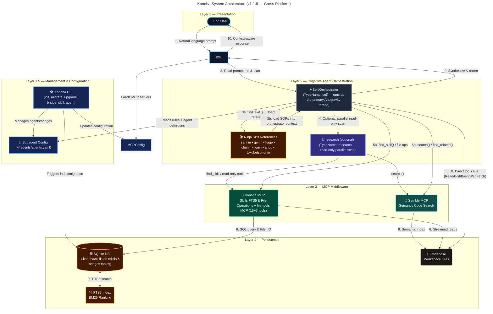
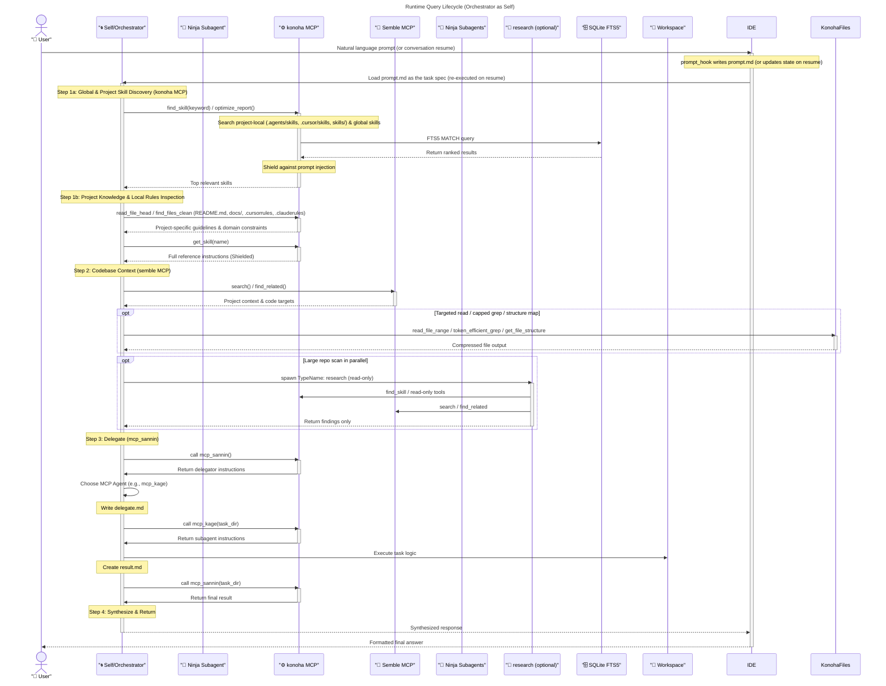

# ⚙️ How It Works

## Architecture

```mermaid
---
title: Konoha System Architecture (v1.1.8 — Cross-Platform)
---
flowchart TB
    %% ── Style Definitions ──────────────────────────────────────
    classDef userNode fill:#0f172a,stroke:#38bdf8,stroke-width:2px,color:#f8fafc;
    classDef ideNode fill:#0f172a,stroke:#38bdf8,stroke-width:2px,color:#f8fafc;
    classDef routerNode fill:#1e293b,stroke:#94a3b8,stroke-width:2px,color:#e2e8f0;
    classDef orchestratorNode fill:#1e1b4b,stroke:#818cf8,stroke-width:2px,color:#e0e7ff;
    classDef researchNode fill:#312e81,stroke:#a5b4fc,stroke-width:2px,color:#e0e7ff;
    classDef mcpNode fill:#064e3b,stroke:#34d399,stroke-width:2px,color:#ecfdf5;
    classDef sembleNode fill:#134e4a,stroke:#2dd4bf,stroke-width:2px,color:#ccfbf1;
    classDef dbNode fill:#451a03,stroke:#fb923c,stroke-width:2px,color:#fff7ed;
    classDef ftsNode fill:#451a03,stroke:#fbbf24,stroke-width:2px,color:#fff7ed;
    classDef codeNode fill:#1c1917,stroke:#a8a29e,stroke-width:2px,color:#e7e5e4;
    classDef mgmtNode fill:#172554,stroke:#3b82f6,stroke-width:2px,color:#dbeafe;
    classDef skillNode fill:#451a03,stroke:#fbbf24,stroke-width:2px,color:#fff7ed;

    %% ── Layer 1: Presentation ──────────────────────────────────
    subgraph L1 ["Layer 1 — Presentation"]
        direction LR
        User(["👤 End User"])
    end

    %% ── Layer 1.5: Management & Configuration ─────────────────
    subgraph LM ["Layer 1.5 — Management & Configuration"]
        CLI["🛠️ Konoha CLI<br>(init, migrate, upgrade, bridge, skill, agent)"]
        AgentConfig["📄 Subagent Config<br>(~/.agents/agents.yaml)"]
    end

    %% ── Layer 2: Cognitive Agent Orchestration ─────────────────
    subgraph L2 ["Layer 2 — Cognitive Agent Orchestration"]
        Orchestrator["🌀 Self/Orchestrator<br>(TypeName: self — runs as the primary Antigravity thread)"]
        SkillRefs["📚 Ninja Skill References<br>sannin • genin • kage • chunin • jonin • anbu • tokubetsu-jonin"]
        Research["🔬 research (optional)<br>(TypeName: research — read-only parallel scan)"]
    end

    %% ── Layer 3: MCP Middleware ────────────────────────────────
    subgraph L3 ["Layer 3 — MCP Middleware"]
        direction LR
        KonohaMCP("⚡ konoha MCP<br>Skills FTS5 & File Operations + file-tools MCP (15+7 tools)")
        Semble("🔮 Semble MCP<br>Semantic Code Search")
    end

    %% ── Layer 4: Persistence ──────────────────────────────────
    subgraph L4 ["Layer 4 — Persistence"]
        direction LR
        DB[("🗄️ SQLite DB<br/>~/.konoha/skills.db (skills & bridges tables)")]
        FTS5("🔍 FTS5 Index<br>BM25 Ranking")
        Codebase("📂 Codebase<br>Workspace Files")
    end

    %% ── Data Flow ──────────────────────────────────────────────
    User -->|"1. Natural language prompt"| IDE
    IDE -->|"2. Read prompt.md & plan"| Orchestrator

    %% CLI and Configuration flow
    CLI -->|"Updates configuration"| MCPConfig
    CLI -->|"Manages agents/bridges"| AgentConfig
    CLI -->|"Triggers index/migration"| DB
    IDE -->|"Loads MCP servers"| MCPConfig
    Orchestrator -->|"Reads rules + agent definitions"| AgentConfig

    Orchestrator -->|"3a. find_skill() → load reference"| SkillRefs
    SkillRefs -->|"3b. load SOPs into orchestrator context"| Orchestrator

    Orchestrator -.->|"4. Optional: parallel read-only scan"| Research
    Research -->|"find_skill / read-only tools"| KonohaMCP
    Research -->|"search()"| Semble

    Orchestrator -->|"5a. find_skill() / file ops"| KonohaMCP
    Orchestrator -->|"5b. search() / find_related()"| Semble

    KonohaMCP -->|"6. SQL query & File I/O"| DB
    DB <-->|"7. FTS5 search"| FTS5
    Semble -->|"6. Semantic index"| Codebase
    KonohaMCP -->|"6. Streamed reads"| Codebase

    Orchestrator -->|"8. Direct tool calls (Read/Edit/Bash/WebFetch)"| Codebase
    Orchestrator -->|"9. Synthesize & return"| IDE
    IDE -->|"10. Context-aware response"| User

    %% ── Layout Alignment ──────────────────────────────────────
    IDE ~~~ KonohaMCP

    %% ── Apply Styles ──────────────────────────────────────────
    class User userNode
    class IDE ideNode
    class Orchestrator routerNode
    class SkillRefs skillNode
    class Research researchNode
    class KonohaMCP mcpNode
    class Semble sembleNode
    class DB dbNode
    class FTS5 ftsNode
    class Codebase codeNode
    class CLI,AgentConfig,MCPConfig mgmtNode
```

> **Legend** — 🔵 Presentation (host IDE) &nbsp;|&nbsp; ⚫ Orchestration &nbsp;|&nbsp; 🟣 Skill references &nbsp;|&nbsp; 🟢 konoha MCP &nbsp;|&nbsp; 🩵 Semble MCP &nbsp;|&nbsp; 🟠 Persistence
>
> In version 1.1.6, Konoha implements SQLite database storage for both bridges and ninja agent skills (`~/.konoha/skills.db`), enabling dynamic skill resolution at rules compile-time and automated installation of the `konoha-bridge` extension into Antigravity IDE and VS Code.
>
> **Orchestration model:** The orchestrator runs as the primary thread and coordinates tasks by delegating to specialized konoha subagents. All subagent delegation goes through the `mcp_sannin` (Village Elder) MCP tool, which intelligently routes tasks to backend MCP agents (e.g. `mcp_kage`, `mcp_jonin`). Custom IDE-native agents and hook-based translations are no longer used.

## Query Lifecycle

```mermaid
---
title: Runtime Query Lifecycle (Orchestrator as Self)
---
sequenceDiagram
    actor User as "👤 User"
    participant Orchestrator as "🌀 Self/Orchestrator"
    participant Subagent as "🤖 Ninja Subagent"
    participant KonohaMCP as "⚙️ konoha MCP"
    participant Semble as "🔮 Semble MCP"
    participant Subagents as "🥷 Ninja Subagents"
    participant Research as "🔬 research (optional)"
    participant DB as "🗄️ SQLite FTS5"
    participant Codebase as "📂 Workspace"

    User->>IDE: Natural language prompt (or conversation resume)
    activate IDE
    Note over IDE: prompt_hook writes prompt.md (or updates state on resume)
    IDE->>Orchestrator: Load prompt.md as the task spec (re-executed on resume)
    activate Orchestrator

    %% --- Skill & Project Knowledge Discovery Phase ---
    Note over Orchestrator: Step 1a: Global & Project Skill Discovery (konoha MCP)
    Orchestrator->>KonohaMCP: find_skill(keyword) / optimize_report()
    activate KonohaMCP
    Note over KonohaMCP: Search project-local (.agents/skills, .cursor/skills, skills/) & global skills
    KonohaMCP->>DB: FTS5 MATCH query
    DB-->>KonohaMCP: Return ranked results
    Note over KonohaMCP: Shield against prompt injection
    KonohaMCP-->>Orchestrator: Top relevant skills
    deactivate KonohaMCP

    Note over Orchestrator: Step 1b: Project Knowledge & Local Rules Inspection
    Orchestrator->>KonohaMCP: read_file_head / find_files_clean (README.md, docs/, .cursorrules, .clauderules)
    activate KonohaMCP
    KonohaMCP-->>Orchestrator: Project-specific guidelines & domain constraints
    deactivate KonohaMCP

    Orchestrator->>KonohaMCP: get_skill(name)
    activate KonohaMCP
    KonohaMCP-->>Orchestrator: Full reference instructions (Shielded)
    deactivate KonohaMCP

    %% --- Context Discovery ---
    Note over Orchestrator: Step 2: Codebase Context (semble MCP)
    Orchestrator->>Semble: search() / find_related()
    activate Semble
    Semble-->>Orchestrator: Project context & code targets
    deactivate Semble

    opt Targeted read / capped grep / structure map
        Orchestrator->>KonohaFiles: read_file_range / token_efficient_grep / get_file_structure
        activate KonohaFiles
        KonohaFiles-->>Orchestrator: Compressed file output
        deactivate KonohaFiles
    end

    %% --- Optional parallel read-only scan ---
    opt Large repo scan in parallel
        Orchestrator->>Research: spawn TypeName: research (read-only)
        activate Research
        Research->>KonohaMCP: find_skill / read-only tools
        Research->>Semble: search / find_related
        Research-->>Orchestrator: Return findings only
        deactivate Research
    end

    %% --- Execution Phase ---
    Note over Orchestrator: Step 3: Delegate (mcp_sannin)
    Orchestrator->>KonohaMCP: call mcp_sannin()
    activate KonohaMCP
    KonohaMCP->>Orchestrator: Return delegator instructions
    deactivate KonohaMCP
    
    Orchestrator->>Orchestrator: Choose MCP Agent (e.g., mcp_kage)
    Note over Orchestrator: Write delegate.md
    Orchestrator->>KonohaMCP: call mcp_kage(task_dir)
    activate KonohaMCP
    KonohaMCP->>Orchestrator: Return subagent instructions
    deactivate KonohaMCP
    
    Orchestrator->>Codebase: Execute task logic
    Note over Orchestrator: Create result.md
    Orchestrator->>KonohaMCP: call mcp_sannin(task_dir)
    activate KonohaMCP
    KonohaMCP->>Orchestrator: Return final result
    deactivate KonohaMCP

    %% --- Response Phase ---
    Note over Orchestrator: Step 4: Synthesize & Return
    Orchestrator-->>IDE: Synthesized response
    deactivate Orchestrator
    IDE-->>User: Formatted final answer
    deactivate IDE
```

## Forced MCP Usage & Delegation Policy

**ABSOLUTE RULE:** All non-trivial work MUST go through the **konoha MCP** and **semble MCP** tools — never execute tasks solo, never bypass the agent delegation workflow.

- **Skill discovery**: Always via `konoha` MCP (`find_skill`, `get_skill`, `list_skills`, `optimize_report`). Never use `semble` for skills.
- **Codebase search**: Always via `semble` MCP (`search`, `find_related`). Never use `grep`, `rg`, `find`, `glob`, or generic `Read`/`Grep` tools for code discovery.
- **File reads & builds**: Always via `konoha` MCP (`read_file_head`, `read_file_range`, `file_info`, `token_efficient_grep`, `get_file_structure`, `find_files_clean`, `search_file`, `build_from_source`, `build_from_text`, `web_search`). Never use shell `cat`/`head`/`tail`/`less` or generic Read/Grep tools.
- **Non-trivial delegation**: Any task that requires code changes, multi-step planning, or specialized expertise MUST be delegated to a konoha subagent by calling their official MCP tool:
  - `mcp_genin` (`@genin`) — codebase search, tracing codepaths, read-only exploration
  - `mcp_kage` (`@kage`) — architecture decisions, security review, deep analysis, risk assessment, diagrams (`drawio`, `mermaid`)
  - `mcp_chunin` (`@chunin`) — web research (`web_search`), documentation synthesis, citation-backed recommendations
  - `mcp_jonin` (`@jonin`) — UI/frontend development (SvelteKit, Next.js, Tailwind), design match (`build_from_source`, `build_from_text`)
  - `mcp_anbu` (`@anbu`) — backend dev, bug fixing, DevOps, infrastructure, messaging/caching (`kafka`, `redis`, `nginx`), cyber defense, prompt engineering
  - `mcp_tokubetsu_jonin` (`@tokubetsu-jonin`) — technical writing, documentation, API specs, PDF reports (`pdf`), postmortems/RCA (`postmortem-writer`), technical articles (`technical-article-writer`)

**The main orchestrator MUST NOT execute implementation tasks itself — it only coordinates and delegates.** The only exception is simple/trivial tasks (single read/edit on a known file) which may be executed directly.

## Recent Architectural Improvements

### 1. 1GB Node.js `spawnSync` Memory Buffer
To prevent `ENOBUFS` errors when delegating to subagents (like `mcp_jonin`) with massive payloads (e.g., 10,000+ line architecture rules), the `maxBuffer` across all MCP tool `spawnSync` executions in `file_tools_router.js` was permanently increased from 16MB/64MB to **1GB**.

### 2. Native `search_file` Implementation
Previously, the `search_file` tool in the MCP router relied on spawning `uvx semble` dynamically. This caused high latency, constant redownloading, and directory parsing bugs. The tool has been refactored to execute `search_file.py` natively via the local Python environment (`import semble`), achieving instant response times and flawless directory resolution.

### 3. Cross-Platform Install Support (v1.1.7+)
- **Node.js version-agnostic**: Konoha installs globally via `npm install -g` and works across any Node.js version (v18+).
- **Python detection**: `platform_utils.js` detects Python on Windows (`py -3`, `python`), macOS (`python3`, `python`), and Linux (`python3`, `python`).
- **Path handling**: All paths use `path.join()` and `path.normalize()` for cross-platform compatibility.
- **nvm support**: Works with nvm on Linux, macOS, and Windows (nvm-windows).
- **Cross-platform launchers**: `file_tools_launcher.js` and `file_tools_router.js` use `platform_utils.js` for all OS-specific operations.

### 4. MCP Alias Architecture
Subagents (`mcp_kage`, `mcp_jonin`, `mcp_anbu`, `mcp_chunin`, `mcp_tokubetsu_jonin`, `mcp_genin`) are now inline persona-injection aliases served by the konoha MCP server. When called, they return the agent's persona, system prompt, and embedded skills as tool response text — the orchestrator then roleplays as that agent in the current thread. No real background subagents are spawned.

## 🛡️ MCP Tooling & Agent Skill Routing Architecture

```mermaid
graph TD
    UserPrompt[User Prompt / Task Input] --> Sannin[mcp_sannin Router]
    
    subgraph Routing Engine & Skill Selection
        Sannin -->|Text-Based Website Build| BuildFromText[build_from_text MCP Tool]
        Sannin -->|Image Mockup Design Build| BuildFromSource[build_from_source MCP Tool]
        Sannin -->|Code Exploration| Genin[mcp_genin / genin-skill]
        Sannin -->|Architecture & Audit| Kage[mcp_kage / kage-skill]
        Sannin -->|Frontend & UI Dev| Jonin[mcp_jonin / jonin-skill]
        Sannin -->|Backend & DevOps| Anbu[mcp_anbu / anbu-skill]
        Sannin -->|Web Research| Chunin[mcp_chunin / chunin-skill]
        Sannin -->|Technical Writing| Tokubetsu[mcp_tokubetsu_jonin / tokubetsu-jonin-skill]
    end

    subgraph Framework Skill References (jonin-skill)
        Jonin --> NextJS[nextjs-ui-expert & nextjs-code-expert]
        Jonin --> Svelte[svelte-ui-expert & svelte-code-expert]
        Jonin --> Nuxt[nuxt-ui-expert & nuxt-code-expert]
        Jonin --> Angular[angular-ui-expert & angular-code-expert]
        Jonin --> Tailwind[tailwind-design-system]
    end

    subgraph Execution & Protocol Layer
        BuildFromText -->|Directives & Specs| Jonin
        BuildFromSource -->|Design Mockup Directives| Jonin
        Jonin -->|Node spawnSync maxBuffer: 1GB| LocalFS[Local Filesystem / pnpm Workspaces]
    end
```

### System Health & Buffer Specifications
- **Node.js `maxBuffer`**: 1GB (`1024 * 1024 * 1024`) across all router process spawns (`file_tools_router.js`) to accommodate massive prompt payloads.
- **Port 19999 Bridge Gateway**: Local HTTP proxy gateway running on port 19999 for local model orchestration. Port collisions resolved via `fuser -k 19999/tcp`.
- **Full E2E MCP Test Suite**: 20/20 exported MCP tools verified via `tests/test_mcp_e2e.js`.

## Konoha Design System

Konoha implements a unified, premium design system across all supported web frameworks (Next.js, SvelteKit, Nuxt, Angular).

### Architecture
- **Exclusive Entry Point**: The design system directives are injected *exclusively* via the `build_from_text` MCP tool in `src/server.py`. (They are not used in `build_from_source`, which relies on pixel-perfect matching of user-provided mockups).
- **Design Token Manifest**: Common CSS variables (`--color-bg`, `--color-accent`, etc.) and typography (DM Sans, Roboto) ensure a consistent, premium feel.
- **Framework Skill References**: Each framework has a dedicated markdown reference file in `.agents/skills/jonin-skill/references/` detailing its specific implementation of the design system components (e.g., `nextjs-ui-expert.md`, `svelte-ui-expert.md`).
- **Mandatory Preserved Components**: Every generated application includes non-negotiable features:
  1. **10-Theme Switcher**: Fixed bottom-left popup with 10 gradient Light Mode themes.
  2. **Sticky Mobile Bottom Dock**: The sole navigation paradigm for mobile devices (no hamburger menus), featuring active accent indicators.
