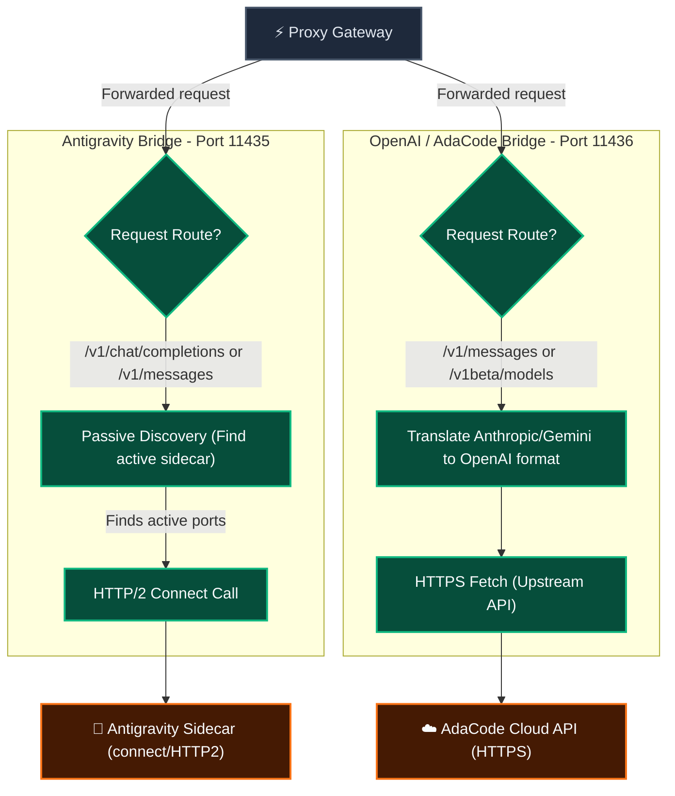

# Konoha LLM Bridge & Proxy Gateway

The **Konoha LLM Bridge and Proxy Gateway** provides a unified local API server to serve, multiplex, and route requests across multiple LLM providers (such as Antigravity sidecar, custom OpenAI endpoints, Anthropic, or Gemini) from a single entry point.

---

## Feature Architecture

### 1. Proxy Gateway Architecture (Port 11434)
The Proxy Gateway serves as a central reverse proxy and routing layer. It receives all client requests, performs path/route checks (including intercepting preflight requests like `count_tokens`), validates model prefixes, and routes requests to the appropriate active bridge.

```mermaid
graph TD
    %% Styling
    classDef client fill:#0f172a,stroke:#38bdf8,stroke-width:2px,color:#f8fafc;
    classDef gateway fill:#1e293b,stroke:#475569,stroke-width:2px,color:#e2e8f0;
    classDef step fill:#1e3a8a,stroke:#3b82f6,stroke-width:1px,color:#f8fafc;
    classDef error fill:#7f1d1d,stroke:#ef4444,stroke-width:1px,color:#f8fafc;

    Client["💻 Client (Claude Code, Cursor, SDKs)"]:::client
    Gateway["⚡ Proxy Gateway (Port 11434)"]:::gateway
    RouteCheck{"Route Check?"}:::step
    CountTokensMock["Mock Token Count<br/>(200 OK: input_tokens=0)"]:::step
    ModelPrefix{"Model name has '-' prefix?"}:::step
    InvalidError["400 Error<br/>(Invalid model prefix)"]:::error
    BridgeCheck{"Bridge running?"}:::step
    NotRunning["404 Error<br/>(Bridge not configured)"]:::error
    Forward["Forward to Target Bridge Port"]:::step
    RewriteModel["Rewrite Model key in Response"]:::step

    Client -->|HTTP Request| Gateway
    Gateway --> RouteCheck
    RouteCheck -->|POST /v1/messages/count_tokens| CountTokensMock
    RouteCheck -->|Other routes| ModelPrefix
    ModelPrefix -->|No| InvalidError
    ModelPrefix -->|Yes (e.g., adacode-claude-sonnet-4-6)| BridgeCheck
    BridgeCheck -->|No| NotRunning
    BridgeCheck -->|Yes| Forward
    Forward -->|Get response| RewriteModel
    RewriteModel -->|Return to Client| Client
```

### 2. LLM Bridges Architecture (Ports 11435, 11436, etc.)
LLM Bridges run as local endpoints representing individual providers. They act as translation layers (converting formats like Anthropic messages or Gemini Content into standard OpenAI payloads if necessary) and dispatch the calls to the final backend engines.



---

## Key Features

### 1. Dynamic Configuration & Hot-Reloading
The `konoha-files` MCP server monitors the bridges configuration file (`~/.konoha/bridges.json`). Whenever changes occur (e.g. creating, deleting, enabling, or disabling a bridge), the MCP server automatically syncs:
- **Enabling/Creating**: Spawns and binds the HTTP bridge server to its configured port instantly.
- **Disabling/Deleting**: Safely stops and unbinds the port.
- **Gateway Auto-Listen**: Because the Proxy Gateway holds a dynamic reference to the active bridges registry, it immediately begins routing requests to newly enabled bridges or handles disabled bridges gracefully without restarting the server.

### 2. Model Alias Prefixing
To route to a specific bridge, prepend the bridge name to the base model name:
$$\text{model} = \langle\text{bridge\_name}\rangle-\langle\text{base\_model\_name}\rangle$$

Examples:
- `antigravity-gemini-3.5-flash-low` routes to the **antigravity** bridge.
- `adacode-claude-sonnet-4-6` routes to the **adacode** bridge with the model `"claude-sonnet-4-6"`.

### 3. Response Model Rewriting & Interception
The Gateway intercepts responses from the backend bridges (both JSON bodies and Server-Sent Event streaming chunks) and rewrites the `"model"` field back to the requested prefix-alias format. This prevents client SDKs from throwing mismatch errors.
To guarantee text-rewriting reliability, client `accept-encoding` headers are stripped during forwarding, ensuring responses are always raw text.

### 4. Strict Passive Discovery Policy
To comply with Google credentials and session policies, the Antigravity bridge employs a strict passive process discovery strategy. It connects only to already active, user-initiated client sessions (via the host IDE or `agy` CLI). The bridge will never spawn, host, or execute background sidecar daemon instances automatically. If no active user session is discovered, calls will fail silently with `Sidecar not discovered` to protect user credentials.

### 5. Anthropic Preflight Token Mocking
To support the Claude CLI, Cherry Studio, and other Anthropic-compatible clients that request input token count estimation before sending completions, the Proxy Gateway intercepts `POST /v1/messages/count_tokens` requests. It returns a mock preflight response:
```json
{
  "input_tokens": 0
}
```
with an HTTP `200 OK` status. This prevents the gateway from returning errors on preflight queries and avoids client-side retry loops.

---

## Subcommands Reference

Manage bridges dynamically from the terminal:

* **Check Status**:
  ```bash
  konoha bridge status
  ```
* **List Bridges**:
  ```bash
  konoha bridge list
  ```
* **List Served Models**:
  ```bash
  konoha bridge models
  ```
* **Create a Bridge**:
  ```bash
  konoha bridge create [name]
  ```
* **Delete a Bridge**:
  ```bash
  konoha bridge delete <name>
  ```
* **Enable a Bridge**:
  ```bash
  konoha bridge enable <name>
  ```
* **Disable a Bridge**:
  ```bash
  konoha bridge disable <name>
  ```

---

## Detailed Curl Testing

Below are specific commands to test and verify the gateway using `curl`. All calls should target the central **Proxy Gateway on port 11434**.

### 1. List Available Models (Aggregated)
Fetch models from all active bridges. The IDs in the returned list are automatically prefixed with their respective bridge name.

```bash
curl -s http://localhost:11434/v1/models | jq .
```

*Example Output Snippet:*
```json
{
  "object": "list",
  "data": [
    {
      "id": "antigravity-gemini-3.5-flash-low",
      "object": "model",
      "created": 1700000000,
      "owned_by": "google"
    },
    {
      "id": "adacode-claude-sonnet-4-6",
      "object": "model",
      "created": 1782473595,
      "owned_by": "anthropic"
    }
  ]
}
```

### 2. OpenAI / Chat Completions (Non-Streaming)
Forward a standard OpenAI chat completion request. The response model name is rewritten back to match the input request.

#### Test Antigravity Bridge:
```bash
curl -s -X POST http://localhost:11434/v1/chat/completions \
  -H "Content-Type: application/json" \
  -d '{
    "model": "antigravity-gemini-3.5-flash-low",
    "messages": [{"role": "user", "content": "say hi"}],
    "max_tokens": 5
  }' | jq .
```

#### Test Adacode Bridge:
```bash
curl -s -X POST http://localhost:11434/v1/chat/completions \
  -H "Content-Type: application/json" \
  -d '{
    "model": "adacode-claude-sonnet-4-6",
    "messages": [{"role": "user", "content": "say hi"}],
    "max_tokens": 5
  }' | jq .
```

*Example Output:*
```json
{
  "id": "chatcmpl-3bac8e17-a766-4bc3-aad3-fde1d70422f5",
  "object": "chat.completion",
  "created": 1782471626,
  "model": "adacode-claude-sonnet-4-6",
  "choices": [
    {
      "index": 0,
      "message": {
        "role": "assistant",
        "content": "Hi there! How can I help you today?"
      },
      "finish_reason": "stop"
    }
  ]
}
```

### 3. OpenAI / Chat Completions (Streaming)
Request a streaming response (`"stream": true`). The gateway rewrites model fields inside each SSE chunk on the fly.

```bash
curl -s -X POST http://localhost:11434/v1/chat/completions \
  -H "Content-Type: application/json" \
  -d '{
    "model": "adacode-claude-sonnet-4-6",
    "messages": [{"role": "user", "content": "say hi"}],
    "max_tokens": 5,
    "stream": true
  }'
```

*Example Output:*
```text
data: {"id":"chatcmpl-22fbbe2c-4c5b-43cc-b936-8d1f5dfbf657","object":"chat.completion.chunk","created":1782471635,"model":"adacode-claude-sonnet-4-6","choices":[{"index":0,"delta":{"role":"assistant","content":"Hi! How can I help you today?"},"finish_reason":null}]}

data: {"id":"chatcmpl-22fbbe2c-4c5b-43cc-b936-8d1f5dfbf657","object":"chat.completion.chunk","created":1782471635,"model":"adacode-claude-sonnet-4-6","choices":[{"index":0,"delta":{},"finish_reason":"stop"}]}

data: [DONE]
```

### 4. Anthropic Messages (Non-Streaming)
Forward a standard Anthropic client request to `/v1/messages`.

```bash
curl -s -X POST http://localhost:11434/v1/messages \
  -H "Content-Type: application/json" \
  -d '{
    "model": "antigravity-claude-sonnet-4-6",
    "messages": [{"role": "user", "content": "say hi"}],
    "max_tokens": 5
  }' | jq .
```

*Example Output:*
```json
{
  "id": "msg_01...",
  "type": "message",
  "role": "assistant",
  "model": "antigravity-claude-sonnet-4-6",
  "content": [
    {
      "type": "text",
      "text": "Hello! How can I help you?"
    }
  ]
}
```

### 5. Gemini / generateContent (Non-Streaming)
Forward a native Google Gemini format request to `/v1beta/models/...:generateContent`.

```bash
curl -s -X POST http://localhost:11434/v1beta/models/antigravity-gemini-3.5-flash-low:generateContent \
  -H "Content-Type: application/json" \
  -d '{
    "contents": [{"parts": [{"text": "say hi"}]}]
  }' | jq .
```

*Example Output:*
```json
{
  "candidates": [
    {
      "content": {
        "role": "model",
        "parts": [{"text": "Hi! How can I help?"}]
      },
      "finishReason": "STOP",
      "index": 0
    }
  ],
  "modelVersion": "antigravity-gemini-3.5-flash-low"
}
```
