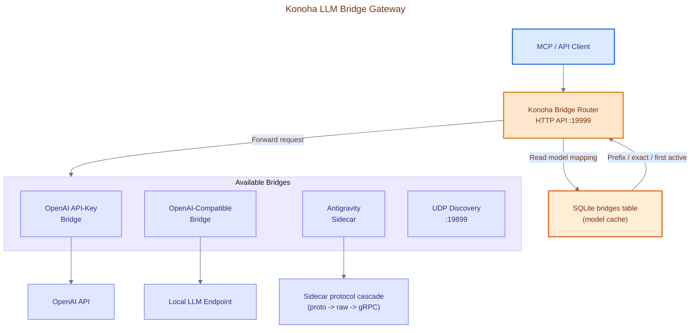

# Konoha Bridge Gateway

> **v2.0.0 Architecture** — The Konoha Bridge Gateway is now part of the broader **Konoha Bridge Router** stack, which multiplexes requests across user-configured LLM bridges. The outer Proxy Gateway listens on **port 19999** and forwards to inner bridges on user-defined ports.

The **Konoha Bridge Gateway** provides a unified local API server on `127.0.0.1:19999` to route, multiplex, and stream LLM requests across multiple explicitly configured bridges from a single entry point. The embedded Konoha bridge remains available on machines without Antigravity IDE.

## Architecture

> **Canonical editable diagram:** [04 LLM Bridge Gateway](diagrams/konoha-architecture.drawio) · [Diagram manifest](diagrams/README.md). The page distinguishes request-time bridge selection from retries inside sidecar protocol paths; there is no gateway-level 429 round-robin failover.



## Supported Providers

| Provider Type | CLI Alias | Model Format | Source |
|---|---|---|---|
| **OpenAI API Key** | `openai` | `<bridge_name>-<model>` | Direct OpenAI API |
| **OpenAI Compatible** | `compatible` | `<bridge_name>-<model>` | Ollama, vLLM, LM Studio, etc. |
| **Antigravity Sidecar** | `antigravity` | `<bridge_name>-<model>` | Local `agy` CLI / Antigravity IDE (requires live session) |

> **Note:** Supported providers are OpenAI API Key, OpenAI Compatible, and Antigravity Sidecar. The `openai-oauth` (device code flow) provider was removed in v2.0.0.

## API Endpoints

| Method | Path | Auth | Description |
|---|---|---|---|
| `GET` | `/healthz` | None | Health check |
| `GET` | `/v1/models` | None | List all models from all active bridges |
| `POST` | `/v1/chat/completions` | None | Chat completions (auto-routed by model prefix) |
| `POST` | `/v1/messages` | None | Anthropic Messages API format |
| `POST` | `/v1/messages.beta` | None | Anthropic Messages beta format |
| `POST` | `/v1/gemini/*` | None | Google Gemini API format |
| `GET` | `/v1/bridge-list` | None | List all configured bridges |
| `POST` | `/v1/messages/count_tokens` | None | Anthropic preflight mock (returns `{"input_tokens": 0}`) — used by Claude CLI / Cherry Studio as a budget-warning preflight |

## Model Naming Rules

### Standard Bridges (`provider: openai` or `openai-compatible`)

Format: `<bridge_name>-<model>`

Examples:
```
my-ollama-llama3.1          # Ollama bridge
lm-studio-mistral-7b        # LM Studio bridge
gpt-api-gpt-4o              # OpenAI API key bridge
```

### Enhanced Model Resolution Flow

1. Extract model name from request (e.g. `gpt-api-gpt-4o`)
2. Split by first hyphen: bridge = `gpt-api`, model = `gpt-4o`
3. Query SQLite `bridges` table for `name = 'gpt-api'`
4. If bridge provider is `antigravity`, verify Antigravity sidecar session is alive via `isAntigravitySessionLive()`
5. Check bridge `enabled` flag — exclude disabled bridges
6. Resolve to an inner bridge, cache the lookup for 30 seconds
7. Forward request with mapped model name

## Bridge Management

### Creating Bridges

```bash
konoha bridge create   # Interactive wizard
```

Wizard prompts:
```
Choose provider type:
  1  OpenAI API Key
  2  OpenAI Compatible (Ollama, LM Studio, vLLM)

Enter choice [1/2]:
```

For **OpenAI API Key** (option 1):
- Prompts: bridge name, port, target URL, API key
- Stores in `~/.konoha/skills.db` bridges table

For **OpenAI Compatible** (option 2):
- Prompts: bridge name, port, target URL (required), API key (optional)
- Example: `http://localhost:11437/v1/chat/completions`

### Managing Bridges

```bash
konoha bridge list              # Table of all configured bridges
konoha bridge status            # Detailed status with runtime connectivity check
konoha bridge models            # All models served across active bridges
konoha bridge enable <name>     # Enable a disabled bridge
konoha bridge disable <name>    # Disable without deleting
konoha bridge delete <name>     # Remove bridge entirely
konoha bridge start             # Start gateway daemon (port 19999)
konoha bridge stop              # Stop gateway daemon
```

## Sidecar Discovery

The gateway supports automatic sidecar discovery for detecting local LLM instances:

1. **UDP broadcast** on port 19899 to discover running sidecars
2. **Cascade fallback**: proto codec → raw JSON → gRPC
3. Auto-registering discovered instances as bridges

## Gateway Protections

### Streaming Timeout Protection

- Gateway never times out during streaming — upstream timeout is extended automatically
- SSE error frames are HTML-entity escaped to prevent framing corruption
- Null bytes and non-printable characters are stripped from error messages
- Response body size is capped at 200MB per request

### Concurrent Request Limits

- Maximum concurrent chat requests: configurable (default varies)
- Rate limiting: minimum interval between requests enforced
- Excess requests receive 429 responses with retry guidance

### Request Validation

- Malformed JSON returns `400 Invalid JSON`
- `[object Object]` serialized messages detected and rejected with clear error
- Missing messages field returns `400 Invalid Request`
- Empty message content validated

### Bridge Failover

The gateway itself does **not** rotate across bridges mid-request. Per request:

1. `resolveBridgeAndModel()` picks **one** bridge using a 3-step priority: (a) `<bridge_name>-<model>` prefix match, (b) exact model-name match across the combined bridge model cache, (c) fallback to the first active bridge (see `src/bridge/gateway.js:65-110`).
2. The gateway forwards the request to that single bridge and **pipes the response verbatim** (status code, headers, body) back to the client. There is no 429-driven rotation loop at the gateway layer — a 429 from the bridge is passed straight through to the caller.

**Where retries actually happen:**

- **Sidecar raw inference path** (`src/bridge/sidecar/raw.js:268-275`): `callRawInference` runs its own retry loop — up to 4 attempts with a 2-second backoff between each — for transient gRPC / connection / sidecar-discoverable / `RESOURCE_EXHAUSTED` errors. This happens inside the sidecar bridge process before the gateway ever sees the response.
- **Cascade path** (`src/bridge/sidecar/cascade.js:75-82`): up to 3 retries with 10s backoff, restarting the cascade on each attempt.
- **RPC path** (`src/bridge/sidecar/rpc.js:277-292`): `_withRetry` wraps transient H2 connect/timeout errors (2 retries).
- **Per-handler error translation**: format adapters such as `src/bridge/handlers/gemini.js:259-304` detect rate-limit-style errors (`429`, `RESOURCE_EXHAUSTED`, `capacity`, `H2 timeout`, `Sidecar not discovered`, etc.) and translate them into a proper 429 response with a `Retry-After` header for the client. They do not retry.

**No global round-robin rotator**: the gateway has no mechanism that, on 429, picks the next bridge and re-sends the same request. Multi-bridge availability is a routing-time concern (model-to-bridge mapping), not a runtime failover concern. If you need cross-bridge failover, the caller (client SDK) must implement it.

### Header Sanitization

The gateway strips the following inbound headers before forwarding to inner bridges:

- `Authorization`, `x-api-key` — API keys are only injected by the bridge (not proxied).
- `x-forwarded-*`, `x-request-id`, `x-client-*`, `x-konoha-gateway-*` — metadata headers.

This ensures local clients never need to send API keys to the gateway, and upstream bridges receive only clean requests.

### Response Model Rewriting

Both streaming and non-streaming responses have their `"model"` field rewritten back to the gateway alias:

- OpenAI: extracts `"model"` from response JSON.
- Anthropic: rewrites `"model_id"` field.
- Gemini: rewrites `"model"` in JSON response.

For example, a request to `adacode-claude-sonnet-4-6` gets rewritten to return `"model": "adacode-claude-sonnet-4-6"` even though the upstream bridge responds with its internal model name.

### Compression Safety

The gateway sets `Accept-Encoding: identity` on forwarded requests to guarantee uncompressed responses. This ensures regex-based model name rewriting is reliable.

## Bridge Schema

### SQLite Database: `~/.konoha/skills.db`

```sql
CREATE TABLE bridges (
    name        TEXT    PRIMARY KEY,
    port        INTEGER NOT NULL,
    provider    TEXT    NOT NULL,   -- openai | openai-compatible | antigravity | antigravity-extension
    enabled     INTEGER NOT NULL DEFAULT 1,
    target_url  TEXT,
    api_key     TEXT
);
```

`antigravity-extension` is an IDE-owned endpoint at `http://127.0.0.1:1313` and is disabled by default when explicitly created. Konoha never starts that extension process; enable it only after Antigravity IDE and the extension are running. No external bridge row is seeded automatically.

### Python CLI: `src/db_bridges.py`

```bash
python3 src/db_bridges.py --list
python3 src/db_bridges.py --upsert '{"name":"my-bridge","port":11437,...}'
python3 src/db_bridges.py --delete my-bridge
python3 src/db_bridges.py --enable my-bridge
python3 src/db_bridges.py --disable my-bridge
```

## Gateway Source Files

| File | Role |
|---|---|
| `src/bridge/server.js` | HTTP server entrypoint, request routing |
| `src/bridge/gateway.js` | Proxy gateway logic, model resolution, concurrent request guard |
| `src/bridge/handlers/openai.js` | OpenAI `/v1/chat/completions` handler |
| `src/bridge/handlers/anthropic.js` | Anthropic `/v1/messages` handler |
| `src/bridge/handlers/gemini.js` | Google Gemini API handler |
| `src/bridge/handlers/proxy.js` | Generic reverse-proxy handler |
| `src/bridge/sidecar/discovery.js` | Sidecar discovery via UDP broadcast |
| `src/bridge/sidecar/cascade.js` | Cascade failover chain (proto → raw → gRPC) |
| `src/bridge/sidecar/proto.js` | Protobuf codec using `@bufbuild/protobuf` |
| `src/bridge/sidecar/raw.js` | Raw inference codec |
| `src/bridge/sidecar/rpc.js` | RPC client for sidecar communication |
| `src/bridge/context.js` | Bridge context management (per-bridge state) |
| `src/bridge/models.js` | Model mapping utilities |
| `src/bridge/utils.js` | Shared utilities (logging, streaming helpers, readBody) |
| `src/db_bridges.py` | SQLite bridge CRUD |

---

## Konoha Bridge Extension — Optional Antigravity Integration

The external `konoha-bridge` repository is an Antigravity/VS Code extension. It runs **inside Antigravity IDE**, discovers the active sidecar, and exposes an OpenAI-compatible API on `http://127.0.0.1:1313`. Konoha’s own aggregate gateway remains separate on `http://127.0.0.1:19999`.

### Source and installation contract

| Property | Value |
|---|---|
| **Repository** | `https://github.com/andycungkrinx91/konoha-bridge` |
| **Ref** | live `master` branch |
| **Package identity** | publisher `andycungkrinx91`, name `konoha-bridge`; package version is read from the checkout |
| **Extension setting namespace** | `agLocalBridge` |
| **Extension API** | `http://127.0.0.1:1313` |
| **Konoha aggregate gateway** | `http://127.0.0.1:19999` |
| **Primary install location** | `~/.antigravity-ide/extensions/andycungkrinx91.konoha-bridge-master-universal/` |

Konoha automatically clones `https://github.com/andycungkrinx91/konoha-bridge` on fresh installation (`konoha init`), packages the extension into `konoha-bridge-1.4.0.vsix` via `@vscode/vsce package`, and installs the extension across supported IDE CLIs:

```bash
# Antigravity IDE CLI
antigravity --install-extension konoha-bridge-1.4.0.vsix

# Standard VS Code CLI
code --install-extension konoha-bridge-1.4.0.vsix

# Cursor IDE CLI
cursor --install-extension konoha-bridge-1.4.0.vsix
```

Additionally, if Antigravity IDE is present, Konoha performs an atomic directory sync directly into `~/.antigravity-ide/extensions/andycungkrinx91.konoha-bridge-master-universal/` and updates the extension registry. `konoha init --force` and `konoha upgrade` refresh this checkout. Konoha never executes the extension as a standalone Node process.

Installation does **not** create or enable an external bridge row. To use the extension through Konoha’s aggregate gateway, explicitly create/select an `antigravity-extension` bridge and enable it:

```bash
konoha bridge create
konoha bridge enable <bridge-name>
```

The external provider defaults to disabled and targets `http://127.0.0.1:1313`. Konoha’s embedded bridge remains the fallback on machines without Antigravity IDE.

### Troubleshooting

| Symptom | Fix |
|---|---|
| Extension installation skipped | Antigravity IDE was not detected. This is expected on headless or CLI-only machines. Use the embedded Konoha bridge instead. |
| Extension is installed but no external traffic flows | Check the extension API on port `1313`, then inspect `konoha bridge list` and explicitly enable the external bridge. |
| Konoha gateway unavailable | Check `http://127.0.0.1:19999/healthz`; start the embedded gateway with `konoha bridge start` if needed. |
| Stale extension checkout | Run `konoha init --force` or `konoha upgrade` with Antigravity IDE installed; the master checkout is staged before replacement and the previous valid directory is restored if validation fails. | 

The gateway selects one enabled bridge per request. It does not perform global round-robin rotation after a `429`; retry behavior belongs to supported sidecar paths or the calling client.
