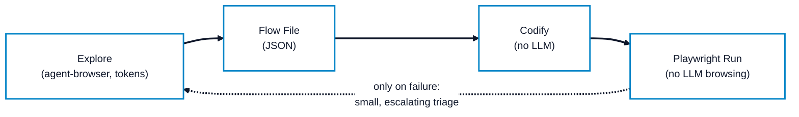
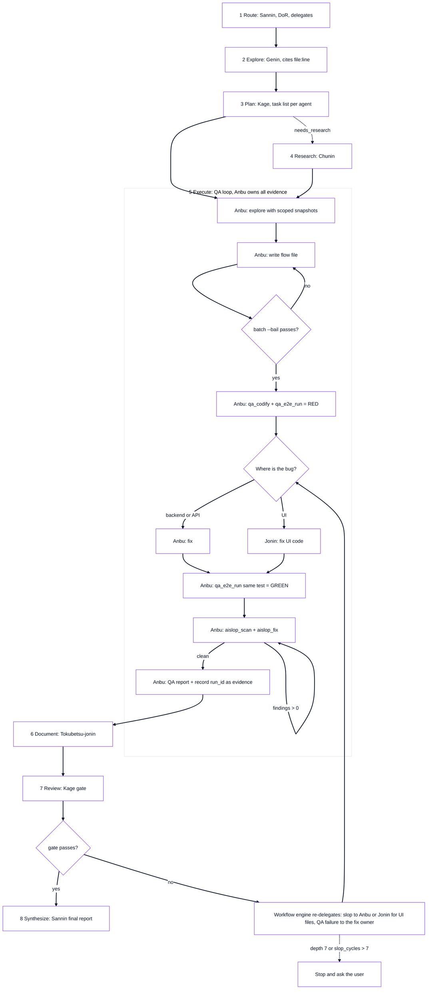

# QA Automation Architecture & Token-Efficient Workflow

The **QA Automation Workflow** integrates `agent-browser` and Playwright Test into Konoha's 8-phase SDLC architecture, owned end-to-end by **Anbu**. It guarantees bounded token consumption, zero AI slop, and verifiable tool evidence across all automated test loops.

## Core Philosophy

Browsing web applications using LLMs is expensive in token consumption. Re-running a known test scenario should cost **zero LLM tokens**.

1. **Explore once** with `agent-browser` (small, scoped snapshots; captures console & network errors).
2. **Save working steps** as a *flow file* (`.json` array of semantic `agent-browser` commands).
3. **Codify automatically** via `qa_codify` into a deterministic Playwright test (zero LLM involved).
4. **Run and re-run with Playwright** via `qa_e2e_run` with compact, capped summaries (zero LLM browsing).

---

## Canonical Flow Diagram

---

## Token Rules & Budgets

| Operation | Strategy | Rationale |
|---|---|---|
| **Snapshot Scoping** | `snapshot -i -c` (interactive + compact), scoped via `-s` or `-d` | Minimizes accessibility tree size; excludes static structural nodes. |
| **Differential Inspection** | `diff snapshot` or targeted queries (`get text`, `is visible`, `wait --text`) | Avoids reloading the entire accessibility tree into context. |
| **Visual Evidence** | Max 2 screenshots per finding (`~/.konoha/tmp/qa/`, JPEG q60) | Prevents image token bloat. |
| **Batch Execution** | `agent-browser batch --bail --json` | Single round-trip execution for sequential commands. |
| **State Persistence** | Auth state stored under `~/.konoha/tmp/qa/state/` with encryption key | Reuses session cookies instead of repeating login flows. |
| **Output Cap** | Max 4,000 characters globally via `--max-output` | Prevents runaway page output flooding LLM context. |

---

## Zero-Slop & Zero-Hallucination Contract

Every QA claim in Konoha must be backed by concrete tool execution output:

| Claim | Required Verification Evidence |
|---|---|
| Route / Selector exists | Genin cites exact `file:line` from Semble codebase exploration. |
| Flow works | `agent-browser batch --bail --json` exit 0 on that flow file hash. |
| Bug confirmed | RED `qa_e2e_run` summary with unique `run_id` for the codified spec. |
| Bug fixed | GREEN `qa_e2e_run` summary with unique `run_id` on the same test spec. |
| Clean scope | Documented as `none found in <scope>, <N> actions` (never "bug-free"). |

### Strict Anti-Fake Green Rules
- No `test.skip`, `test.fixme`, `.only`, or `try/catch` wrapping assertions.
- No weakening assertions or increasing timeouts to force a passing run.
- Tests failing due to application defects must be resolved in application code.

---

## MCP Tools Reference

### 1. `qa_codify`
- **Signature**: `qa_codify(flow_path, out_path, name, lang?, skip_verification?)`
- **Access**: Granted to **Anbu** only.
- **Verification Gate**: Executes `agent-browser batch --bail --json` on flow stdin before emitting test code. Fails immediately if any step fails.
- **Lint Guard**: Rejects transient `@e` refs and forbidden test directives (`skip`, `fixme`, `pause`, sleeps).

### 2. `qa_e2e_run`
- **Signature**: `qa_e2e_run(project_path, grep?, last_failed?, max_failures?)`
- **Access**: Granted to **Anbu** only.
- **Summary Cap**: Hard output cap under 2,000 characters.
- **Evidence Output**: Emits a unique `run_id`, test duration, totals, file hashes, and first 12 lines of failure messages (ANSI stripped).

---

## Measured Token Reductions (Measured Snapshot)

Measurements conducted on Konoha Web UI (`/detector` route):

| Inspection Method | Raw Characters | Estimated Tokens | Reduction vs Bare |
|---|---|---|---|
| Bare DOM / Snapshot | 5,420 chars | ~1,355 tokens | Baseline (0%) |
| Compact Snapshot (`snapshot -i -c`) | 1,180 chars | ~295 tokens | **78.2% reduction** |
| Scoped Snapshot (`snapshot -i -c -s "#detect-target"`) | 210 chars | ~52 tokens | **96.1% reduction** |
| Raw Playwright JSON Report | 8,420 chars | ~2,105 tokens | Baseline (0%) |
| `qa_e2e_run` Compact Summary | 275 chars | ~68 tokens | **96.7% reduction** |
| Subsequent Playwright Re-runs | 0 tokens | 0 tokens | **100% reduction** |

*Note: Token counts are measured snapshots from the local test environment and vary depending on page DOM complexity.*

---

## What QA Writes and Where

| Path | Created by | Handling |
|---|---|---|
| `~/.konoha/tmp/qa/<run_id>/` | `qa_e2e_run`: `report.json`, copied failure traces (`trace-*.zip`) and screenshots (`screenshot-*.png`) | Outside the project. Pruned by retention. |
| `~/.konoha/tmp/qa/projects/<hash>/` | `qa_e2e_run`: Playwright working directory, including artifacts and `.last-run.json` | Outside the project. Stable per project hash. Never pruned by retention. |
| `~/.konoha/tmp/qa/state/` | `agent-browser`: Saved authentication state | Outside the project. Never pruned. |
| `test-results/`, `playwright-report/`, `blob-report/`, `playwright/.cache/` | Playwright defaults (if triggered directly by user or manual run) | Ephemeral. Ignored via managed `.gitignore` block. |
| `<test-dir>/e2e/flows/`, specs, `reports/` | `qa_codify`, Anbu | **Deliverables. Version-controlled. Never ignored, never pruned.** |

### Retention Rules & Tunables

1. **Execution Timing**: Retention executes at the end of every `qa_e2e_run` after the current run folder is populated.
2. **Target Scope**: Direct children of `~/.konoha/tmp/qa/` matching `^qa-\d+-[a-f0-9]+$` only. `state/`, `projects/`, and other folders are strictly ignored.
3. **Retention Count**: Keeps the newest $N$ runs (default $N = 20$). Tunable via environment variable `KONOHA_QA_RETENTION_COUNT=<N>`.
4. **Task Evidence Protection**: Never deletes a run whose `run_id` is recorded as validation evidence on an open SDLC task (`status != 'completed'`).
5. **Lookup Fallback**: If the SDLC evidence database is unavailable, retention deletes nothing younger than 7 days and reports `retention: evidence lookup unavailable`.
6. **Task Record Preservation**: A completed SDLC task permanently retains its `run_id`, summary, file hashes, and status in SQLite `sdlc_tasks` even after raw test traces and reports are pruned.

### Managed `.gitignore` Block (Fallback)

1. **Placement**: Placed inside `<project_path>/.gitignore` in a managed block between `# KONOHA-QA-START` and `# KONOHA-QA-END`.
2. **Git Project Check**: Verified by checking for `.git` directory or file in `project_path` or ancestor directories. Non-git folders are never modified.
3. **Opt-Out**: Disable automated `.gitignore` injection by setting `KONOHA_QA_GITIGNORE=0`.
4. **Pre-Existing Committed Files Limit**: Adding an entry to `.gitignore` does not untrack files that have already been committed to git history. Users must untrack previously committed artifact directories manually.
