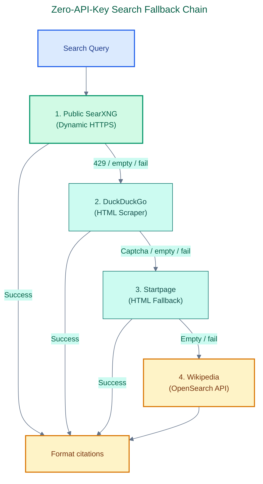

# SearXNG & Multi-Source Search Chain Setup Guide

This guide covers the architecture, setup, configuration, and troubleshooting for the **zero-API-key, multi-source search chain** integrated into Konoha's `web_search` MCP tool.

---

## 🔍 Search Chain Architecture

To eliminate the need for API keys, subscription limits, and manual credential management, Konoha uses a fallback-based search chain that dynamically queries multiple public endpoints:

> **Canonical editable diagram:** [05 Search Fallback Chain](diagrams/konoha-architecture.drawio) · [Diagram manifest](diagrams/README.md).



---

## ⚡ Dynamic SearXNG Instance Selector

The primary search engine is **SearXNG**, dynamically queried using the best available public instance listed on [searx.space](https://searx.space).

### Caching and Resolution Loop
1. **Instances Discovery**: Konoha fetches the global instances registry from `https://searx.space/data/instances.json` and caches it locally at `~/.konoha/searxng/instances_cache.json` for **24 hours**.
2. **Filtering**: The instances are parsed and filtered:
   - Must use secure HTTPS (`https://`).
   - Must have an uptime rating > **95%** (`uptimeDay > 95`).
   - Must have active search latency response profiles.
3. **Sorting**: Filtered candidates are sorted primarily by **uptime** (descending) and secondarily by **latency** (ascending).
4. **Live Verification**:
   - The top 5 candidates are live-tested sequentially by sending a lightweight check request (`/search?q=test&format=json`) with a **3-second timeout**.
   - The first instance that returns a valid JSON response containing search results is elected as the "best instance".
5. **Best Instance Caching**: The elected instance URL is cached at `~/.konoha/searxng/best_instance.json` with a **1-hour TTL**.
6. **Self-Healing Fallback**: If the elected instance returns an error or times out during actual query execution, Konoha immediately invalidates the cache file and falls back to testing the next candidate from the cached sorted list.

---

## 🦆 Secondary & Tertiary Fallbacks

### DuckDuckGo HTML Scraper
If SearXNG is unavailable or rate-limited, Konoha falls back to `https://html.duckduckgo.com/html/`.
- Queries are executed using browser-like `User-Agent` headers to bypass rate limits.
- HTML result cards are parsed using regex to extract titles, snippets, and redirect links.
- Redirect links are automatically resolved back to original URLs.

### Startpage Scraper
If DuckDuckGo HTML fails (e.g. captcha interception), the engine queries `https://www.startpage.com/sp/search`.
- Leverages global list pairing matching link classes (`result-link`), headers (`wgl-title`), and paragraphs (`description`) to cleanly associate results.

### Wikipedia OpenSearch
For factual queries, if all web search endpoints fail, Wikipedia OpenSearch acts as a final fallback, ensuring the tool always returns a factual definition.

---

## ⚙️ Configuration & Logging

### Log Location
All search queries and chosen sources are logged to:
```bash
~/.konoha/searxng/search.log
```
Log entries use the following format:
```
[2026-07-14 22:58:46] SOURCE: DuckDuckGo HTML | QUERY: SvelteKit 3D | COUNT: 5
```

### Disk Pruning
To prevent logs from consuming disk space, the log file and instances cache can be pruned at any time by running:
```bash
konoha data prune
```
This automatically deletes `search.log`, `instances_cache.json`, and `best_instance.json`, reclaiming disk space.

---

## 🛠️ Troubleshooting

### Issue: "No results found across fallbacks"
* **Cause**: All public endpoints might be rate-limiting queries originating from your IP range. This is common when running inside cloud hosting environments (such as AWS or Google Cloud) where public instances aggressively block cloud IP ranges.
* **Solution**: Enable a local proxy or run Konoha in a local sandbox environment. The emulated Chrome headers will automatically bypass rate-limits on standard home/office networks.

### Issue: Slow Response Times
* **Cause**: The current "best instance" might have become slow, forcing the tool to wait for timeouts.
* **Solution**: Clear the best instance cache using `konoha data prune`. The server will dynamically test and find a new low-latency candidate on the next search query.
