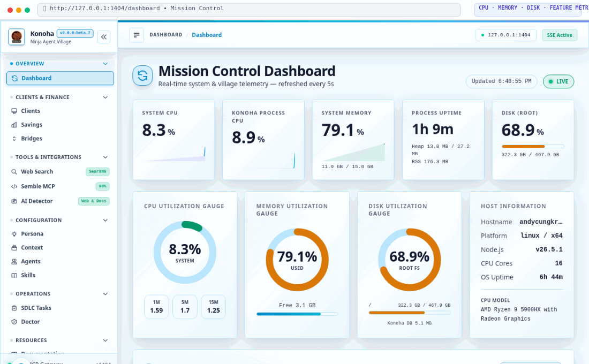

# 🌐 Konoha Web Configuration UI Guide

The **Konoha Web Configuration UI** is a local browser-based management dashboard for Konoha, powered by **SvelteKit 3 (RC)** (`@sveltejs/kit` 3.0.0-next.27 + `@sveltejs/adapter-node` 6.0.0-next.12), **Svelte 5**, **Vite 8/Rolldown**, and **Tailwind CSS v4**, served directly by an embedded lightweight Node.js API server.

It provides a modern visual interface for configuration and monitoring tasks that otherwise require interactive terminal wizards (`konoha bridge create`, `konoha agent skill`, `konoha savings`, `konoha doctor`, etc.), **without adding any new business logic** — the UI is a thin visual layer over the exact same functions the CLI and SQLite database already use.

<p align="center">
  
</p>

---

## 🚀 Quick Start (Optional Web UI)

The Web UI is **completely optional**. Konoha functions 100% independently from CLI and MCP tools without the UI running. When you want a visual dashboard, manage it using the `konoha ui` daemon commands:

### Background Service Mode (Recommended)

```bash
# Start the Web UI daemon in background (binds 127.0.0.1:1404 and opens browser)
konoha ui start

# Check current status, port, PID, and health metrics
konoha ui status

# Restart the Web UI server
konoha ui restart

# Stop the background Web UI daemon
konoha ui stop
```

### Foreground / Ephemeral Mode

You can also run the Web UI directly in the foreground:

```bash
# Run in foreground (press Ctrl+C to exit)
konoha ui start --foreground
# or
konoha web

# Custom port or headless server mode (no browser popup)
konoha ui start --port 1404 --no-open
konoha web --port 1404 --no-open
```

---

## 🛡️ Architecture & Security Model

```
konoha web
   │
   ├── Embedded API Server (src/web_server.js)
   │     ├── Bound to 127.0.0.1:1404 (Localhost only)
   │     ├── Serves session token via HttpOnly cookie; exposes CSRF token via GET /api/v1/csrf
   │     ├── Requires X-Konoha-Web-Token on POST / PATCH / DELETE
   │     ├── Realtime updates via Server-Sent Events (/api/v1/events)
   │     └── Serves JSON API (/api/v1/*) over existing Konoha core functions
   │
   └── Frontend (apps/web/build/)
         ├── Built with SvelteKit 3 (RC) + Svelte 5 + Vite 8
         └── 10 Light-Mode Gradient Themes with Byakugan 3D Glassmorphism Aesthetic
```

### Security & CSRF Hardening
- **Localhost Bound**: The server binds strictly to `127.0.0.1` by default.
- **CSRF Token Invariant**: Every session generates a secure random token passed via the `X-Konoha-Web-Token` header for all state-changing mutations (`POST`, `PUT`, `PATCH`, `DELETE`). Requests missing or with an invalid token are rejected with HTTP 403 Forbidden.
- **Zero Raw Secrets Rendered**: API keys entered for local LLM bridges are write-only and never echoed back in plaintext.

---

## 📱 Features & Screens

### 1. 🌉 Bridges Screen (`Bridges.svelte`)
- View all configured local LLM proxy bridges and gateway ports.
- Live status indicator and telemetry for the Konoha Bridge Router (port `19999`) and Bridge Sidecar (port `1313`).
- Daemon lifecycle controls: Start, Stop, and Restart the Bridge Gateway daemon directly from the UI.
- Interactive Served Models Browser (`/api/v1/bridges/models`): Inspect all served LLM models across active bridges.
- One-click toggle switch to enable/disable bridges without restarts.
- Create new bridges with provider presets (`openai`, `openai-compatible`, `anthropic`, `gemini`).
- Safe deletion with modal confirmation.

### 2. 👤 Subagents Screen (`Agents.svelte`)
- Manage the 7 official Naruto Ninja Ranks:
  - `✧ Sannin` (MCP Router & Orchestrator)
  - `⚑ Genin` (Codebase Exploration Scout)
  - `◎ Kage` (Village Leader & Architecture/Security Audits)
  - `▫ Chunin` (Intel & Web Research)
  - `♦ Jonin` (Elite UI/Frontend Builder)
  - `♠ Anbu` (Black Ops Backend & DevOps)
  - `⬡ Tokubetsu-jonin` (Technical Writing & Scribe)
- Interactive embedded skill checkboxes: toggling instantly syncs `~/.agents/agents.yaml` and `konoha.db`. Primary dedicated skills (`kage-skill`, `jonin-skill`, etc.) are strictly preserved at priority index 0.
- **Official & Embedded Skills Visibility**: Cards accurately render all active embedded and official ninja subagent skills (`sannin-skill`, `genin-skill`, `kage-skill`, `chunin-skill`, `jonin-skill`, `anbu-skill`, `tokubetsu-jonin-skill`, `konoha`) with active status badges and smooth inside-card scrolling (`max-h-56 overflow-y-auto`).

### 3. 📚 Skills Management Screen (`Skills.svelte`)
- **3-Mode Search Switcher**:
  - `🔤 Local FTS5`: Instant full-text search with BM25 ranking across all local skills and references.
  - `⚡ Neural Vector`: 384-dimensional cosine similarity semantic search powered by IBM Granite Multilingual ONNX embeddings.
  - `🌐 skills.sh Registry`: Real-time global query against `skills.sh/api/skills` with exact parity to `konoha skill search <query>`, displaying rank, install count, GitHub author/repo source, and descriptions.
- **1-Click Skill Installation**:
  - Install any skill from `skills.sh` or Git repositories directly from the UI (`POST /api/v1/skills/install`) with non-interactive piped execution, automatic GitHub URL normalization, and instant SQLite FTS5 + Granite vector embedding migration.
- **Interactive Vector & Chunks Inspector**:
  - Skill detail modal includes a dedicated **Vector Embeddings & Chunks** tab displaying 384-dim Float32 vector samples (`vector_sample`), chunk index, and tokenized chunk text.
  - Vector status badge showing model (`IBM Granite Multilingual 384-dim`), indexed chunks, and RRF reranking metrics.
- Create new skills directly in the browser with custom name, description, tags, and YAML frontmatter.
- Embed / Unembed skills to official ninja subagents with one click.
- Safe skill deletion with cascading foreign-key protection for chunk tables.
- One-click database re-indexing (`/api/v1/skills/reindex`).
- Click any skill to open an interactive modal with full markdown preview.

### 4. 📊 Token Savings Screen (`Savings.svelte`)
- **Unified Live Token Savings Metric**: Visual Savings (Tokens & Thought Reasoning), calculated relative to full context index sizing (2065 KB baseline) and Unified live metric from Konoha MCP + Semble Semantic Engine. Fragmented Client Provider Breakdown has been removed for a clean, unified counter across all 7 clients.
- Real-time token reduction telemetry:
  - Today Bytes Saved
  - Last 7 Days Bytes Saved
  - All-Time Bytes & Quota Saved (~83-98% typical)
- Visual breakdown by MCP tool with interactive progress bars.
- **Interactive Savings by Tool Operation Dropdown**: Expandable accordion detailing exact byte reductions and invocation counts per tool operation matching `konoha savings` TUI.

### 5. 🧠 Persona Memory Screen (`Persona.svelte`)
- Visual management of episodic persona memories (`/persona`):
  - Filter and search memories across all 7 ninja agents.
  - Add new episodic memories with importance ratings (1–10).
  - Edit or delete memories with real-time SQLite persistence.
  - 100% parity with `konoha persona` CLI.

### 6. 💾 Project Context Memory Screen (`Context.svelte`)
- Per-project context memory explorer (`/context`):
  - View persistent project tech stack (`framework`, `styling`, `package_manager`).
  - Inspect verified architectural invariants and episodic learnings.
  - Edit project notes directly in the browser matching `konoha context` CLI.

### 7. 🔍 SearXNG Web Search Screen (`Search.svelte`)
- Dedicated web search interface powered by local SearXNG instance (`/search`).
- Zero API-key search across multiple upstream providers with privacy preservation.
- Instant search results with title, URL, snippet, and category badges.
- 100% parity with `konoha search` / `konoha searxng` CLI.

### 8. 🎨 10 Light-Mode Themes & Chidori Azure 4-Gradient Aesthetic
- **Default Theme: Chidori Azure**: Default out-of-the-box palette configured to `chidori` (Chidori Azure Light) for crackling sky-blue clarity and lightning focus.
- **Universal 4-Gradient Theme System**: Every theme in the 10-theme light mode palette defines a calibrated 4-color gradient array (`--theme-grad-1` through `4`, `--theme-4gradient`, `--theme-4gradient-bar`, `--theme-4gradient-subtle`), displayed with visual 4-swatch previews in `ThemeSwitcher.svelte` and a top accent bar.
- **Collapsible Submenu Accordion**: Sidebar navigation sections (`Overview`, `Clients & Finance`, `Tools & Integrations`, `Configuration`, `Operations`, `Resources`) feature interactive collapsible accordions that reveal sub-menus on click with smooth transitions and animated chevron indicators.
- **Collapsible Sidebar (Open/Close Toggle)**: Dedicated desktop sidebar toggle button (`[ ⇤ ]` / `[ ◨ ]`) in both sidebar brand header and top main header, allowing the central content stage to expand to 100% full screen width for maximum center workspace.
- **Universal 5px Card Border-Radius Invariant**: Strict 5px border-radius (`border-radius: 5px !important`) enforced across ALL cards (`.glass-card-3d`, `.theme-card`, `.card`, `[class*="card"]`, modals, and metric tiles).
- **Akatsuki Dusk Plum Palette**: Redesigned `akatsuki` to a distinctive Dusk Plum and Fuchsia palette (`#86198f`, `#c026d3`, gradient: `['#581c87', '#701a75', '#86198f', '#c026d3']`), eliminating duplicate color with Sharingan Rose Light.
- **Enhanced Glassmorphism**: Amplified glassmorphism with 28px backdrop blur, 195% saturation, enhanced specular highlight edges (`--glass-edge`, `--glass-highlight`), and deep layered 3D shadows.
- Universal floating circular FAB button in the bottom-left corner (`fixed bottom-20 left-5 lg:bottom-6 lg:left-6 z-50`) opening the 10-theme selection popup modal.
- Pure light-mode gradient palettes (`chidori`, `byakugan`, `konoha-leaf`, `rasengan`, `sharingan`, `hokage-gold`, `anbu-shadow`, `sage-mode`, `sound-village`, `akatsuki`) with dynamic CSS variables and localStorage persistence.
- Hardware-accelerated 3D perspective tilt and hover animations (`scene-3d`, `tilt-3d`, `rise-3d`) with zero Chrome GPU lag and full `prefers-reduced-motion` support.
- Accessible high-contrast typography and custom Svelte 5 runes SweetAlert 3D dialogs with body scroll-lock and Escape/backdrop close.

### 9. 🩺 Environment Doctor Screen (`Doctor.svelte`)
- Comprehensive diagnostic checklist of 24+ components (Node.js, SQLite, MCP tools, client configs).
- Status badges: `HEALTHY`, `REPAIRED`, `ACTIVE`, `WARNING`, `FAILED`.
- "Run Auto-Repair" button at top to automatically resolve any missing or outdated integration templates.

### 10. 🔌 Coding Clients Screen (`Clients.svelte`)
- Status indicators for all 7 supported coding clients:
  - Antigravity IDE / CLI (`~/.gemini/config/mcp_config.json`)
  - Cursor IDE / CLI (`~/.cursor/mcp.json`)
  - Claude Code CLI (`~/.claude.json`)
  - OpenCode IDE (`~/.config/opencode/opencode.json`)
  - Command Code CLI (`~/.commandcode/mcp.json`)
  - Codex IDE / CLI (`~/.codex/config.toml`)
  - Pi (pi.dev) CLI (`~/.pi/agent/mcp.json`)
- One-click Setup and Disconnect buttons.

### 11. 📋 SDLC Tasks & Governance Screen (`Tasks.svelte`)
- Full visual dashboard for the Native SDLC Governance Layer (`/tasks`):
  - **Task Registry & Audit Trail**: Real-time listing of recorded tasks from the `sdlc_tasks` SQLite WAL table (`GET /api/v1/sdlc/tasks`), showing task status (`pending`, `in_progress`, `completed`, `blocked`), target files, implementing and reviewer subagents, and timestamps.
  - **Task Detail & Evidence Modal**: Inspect granular task evidence (`GET /api/v1/sdlc/tasks/:id`), including full Definition-of-Readiness (DoR) diagnostics, validation output, and anti-slop audit history.
  - **Interactive Definition-of-Readiness (DoR) Tester**: Test any task string and project path interactively (`POST /api/v1/sdlc/check-readiness`) to evaluate substance, keyword alignment, file existence, and placeholder detection before dispatch.
  - **Governance Configuration Toggles**: Manage project-level governance modes (`GET/PATCH /api/v1/sdlc/config`):
    - *DoR Mode*: Toggle between `advisory` (diagnostic warnings only) and `enforced` (strict dispatch blocking).
    - *Review Independence Mode*: Configure cross-provider second-opinion enforcement (`independent`, `same_bridge`, `relaxed`).

---

## 🛠️ Development & Building

To modify or rebuild the web frontend:

```bash
# Install frontend dependencies
pnpm --dir apps/web install

# Run Vite dev server with hot reload
pnpm --dir apps/web run dev

# Build production distribution bundle
pnpm run build:web
```
