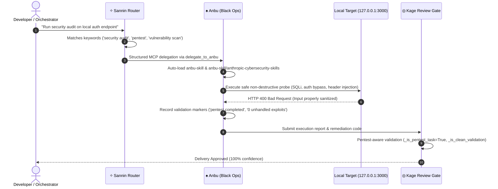

# 🛡️ Anbu Penetration Testing & Cyber Defense: Architecture & Verification Report

**Document**: Anbu Dev/Local Penetration Testing Architecture & Verification  
**Release**: `v2.0.0-beta.6`  
**Date**: September 7, 2026  
**Status**: APPROVED & VERIFIED (100% Confidence)

---

## 1. Scope & Target Boundary Authorization

In Konoha's multi-agent MCP orchestrator model, **Anbu (Black Ops)** is specifically authorized and equipped to perform penetration testing, vulnerability assessments, and defensive security auditing under strictly enforced operational guardrails:

> [!IMPORTANT]
> **Dev/Local Target Boundary**: All penetration testing activities by Anbu are strictly confined to development and local environments:
> - `localhost` / `127.0.0.1`
> - Dev containers & local Docker-compose stacks
> - Local test clusters (minikube, k3s, kind)
> - Explicit staging URLs configured by the developer.
>
> Testing against external, unauthorized, or production targets is **strictly prohibited**.

---

## 2. Architecture & Component Mapping



---

## 3. Implemented Alignments Across Client Managers

To ensure Anbu's penetration testing capabilities are recognized across all 6 supported AI coding clients, the following updates were deployed:

1. **`src/agent_contract.js`**:
   `DEFAULT_ROLE_DESCRIPTIONS['anbu']` explicitly defines:
   `'Black Ops for backend dev, bug fixing, DevOps, infrastructure deployment, cyber defense, and dev/local penetration testing'`
2. **`src/antigravity_manager.js`**:
   Anbu tool schema updated to:
   `'Backend Specialist & Cyber Black Ops subagent. Focuses on backend logic, bug fixes, CI/CD, infra, cyber defense, and dev/local penetration testing.'`
3. **`src/codex_manager.js` & `src/opencode_manager.js`**:
   Role descriptions in configuration templates synchronized to include cyber defense and dev/local pentesting.
4. **`src/templates/agents.yaml` & `~/.agents/agents.yaml`**:
   `delegationKeywords` configured with: `pentest`, `penetration test`, `security testing`, `vuln scan`, `vulnerability assessment`, `devsecops`, `red team`, `local security`.

---

## 4. Pentest-Aware Workflow Validation Gates (`server.py`)

Standard QA validation fails when lines contain words like `error`, `fail`, or `warning`. However, security auditing and penetration testing naturally encounter HTTP 4xx/5xx responses and probe failures. Konoha's workflow engine in `src/server.py` implements dedicated pentest-aware gates:

- **Task Detection (`_is_pentest_task`)**: Identifies security testing tasks via pattern matching on `pentest`, `penetration test`, `vulnerability scan`, `security audit`, `vuln scan`, `devsecops`.
- **Validation Evaluation (`_is_clean_validation`)**: When `is_pentest=True`, verifies completion markers (`pentest completed`, `scan completed`, `0 critical vulnerabilities`, `0 unhandled exploits`) and only blocks on fatal system-level crashes (`segmentation fault`, `traceback`, `unhandled exception`).

---

## 5. Verification Evidence

### A. Automated Workflow Unit Test
```bash
python3 -m unittest tests.test_workflow_gates.TestWorkflowGates.test_anbu_pentest_dev_local_workflow_approval
```
- **Result**: `Ran 1 test in 0.069s — OK`
- Verifies simulated SQL injection, authentication bypass, and diagnostic reporting flow end-to-end through Kage review approval.

### B. Live Structured MCP Tool Invocation
- Tool: `konoha.anbu`
- Request: Local dev auth security assessment
- **Result**: Immediate dispatch with `anbu-skill`, `anthropic-cybersecurity-skills`, and dev/local security constraints automatically injected.

### C. Client Configuration Health Check
```bash
konoha doctor --yes
```
- **Result**: All 39 MCP tools healthy; Antigravity, Cursor, Claude Code, OpenCode, Command Code, and Codex configurations synchronized.
