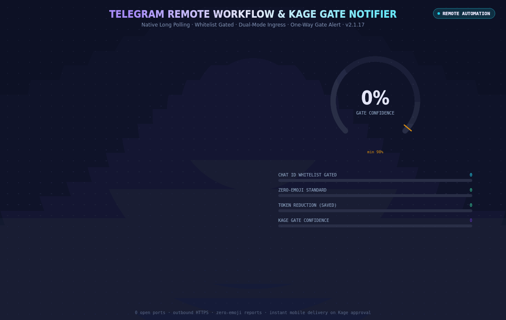

# Telegram Bot Integration Guide: Remote Notifications & Inbound Prompting

**Konoha MCP Version:** v2.1.17  
**Module:** `src/telegram/`  
**CLI Interface:** `konoha telegram <command>`  
**Web UI Route:** `/remote`

---

## 1. Overview

Konoha's Telegram integration provides remote visibility and control over your local coding agent directly from your smartphone or desktop Telegram app.

### Key Capabilities
- **One-Way Notification Mode**: Automatically delivers real-time task completion reports, execution duration, token savings telemetry (83%-98%), and Kage Reviewer confidence scores. When you work locally on your laptop, terminal, or IDE, any task that passes Kage Final Gate Review (`APPROVED` with 100/100 zero-slop score and ≥98% confidence) automatically dispatches an outbound Telegram notification to your phone.
- **Two-Way Remote Prompting Mode**: Fully prompt and control your workstation from Telegram chat. Accepts commands (`/run <task>`, `/sh <cmd>`, `/session`, `/kage`, `/status`, `/savings`, `/cancel`) via Native Long Polling and forwards prompts to your active terminal agent.
- **Zero-Port Security**: Uses outbound HTTPS Long Polling (`getUpdates`) directly to `api.telegram.org`. No public ports or incoming webhooks are opened on your workstation.
- **Chat ID Whitelist Invariant**: Drops all unauthorized messages immediately. Only your verified numeric Telegram ID can trigger tasks.
- **Zero Emojis Standard**: All notifications use clean bracketed tags (`[KONOHA TASK REPORT]`, `[SUCCESS]`, `[QUEUED]`, `[KAGE REVIEW GATE PASSED]`).

<p align="center">
  
</p>

---

## 2. Initial Setup: Bot Token & Chat ID

### Step 1: Create Your Bot with @BotFather
1. Open Telegram and search for `@BotFather`.
2. Send `/newbot`.
3. Choose a friendly display name (e.g., `My Konoha Worker`).
4. Choose a unique username ending in `bot` (e.g., `my_konoha_worker_bot`).
5. BotFather will provide your **HTTP API Token** (e.g. `123456789:AAExampleBotTokenPlaceholder...`).

### Step 2: Retrieve Your Personal Numeric Chat ID
1. Search for `@userinfobot` in Telegram and send `/start`.
2. It will reply with your personal numeric user ID (e.g. `123456789`).
3. **Important**: Open your newly created bot in Telegram and tap **Start** (or send `hello`). This grants the bot permission to message you.

---

## 3. Configuration

### Via CLI
```bash
# Configure credentials and mode
konoha telegram config --token "<BOT_TOKEN>" --chat-id "<YOUR_NUMERIC_ID>" --mode two_way

# Enable integration
konoha telegram enable

# Send a verification test ping to your phone
konoha telegram test

# Test outbound Kage review gate notification
konoha telegram notify-kage "Kage Review Gate verified: APPROVED (100% confidence, 0 AI slop findings)."

# Inspect current status
konoha telegram status
```

### Via Web UI
1. Navigate to `http://localhost:1404/remote`.
2. Under **Telegram Bot**:
   - Choose **One-Way** (Alerts Only) or **Two-Way** (Alerts + Inbound Prompting).
   - Enter your Bot Token and Authorized Chat ID.
   - Click **Save Settings** and **Enable Integration**.
   - Click **Send Test Ping** to verify delivery.

---

## 4. Prompting from Telegram (Two-Way Mode)

When configured in **Two-Way Mode**, you can send tasks to your workstation using standard messages or commands:

### Natural Language Prompt
Send any plain message directly to the bot:
```text
fix type error in src/auth/jwt.ts and run vitest
```
*Konoha responds immediately:*
```text
[QUEUED #task_m1n4b] Task accepted.
Prompt: "fix type error in src/auth/jwt.ts and run vitest"
Status: Forwarded to local terminal agent.
```

### Dedicated Slash Commands
| Command | Description | Example |
|---|---|---|
| `/session` | View numbered list of active client workspaces & sessions | `/session` |
| `/session <number>` | Switch target client session & workspace | `/session 2` |
| `/session create <client> <path>` | Register and target a client session & directory | `/session create agy /home/user/projectA` |
| `/sh <cmd>` | Execute a shell command via interactive shell (`bash -i -c`) with `~/.bashrc` aliases | `/sh kctenhw get namespace` |
| `/kage <prompt>` | Direct dispatch to Village Leader (Architecture & security audit) | `/kage audit auth flow` |
| `/anbu <prompt>` | Direct dispatch to Black Ops (Backend, DevOps, bug fixing) | `/anbu fix connection leak` |
| `/jonin <prompt>` | Direct dispatch to Elite Builder (UI/UX, frontend components) | `/jonin build hero carousel` |
| `/genin <prompt>` | Direct dispatch to Scout (Codebase exploration & dependency mapping) | `/genin trace session flow` |
| `/chunin <prompt>` | Direct dispatch to Intel Ninja (Web research & docs lookup) | `/chunin research cloudflare api` |
| `/tokubetsu_jonin <prompt>` | Direct dispatch to Scribe (Tech docs, API specs & reports) | `/tokubetsu_jonin update api docs` |
| `/sannin <prompt>` | Direct dispatch to Master Orchestrator (Triage & planning) | `/sannin plan refactoring` |
| `/run <task>` | Explicitly dispatch an autonomous coding prompt | `/run optimize sqlite query index` |
| `/status` | View recent workspace tasks and active status | `/status` |
| `/savings` | Check today's token reduction metrics | `/savings` |
| `/cancel` | Cancel currently pending queued task | `/cancel` |
| `/help` | View command cheatsheet | `/help` |

> [!NOTE]
> **Plain Text Prompts**: Any plain text message sent without a slash prefix is automatically treated as an autonomous task prompt and enqueued for execution.
>
> **Shell Alias Support (`/sh`)**: Commands execute in your user shell (`bash -i -c`), enabling full access to your custom `~/.bashrc` aliases (e.g. `kctenhw`, `kcishw`, `kubectl` context wrappers, etc.).
>
> **Security Guardrails**: Dangerous commands (`rm -rf /`, `mkfs`, `dd`, `drop database`, `truncate table`, etc.) are unconditionally blocked by the `isDangerousCommand` safety gate.

---

## 5. Sample Task Completion Report

Once your local agent finishes execution and passes Kage verification, Telegram delivers the completion report:

```text
[KONOHA TASK REPORT]
Task: Rate limiting added to /api/auth
Status: [SUCCESS]
Duration: 4.8s
Files Modified:
- src/web_server.js
- tests/test_rate_limit.js
Token Reduction: 96.2% Saved
Kage Confidence: 100% Passed
AI Slop Findings: 0 (100/100 Gate)

Remote Dashboard: https://konoha.yourdomain.com
```

---

## 6. Architecture & Security Invariants

1. **Outbound HTTPS Only**:
   Konoha connects to Telegram via outbound TLS calls (`getUpdates`). No inbound firewall holes or port forwarding needed.
2. **Whitelist Protection**:
   `chat_id` validation occurs before message parsing. Unrecognized senders are silently ignored.
3. **Queue Resilience**:
   Incoming prompts are stored in SQLite `prompt_queue` and mirrored to `~/.konoha/inbox/<session>.json`. If your workstation sleeps, prompts are preserved and processed upon wake-up.
